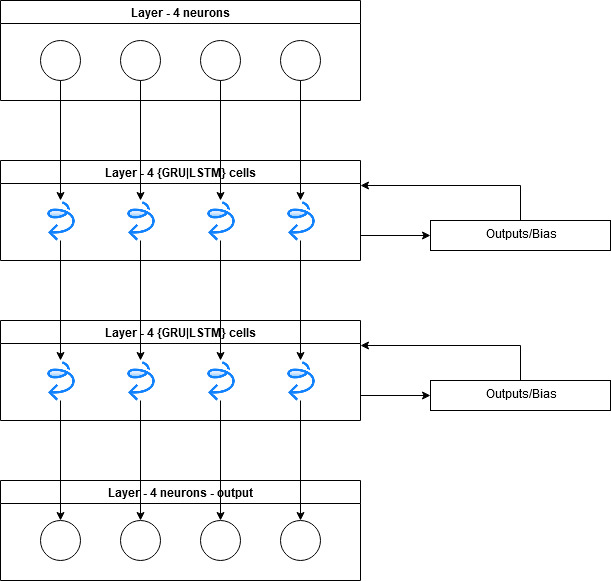
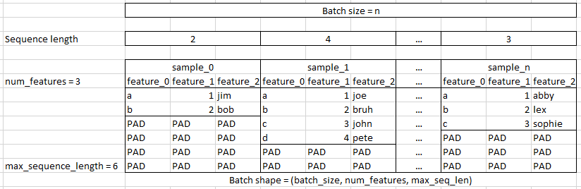

# Recurrent Neural Networks

Two types of cells:

* LSTM
* GRU

These are individual neurons in a layer

* the n-dims param is the width of a layer containing LSTM or GRU cells

## Input Formatting

