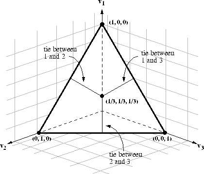
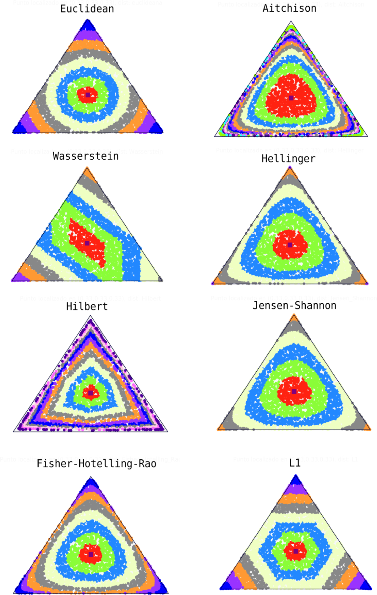

# Chapter 1: Manifold, Divergence and Dually Flat Strucutre

The chapter begins with a manifold and a coordinate system within it. Then, a divergence between two points is defined

- Divergence:
  - representes a degree of separation of two points
  - but it is not a sistance since it is not symmetric with respect to the two points
  Here is the origin of `dually coupled asymmetry`, leading us to a dual world

When a divergence is derived from a convex function in the form of a bregman divergence, two affine structures are induced in the manifold. They are dually coupled via the Legendre transformation. Thus, a convex function provides a maniforld with a dually flat affine structure in addition to a Riemannian metric derived from it. The dually flat structure plays a pivotal role in information geometry, as is shown in the generalized Pythagorean theorem. The dually flat structure is a special case of Riemannian geometry equipped with non-flat dual affine connections, which will be studied in Part II.

## 1.1 Manifolds

### 1.1.1 Manifold Coordinate Systems

An n-dimensional manifold M is a set of points such that each point has n-dimensional extensions in its neighborhood. That is, such a neighborhood is topologically equivalent to an n-dimensional Euclidian space

Intuitively speaking, a manifold is a deformed Euclidian space, like a curved surface in the two-dimensional case. But it may have a different global topology. A sphere is an example which is locally equivalent to a two dimensional Euclidian space, but is curved and has a different global topology because it is compact (bounded and closed)

Locally, a manifold M is equivalent to an n-dimensional Euclidian space E_n, which allows a local coordinate system:

$\boldsymbol{\xi} = (\xi_{1}, ..., \xi_{n})$

Which is composed of n components, such that each point is uniquely specified by its coodinates $`\xi`$ in a neighborhood

Since a manifold may have a topology different from a Euclidian space, in general we need **more than one coordinate neighborhood and coordinate system** to cover all the points of a manifold

The coordinate sysetm is not unique even in a coordinate neighborhood, and there are many coordinate systems. Let $\zeta = (\zeta_{1}, ..., \zeta_{n})$ be another coordinate sysetm. When a point $P \in M$ is represented in two coordinate systems $\xi$ and $\zeta$, there is a one-to-one correspondence betwen them and we have relations:

$\xi = f(\zeta_{1}, ..., \zeta_{n})$

Note, this zeta is like the other half of a bijection, constituting a homeomorphism?

$\zeta = f(\xi_{1}, ..., \xi_{n})$

Where $f$ and $f^{-1}$ are mutually inverse vector-valued functions. They are a coordinate transformation and its inverse transformation. We usually assume that these are `differentiable functions` of n coordinate variables

### 1.1.2 Examples of Manifolds

#### A. Euclidian Space

Consider a two-dimensional Euclidian space, which is a flat plane. It is convenient to use an `orthonormal` cartesian coordinate system $\xi = (\xi_{1}, \xi_{2})$.

A polar coordinate system $\zeta = (r, \theta)$ is sometimes used, where r is the radius and $\theta$ is the angle of a point from one axis. The coordinate transformation between them is given by:

$r = \sqrt(\xi_{1}^2 + \xi_{2}^2),  \theta = tan^-1(\xi_{2}/\xi_{1})$

$\xi_{1} = r\cos\theta,  \xi_{2} = r\sin \theta$

The transformation is analytic except for the origin

#### B. Sphere

A sphere is the surface of a three dimensional ball. The surface of the earth is regarded as a sphere, where each point has a two-dimensional neighborhood, so that we can draw a local geographic map on a flat sheet of paper. The pair of lattitude and longitude gives a local coordinate system. However, a sphere is topologically different from a Euclidian space, and it cannot be covered by one coordinate system. At least two coordinate systems are required to cover it

#### C. Manifold of Probability Distributions

##### C1. Gaussian Distributions

The probability density function of a Gaussian random variable x is given by:

$p(x; \mu, \sigma^2) = 1/\sqrt(2\pi\sigma)\exp\{-(x - \mu)^2 / 2\sigma^2 \}$

Where \mu is the mean and \sigma^2 is the variance. Hence, the set of all gaussian distributions is a two-dimensional manifold, where a point denotes a probability density function and:

$\xi = (\mu,\sigma), \sigma > 0$

is a coordinate system. This is topologically equivalent to the upper half of a two-dimensional Euclidian space. The manifold of Gaussian distributions is covered by one coordinate system $\xi = (\mu, \sigma)$

There are other coordinate systems. For example, let $m_{1}$ and $m_{2}$ be ther first and second moments of x, given by

$m_{1} = E[x] = \mu, m_{2} = E[x^2] = \mu^2 + \sigma^2$

Where E denotes the expectation of a random variable. Then,

$\zeta = (m_{1}, m_{2})$

is a coordinate system (the moment coordinate system).

It will be shown later that the coordinate system defined by $\theta$,

$\theta_{1} = \mu/\sigma^2, \theta_{2} = -1/2\sigma^2$

is referred to as the natural parameters, and is convenient for studying properties of Gaussian distributions

##### C2. Discrete Distributions

Let $x$ be a discrete random variable taking values on X = {0, 1, ..., n}. A probability distribution p(x) is specified by n+1 probabilities

$p_{i} = Prob\{x=i\}, i=0, 1, ..., n$

so that p(x) is represented by a probability vector

$\boldsymbol{p} = (p_{0}, p_{1}, ..., p_{n})$

Because of the restriction

$\sum^{n}_{i=0}p_{i} = 1, p_{i} > 0$

the set of all probability distributions p forms an n-dimensional manifold. Its coordinate sysetm is given, for example, by

$\xi = (p_{1}, ..., p_{n})$

and $p_{0}$ is not free but is a function of the coordinates

$p_{0} = 1 - \sum\xi_{i}$

The manifold is an n-dimensional simplex, called the probability simplex, and is denoted by S_n. W

[Anomaly detection in the probability simplex under different geometries](https://doi.org/10.1007/s41884-023-00107-y)

Let us introduce n+1 random variables $\delta(x), i= 0, 1, ..., n$ such that

$\delta(x) = \{1, x=i, 0, x!=i$

Then, a probability distribution of x is denoted by

$p(x, \xi) = \sum^{n}_{i=1}\xi_{i}\delta_{i}(x) + p_{0}(\boldsymbol{\xi})\delta_{0}(x)$

in terms of coordinates $\xi$

We shall use another coordinate system $\theta$ later, given by

$\theta_{i} = \log(p_{i}/p_{0}), i = 1, ..., n$

##### C3. Regular Statistical Model

Let x be a random variable which may take discrete, scaler, or vector continuous values. A statistical model is a family of probability distributions $M = \{p(x,\xi)\}$ specified by a vector parameter $\xi$. When it satisfies certain regularity conditions, it is called a regular statistical model. Such an M is a manifold, where $\xi$ plays the role of a coordinate system. The family of Gaussian distributions and the family of discrete probability distributions are examples of the regular statistical model. Information geometry has emerged from a study of invariant geometrical structures of regular statistical models

#### d. Manifold of Positive Measures

Let x be a variable taking values in set N = {1, 2, ..., n}. We assign a positive measure (or a weight) m_i to element i, i=1, ...,. n. Then

$\xi = (m_{1}, ..., m_{n}), m_{i} > 0$

defines a distribution of measures over N. The set of all such measures sits in the first quadrant $\boldsymbol{R}_{+}^n$ of an n-dimensional Euclidian space. The sum

$m = \sum^{n}_{i=1}m_{i}$

is called the total mass m = m (m_1, ..., m_n)

When m satisfies the constraint that the total mass is equal to 1

$\sum m_{i} = 1$

it is a probability distribution belonging to $S_{n-1}$. Hence, $S_{n-1} is included in $\boldsymbol{R}_{+}^n$ as its submanifold

A positive measure (unnormalized probability distribution) appears in many engineering problems. For example, image s(x,y) drawn on the x-y plane is a positive measure when the brightness is positive

s(x,y) > 0

When we discretize the x-y plane into n^2 pixels (i,j), the discretized pictures {s(i,j)} for a positive measure belonging to $\boldsymbol{R}_{+}^(n^2)$. Similarly, when we consider a discretized power spectrum of a sound, it is a positive measure. The histogram of observed data defines a positive measure, too

#### E. Positive-Definite Matrices

Let A be an nxn matrix. All such matrices form an n^2-dimensional manifold. When A is symmetric and positive definite, they form a n(n+1)/2 -dimensional manifold. This is a submanifold embedded in the manifold of all the matrices. We may use the upper right elements of A as a ccoordinate system. Positive-definite matrices appear in statistics, physica, operations research, control theory, etc

#### F. Neural Manifold

A neural network is composed of a large number of neurons connected with each other, where the dynamics of information processing takes place. A network is specified by connection weights w_ji connecting neuron i with neuron j. The set of all such networks forms a manifold, where matrix W = (w_ji) is a coordinate system. We will later analyze behaviors of such networks from the information geometry point of view

## 1.2 Divergence Between Two Points

### 1.2.1 Divergence

Let us consider two points P and Q in a manifold M, of which coordinates are $\xi_{P}$ and $\xi_{Q}$. A divergence $D[P : Q]$ is a function of $\xi_{P}$ and $\xi_{Q}$ which satisfies certain criteria. See Basseville (2013) for a detailed bibliography

$D[P : Q] = D[\xi_{P} : \xi_{Q}]$

We assume that it is a differentiable function of $\xi_{P}$  and $\xi_{Q}$

#### Definition 1.1

D[P : Q] is called a divergence when it satisfies the following criteria:

- 1. D[P : Q] >= 0
- 2. D[P : Q] = 0, when and only when P = Q
- 3. When P and Q are sufficiently close, by denoting their coordinates by $\xi_{P}$ and $\xi_{Q} = \xi_{P} + d\xi$, the Taylor expansion of D is written as

$D[\xi_{P}: \xi_{P} + d\xi] = 1/2 \sum g_{ij}(\xi_{P})d\xi_{i}d\xi_{j} + O(|d\xi|^3)$

and matrix G = (g_ij) is a positive-definite, depending on $\xi_{P}$

A divergence represents a degree of separation of two points P and Q, but it or its square root is not a distance. It does not necessarily satisfy the symmetry condition, so that in general

D[P : Q] != D[Q : P]

We may call D[P : Q] divergence from P to Q. Moreover, the triangular inequality does not hold. It has the dimensional of the square of distance. It is possible to symmetrize a divergence by

$D_{S}[P : Q] = 1/2 (D[P : Q] + D[Q : P])$

However, the **asymmetry of divergence plays an important role in information geometry,** as will be seen later

When P and Q are sufficiently close, we define the square of an infinitesimal distance ds between them as

$ds^2 = 2D[\xi : \xi + d\xi] = \sum g_{ij}d\xi_{i}d\xi_{j}$

A manifold M is said to be Riemannian when a positive definite matrix $\boldsymbol{G}(\boldsymbol{\xi})$ is defined on M and the square of the local distance between two nearby points $\xi$ and $\xi + d\xi$ is given by 1.27. A divergence D provides M with a Riemannian structure.

### 1.2.2 Examples of Divergence

#### A. Euclidian Divergence

When we use an orthonormal Cartesian coordinate system in a Euclidian space, we define
