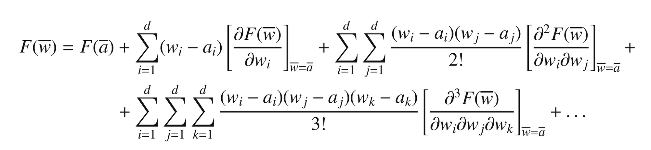

# Chapter 1. Linear Algebra and Optimization: An Introduction

## 1.1 Introduction

ML builds mathematical models from data containing multiple *attributes* (i.e. variables) in order to predict some variables from others. Such models are expressed as linear and nonlinear relationships between variables. These relationships are discovered in a data-driven manner by optimizing (maximizing) the "agreement" between the models and the observed data - this is an optimization problem.

Linear algebra is the study of linear operations in *vector spaces*. ex. the infinite set of all possible cartesian coordinates in two dimensions in relation to the origin

Dimensions correspond to attributes in ML

Linear algebra can be viewed as a generalized form of the geometry of cartesian coordinates in d dimensions. Just as one can use analyticsl geometry in two dimensions in order to find the intersection of two lines on a plane, one can generalize this concept to any number of dimensions. The resulting method is referred to as *Gaussian elimination* for solving systems of equations. The probelm of *linear regression*, which is fundamental to linear algebra, optimization, and machine learning is closely related to solving systems of equations

## 1.2 Scalars, Vectors, Matrices

1. Scalars
2. Vectors
3. Matrices - always upper case variables

Pythagorean theorum - a^2 + b^2 = c^2

in linear algebra, only vectors who have tails at the origin are considered - **all vectors, operations, and spaces in linear algebra use the origina as an important referecne point**

### 1.2.1 Basic Operations with Scalars and Vectors

Vectors of the same dimensionality can be added or subtracted

Vector addition and subtraction are commutative - the order of numbers does not matter

- $\bar{x} + bar{y} = [x_{1}...x_{d}] + [y_{1}...y_{d}] =  [x_{1} + y_{1} ... x_{d}+y_{d}]  $
- $\bar{x} - \bar{y} = [x_{1}...x_{d}] - [y_{1}...y_{d}] =  [x_{1} - y_{1} ... x_{d}-y_{d}]  $

Scalar Multiplication

- $\bar{x}' = a \bar{x} = [ax_{1}...ax_{d}]  $

This operation scales the length of the vector, but does not change its direction

Dot product multiplication

- $\bar{x} \cdot \bar{y} = \sum_{i=1}^{d} x_{i}y_{i}  $

[1, 2, 3] \cdot [6, 5, 4] = (1)(6) + (2)(5) + (3)(4) = 28

The dot product is a special case of a more general operation, referred to as the *inner product*, and it preserves many fundamental rules of Euclidian geometry. The space of vectors that includes a dot product operation is referred to as the Euclidian space. It is also commutative.

It is also distributive

- $\bar{x} \cdot (\bar{y} + \bar{z}) = \bar{x} \cdot \bar{y} + \bar{x} \cdot \bar{z}  $

The **dot product of a vector with itself** is referred to as its squared norm, or Euclidian norm. The norm defines the vector length and is denoted by $\|.\|$

- $\|\bar{x} \|^{2} = \bar{x} \cdot \bar{x} = \sum_{i=1}^{2} x_{i}^{2} $

The norm of the vector is the Euclidian distance of its coordinates from the origin

Often vectors are **noramlized** to unit length by dividing them with their norm - unit vector

- $\bar{x}' = \frac{\bar{x}}{\|\bar{x}\|} = \frac{\bar{x}}{\|\sqrt{\bar{x}\cdot\bar{x}}}  $ 

Scaling a vector by its norm does not change the relative values of its components

A generalization of the Euclidian norm is the L_{p}-norm, which is denoted by $\|.\|_{p} $

$\|\bar{x}\|_{p} = (\sum_{i=1}^{d} |x_{i}^{p}|  )^{1/p}  $

Here, |.| indicates the absolute value of a scalar, and p is a positive integer. When p is set to 1, the resulting norm is referred to as the Manhattan norm or L_{1}-norm

The (squared) Euclidian distance between \bar{x} and \bar{y} can be shown to be the doct product of \bar{x} - \bar{y} with itself:

$\|\bar{x} - \bar{y}\|^{2} = (\bar{x} - \bar{y}) \cdot (\bar{x}-\bar{y} ) = sum_{i=1}^{d}(x_{i} - y_{i})^{2} = Euclidean(\bar{x}, \bar{y})^{2}  $

Dot products satisfy the *Cauchy-Schwarz inqeuality*, accoding to which the dot product between a pair of vectors id bounded above by the product of their lengths

$|\sum_{i=1}^{d}x_{i}y_{i}| = |\bar{x} \cdot \bar{y}  | \leq  \|\bar{x}\| \|\bar{y}\|  $

The ratio between the two quantities is the cosine of the angle between the two vectors

- `polar form`
  - $[a, \theta]$
  - a is the length of the vector
  - \theta is the counter clock wise angle the vector makes with the X axis
- `cartesian form`
  - $[a \cos(\theta), a \sin(\theta)]  $
  - the dot porduct with [0,1] (the X-axis) is $a \cos(\theta)  $

The cosine fn between two vectors is algebraically defined by the dot product between the two vectors *after* scaling them to unit norm:

$\cos(\bar{x}, \bar{y}) = \frac{\bar{x} \cdot \bar{y}}{\sqrt{\bar{x}\cdot \bar{x}} \sqrt{\bar{y}\cdot \bar{y}}} = \frac{\bar{x} \cdot \bar{y}}{\|\bar{x}\| \|\bar{y}\|}  $

`cosine law` from Euclidean geometry:

$\cos(\theta) = \frac{a^{2} + b^{2} - c^{2}}{2ab} = \frac{\|\bar{x}\|^{2} + \|\bar{y}\|^{2} - \| \bar{x} - \bar{y}\|^{2}}{2(\|\bar{x}\|)(\|\bar{y}\|)} = \frac{\bar{x}\bar{y}}{\sqrt{\bar{x}\cdot \bar{x}}\sqrt{\bar{y}\cdot\bar{y}}}  $

A pair of vectors is `orthogonal` if their dot product is 0 (and the angle between them is 90). The vector \bar{0} is considered orthogonal to every vector.

A set of vectors is `orthonormal` if each pair in the set is mutually orthogonal and the norm of each vector is 1.

Orthonormal directions are useful because they are employed for transformations of points across different orthogonal coordinate systems with the use of 1-dimensional `projections` 

- `coordinate transformation` or `projection`
  - compute a new set of coordinates with respect to a changed set of directions

Consider the point [10, 15]. Imagine given two orthonormal directions [3/5, 4/5] and [-4/5, 3/5] - compute the dot product to project

- x' = 10*(3/5) + 15*(4/5) = 18
- y' = 10*(-4/5) + 15*(3/5) = 1

These types of transformations of vectors to new representaitons lie at the heart of linear algebra. In many cases, transformed representations of data sets have useful properties, which are exploited by ML applications.

### 1.2.2 Basic Operations with Vectors and Matrices

The `transpose` of a matrix is obtained by flipping its rows and columns. The (i,j)th entry of the transpose is the same as the (j,i)th of the original. comes from an n x d matrix to a d x n matrix, denoted as $A^{\top} $

Like vectors, matrices can be added only if they have the same size

- 3x2 times 2x1 (inner dimensions the same)
  - --> 3x1 (outer dimensions become dimensions of resultant)
- 1x3 x 3x2 = 1x2

The multiplication of an nxd matric with a d dimensional column vector creates an n-dimensional column vector, is often interpreted as a *linear transformation* from d-dimensional space to n-dimensional space

the nxd matrix A is occasionally represented in terms of its ordered set of n-dimensional columns $\bar{a}_{1}...\bar{a}_{d} $ as $A [\bar{a}_{1}...\bar{a}_{d}]  $. This results in the following form of *matrix-vector multiplication* using the columns of A and a column vector $\bar{x} = [x_{1}...x_{d}]^{\top}  $ of coefficients:

$A\bar{x} = \sum_{i=1}^{d}x_{i}\bar{a}_{i} = \bar{b}  $

Each x_{i} corresponds to the "weight" of the i-th direction of $\bar{a}_{i}$, which is also referred to as the ith *coordinate* of \bar{b} using the (possibly non-orthogonal) directions contained in the columns of A. This notation is a generalization of the (orthogonal) Cartesian coordinates defined by d-dimensional vectors $\bar{e}_{i}...\bar{e}_{i}  $, where each e is an axis direciton with a single 1 in the ith position and remaining 0s

The dot product between two vectors can be viewed as a special case of matrix-vector multiplication

the outer product between two vectors is a nxn matrix, denoted by $\bar{x} \times \bar{v}  $. The "tall" matrix is alwasy ordered before the "wide" matrix:

- 3x1 times 1x3 = 3x3

Unlike dot products, the outer product can be performed between two vectors of different lengths.

Conventionally, outer products are defined between two column vectors, and the second vector is transposed into a matrix containing a single row before matmul

$(UV)_{ij} = \sum_{r=1}^{k} u_{ir}v_{rj}  $

### Problem 1.2.2 (Outer Product Properties)

Show that if an nx1 matrix is multipled with a 1xd matrix (which is also an outer product between two vectors), we obtain an nxd matrix with the following properties:

- Every row is a multiple of every other row
- Every column is a multiple of every other column

Each entry in a matrix product is an `inner product` of two vectors extracted from the matrix. What about outer products? It can be shown that the entire matrix is the sum of as many outer products as the common dimension k of the two multiplied matrices

### Lemma 1.2.1 (Matrix Multiplication as Sum of Outer Products)

The product of an nxk matrix U with a kxd matrix V results in an nxd matrix, which can be expressed as the sum of k outer-product matrices; each of these k matrices is the product of an nx1 matrix with a 1xd matrix. Each nx1 matrix corresponds to the ith column U_{i} of U, and each 1xd matrix corresponds to the ith row V_{i} of V. Therefore, we have the following:

$UV = \sum_{r=1}^{d}U_{r}V_{r} $ where the product dimensions of U_{r}V_{r} is nxd

Matrix multiplication is not *commutative*, but it is *associative* and *distributive*

$[A(BC)]_{ij} = [(AB)C]_{ij} = \sum_{k}\sum_{m} a_{ik}b_{km}c_{mj}  $

### Problem 1.2.3

Express the matrix ABC as the weightes sum of outer products of vectors extracted from A and C. The weights are extracted from matrix B

### Problem 1.2.4

Let A be an 1000000x2 matrix. Suppose you have to compute the 2x100000 matrix A^T AA^T on a computer. would you prefer to compute (A^T A)A^T or A^T (AA^T)

### 1.2.5

Let D be an nxd matrix for which eahc column sums to 0. Let A be an arbitrary dxd matrix. Show that the sum of each column of DA is also zero

The transpose of the product of two matrices is given by the prodcut of their transposes, but the order of multiplication is reversed:

$(AB)^{\top} = B^{\top}A^{\top}  $

### Problem 1.2.6

Show the following result for matrices A_{1}...A_{n}

- $(A_{1}A_{2}A_{3}...A_{n})^{\top} = A_{n}^{\top}A_{n-1}^{\top}...A_{2}^{\top}A_{1}^{\top}  $

### 1.2.3 Special Classes of Matrices

- `symmetric matrix`
  - is a square matrix that is its own transpose
  - A = A^{\top}

### Problem 1.2.7

If A and B are symmetric matrices, then show that AB is symmetric if and only if AB = BA

The `diagonal` of a matrix is defined as the set of entries for which the row and column indices are the same. Generally used for square matrices, but can be used for rectangular matrices

#### Definition 1.2.1 - Rectangular Diagonal Matrix

A rectangular diagonal matrix is an nxd matrix in which each entry (i,j) has a non-zero value if and only if i = j. Therefore, the diagonal of non-zero entries starts at the upper-left corner of the matrix, although it might not meet the lower-right corner

`block diagonal matrix` contains square blocks B_{1}...B_{r} of (possibly non-zero) entries along the diagonal. All other entries are zero. Although each block is square, they need not be of the same size.

- `triangular matrix`
  - a generalization of the diagonal matrix

#### Definition 1.2.2 - Upper and Lower Triangular Matrix

A square matrix is an `upper triangular matrix` if all entries (i,j) below its main diagonal (i.e., satisfying i > j) are zeros. A matrix is `lower triangular` if all entries (i,j) above its main diagonal (i.e., satisfying i<j) are zeros

#### Definition 1.2.3 - Strictly Triangular Matrix

A matrix is said to be *strictly* triangular if its triangular *and* all its diagonal elements are zeros. Basically, all the diagonal elements are zero, but above or below the diagonal has values

#### Lemma 1.2.2 - Sum or Product of Upper-Triangular Matrices

The sum of upper-triangular matrices is upper triangular. the product of upper-triangular matrices is upper triangular

### 1.2.4 Matrix Powers, Polynomials, and the Inverse

Square matrices can be multiplied with themselves without violating the size constraints of matrix multiplication. Multiplying a square matrix with itself many times is analogous to raising a scalar to a particular power. The nth power of a matrix is defined as:

$A^{n} = AA...A (n-times)  $

The zero-th power of a matrix is defined to be the identity matrix of the same size

`nilpotent` - when a matrix satisfies $A^{k} = 0 $ for some integer k

All polynomials of the same matrix A will commute with respect to the multiplication operator

#### Observation 1.2.1 - Commutativity of Matrix Polynomials

Two polynomials f(A) and g(A) of the same matrix A will always commute:

$f(A)g(A) = g(A)f(A)  $

- `inverse`
  - of a square matrix A is another square matrix A^{-1}
  - not all matrices have an inverse
  - $AA^{-1} = A^{-1}A = I  $

Matrices that are invertible always have the property that a non-zero linear combination of the rows does not sum to zero. Each vector direction in the rows of an invertible matrix must contribute new, non-redundant "information" that cannot be conveyed using sums, multiples, or linear combinations of other directions

When the inverse of matrix A does exist, it is unique. Furthermore, the product of a matrix with its inverse is always commutative and leads to the identity matrix

#### Lemma 1.2.3 - Commutativity of Multiplicaiton with Inverse

If the product AB of d x d matrices A and B is the identity matrix I, then BA must also be equal to I

#### 1.2.4

When the inverse of a matrix exists, it is always unique. In other words, if B_{1} and B_{2} satisfy AB_{1} = AB_{2} = I, we must have B_{1} = B_{2}

All diagonal entries of a diagonal matrix need to be non-zero for it to be invertible or have negative powers. The polynomials and inverses of triangular matrices are also triangular matrices of the same type (i.e., lower or upper triangular). A similar result holds for block diagonal matrices.

### Problem 1.2.8 - Inverse of Triangular Matrix is Triangular

Basically, front load an inverse of R to isolate x on one side. then the k-th index of column vector e you just multiply by the corresponding row of R^-1. The inverse of R must be upper-triangular cause i think thats just a theorum or law or whatever. idk how to prove it but im pretty sure thats the deal

### Problem 1.2.9 - Block Diagonal Polynomial and Inverse

Suppose that you have a block diagonal matrix B, which has blocks B_{1}...B_{r} along the diagonal. Show how you can express the polynomial function f(B) and the inverse of B in terms of functions on block matrices

$f(B) = a_{0}I + a_{1}B^{1} + a_{2}B^{2} + ... + a_{n}B^{n}  $

$f(B) =  $
$
\begin{bmatrix} 
f(B_{1}) & 0 \\ 
0 & f(B_{2}) 
\end{bmatrix}
$

#### Problem 1.2. 10

Suppose that the matrix B is the inverse of matrix A. Show that for any positive integer n, the matrix B^{n} is the inverse of matrix A^{n}

The inversion and the transposition operations can be applied in any order without affecting the result:

$(A^{\top})^{-1} = (A^{-1})^{\top}  $

- `orthogonal matrix`
  - square matrix whose inverse is its transpose
  - $AA^{\top} = A^{\top}A = I  $

Although such matrices are formally defined in terms of having orthonomal *columns*, the commutativity in the above relationship implies the remarkable property that they contain both orthonormal columns and orthonormal rows

#### Dude, closing the loop

A useful property of invertible matrices is that they define a uniquely solvable system of equations. For example, the solution to $A\bar{x} = \bar{b}  $ exists and is uniquely defined as $\bar{x} = A^{-1}\bar{b}  $ when A is invertible

One can also view the solution $\bar{x}  $ as a new set of coordinates of $\bar{x} $ in a different (and possibly non-orthogonal) coordinate system defined by the vectors contained in the columns of A.

Note that when A is orthogonal, the solution simplifies to $\bar{x} = A^{\top}\bar{b}  $, which is equivalent to the dot product between $\bar{b} $ and each column of A to compute the corresponding coordinate.

In other words, we are **projecting** $\bar{b} $ on each orthonormal column of A to compute the corresponding coordinate

### 1.2.5 The Matrix Inversion Lemma: Inverting the Sum of Matrices

The *limit* of $A^{n}$ as $n \implies \inf  $ is the zero matrix (0). For such matrices, the following result holds:

$(I+A)^{-1} = I - A + A^{2} - A^{3} + A^{4} + ... + Infinite Terms  $

$(I-A)^{-1} = I + A + A^{2} + A^{3} + A^{4} + ... + Infinite Terms  $

This result can be used for inverting triangular matrices (although more straightforward alternative exist)

#### Problem 1.2.11 - Inverting Triangular Matrices

A dxd triangular matrix L with non-zero diagonal entries can be expressed in the for (\Delta + A), where \Delta is an invertible diagonal matrix and A is a *strictly* triangular matrix. Show how to compute the inverse of L using only diagonal matrix inversions and matrix multiplications/additions. Note that the strictly triangular matrices of size dxd are always nilpotent and satisfy A^{d} = 0

$ L = (\Delta + A), and \Delta \Delta^{-1} = I $

so

$L^{-1} = (\Delta + A)^{-1} = (D(I + D^{-1}A))^-1  $

apply *inverse rule for products*

$L^{-1} = (I + D^{-1}A)^{-1}D^{-1}  $

and now can apply the series expansion

$L^{-1} = I - D^{-1}A + (D^{-1}A)^{2} - (D^{-1}A)^3 + ...  $

remember, (AB)^3 is the same as (AB)(AB)(AB), so in this case:

$(D^{-1}A)^3 = (D^{-1}A)(D^{-1}A)(D^{-1}A) $

#### Main branch now

If you have the sum of two matrices, can invert that if one of the two is "compact". Here, compactness means that a matrix has so much structure to it that it can be expressed as the product of two much smaller matrices

The matrix inversion lemma is a useful property for computing the inverse of a matrix after incrementally updating it with a matrix created from the outer-product of two vectors. These types of inverses *arise often* in iterative optimizatino algorithms such as the *quasi-Newton method* for incremental linear regression. In these cases, the inverse of the original matrix is already available, and one can cheaply update the inverse with the matrix inversion lemma

#### Lemma 1.2.5 - Matrix Inversion Lemma

Let A be an invertible dxd matrix, and \bar{u} and \bar{v} be non-zero d-dimensional column vectors. Then, $A + \bar{u}\bar{v}^{\top}  $ is invertible if and only if $\bar{v}^{\top}A^{-1}\bar{u} \neq -1  $. In such a case, the inverse is computed as:

$(A+\bar{u}\bar{v}^{\top})^{-1} = A^{-1} - \frac{A^{-1}\bar{u}\bar{v}^{\top}A^{-1}}{1 + \bar{v}^{\top}A^{-1}\bar{u}}  $

Side comment, column vector rep: \bar{u} = U_{*k}

#### New segment

Variants of the matrix inversion lemma are used in various types of iterative updates in ML.

A specific example is incremental linear regressino, where one often wants to invert matrices of the form $C = D^{\top}D  $, where D is an nxd data matrix. When a new d-dimensional data point \bar{v} is received, the size of the data matrix becomes (n+1)xd with the addition of row vector \bar{v}^{-\top} to D. The matrix C is now updated to $D^{\top}D + \bar{v}\bar{v}^{\top}  $, and the mnatrx inversino lemma comes in handy for updating the inverted matrix in O(d^{2}) time. One can even generalize the above result to cases where the vectors \bar{u} and \bar{v} are replaces with "thin" matrices U and V containing a small number k of columns

#### Theorum 1.2.1 - Sherman-Morrison-Woodbury Identity

Let A be an invertible dxd matrix and let U, V be dxk non-zero matrices for some small value of k. Then, the matrix $A + UV^{\top}$ is invertible if and only if the kxk matrix $(I + V^{\top}A^{-1}U)$ is invertible. Furthermore, the inverse is given by the following:

$(A + UV^{\top})^{-1} = A^{-1} - A^{-1}U(I + V^{\top}A^{-1}U)^{-1}V^{\top}A^{-1}  $

This type of update is referred to as *low-rank* update, which will be explained in ch2

#### Problem 1.2.12

Suppose that I and P are two kxk matrices. Show the following result

(I + P)^{-1} = I - (I + P)^{-1}P

#### Problem 1.2.13 - Push-Through Identity

If U and V are two nxd matrices, show the following result:

$U^{\top}(I_{n} + VU^{\top})^{-1} = (I_{d} + U^{\top V})^{-1}U^{\top} $

### Push-Through Identity

helpful when you want to "push" the *inverses* of A and C outside a product that includes B:

$A^{-1}BC^{-1} = (AC)^{-1}(ABC)  $

or

$(I + AB)^{-1}A = A(I + BA)^{-1}  $

or

$(I + AB)^{-1} = I - AB(I + AB)^{-1} = I - A(I + BA)^{-1}B  $

### 1.2.6 - Frobenius Norm, Trace, and Energy

Like vectors, one can define norms of matrices. For the rectangular n x d matrix A with (i,j)th entry denoted by a_{ij}, its `Frobenius norm` is defined as follows:

$\|A\|_{F} = \|A^{\top}\|_{F} = \sqrt{\sum_{i=1}^{n} \sum_{j=1}^{d} a_{ij}^{2}  }  $

The squared Frobenius norm is the sum of squares of the norms of the row-vectors (or, alternatively, column vectors) in the matrix

THE ROLE OF SQUARING IS TO GET RID OF THE SQRT

The `energy` if a matrix A is an alternative term used in ML for the squared Frobenius norm

The `trace` of a square matrix A, denoted by tr(A), is defined by the sum of its diagonal entries. The energy of a rectangular matrix A is equal to the trace of either AA^{\top} or A^{\top}A

$\|A\|_{F}^{2} = Energy(A) = tr(AA^{\top}) = tr(A^{\top}A)  $

More generally, the trace of the product of two matrices:

- $C = [c_{ij}]  $
- $D = [d_{ij}]  $

of sizes nxd is the sum of their entry-wise product

$tr(CD^{\top}) = tr(DC^{\top}) = \sum_{i=1}^{n} \sum_{j=1}^{d} c_{ij}d_{ij}  $

The trace of the product of two matrices $A = [a_{ij}]_{n \times d}  $ and $B = [b_{ij}]_{d \times n}  $ is invariant to the order of matrix multiplication:

$tr(AB) = tr(BA) = \sum_{i=1}^{n} \sum_{j=1}^{d} a_{ij}b_{ji}  $

#### Problem 1.2.14

Show that the Frobenius norm of the outer product of two vectors is equal to the product of their Euclidean norms

The Frobenius norm shares many properties with vector norms, such as sub-additivity and sub-multiplicativity. These properties are analogous to the triangle inequality and the Cauchy-Schwarz inequality, respectively, in the case of vector norms

#### Lemma 1.2.6 - Sub-additive Frobenius Norm

For any pair of matrices A and B of the same size, the triangle inequality $\|A + B\|_{F} \leq \|A\|_{F} + \|B\|_{F}  $ is satisfied

Hmm, this takes the same form of many of the ordinal distance metrics from binary representation learning

#### Lemma 1.2.7 - Sub-multiplicative Frobenius Norm

For any pair of matrices A and B of sizes n \times k and k \times d, respectively, the sub-multiplicative property $\|AB\|_{F} \leq \|A\|_{F}\|B\|_{}F  $ is satisfied

#### Problem 1.2.15 - Small Matrices Have Large Inverses

Show that the Frobenius norm of the inverse of an nxn matrix with Frobenius norm of ? is at least $\sqrt{n}/\epsilon  $

## 1.3 Matrix Multiplication as a Decomposable Operator

Matrix multiplication can be viewed as a vector-to-vector function that maps one vector to another. Ex, the multiplicaiton of a d-dimensional column vector $\bar{x}_{*k}  $ with the dxd matrix A maps it to another d-dimensional vector, which is the output of the fn f(\bar{x}):

$f(\bar{x}) = A\bar{x}  $

One can view this fn as a vector-centric generalization of the *univariate linear function*

g(x) = ax

for scalar a. This is one of the reasons that matrices are viewed as `linear operators` on vectors. Much of linear algebra is devoted to understanding this transformation and leveraging it for efficient numerical computations.

One issue with large matrices, it is often hard to interpret wheat the matrix is really doing to the vector in terms of its individual components. This is the reason that **it is often useful to interpret a matrix as a product of simpler matrices**. Because the beautiful property of the associativity of matrix multiplication, one can interpret a product of simple matrices (and a vector) as the *composition of simple operations on the vector*..

A can be decomposed into the product of simpler dxd matrices $B_{1}, B_{2}, ..., B_{k}  $

$A = B_{1}B_{2}...B_{k-1}B_{k}  $

Assume that the B_{i} is simple enough that one can intuitively interpret the effect of multiplying a vector \bar{x} with B_{i} easily (**such as rotating a vector or scaling it**). Then, f(\bar{x}) can be written as follows:

$f(\bar{x}) = A\bar{x} = [B_{1}B_{2}...B_{k-1}B_{k}]\bar{x}  $

$f(\bar{x}) = A\bar{x} = B_{1}(B_{2}...[B_{k-1}(B_{k}\bar{x})])  $  [Associative Property of Matrix Multiplication]

The nested brackets on the right provide an order to the operations. We first apply the operator B_{k} to \bar{x}, then apply B_{k-1}, and so on all the day down to B_{1}. Therefore, as long as we can decompose a matrix into the product of simpler matrices, we can interpret matrix multiplication with a vector as a sequence of simple, easy-to-understand operations on the vector

### 1.3.1 Matrix Multiplication as Decomposable Row and Column Vectors

An important property of matrix multiplication is that the rows and columns of the product can be manipulated by applying the corresponding operations on one of the two matrices. In a product AX of two matrices A and X:

- interchanging the ith and jth *rows* of the *first* matrix A will also interchange the corresponding rows in the product (which has the same number of rows as the first matrix)
- If we interchange the *columns* of the *second* matrix, this interchange will also occur in the product (which has the same number of columns as the second matrix)

There are three main elementarry operations, corresponding to interchange, addition, and multiplication. The **elementary row operations** on matrices are:

- `interchange operation`
  - the ith and jth rows of the matrix are interchanged
  - the operation is fully defined by two indices i and j in any order
- `addition operation`
  - a scalar multiple of the jth rows is added to the ith row
  - this operation is defined by two indices i,j in a specific order, and a scalar multiple c
- `scaling operation`
  - the ith row is multiplied with scalar c
  - the operation is fully defined by the row index i and the scalar c

One can define exactly analogous operations on the columns with **elementary column operations**

- `elementary matrix`
  - differs from the identity matrix by applying a single row or column operation
  - pre-multiplying matrix X with an elementary matrix corresponding to an interchange >> results in an interchange of the rows of X.
  - In other words, if E is the elementary matrix corresponding to an interchange, then a pair of rows of $X' = EX  $ will be interchanged wrt to X. A similar result holds true for other operations like row addition and row scaling

Examples:

Interchange - interchange rows 1, 2

$
\begin{bmatrix}
0 & 1 & 0 \\
1 & 0 & 0 \\
0 & 0 & 1
\end{bmatrix}
$

Addition - add c x(row 2) to row 1

$
\begin{bmatrix}
1 & c & 0 \\
0 & 1 & 0 \\
0 & 0 & 1
\end{bmatrix}
$

Scaling - multiply row 2 by c

$
\begin{bmatrix}
1 & 0 & 0
0 & c & 0
0 & 0 & 1
\end{bmatrix}
$

These rows are referred to as `elementary matrix operators` because they are used to apply specific row operations on arbitrary matrices. The scalar c is always non-zero in the above matrices, because all elementary matrices are invertible and are different from the identity matrix (albeit in a minor way). Pre-multiplication of X with the appropriate elementary matrix can result in a row exchange, addition, or row-wise scaling being applied to x.

The first and second rows of the matrix X can be exchanged to create X' as follows

0 1 0 | 1 2 3   4 5 6  v interchange v
1 0 0 | 4 5 6 = 1 2 3  ^ interchange ^
0 0 1 | 7 8 9   7 8 9

The first row can be scaled up by 2 with:

2 0 0 | 1 2 3   2 4 6  x2
0 1 0 | 4 5 6 = 4 5 6  
0 0 1 | 7 8 9   7 8 9

Post-multiplication of matrix X with the following elementary matrices will result in exactly analogous operations on the columns of X to create X'

Interchange - interchange columns 1, 2

$
\begin{bmatrix}
0 & 1 & 0 \\
1 & 0 & 0 \\
0 & 0 & 1
\end{bmatrix}
$

Addition - Add c x (col 2) to col 1

$
\begin{bmatrix}
1 & 0 & 0 \\
c & 1 & 0 \\
0 & 0 & 1
\end{bmatrix}
$

Scaling - Multiply col 2 by c

$
\begin{bmatrix}
1 & 0 & 0 \\
0 & c & 0 \\
0 & 0 & 1
\end{bmatrix}
$

Only the elementary matrix for the addition operation is slighly different between row and column operations (although the other two matrices are the same.)

Post-multiplication for column exchange

1 2 3 | 0 1 0   2 1 3
4 5 6 | 1 0 0 = 5 4 6
7 8 9 | 0 0 1   8 7 9

#### Problem 1.3.1

Define a 4x4 operator matrix so that pre-multiplying matrix X with this matrix will result in addition of c_{i} times the ith row of X to the 2nd row of X for each i \in {1, 2, 3, 4} in one shot. Show that this matrix can be expressed as the product of three elementary addition matrices and a single elementary multiplication matrix

These types of elementary matrices are always invertible
The inverse of the interchange matrix is itself

#### Observation 1.3.1

The inverse of an elementary matrix is another elementary matrix

#### Problem 1.3.2

Write down one example of each of the three types [i.e., interchange, multiplicaiton, and addition] of elementary matrices for performing row operations on a matrix of size 4x4.

Work out the inverse of these matrices

Repeat this for each of the three types of matrices for performing column operations

- swap/interchange
  - the inverse is the same
- scaling
  - inverse is 1/c, whatever the c scaling factor is on the diagonal
- addition
  - inverse is -(c), whatever the c addition factor is not on the diagonal

#### Problem 1.3.3

Let A and B be two matrices. Let A_{ij} be the matrix obtained by exchanging the ith and jth columns of A, and B_{ij} be the matrix obtained by exchanging the ith and jth rows of B. Write each of A_{ij} and B_{ij} in terms of A or b, and an elementary matrix.

Now explain why A_{ij}B_{ij} = AB

The elementary matrix is identical for each, so it

#### Problem 1.3.4

Let A and B be two matrices. Let matrix A' be created by adding c times the jth column of A to its ith column, and matrix B' be created by subtracting c times the ith row of B from its jth row. Explain using the convept of elementary matrices why the matrices AB and A'B' are the same

the elementary matrices are the same

#### main branch

Can also apply elementary operations to matrices that are not square.

For an nxd matrix, the pre-multiplication operator matrix will be of size nxn, whereas the post-multiplication operator matrix will be of size dxd

#### Permutation Matrices

An elementary row (or column) interchange operator matrix is a special case of `permutation matrix`

- `permutation matrix`
  - contains a single 1 in each row, and a single 1 in each column
  - pre-multiplying shuffles the rows
  - post-multiplying shuffles the columns
  - permutation matrix and its transpose are inverses of one another, because orthonormal columns
  - any permutation matrix is a product of row interchange operator matrices

#### Applications of Elementary Operator Matrices

The row manipulation property is used to compute the inverses of matrices. This is because matrix A and its inverse X are related as:

$AX = I  $

Row operations are applied on A to convert the matrix to the identity matrix. Results in:

$IX = A^{-1}  $

Elementary matrices are fundamental because *one can decompose any square and invertible matrix into a product of elementary matrices*

Application of finding a solution to the system of equations:

$A\bar{x} = \bar{b}  $

- A is an nxd matrix
- \bar{x} is a d-dimensional column vector
- \bar{b} is an n-dimensional row vector

Can convert original system into:

$A'\bar{x} = \bar{b}'  $

Where A' is triangular. Therefore, if we apply a squence E_{1}...E_{k} of elementary row operations to the system of equations, we obtain:

$E_{k}E_{k-1}...E_{1}A\bar{x} = E_{k}E_{k-1}...E_{1}\bar{b}   $

A triangular system of equations is solved by first processing equations with fewer variables and iteratively backsubstituting these values to reduce the system to fewer variables. It is noteworthy that the problem of solving linear equations is a special case of the fundamental ML problem of *linear regression*, in which the best-fit solution is found to an inconsistent sysetm of equations. Linear regression serves as the "parent problem" to many machine learning problems like least-squares classification, support-vector machines, and logistic regression.

### 1.3.2 Matrix Multiplication as Decomposable Geometric Operators

Aside from decompositions involving elementary matrices, other forms exist

`geometric` interpretations:

- rotation
  - 90deg counter-clockwise of [2,1] becomes [-1,2]
- reflection
  - [2,1] across X axis yields [2,-1]
- scaling
  - along X and Y by factors of 2 and 3 respectively yields [4,3]

All these simple transformations on a vector in two dimensions can be defined by pre-multiplication of the corresponding column vector with a 2x2 matrix (or post-multiplied on a row vector with the transpose of this 2x2 matrix)

Ex. consider the column vector of a point with:

- polar coordinates [a,a]
- cartesian coordinates [a cos(a), a sin(a)]

The point has magnitude a and makes a counter-clockwise angle of a with the X-axis. Then, one can multiply it with the `rotation matrix` to yield a ccw rotation of the vector with the angle theta

Rotation - rotate ccw by \theta

$
\begin{bmatrix}
\cos(\theta) & -sin(\theta) \\
\sin(\theta) & cos(\theta)
\end{bmatrix}
$

Reflect - reflect across X-axis

$
\begin{bmatrix}
1 & 0 \\
0 & -1
\end{bmatrix}
$

Scale - scale x and y by factors of c_{1} and c_{2}

$
\begin{bmatrix}
c_{1} & 0 \\
0 & c_{2}
\end{bmatrix}
$

#### Problem 1.3.5

The above lists matrices for rotation, reflection, and scaling is designed to transform a column vector $\bar{x}_{*k}  $ using the matrix-to-vector product $A\bar{x}$

Write down the corresponding matrices for the case when you want to transform a row vector: $\bar{u}  $ as $\bar{u}B  $

- Rotation - take transpose
- Reflection - same
- scaling - same

The matrix for a sequence of transformations can be computed by multiplying the corresponding matrices. This is easy to show by observing that if we have A = A_{1}...A_{k}, then successively pre-multiplying a column-vector \bar{x} with A_{k}...A_{1} is the same as the expression A_{1}(A_{2}(...(A_{k}\bar{x}))). Because of the associativity of matrix multiplication, one can express this matrix as:

$(A_{1}...A_{k})\bar{x} = A\bar{x}  $

Conversely, if a matrix can be expressed as a product of simpler matrices (like the geometric ones from above), then multiplication of a vector with that matrix is equivalent to a sequence of the above geometric transformations

A fundamental result of linear algebra is that any square matrix can be shown to be a product of rotation/reflection/scaling matrices by using a technique called `singular value decomposition`. In other words, *all linear transformations of vectors defined by matrix multiplication correspond to the application of a squence of rotations, reflections, and scaling on the vector*

#### Problem 1.3.6

Suppose that you are told that any invertible square matrix A can be expressed as a product of elementary rotation/reflection/scaling matrices as A = R_{1}R_{2}...R_{k}. Express the invers of A in terms of the easily computable inverses of R_{1}, R_{2}, ...., R_{k}

$A^{-1} = R_{k}^{-1}...R_{2}^{-1}R_{1}^{-1}  $

#### Main

It is also helpful to understand the row addition operator. Consider the 2x2 row addition operator:

A = 1 c
    0 1

This operator `shears` the space along the direction of the first coordinate. For example, if vector \bar{z} = [x, y]^{\top}, then A\bar{z} yields the new vector [x + cy, y]^{\top}

Here, the y-coordinate remains unchanged, whereas the x-coordinate gets sheared in proportion to its height

An elementary row operator matrix is a very special case of a triangular matrix; correspondingly, a triangular matrix with *unit diagonal entries* corresponds to a sequence of shears. This is because one can convert an identity matrix into any such triangular matrix with a sequnce of elementary row addition operations

#### New section

A linear transformation can be viewed as a succession of simpler transforms. This simpler squence is obtained by `decomposing` a matrix A into the product of simpler matrices B_{1}...B_{k}

$f(\bar{x}) = A\bar{x} = B_{1}(B_{2}...[B_{k-1}(B_{k}\bar{x})])  $

Each B_{i} is typically a group of similar transformations, such as orthogonal matrices (sequence of rotations), diagonal matrices (sequence of scalings), or triangular matrices with unit diagonal entries (sequence of shears). There is considerable flexibility in terms of how these decompositions can be performed. Discussed later are the `LU decomposition`, the `QR decomposition`, and the `singular value decomposition`

## 1.4 Basic Problems in Machine Learning

Machine learning is about constructing models on observed examples in the rows of data matrices, and using these models to make predictions about missing entries of previously unseen examples. This process is also referred to as `learning`, which is where "machine learning" derives its name.

Throughout this book, we assume that we have an *n x d* data matrix D, which contains n examples of d-dimensional data points in its rows. A `dimension` or `attribute` is one of the d properties of a data point

Classical problems in machine learning

### 1.4.1 Matrix Factorization

- `matrix factorization` is an alternative term for `matrix decomposition`
  - typically refers to an **optimization centric** view of decomposition

matrix factorization decomposes an nxd matrix D into two *factor* matrices:

- U, size nxk
- V, size dxk

so that $UV^{\top} \approx D$

Here, $k << min\{n,d \}  $ is a parameter referred to as the *rank* of the factorization

The rank controls the "conciseness" of the factorization because the total number of entries in U and V is k(n+d), which is much smaller than the original number of entries in D.

Matrix factorization is a generalization of (real-valued) scalar factorization to matrices. There are an infinite number of factors of the same matrix D, just as scalar can be factored into an infinite number of pairs of real values.

Ex. the scalar 6 can be written as:

- 2x3
- 1.5x4
- \sqrt{2} x \sqrt{18}

An example of a matrix factorization of a 3x3 is:

$
\begin{bmatrix}
1 & -1 & 1 \\
-1 & 1 & -1 \\
2 & -2 & 2
\end{bmatrix}
$

$= [1, -1, 2]^{\top}[1, -1, 1] $

In this case, the factorization is exact, although it is often allowed to be *approximately* true in order to minimize the sizes of the factor matrices U and V. If one is willing to allow for a reasonable level of approximation, the value of k can be quite small

A common approach for matrix factorization is to set up the following optimization problem:

Minimize: $J = \|D - UV^{\top}\|_{F}^{2}  $

Frobenius norm, which is the sum of the squares of the entries in the *residual matrix* $(D-UV^{\top} ) $. The objective function J is minimized with the use of gradient descent on the parameter matrices U and V, whose entries are variables of this optimization problem. By minimizing this objective fn, one will ensure that the matrix (D - UV^{\top}) will have entries that are small in magnitude, and therefore $D \approx UV^{\top}  $. These types of objective functions are also referred to as `loss functions`, because they measure how much information $UV^{\top} $ "loses" with respect to the original matrix D.

One can even factorize an incompletely specified matrix D by formulating the optimization function only with the observed entries. This basic principle serves as the foundation of *recommender systems*. For example, consider a setting in which we have n users and d ratings; the (i,j)th entry of D provides the ratings of the user i for item j. Most of the entries of D are unobserved, because users typically rate only a small subset of items. In such a case, the objective fn $\|D-UV^{\top}\|_{F}^{2}  $ will need to be modified, so that we sum up the squared errors only over the *observed* entries in D. This is because the values of the remaining entreis in (D - UV^{\top}) are unknown. Setting up an optimization problem only in terms of a subset of entries allows us to learn fully specified matrices U and V. Therefore, UV^{\top} provides a prediction of the *fully reconstructed* matrix D.

### 1.4.2 Clustering

The problem of clustering is that of partiioning the rows of the nxd data matrix D into groups of similar rows

Often you can use the segmentation created by clustering as a preprocessing step for other analytical goals

- k-means
- spectral clustering

### 1.4.3 Classification and Regression Modeling

The problem of classification is closely related to clustering, except that more guidance is available for grouping the data with the use of the notion of *supervision*.

- In the case of clustering, the data is partitioned into groups without any regard for the *types* of clusters we wish to find
- In the case of classification, the *training* data are already partitioned into specific types of groups

Therefore, in addition to the nxd data matrix D, we have an nx1 array of labels denoted by \bar{y}.

The actual segmentation of the rows is done on a separate $n_{t} \times d  $ *test* data matrix D_{t}, in which the labels are not specified. Therefore, for each row of D_{t}, one needs to map it on one of the labels from the set \mathcal{L}. This mapping is done with the use of a classification `model` that was constructed on the training data. The test data is unseen during the process of model construction, as the rows of D and D_{t} are not the same

A common setting in classification is the label set is binary and only contains two possible values. In such a case, it is common to use the label set \mathcal{L} from {0,1} or from {-1,+1}. The goal is to *learn* the ith entry y_{i} in \bar{y} as a function of the ith row \bar{X}_{i} of D:

$y_{i} \approx f(\bar{X}_{i})  $

The function f(\bar{X}_{i}) is often parameterized with a weight vector \bar{W}. Consider the following example of binary classification into the labels {-1,+1}:

$y_{i} \approx f_{\bar{W}}(\bar{X}_{i}) = sign\{\bar{W} \cdot \bar{X}_{i}\}  $

How does one compute \bar{W}? The key idea is to penalize any kind of mismatching between the *observed value* y_{i} and the predicted value f(\bar{X}_{i}) with the use of a carefully constructed *loss function*. therefore, many ML models reduce to the following optimization problem:

$Minimize_{\bar{W}} \sum_{i} Mismatching between y_{i} and f_{\bar{W}}(\bar{X}_{i})  $

Once the weight vector \bar{W} has been computed by solving the optimization model, it is used to predict the value of the class variable y_{i} for instances in which the class variable is not known.

Classification is also referred to as supervised learning. In a sense, the training data serves as the "teacher" providing supervision. The ability to use the knowledge in the training data in order to classify the examples in unseen test data is referred to as *generalization*. There is no utility in classifying the examples of the training data again, because their labels have already been observed.

#### Regression

The label in classification is also referred to as the `dependent` variable, which is *categorical* in nature.

In the regression modeling problem, the nxd training data matrix D is associated with an nx1 vector \bar{y} of dependent variables, which are *numerical*

Therefore, the only difference from classification is that the array \bar{y} contains numerical values (rather than categorical ones), and can therefore be treated as a vector

Binary response variables are closely related to regression, and some models solve binary classification *directly* with the use of a regression model (by pretending that the binary labels are numerical). This is because binary values have the flexibility of being treated as either categorical or as numerical values. However, more than two classes like {red, green, blue} cannot be ordered, and are therefore different from regression

Regression modeling problem closely related to linear algebra, especially when a *linear optimization model* is used

In the linear optimization model, we use a d-dimensional column vector $\bar{W} = [w_{1}...w_{d}]^{\top}  $ to represent the weights of the different dimensions. The ith entry y_{i} of \bar{y} is obtained as the dot product of the ith row \bar{X}_{i} of D and \bar{W}

In other words, the function f(.) to be learned by the optimization problem is as follows:

$y_{i} = f(\bar{X}_{i}) = \bar{X}_{i}\bar{W}  $

One can also state this condition across all training instances using the full nxd data matrix D:

$\bar{y} \approx D \bar{W}  $

Note that this is a matrix representation of n linear equations. In most cases, the value of n is much greater than d, and therefore, is an *over-determined* system of linear equations. In over-determined cases, there is usually no solution for \bar{W} that *exactly* satisfies this system. However, we can minimize the sum of squares of the errors to get as close to this goal as possible:

$J = \frac{1}{2} \|D\bar{W} - \bar{y}\|^{2}  $

The solution \bar{W} can be obtained as follows:

$\bar{W} = (D^{\top}D)^{-1}D^{\top}\bar{y}  $

Then, for each row \bar{Z} of the test data matrix D_{t}, the dot product of \bar{W}^{\top} and \bar{Z} is the corresponding prediction of the real-valued dependent variable.

### 1.4.4 Outlier Detection

We have an nxd data matrix D, and we would like to find rows of D that are very different from most of the other rows. This has a complementary relationship with the clustering problem

Outliers are rows of D that do not naturally fit in with the other rows.

Therefore, clustering methods are often used to find outliers. Matrix factorization methods are also used often for outlier detection

## 1.5 Optimization for Machine Learning

Much of ML uses optimizaitno in order to define parameterized models for learning problems

These models treat dependent variables as functions of indepentend variables. It is assumed that some examples are available containing observed values of both dependent and independent variables for training. These problems define objective fns or `loss functions` which penalize differences between predicted and observed values of dependent variables. Therefore, the training phase od ml methods requires the use of optimization techniques

In most cases, the optimization models are posed in minimization form. The most basic condition for optimality of the fn $f(x_{1}, ..., x_{d})  $ at $[x_{1}...x_{d}]  $ is that each partial detivative is 0:

$\frac{\partial f(x_{1},...,x_{d})}{\partial x_{r}} = \lim_{\partial \rightarrow 0} \frac{f(x_{1},...,x_{r} + \partial,...,x_{d}) - f(x_{1},...,x_{r},...x_{d})}{\partial} = 0 \forall r  $

The basic idea is that the rate of change of the function in any direction is 0, or else one can move in a direction with negative rate of change to further improve the objective fn. This condition is necessary, but not sufficient, for optimization

The d-dimensinoal vector of partial derivatives is referred to as the *gradient*:

$\nabla f(x_{1}, ..., x_{d}) = [\frac{\partial f(.)}{\partial x_{1}} ... \frac{\partial f(.)}{\partial x_{d}} ]^{\top} $

Putting the \nabla in front of the fn refers to the vector of partial derivatives wrt the argument

### 1.5.1 The Taylor Expansion for Function Simplification

Many objective fns in ML are very complicated in comparison with the relatively simple structure of polynomial fns (which are much easier to optimize). Therefore, if one can approximate complex objective fns with simpler polynomials (even within restricted regions of the sapce), it can go a long way toward solving optimization problems in an iterative way

The taylor expansion expresses any smooth fn as a polynomial (with an infinite number of terms). Furthermore, if we only want an approximation of the fn in the small locality of the argument, a small number of polynomial terms (typically no more than 2 or 3) will often suffice.

First, consider the unvariate fn f(w) (univariate = one variable). This fn can be expanded about any point a in the domain of the fn by using:

$f(w) = f(a) + (w - a)f'(a) + \frac{(w - a)^{2}f''(a)}{2!} + ... + \frac{(w-a)^{r}}{r!} [\frac{d^{r}f(w)}{d w^{r}} ]_{w=a}  + ... $

f'(w) is the first derivative at a, f''(w) is the second, etc. Note that f(w) could be an arbitrary fn, such as sin(w) or exp(w), and the expansion expresses it as a polynomial with an infinite number of terms

Some functions expressed as an infinite polynomial make sense bc limit as n to inf for w (n/n!) = 0

For some fns like sin(w) and exp(w), the Taylor expansion converges to the true fn by including an increased number of terms. For other fns, like 1/w or log(w), a converging expansion exists in restricted ranges of w at any particular value of a.

More importantly, the Taylor expansion almost alwyas provides a very good approximation of any smooth function *near* w = a, and the approximation is exact at w = a. Furthremore, higher-order terms tend to vanish when |w-a| is small, because (w-a)^{r}/r! rapidly converges to 0 for increasing r. Therefore, one can often obtain good quadratic approximations of a function near w = a by simply including the first three terms

In practical settings like optimization, one is often looking to change the value w from the current point w=a to a "nearby" point in order to improve the objective fn value. In such cases, using onth up to the quadratic term of the Taylor expansion about w = a provides an extellent simplification in the neighborhood of w=a. In gradient-descent algorithms, one is often looking ot move from the current point by a relatively small amount, and therefore lower-order Taylor approximations can be used to guide the steps in order to improve the polynomial approximation rather than the original fn. It is often much easier to optimize polynomials than arbitrarily complex fns.

One can also generalize the Taylor expansion to multivariable functions F(\bar{w}) (w as vector) with d-dimensional arguments of the form $\bar{w} = [w_{1}...w_{d}]^{\top} $

Jesus christ this is a mess of a function im not typing this

In the multibariable case, we have O(d^{2}) second-order interaction terms, O(d^{3}), third-order interaction terms, and so on. This gets unwieldy very quickly

Luckily we rarely need to go beyond second-order approximations in practice.

Furthermore, the above expression can be rewritten using the gradients and matrixes compactly. The second order approx can be written in vector form as:

$F(\bar{w}) \approx F(\bar{a}) + [\bar{w} - \bar{a}]^{\top} \nabla F(\bar{w}) + [\bar{w} - \bar{a}]^{\top} H(\bar{a})[\bar{w} - \bar{a}]  $

Here, $\nabla F(\bar{W})$ is the gradient, and $H(\bar{a}) = [h_{ij}]  $ is the dxd matrix of all the second-rder derviatives of the form:

$h_{ij} = [\frac{\partial^{2} F(\bar{w})}{\partial w_{i} \partial w_{j}}]_{\bar{w}=\bar{a}}  $

A third-order expansion would require the use of a *tensor*, which is a generalization of the notion of a matrix. The first- and second-order expansion will be used frequently in this book for developing various types of optimization algorithms, such as the Newton method

#### Problem 1.5.1 (Euler Identity)

The Taylor series is valid for complex fns as well. Use the Taylor series to show the Euler identity $e^{i\theta} = \cos(\theta) + i \sin(\theta)  $

### 1.5.2 Example of Optimization in ML

An example of a parameterized model discussed in an earlier section is that of linear regression, in which we want to determine a d-dimensional vector $\bar{W} = [w_{1}...w_{d}]^{\top}  $ so that we can predict the n-dimensional dependent variable vector \bar{y} as the function $\bar{y} = D\bar{W}  $ of the nxd matrix D of the observed values. In order to minimize the difference between predicted and observed values, the following objective fn is minimized:

$J = \frac{1}{2} \|D\bar{W} - \bar{y}\|^{2}  $

Here, D is an nxd data matrix, whereas \bar{y} is an n-dimensional column vector of dependent variables. Therefore, this is a simple optimization problem in d parameters. Finding the optimal solution requires techniques from differential calculus. The simplest approach is to set the partial derivative wrt to each parameter w_{i} to 0, which provides a necessary (but not sufficient) condition for optimality:

$\frac{\partial J}{\partial w_{i}} = 0, \forall i \in \{1...d \}  $

The partial derivatives can be shown to be the following:

$[\frac{\partial J}{\partial w_{1}}...\frac{\partial J}{\partial w_{d}}  ] = D^{\top} D\bar{W} - D^{\top}\bar{y}   $

For certain types of `convex objective functions` like linear regression, setting the vector of partial derivatives to the zero vector is both necessary and sufficient for minimization. Therefore we have

$D^{top}D\bar{W} = D^{\top}\bar{y}  $

which yields the following:

$\bar{W} = (D^{\top} D)^{-1}D^{\top}\bar{y}  $

Linear regression is a particularly simple probelm because the optimal solution exists in `closed form`. However, in most cases, one cannot solve the resulting optimality conditions in such a form.Rather, the approach of *gradient-descent* is used.

In `gradient descent`, we use a computaiton algorithm of initializing the parameter set \bar{W} randomly (or a heuristically chosen point), and then change the parameter set in the direction of the negative derivative of the objective fn. In ther words, we use the following updates repeatedly with a step-size \alpha , which is also referred to as the `learning rate`

$[w_{1}...w_{d}]^{\top} \Leftarrow [w_{1}...w_{d}]^{\top} - \alpha [\frac{\partial J}{\partial w_{1}}...\frac{\partial J}{\partial w_{d}}]^{\top} = \bar{W} - \alpha [D^{\top} D\bar{W} - D^{\top}\bar{y}]  $

The d-dimensional vector of partial derivatives is referred to as the `gradient vector`, and it defines an instantaneous direction of best rate of improvement of the objective fn at the current value of the parameter vector \bar{W}. Denoted as:

$\nabla J(\bar{W}) = [\frac{\partial J}{\partial w_{1}}...\frac{\partial J}{\partial w_{d}}]^{\top}  $

Therefore, one can succinctly write gradient descent in the form:

$\bar{W} \Leftarrow \bar{W} - \alpha \nabla J (\bar{W})  $

Note that the best rate of improvement is only over a step of infinitesimal size, and does not hold true for larger steps of finite size. Since the gradients change on making a step, one must be careful not to make steps that are too large or else the effects may be unpredictable.

These steps are repeatedly executed to `convergence`, when further improvements become too small to be useful. Such a situation will occur when the gradient vector contains near-zero entries. Therefore, this computational approach will also (eventually) reach a solution approximately satisfying the optimality conditions of Eq 1.33

The gradient descent method (and many other optimization algorithms) can be explained with the use of the Taylor expansion

Using gradient descent for optimization is a tricky exercise, because one does not always converge to an optimal solution for a variety of reasons. One ex, wrong step size may result in unexpected numerical overflows. Another ex, one might terminate at suboptimal solutions, when the obj fn contains multiple minima relative to specific local regions. There is a significant body of work on designing optimization algorithms

### 1.5.3 Optimization in Computational Graphs

Many ML problems can be represented as the process of learning a function of the inputs that matches the observed variables in the data.

For ex. the least-squares optimization problem can be represented as the following sequence of operations:

$Input (d variables) \Rightarrow Dot product with parameter vector \bar{W} \Rightarrow Prediction \Rightarrow Squared loss   $

The model has d input nodes containing the features x_{1}...x_{d} of the data, and a single (computational) output node creating the dot product $\sum_{i=1}^{d} w_{i}x_{i}  $. The weights [w_{1}...w_{d}] are associated with the edges

Therefore, each node computes a fn of its inputs, and the edges associated with the parameters to be learned. By choosing a more complex topology of the computational graph with more nodes, one can create more powerful models, which often do not have direct analogs in traditional ML

How does one compute gradients wrt edge parameters in computational graphs? Achieved through `backpropagation`. Backprop yields exactly the same gradient as is computed in traditional ML. Backprop can compute gradients in more complex cases. Almost all the well-known ML models (based on gradient descent) can be represented as relatively simple computational graphs. Therefore, computational graphs are extemely powerful abstractions, as they include traditional ML as special cases

## 1.6 Summary

Linear algebra and optimization are intimately related because many of the basic problems in linear algebra, such as finding the "best" solution to an over-determined system of linear equations, are solved using optimization techniques. Many optimization models in ML can also be expressed as obj fns and constrains using matrices/vectors. A useful technique that is used in many of these optimization problems is to decompose these matrices into simpler matrices with specific algebraic/geometric properties. In particular, two types of decomposition are commonly used in ML:

- Any square an invertible matrix A can be decomposed into a product of elementary matrix operators. If the matrix A is not invertible, it can still be decomposed with a *relaxed* defintion of matrix operators, which are allowed to be non-invertible
- Any square matrix A can be decomposed into a product of two rotation matrices and one scaling (diagonal) matrix in the particular order of rotation, scaling, and rotation. This is known as `singular value decomposition`

An alternative view of ML expresses predictions as computational graphs; this idea also forms the basis for the field of *deep learning*

## 1.8 Exercises

- 1. x - y is orthogonal to x + y
- 2. 
- 3. if A = -A^{\top}, then diag must be 0
- 4. 
- 5. 
- 6. 
- 7. 
- 8. 
- 9. 
- 10. where D \approx UV^{\top}, you can adjust dimension k (the rank) to get infinite number of factorizations
- 11. 
- 12. After some high enough power of a permutation matrix, the permutation matrix is always the identity
  eventually, there is a collision where you get a transpose of P where P^{\top} = P^{-1}, which times itself, makes the I
- 13. for a matrix polynomial \sum_{i=0} a_{i}A^{i}, normally evaluating requires O(t^2)
  - to reduct this, just nest the terms inside each other so dont need to re-compute
  - like the chain rule i think, and results in O(t)
- 14. 
- 15. Parallelogram law
  - States that the sum of the squares of the sides of a parallelogram is equal to the sum of the squares of its diagonals
- 16. Taylor expansion
- 17. Taylor expansion
- 18. for matrix P initialized with random values of either -1 or 1, the columns will be mutually orthogonal
  - two columns in a matrix are othogonal if the dot product is zero
  - at the limit, 1(1) -1(1) ... 1(-1) 1(1) \approx 0
- 19. perturbed matrix - Neumann Series Approximation
  - `Neumann Series Approximation`
    - $(I + X)^{-1} \approx I - X + X^{2} - X^{3} + X^{4}  $
    - $(I + AB)^{-1} \approx I - AB + (AB)^{2} - (AB)^{3} + (AB)^{4}  $
- 20. interchange, addition, scaling
- 21. parallelogram law
- 22. 
- 23. product of upper triangle matrices is the zero matrix
- 24. Apollonius identity
  - AB^{2} + AC^{2} = 2(AD^{2} + BD^{2})
  - closely related to Parallelogram Law
- 25. Sine law
  - soh cah toa
  - sin(\theta) = \frac{\|A\crossB\|}{\|a\|\|b\|}
  - cos(\theta) = \frac{\|A\cdot\|}{\|a\|\|b\|}
  - tan(\theta) = \frac{\|A\crossB\|}{\|A\cdot\|}
  - sin^{2}(x) + cos^{2}(x) = 1
  - \frac{\|a\|}{sin(A)} = \frac{\|b\|}{sin(B)}
- 26. Trigonometry with vector algebra
- 27. find intersection coordinates of two lines by inverting matrix A
  - A[x, y]^{\top} = b
  - [x, y]^{\top} = A^{-1}b
  - use 1/(ad - bc)[[d, -b], [-c, a]] to invert the matrix
- 28. Inverting matrix of 1s, whose diagonal values = 2
  - decompose into (I + A)^{-1} form
  - (I + A)^{-1} = I - A + A^{2} - A^{3} ...
- 29. Solid geometry with vector algebra
  - system of linear equations
  - the closest point on a hyperplane to a point not on the hyperplane, is the orgin of a vector orthogonal to the hyperplane whose head is at the point not on the hyperplane
  - "since b lies in the span of v1 and v2 (aka on the hyperplane)", we can write:
    - b = Vc
- 30. 
  - just like remember that rectangular matrices are not invertible, but if you do the VV^T, you get a square, that could be invertible
- 31. Matrix centering
  - basically, use vector of 1s cross a vector of the mean value of each column
- 32. Energy preservation in orthogonal transformations
  - orthogonal matrices are like rotation matrices
  - energy stays same, regardless of orientation
- 33. Tight sub-mulitplicative case
  - factorizing sum operations
- 34. Frobenius othogonality and Pythagorean theorum, trace
  - trace is sum the diagonal entries
- 35. Frobenius othogonal vector outer products
- 36. 
- 37. Any orthogonal upper-triangular matrix is a diagonal matrix
  - to be orthogonal, the inverse is equal to the Transpose
  - for this to be true, only values can be on diagonal
- 38. 
  - euclidean distance between two vectors
    - \|u - v \|^{2} = \|u\|^{2} + \|v\|^{2} - 2(u.v)
  - unit vector u^2 = 1
- 39. 
- 40.
  - EVERY matrix commutes with its inverse
  - All polynomials of the same matrix A will commute with respect to the multiplication operator
  - Two polynomials f(A) and g(A) of the same matrix A will always commute
  - [f(A)]^{-1}g(A) = g(A)[f(A)]^{-1}
  - sinular matrices
- 41.
  - push through fn on polynomials
  - rectangular matrx / non-square matrix
  - A^{\top}f(AA^{\top}) = f(A^{\top}A)A^{\top}
  - [f(A^{\top}A)]^{-1}A^{\top} = A^{\top}[f(AA^{\top})]^{\top}
- 42.
  - scalar binomial expansion
  - vectors multiplication commutes, whereas matrix mutliplication does not
  - I think because you can then replace B with some A-based matrix, which being the same matrix base lets us skirt non-commutative properties
- 43.
  - all strictly upper trianglular matrices are nilpotent
  - matrix inversion lemma
  - $(I+A)^{-1} = I - A + A^{2} - A^{3} + A^{4} + ... + Infinite Terms  $
  - ok but this is sick - because we know A^{4} = 0, we can stop there
  - so: (I+A)^{-1} = I - A + A^{2} - A^{3}
- 44.
  - strictly lower are also nilpotent
  - 
- 45. 
- 46.
  - basically, if commute, can rewrite as A^{m}B^{n} = B^{n}A^{m}
  - focus on the powers m, and n
  - these powers are like the result of polynomials
  - so the polynomials inheret the comutativity
- 47. sameas
- 48.
- 49.
  - Inverses behave like matrix polynomials
  - Cayley-Hamilton theorem: a finite-degree polynomial f(.) always exists for any matrix A satisfying f(A) = 0
- 50.
  - sum of matrices = (A + B)
- 51.
  - for any non-invertible matrix A, the infinite summation cannot converge to a finite matrix
- 52.
- 53. 
  - basically, if it commutes, then order doesnt matter
  - elementary matrix for scaling commutes
  - diagonal matrices commute
- 54. 
