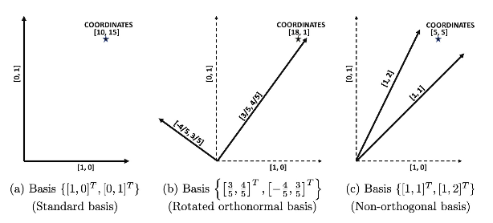
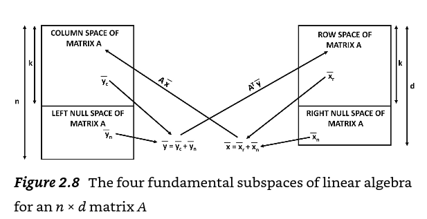

# Chapter 2. Linear Transformations and Linear Systems

## 2.1 Introduction

- `vector spaces`
  - the collection of row vectors and column vectors into data matrices

Mutliplying a vector can be used to implement rotation, scaling, reflection operations

A multiplication of a vector with a matrix can be shown to be some combination of rotation, scaling, and reflection being applied to the vector

### 2.1.1 What Is a Linear Transform

Typically accomplished by multiplying matrices and vectors

#### Definition 2.1.1 - Linear Transform

A vector-to-vector function f(\bar{x}) defines a linear transformation of \bar{x}, if the following conditions are satisfied for any scalar c:

$f(c\bar{x}) = c \cdot f(\bar{x}), \forall x in domain of f(.)  $

$f(\bar{x} + \bar{y}) = f(\bar{x}) + f(\bar{y}), \forall \bar{x}, \bar{y} in domain of f(.)  $

A vector-to-vector fn is a generalization of the notion of scalar functions, and it maps a d-dimensional vector to an n-dimensional vector for some d and n

the `translation` operator is NOT a linear transform

An `affine transformation` is a combination of linear transformation with a translation

- `affine transformations`
  - a combination of linear transform with a translation
  - includes any transform of the form:
    - f(x) = Ax + c
      - where both x and c are vectors
      - A is an nxd matrix
      - x is a d-dimensional vector
      - c is an n-dimensional column vector

#### Definition 2.1.2 - Affine Transform

A vector-to-vector fn f(\bar{x}) defines an affine transformation of \bar{x}, if the following condition is satisfied for any scalar \labmda

$f(\lambda \bar{x} + [1 - \lambda]\bar{y}) = \lambda f(\bar{x}) + [1 - \lambda]f(\bar{y}), \forall \bar{x}, \bar{y} in domain of f(.)  $

All linear transforms are special cases of affine transforms, but not vice versa. the simplest univariate fn f(x) = m.x + b is widely referred to as "linear", allows a non-zero translation b; this would make it an affine transformation. However, the notion of linear transform from the linear algebra perspective is much more restrictive, and it does not even include the univariate fn, unless the bias term b is zero

The class of linear transforms can always be geometrically expressed as a sequence of one or more rotations, reflections, dilations/contractions about the origin. The origin always maps to itself after these operations, and therefore translation is not included

In this book, "linear transform" or "linear operator" will be used in the context of linear algebra, where **translation is NOT allowed**

"linear function" will be used in the context of machine learning, where **translation is allowed**

## 2.2 The Geometry of Matrix Multiplication

The multiplicaiton of a d-dimensional vector with an nxd matrix is an example of a linear transformation. **The converse is also true**

#### Lemma 2.2.1 - Linear Transformation is Matrix Multiplication

Any linear mapping f(\bar{x}) from d-dimensional vectors to n-dimensional vectors can be represented as the matrix-to-vector product A\bar{x} by construcing A as follows. The columns of the nxd matrix A are $f(\bar{e}_{1}...f(\bar{e}_{d}))$, where \bar{e}_{i} is the ith column of the dxd identity matrix

Setting A to the scalar m yields a special case of the scalar-to-scalar linear fn f(x) = m.x + b (with b=0). For vector-to-vector transformations, one can either transform a row vector \bar{y} as \bar{y}V or (equivalently) transform the column vector $\bar{x} = \bar{y}^{\top} as V^{\top}\bar{x}  $:

$f(\bar{y}) = \bar{y}V  $ [Linear transform on row vector \bar{y}]

$g(\bar{x}) = V^{\top}\bar{x}  $ [Same transformation on column vector \bar{x} = \bar{y}^{\top} ]

One can also treat a matrix-to-matrix multiplication between nxd matrix D and dxd matrix V as a linear transformation of the rows of the first matrix. In other words, the ith row of the nxd matrix D' = DV is the transformed representation of the ith row of the original matrix D.

Data matrices in ML often contain multidimensional points in their rows

Matrix transformations can be broken up into geometrically interpretable sequences of transformations by expressing matrices as products of simpler matrices

#### Observation 2.2.1 - Matrix Product as Sequence of Geometric Transformations

The geometric transformation caused by multiplying a vector with V = V_{1}V_{2}...V_{r} can be viewed as a sequence of simpler geometric transformations by regrouping the product as follows:

$\bar{y}V = ([\bar{y}V_{1}V_{2}]...V_{r})\bar{y}  $ For row vector

$V^{\top}\bar{x} = (V_{r}^{\top}[V_{r-1}^{\top}...(V_{1}^{\top})])\bar{x} = \bar{y}^{\top}  $ For column vector

#### Orthogonal Transformations

The orthogonal 2x2 matrices V_{r} and V_{c} that respectively rotate 2-dimensional row and column vectors by \theta degress in the counter clockwise counter-clockwise direction are as follows:

$ V_{r} =
\begin{bmatrix}
\cos{\theta} & \sin{\theta} \\
-\sin{\theta} & \cos{\theta}
\end{bmatrix}
$

$ V_{c} =
\begin{bmatrix}
\cos{\theta} & -\sin{\theta} \\
\sin{\theta} & \cos{\theta}
\end{bmatrix}
$

DV_{r} will rotate each **row** of D

V_{c}D^{\top} will rotate each **column** of d

The two columns of the transformation matrix V_{r} represent the mutually orthogonal unit vectors of a new axis system that is rotated clockwise by \theta

Orthogonal matrices might include reflections

Consider V = [[0, 1],[1, 0]]. Here, the transformation DV of the rows D simply flips the two coordinates in each row of D. The resulting transformation cannot be expressed purely as a rotation. This is because this transformation changes the `handedness` of the data

In some cases, reflections are included with rotations. When a compulsory reflection is included in the sequence, the resulting matrix is referred to as a `rotreflection` matrix

#### Lemma 2.2.2 - Closure Under Multiplication

The product of any number of othogonal matrices is always an orthogonal matrix

What about the commutativity of the product of orthogonal matrices? Basically, not really commutative in higher dimensions. the main issue is that rotations in higher dimensions are associated with a vector referred to as the `axis of rotation`. orthogonal matrices that do not correspond to the same `axis of rotation` may not be commutative

All 3-dimensional rotation matrices can be geometrically expressed as a single rotation, albeit with an arbitrary axis of rotation

#### Givens Rotations and Householder Reflections

It is not possible to express a rotation matrix using a single angle in dimensionalities greater than 3. In such cases, independent rotations of different angles might be occuring in unrelated planes (e.g. xy-plane and zw-plane). therefore, one must express a rotation transformation as a *sequence* of elementary rotations, each of which occurs in a 2-dimensional plane

One natural choice for defining an elementary rotation is the `Givens rotation`, which is a generalization of eq. 2.4 to higher dimension

A dxd `Givens rotation` always selects two coordinate axes and performs the rotation in that plane, so that post-multiplying a d-dimensional row vector with that rotation matrix changes only two coordinates.

The dxd Givens rotation matrix is different from the dxd identity matrix in only 2x2 relevant entries; these entries are the same as those of a 2x2 rotation matrix

A 4x4 givens rotation matrix is denoted as G_{r}(2, 4, \alpha). The notation G(.,.,.) for row-wise and column-wise transformation matrices are respectively sub-scripted by either "r" or "c". All orthogonal matrices can be decomposed into Given rotations, athougha a reflection might also be needed

#### Lemma 2.2.3 - Givens Geometric Decomposition

All dxd orthogonal matrices can be shown to be products of at most O(d^{2}) Givens rotations and at most a single elementary reflection matrix (obtained by negating one diagonal element of the identity matrix)

#### Problem 2.2.1

Show that you can express a dxd elementary row interchange matrix as the product of a 90deg rotation and an elementary reflection

Thus far, introduced only diagonal reflection matrices that flip the sign of a vector component.

The `Householder reflection matrix` is an orthogonal matrix that reflects a vector \bar{x} into any "mirror" hyperplane of arbitrary orientation. Such a hyperplane passes through the origin and its orientation is defined by an `arbitrary` normal vector \bar{v} (of unit length)

The distance of \bar{x} from the "mirror" hyperplane is $c = \bar{x} \cdot \bar{v}$. An object and its mirror image are separated by twice this distance (c) along \bar{v}. Therefore, to perform the reflection of \bar{x} and create its mirror image \bar{x}', one must subtract *twice* of cv from x

$(I - 2\bar{v}\bar{v}^{\top}) \bar{x}  $ Householder

For any unit (column) vector \bar{v}, the matrix $(I - 2\bar{v}\bar{v}^{\top})$ is an elementary reflection matrix in the hyperplane perpendicular to \bar{v} and passing through the origin.

Any orthogonal matrix can be represented with fewer Householder reflections than Given rotations, therefore, the Householder is a more expressive transformation

#### Lemma 2.2.4 - Householder Geometric Decomposition

Any orthogonal matrix of size dxd can be expressed as the product of at most d Householder reflection matrices

#### Problem 2.2.2 - Reflection of a Reflection

Verify algebraically that the square of the householder reflection matrix is the I matrix

two unit vectors produce a matrix that is Idempotent

#### Problem 2.2.3

Show that the elementary reflection matrix, which varies from the id matrix only in terms of flipping the sign of the ith diagonal element, is a special case of the householder reflection matrix

#### Problem 2.2.4 - Generalized Householder

Show that a sequence of k mutually orthogonal Householder transformations can be expressed as $I - 2QQ^{\top} $ for a dxk matrix Q containing orthonormal columns. Which (d-k)-dimensional plane is that reflection in

#### Rigidity of Orthogonal Transformations

Dot products and Euclidean distances between vectors are unaffected by multiplicative transformations with orthogonal matrices. This is because an orthogonal transformation is a sequence of rotations and reflections, which **does not change lengths and angles**

This also means that orthogonal transformations preserve the:

- sum of squares of Euclidean distances of the data points (i.e. rows of a data matrix D) about the origin
  - this is also the (squared) Frobenius norm/energy of the nxd matrix D

When the nxd matrix D is multiplied with the dxd orthogonal matrix V, can express the Frobenius norm of DV in terms of the trace operator:

$\|DV\|_{F}^{2} = tr[(DV)(DV)^{\top}] = tr[D(VV^{\top})D^{\top}] = tr(DD^{\top}) = \|D\|_{F}^{2}   $

- `rigid` transformations
  - transformations that preserve distances between pairs of points
  - rotations and reflections not only preserve distances between points, but also absolute distances of points from the origin

Translations (which are not linear transforms) are also not rigid because they preserve distances between pairs of transformed points. However, translations usually do not preserve distances from the origin

#### Scaling: A Non-rigid Transformation

In general, a multiplication of vector x with an arbitrary matrix V might change it length. If such a matrix can be decomposed into simpler geometric operator matrices as $V = V_{1}V_{2}...V_{r} $, it means that there must be some fundamental geometric transformation V_{i} among these operator matrices that does not preserve distances.

This fundamental transformation is that of `dilation/contraction` (or more generally, `scaling`)

It is possible for these values to be negative, which also makes it a reflection operation

#### General Case: Combining Orthogonal and Scaling Transformations

Multiplying an nxd data matrix D with a diagonal matrix \Delta to create D\Delta results in scaling of the ith dimension (column) of the data matrix D with the ith diagonal entry of \Delta. This is an example of axis-parallel scaling, where the directions of scaling are aligned with the axes of representation. Just as axis-parallel scalings are performed with diagonal matrices, scalings along arbitrary directions are performed with `diagonalizable matrices`

Say we want to scale each 2-dimensional row of an nx2 data matrix

- in the direction [cos(-30), sin(-30)]
  - by a factor of 2
- in the direction [cos(60), sin(60)]
  - by a factor of 0.5

Steps:

- i. first rotate the data set D by a 30 degree angle
  - by multiplying D with orthogonal matrix V to create DV
  - DV
- ii. then multiply DV with the diagonal matrix \Delta
  - which has diagonal entries of 2 and .5
- iii. finally, rotate the dataset in the reverse direction (i.e. -30)
  - $(DV\Delta)V^{\top}  $

Transformations of the form $V\Delta V^{\top}  $ are discussed in Ch3

V = 
$
\begin{bmatrix}
\cos(-30) & \cos(60) \\
\sin(-30) & \sin(60)
\end{bmatrix}
$

=

$
\begin{bmatrix}
\cos(30) & \sin(30) \\
-\sin(30) & \cos(30)
\end{bmatrix}
$

\Delta = 

$
\begin{bmatrix}
2 & 0 \\
0 & 0.5
\end{bmatrix}
$

Not all transformations can be expressed in the form $V\Delta V^{\top}  $. However, a beautiful result, referred to as `singular value decomposition`, states that any square matrix A can be expressed in the form $A = U\Delta V^{\top}  $, where U and V are both orthogonal matrices (which might be different) and $\Delta$ is a *nonnegative* scaling matrix

Therefore, *all linear transformations defined by matrix multiplication can be expressed as a sequence of rotations/reflections, together with a single ansiotripic scaling*

## 2.3 Vector Spaces and Their Geometry

A `vector space` is an infinite `set` of vectors satisfying certain types of `set closure` properties under addition and scaling operations

One of the most important vector spaces in linear algebra is the set of all n-dimensional vectors

#### Definition 2.3.1 - Space of n-Dimensional Vectors

The space $\mathbb{R}^{n} $ consists of the set of all column vectors with n real componments

By convention, the vectors in \mathbb{R}^{n} are assumed to

- be column vectors
- have tails at the origin
- contains an infinite set of vectors
- we can scale any vector or add two vectors from R and still stay in R

#### Definition 2.3.2 Vector Space in $\mathbb{R}^{n} $

A subset of vectors V from $\mathbb{R}^{n}  $ is a vector space if it satisfies the following properties:

1. if $\bar{x} \in V  $ then $c\bar{x} \in V $ for any scalar $c \in \mathbb{R}  $
2. if $\bar{x}\bar{y} \in V  $, then $\bar{x} + \bar{y} \in V  $

The zero vector $\bar{0}  $ is included in all vector spaces becauase it always satisfies the additive identity

In general, vector spaces that are subsets of $\mathbb{R}  $ correspond to vectors sititng on an **origin-centered hyperplane** of dimensionality at most n. Therefore, vector spaces in R can be nicely mapped to our geometric understanding of lower-dimensional hyperplanes.

The **origina-centered nature of the hyperplanes is important**;

(the set of vectors with tails at the origin and heads on a hyperplane that is NOT origin centered does not define a vector space, because this set of vectors is not closed under scaling and addition)

Other than the zero vector space, all vector spaces contain an infinite set of vectors

A fixed linear transformation of each element of a vector space results in another vector space, because of the way in which linear transformations preserve the properties of addition and scalar multiplication.

The modern notation of a vector space is more general than vectors from R^n, because it allows all kinds of abstract objects to be considered "vectors" and infinite sets of such objects to be considered vector spaces (along with appropriately defined vector addition and scalar multiplication operations on these objects)

A large class of vector spaces over the Real field can be *indirectly* represented using R^n, via the process of `coordinate representation`. Furthermore, staying in R^{n} has the distinct advantage of being able to work with easily understandable operations over matrices and vectors

#### Problem 2.3.1

Let \bar{x} \in R^{d} be a vector and A be an nxd matrix. Is each of the following a vector space?

- All \bar{x} satisfying A\bar{x} = \bar{0}
  - the zero vector in all vector spaces
- All \bar{x} satisfying A\bar{x} >= \bar{0}
  - i think not. I dont like the >= operator in this context
- All \bar{x} satisfying A\bar{x} = \bar{b} for some non-zero \bar{x} \in \mathbb{R}^{n}
  - if b could assume the zero vector then it would be a vector space
- All nxn matrices in which the row sums and column sums are the same for a particular matrix (but not necessarily across matrices)
  - yeah I think so
  - a scalar times the row sums must be in the domain
  - addition an dmultiplication also holds

#### Definition 2.3.3 - Subspace

A vector space S is a subspace of another vector space V, if any vector x \in S is also present in V. In addition, when V contains vectors not present in S, the subspace S is a `proper subspace` of V

The requirement that subspaces are vector spaces ensures that subspaces of \mathbb{R}^{n} contain vectors residing on hyperplanes in n-dimensional space passing through the origin

When the hyperplane defining the subspace has dimensionality strictly less than n, the corresponding subspace is a proper sub-space of R^n because non-hyperplane vectors in R^n are not members of the subspace

if you have [1, 0, 0]^T and [1, 2, 1]^T, these can be used to define a 2-dimensional hyperplane V, and each point on the hyperplane is a linear combination of the pair of vectors

then, when using linear combinations to create new points, any subspace between two of these points must be a proper subspace of V

For the vector space R^3, examples of proper subspaces could be the set of vectors sitting on:

- i. any 2-dimensional plane passing through the origin
- ii. any 1-dimensional line passing through the origin
- iii. the zero vector

Furthermore, subspace relationships might exist among the lower-dimensional hyperplanes when one of them contains the other (e.g. a 1-dimensional line sitting on a plane in R^3)

A set of vectors {a_1...a_d} is `linearly dependent` if a non-zero linear combination of these vectors sums to zero

#### Definitino 2.3.4 - Linear Dependence

A set of non-zero vectors $\{\bar{a}_{1}...\bar{a}_{d} \}  $ is linearly dependent, if a set of d scalars $x_{1}...x_{d}  $ can be found so that at least some of the scalars are non-zero, and the following condition is satisfied

$\sum_{i=1}^{d} x_{i}\bar{a}_{i} = \bar{0}  $

We emphasize the fact that all scalars x_1...x_d cannot be zero. Such a coefficient set is said to be `non-trivial`

`linearly independent` when no set of non-zero scalars can be found

It is relatively easy to show that a set of vectors a...a that are mutually orthogonal must be linearly independent. If these are linearly dependent, we must have non-trivial coefficients x_1...x_d such that $\sum_{i=1}^{d} x_{i}\bar{a}_{i} = \bar{0}  $

However, taking the dot product of the linear dependence condition with each a_i and setting each a_i \cdot a_j = 0 for i \neq j yields each x_i = 0, which is a `trivial` coefficent set

Building on above example of having two vectors defining a plane, and then using linear combinations to create new points. One only needs 2 of these vectors to define the hyperplane on which all vectors lie. This **minimal set of vectors** is known as a `basis`

#### Definition 2.3.5 - Basis

A `basis` (or `basis set`) of a vector space $V \subseteq \mathbb{R}^{n} $ is a **minimal** set of vectors $\mathbb{B} = \{\bar{a}_{1}...\bar{a}_{d} \} \subseteq V  $, so that all vectors in V can be expressed as linear combinations of a_1...a_d

In other words, for any vector v \in V,, we can find scalars x_1...x_d so that $\bar{v} = \sum_{i=1}^{d} x_{i}\bar{a}_{i}  $, and one cannot do this for any proper subset of B

It is helpful to think of a basis geometrically as a coordinate system of directions or `axes`, and the scalars x_1...x_d as coordinates in order to express vectors

For example, the two commonly used axis directions in the classical 2d plane of Cartesian geometry are [1,0]^T and [0,1]^T, although we could always rotate this axis system by \theta to get a new set of axes

Furthermore, the representative directions need not even be mutually orthogonal. The basis set does not need to be unique

The vectors in a basis must be linearly independent. this is because if the vectors in the basis are linearly dependent, we can drop any vector occuring in the linear dependence condition from B without losing the ability to express all vectors in V in terms of the remaining vectors. "if any vector in a supposed basis were linearly dependent on others, it could be removed without reducing the span. This means that a dependent vector in a basis would be redundant because it doesnt contribute a new, independent direction"

Furthermore, if the linear combination of a set of vectors B cannot express a particular vector in v \in V, one can add v to the basis set without disturbing its linear independence. This process can be continued until all vectors in V are expressed by a linear combination of the set B. Therefore, an alternative definition for `basis` is:

#### Definition 2.3.6 - Basis: Alternative Definition

A basis (or basis set) of a vector space V is a **maximal** set of linearly independent vectors in it

Both definitions of the basis are equivalent and can be derived from one another. An interesting artifact is that the vector space containing only the zero vector has an empty basis

A vector space containing non-zero vectors always has an infinite number of possible basis sets

The `dimension theorem of vector spaces` states that the size of every basis set of a vector space must be the same

#### Theorem 2.3.1 - Dimension Theorem for Vector Spaces

The number of members in every possible basis set of a vector space V is always the same. This value is referred to as the **dimensionality** of the vector space

The notion of subspace dimensionality is identical to that of geometric dimensionality of hyperplanes in R^n

For example, any set of n linearly independent directions in R^n can be used to create a basis (or coordinate system) in R^n

For subspaces corresponding to lower dimensional hyperplanes, we only need as many linearly independent vectors sitting on the hyperplane as are needed to uniquely define it. This value is the same as the geometric dimensionality of the hyperplane

#### Lemma 2.3.1 - Matrix Invertibility and Linear Independence

An nxn square matrix A has linearly independent columns/rows if and only if it is invertible

When vector spaces contain abstract objects like degree-p polynomials of the form $\sum_{i=0}^{p} c_{i}t^{i}  $, the basis contains simple instantiations of these objects like $\{t^0, t^1,...t^p \}  $. Choosing a basis like this allows us to use the coefficients $[c_0...c_p]^T$ of each polynomial as the new vectors space $\mathbb{R}^{p+1} $

Carefully chosen basis sets *allow us to automatically map all d-dimensional vector spaces over real fields to R^d for finite values of d*

For example, V might be a d-dimensional subspace of R^n (for d < n). However, once we select d basis vectors, the set of d-dimensional combination coefficients for these vectors themselves create the "nicer" vector space R^d (opposed to R^n). Therefore, we have a one-to-one isomorphic mapping between any d-dimensional vector space V and R^d

### 2.3.1 Coordinates in a Basis System

Let $\bar{v} \in \subset R^n  $ by a vector drawn from a d-dimensional vector space V for d < n. In other words, the vector space contains all vectors sitting on a d-dimensional hyperplane in R^n. The coefficients in x_1...x_d, in terms of which the vector $\bar{v} = \sum_{i=1}^d x_{i} \bar{a}_i $ is represented in a particular basis are referred to as its coordinates. A particular basis set of the vector space R^n referred to as the *standard basis*, contains the n-dimensional column vectors $\{ \bar{e}_{1}, ... \bar{e}_{n} \}  $ where each e_i contains a 1 in the ith entry and a value of 0 in all other entries

The standard basis set is often chosen by default, where the scalar components of vectors are the same as their coordinates. However, scalar components of vectors are not the same as their coordinates for arbitrary basis sets. The standard basis is restrictive because it cannot be used as the basis of a `proper` subspace of R^n

The coordinates of a vector in any basis must be unique

#### Lemma 2.3.2 - Uniqueness of Coordinates

The coordinates $\bar{x} = [x_1 , ..., x_d]^T  $ of any vector $\bar{v} \in V $ in terms of a basis set $B = \{\bar{a}_{1}...\bar{a}_{d} \}  $ are always unique

How can one find these unique coordinates? When $\bar{a}_{1}...\bar{a}_{d} $ correspond to an **orthogonal** basis of V, the coordinates are simply the dot products of \bar{v} with those vectors

By taking the dot product of both sides of $\bar{v} = \sum_{i=1}^{d} x_{i}\bar{a}_{i}  $ with each $\bar{a}_{j}$ and using orthonormality, it is easy to show that $x_j = \bar{v} \cdot \bar{a}_j$

For non-orthogonal basis systems, it is much harder to find the coordinates. The general problem is that of:

solving the system of equations $A\bar{x} = \bar{v} $ for $\bar{x} = [x_1 ... x_d]^T  $

where the n-dimensional columns of the nxd matrix A contain the (linearly independent) basis vectors. The problem boils down to finding a solution to the system of equations $A\bar{x} = \bar{v} $ where $A = [\bar{a}_{1}...\bar{a}_{d}]  $ contains the basis vectors ofo the d-dimensional vector space $V \subseteq R^n  $. Note that the basis vectors are themselves represented using n components like the vectors of R^n, even though the vector space V is a d-dimensional subspace of R^n and the coordinate vector \bar{x} lies in R^d. If d=n, and the matrix A is square, the solution is simply $\bar{x} = A^{-1}\bar{v} $

However, when A is not square, one may not be able to find valid coordinates, if \bar{v} does not lie in $V \subset R^n  $. This occurs when \bar{v} does not geometrically lie on the hyperplane H_A defined by all possible linear combinations of the columns of A.

However, one can find the *best fit* coordinates \bar{x} by observing that:

- the line joining the closest linear combination $A\bar{x}  $ of the columns of A to \bar{v} must be **orthogonal** to the hyperplane H_A, and is therefore orthogonal to every column of A. The condition that $(A\bar{x} - \bar{v})$ is orthogonal to every column of A can be expressed as the `normal equation` $A^T (A\bar{x} - \bar{v}) = \bar{0} $ which results in:

$\bar{x} = (A^T A)^{-1} A^T  \bar{v} $

The best-fit solution includes the exact solution when it is possible

- `left-inverse` of matrix A
  - $\bar{x} = (A^T A)^{-1} A^T  \bar{v} $
  - with linearly dependent columns

Figure 2.5 - THIS IS NOT MY DIAGRAM ALL CREDIT TO THE AUTHOR

Although the notion of a non-orthogonal coordinate system does exist in analytical geometry, it is rarely used in practice because of loss of visual interpretability of coordinates. However, such non-orthogonal basis systems are very natural to linear algebra, where some loss of geometric intuition is often compensated by algebraic simplicity

### 2.3.2 Coordinate Transformations Between Basis Sets

Previous section talks about how different basis sets correspond to different coordinate systems

What if we have coordinates $\bar{x}_{a}$ defined wrt to the basis set $\{a_{1}, ..., \bar{a}_{n} \}  $ of R^n into the coordinates $\bar{x}_{b}$ defined wrt to the n-dimensional basis set $\{\bar{b}_{1}, ..., \bar{b}_{n} \} $. The goal is to find an nxn matrix $P_{a\rightarrow b}  $ that transforms $\bar{x}_{a} to \bar{x}_{b}  $:

$\bar{x}_b = P_{a \rightarrow b}\bar{x}_{a}  $

For ex: how might one transform the coordinates in the orthogonal basis set of figure 2.5.b into the non-orthogonal system of 2.5.c ?

Here, the key point is to observe that the coordinates x_a and x_b are **representations of the same vector**, and they would therefore have the **same coordinates** in the standard basis.

First, we use the basis sets to construct two nxn matrices: $A = [\bar{a}_{1}...\bar{a}_{n}]  $ and $B = [\bar{b}_{1}...\bar{b}_{n}]  $ since the oordinates \bar{x} of $\bar{x}_{a}  $ and $\bar{x}_{b} $ must be identical in the standard basis, so we have:

$A\bar{x}_a = B\bar{x}_{b} = \bar{x}  $

Already established that square matrices defined by linearly independent vectors are invertible - therefore mulitplying both sides with B^{-1} we obtain:

$\bar{x}_b = [B^{-1}A]\bar{x}_{a}  $ where $[B^{-1}A]$ is $P_{a\rightarrow b}  $

The main computational work involved in the transformation is in inverting the matrix B

One observation is that when B is an orthogonal matrix, the transformation matrix simplifies to B^{T}A

And, when A corresponds to the standard basis, the transformation matrix is B^T (because identity)

Therefore, working with orthonormal bases simplifies computations, which is why the identification of orthonormal basis sets is an important problem in its own right

---

It is also possible to perform coordinate transformations between basis sets that define a particular d-dimensional *subspace* V of R^n, rather than all of R^n.

Let $\{\bar{a}_1...\bar{a}_d \} and \{\bar{b}_1...\bar{b}_d \} $ be two basis sets for this d-dimensional subspace V, such that each of these basis vectors is expressed in terms of the standard basis of R^n.

Furthermore, let $\bar{x}_{a} and \bar{x}_{b}  $ be two d-dimensional coordinates of the same vector \bar{v} \in V in terms of the two basis sets. We want to transform the known coordinates of x_a to the unknown coordinates of x_b in the second basis set (and find a best fit if the two basis sets represent different vector spaces). In this case, because matrix B is not square, it cannot be inverted to solve for x_b in terms of x_a, and we sometimes might have to be content with a best fit

Here, we use the normal equation and $A\bar{x}_a - B\bar{x}_b  $ needs to be orthogonal to every column of B in order to be a best-fit solution. This implies that:

$B^T (A \bar{x}_{a} - B\bar{x}_{b}) = \bar{0}  $

and we have the following:

$\bar{x}_b = (B^T B)^{-1} B^T A \bar{x}_{a}  $ where $(B^T B)^{-1} B^T A $ is $P_{a\rightarrow b}  $

when B is square and invertible, it is easy to show that this solution simplifies to $B^{-1}A \bar{x}_{a}  $

### 2.3.3 Span of a Set of Vectors

Even though a vector space is naturally defined by a basis set (which is linearly independent), one can also define a vector space by using a set of linearly dependent vectors. This achieves the notion of a `span`

#### Definition 2.3.7 - Span

The span of a finite set of vectors $A = \{\bar{a}_1, ..., \bar{a}_{d}  \}  $ is the vector space defined by all possible linear combinations of the vectors in A:

$Span(A) = \{\bar{v}: \bar{v} = \sum_{i=1}^{d} x_{i}\bar{a}_{i}, \forall x_1...x_d \in \mathbb{R}  \}  $

Points that do not lie on the hyperplane defined by two vectors are not in the span. New vectors that are linearly dependent on the basis vectors are naturally in the span

When the set A contains linearly independent vectors, it is also a basis set of its span

If have three vectors that all lie on a hyperplane passing through the origin, their span is all the vectors on the hyperplane

If have three linearly independent vectors, the span is all vectors in R^3. For the linearly indepdnent vectors spanning R^3, these can be used to create a valid coordinate system to represent any vector in R^3 (albeit a non-orthogonal one)

### 2.3.4 Machine Learning Example: Discrete Wavelet Transform

Basis transformations are used frequently in ML of time series

vectors length of n, where each n is a time step, so an hour would be R^3600

a common charactersitic of time series is that consequtive values are very similar in most real applications. therefore, most information would be hidden in a few variations across time. The Haar wavelet transformation performs precisely a basis transformation that extracts the important variations. Typically, only a few such differences will be large, which results in a sparse vector. Aside from the space-efficiency advantages of doings so, some predictive algorithms seem to work better with coordinates that reflect tred differences

consider $\bar{s} = [8, 6, 2, 3, 4, 5, 6, 6, 5]^T in R^8  $ - the representaiton corresponds to the values in the standard basis. however, we want a basis in which the differnces between *continguous* regions of the series are emphaized. Therefore, we define the following set of 8 vectors to create a new basis in R^8 together with an interpretation of what their coefficients represent wo within a proportionality factor

note that all basis vectors are othogonal, though they are not normalized to unit norm. we want to transform the time series from the std basis into the new set of orthogonal vectors

### 2.3.5 Relationships Among Subspaces of a Vector Space

This section makes the assumption that all vector spaces are subspaces of R^n (because of the relevance to ML)

#### Definition 2.3.8 - Disjoint Vector Spaces

Two vector spaces $U \subseteq R^n $ and $W \subseteq R^n  $ are *disjoint* if and only if the two spaces do not contain any vector in common other than the zero vector

If U and W are disjoint with basis sets B_u and B_w, the union B = B_u \union B_w of these basis sets is a linearly independent set. Otherwise, we can apply the linear dependence condition to B and place elements from each of the vector spaces on the two sides of the dependence condition to create a vector that lies in both U and W. This is a contradiction to the pre-condition of disjointedness

Two vector spaces created by any origin-centered planes in R^3 are not disjoint because they must intersect along a 1d line.

The hyperplanes corresponding to two disjoint vector spaces *must intersect only at the origin*, which is a 0d vector space. A special case of disjointedness of vector spaces is that of *orthogonality* of the two spaces

#### Definition 2.3.9 - Orthogonal Vector Spaces

Two vector spaces $U \subseteq R^n  $ and $W \subseteq R^n $ are orthogonal if and only if for any pair of vectors u \in U and w \in W, the dot product of the vectors is zero:

Disjoint pairs of vector spaces need not be orthogonal, but orthogonal pairs of vector spaces are always disjoint

Two orthogonal subspaces such that the union of their basis sets span all of R^n are referred to as `orthogonal complementary subspaces`

#### Definition 2.3.10 - Orthogonal Complementary Subspace

Let U be a subspace of R^n. Then, W is an orthogonal complementary subspace of U if and only if it satisfies these properties:

- The spaces U and W are orthogonal (and therefore disjoint)
- The union of the basis sets of U and W forms a basis for R^n

The notion of orthogonal complementary subpsace is a special case of that of complementary subspaces. Twoi subspaces are complementary when they are disjoint and the union of their basis sets spans all of R^n, but they dont need to be orthogonal. For a given subspace, there are an infinite number of complementary subspaces. However, there is only one orthogonal complementary subspace

basically, an orthogonal (perpendicular) vector exiting a 2d subspace

#### Problem 2.3.2

{[1, 1, 1]^T} and {[1, 0, 0]^T, [0, 1, 0]^T}, express [0, 1, 1]^T as the sum of two vectors, such that each of them belongs to one of the two subspaces

solve with row operations, [0, 1, 1] = v1 + v2 = a[1, 1, 1] + (b[1, 0, 0] + c[0, 1, 0])

#### Problem 2.3.3

#### Problem 2.3.4

## 2.4 The Linear Algebra of Matrix Rows and Columns

The rows and columns of an nxd matrix A span vector spaces, referred to as *row spaces* and *column spaces*

#### Definition 2.4.1 - Row Spaces and Column Spaces

For an nxd matrix A, its

- `column space` is defined as the vector space spanned by its columns, and is a subspace of R^n
- `row space` is defined as the vector space spanned by the columns of A^T, and is a subspace of R^d

A remarkable result in linear algebra is that the dimensionality of the row space (aka `row rank`) and that of the column space (aka `column rank`) of any nxd matrix A is the same

For special cases where the rows of a square matrix must be linearly independent when the columns are linearly independent, these matrices are of full rank

Since the columns of an nxd matrix A might span only a subspace of R^n (rows), and the (transposed) rows of A might span only a subspace of R^d, how does one characterize the orthogonal complements of these subspaces? through `null spaces`

#### Definition 2.4.2 - Null Space

The null space of a matrix A is the subspace of R^d (cols) containing all column vectors $\bar{x} \in R^d  $, such that $A\bar{x} = \bar{0} $

The null space of matrix A is essentially the **orthogonal complementary subspace of the row space of A**

if d > n, the d-dimensional rows of A (after transpose to col vectors) will always span a *proper* subspace of R^d, whose orthogonal complement is non empty. Aka, the null space of A will be non-empty in this case

for square and non-singular matrices, the null space only contains the zero vector

the notion of a null space refers to a *right* null space. This is because the vector \bar{x} occurs on the right side of matrix A in the product $A\bar{x}$, which must evaluate to the zero vector.

#### Definition 2.4.3 - Left Null Space

The left null space of an nxd matrix A is the subspace of R^n containing all column vectors $\bar{x} \in R^n $, such that $A^T \bar{x} = \bar{0}  $. The left null space of A is the orthogonal complementary subspace of the column space of A

Alternatively, the left null space of matrix A contains all vectors \bar{x} satisfying $\bar{x}^T A = \bar{0}^T  $

The four fundamental subspaces of linear algebra:

- the row space
- the column space
- the right null space
- the left null space

#### Problem 2.4.1

#### Problem 2.4.2

when \lambda is greater than zero, guaranteed to have positive values contributed from \lambda I_x. The P and Q are guaranteed to be full rank by the guarantee of adding positive values from \lambda I

## 2.5 The Row Echelon Form of a Matrix

The row echelon form is useful for transforming matrices to simpler forms with elementary row operations that are *row equivalent* to the original matrix

#### Definition 2.5.1 - Row and Column Equivalence

Two matrices are said to be row equivalent, if one matrix is obtained from the other by a sequence of row operations such as row interchange, row addition, or multiplication of a row with a non-zero scalar

Similarly, two matrices are said to be column eqivalent if one matrix is obtained from the other with a sequence of elementary column operations

Applying elementary row operations does not change the vector space spanned by the rows of a matrix. This is because row interchange and non-zero scaling operations do not fundamentally change the (normalized) row set of the matrix

- row operations change the column space
- column operations change thw row space

#### Lemma 2.5.1

Elementary row operations do not change the vector space spanned by the rows, whereas elementary operations do not change the vector space spanned by the columns

A particularly convenient row-equivalent conversion of the matrix A is the `row echelon form`, which is useful for soving linear systems of the type Ax = b.

By applying the same row operations to both the matrix A and the vector b in the system of equations Ax = b, one can simplify the matrix A to a form that makes the system easily solvable. This is exactly the row echelon form, and the procedure is equivalent to the `Gaussian elimination` method for solving systems of linear equations

#### Definition 2.5.2 - Row Echelon Form

An nxd matrix A is said to be in row echelon form, if and only if:

- i. the leftmost non-zero entry in each row is 1
- ii. the column index of the leftmost non-zero entry in each row increases with row index
- iii. all zero rows (if any) occur at the bottom of the matrix

Basically cascading 1s down the diagonal is ideal, but can push right if needed

$
\begin{bmatrix}
1 & 7 & 4 & 3 & 5 \\
0 & 0 & 1 & 7 & 6 \\
0 & 0 & 0 & 1 & 3 \\
0 & 0 & 0 & 0 & 1
\end{bmatrix}
$

The increasing column index of the leading non-zero entry ensures that non-zero rows in echelon form are **always** `linearly independent`; adding rows in the order from bottom to top of the matrix to set S always increases the span of S by 1

The bulk of the work in Gaussian elimination is to create a matrix in which the column index of the lef-most non-zero entry is different for each row; further row interchange operations can create a matrix in which the leftmost non-zero entry has an increasing column index, and row scaling operations can change the left-most entry to 1.

Three phases:

- row addition operations
  - we always choose to perform the operation on the lower of the two rows in order to ensure that the corresponding operator matrix is a lower triangular matrix and the number of leading zeros in the lower row increases by 1
- row interchange operations
- row scaling operations

wait bruh can we express these transforms as chains of elementary matrix multiplications?

#### 2.5.1 LU Decomposition

The goal of LU decomopsition is to express a matrix as the product of a (square) lower triangular matrix L and a (rectangular) upper triangular matrix U. Note it is not always possible to create an LU decomopsition of a matrix without permuting its rows first

#### Observation 2.5.1

A non-singular matrix $A = [a_ij]  $ with a_11 = 0 can never be expressed in the form A = LU, where $L = [l_ij]  $ is a lower-triangular and $U = [u_ij]  $ is upper-triangular

The sequence of row interchange operations is a permutation of rows, and therefore can be expressed as the permutation matrix P. Therefore, we can express the first two steps of the Gaussian elimination process in terms of a permutation matrix P and the m row-addition operations defined by lower-triangular matrices L_1...L_m:

$ PL_{m} L_{m-1} ... L_1 A = U  $

Multiplying both sides with P^T and the inverses of the lwoer triangular matrces L_i in the proper sequence, we obtain:

$A = L_{1}^{-1} L_{2}^{-1} ... L_{m}^{-1} P^T U  $

The inverses and products of lower-triangular matrices are lower triangular. Therefore, we can consolidate these matrices to obtain a single lower triangular matrix L of size nxn:

$A = LP^T U  $

However, this is not the standard form of the LU decomposition. With some bookkeeping, it is possible to obtain a decomposition in which the permutation matrix P^T occurs before the lower-triangular matrix L (although these matrices would be different when re-ordered)

$A = P^T LU $

Same as: which is the standard form of LU decomposition

$PA = LU  $

### 2.5.2 Application: Finding a Basis Set

The Gaussian elimination method can be used to find a basis set of a bunch of (possibly linearly dependent vectors). Let $\bar{a}_{1}...\bar{a}_{n}  $ be a set of n row vectors, each of which have d dimensions. Then create nxd matrix A whose rows are the a's. Use the above process to create row echelon form. The non-zero rows in the reduced matrix are **always linearly independent** because of the fact that their leading entries have a different column index.

In cases where the original rows of A are linearly dependent, and the rank k of the corresponding vector space is strictly less than n, the final (n-k) rows of the row echelon matrix will be zero vectors. The reduced row vectors (which are non-zero) correspond to the linearly independent basis set

### 2.5.3 Application: Matrix Inversion

In order to invert a non-singular matrix A, we first perform row operations to convert it to the upper-triangular dxd matrix $U = [u_ij] $ in row echelon form. For invertible/nonsingular matrices like U, it is possible to further convert the matrix U to an identity matrix with the use of only row operations.

A sequence of row operations that transforms A to the identity matrix will transform the identity matrix to $B = A^{-1}  $

### 2.5.4 Application: Solving a System of Linear Equations

Consider the problem where we want to find all solutions $\bar{x} = [x_1, x_2, ..., x_d]^T  $ that satisfy $A\bar{x} = \bar{b}  $ where A is an nxd matrix and b is an n-dimensional column vector. If the columns of the matrix A are $\bar{a}_1 ... \bar{a}_d  $, \bar{b} needs to be expressed as a linear combination of these columns. This is because Ax = b can be rewritten in terms of the columns of A like:

$\sum_{i=1}^{d} x_i \bar{a}_{i} = \bar{b}  $

Depending on A and \bar{b}, three cases arise:

- 1. If the vector \bar{b} does not occur in the column space of A, then no solution exists to this system of linear equations although **best fits** are possible
  - this arises very commonly in over determined systems of linear equations where the number of rows of the matrix is much greater than the number of columns
- 2. If the vector $\bar{🅱️}$ occurs in the column space of A, and A has linearly independent columns (which implies that the columns form a basis of a d-dimensional subspace of R^n), the solution is unique. In the special case that A is square, the solution is simply $\bar{x} = A^{-1}\bar{b}  $
- 3. If the vector \bar{b} occurs in the column space of A and the columns of A are linearly dependent, then an infinite number of solutions exist
  - note that if x_1 and x_2 are solutions, then $\lambda \bar{x}_{1} + (1 - \lambda)\bar{x}_{2}  $ is also a solution for any real \lambda
  - occurs more commonly in cases where the number of columns d is greater than the number of rows n
  - also possible to find linearly dependent column vectors even when d < n

#### Problem 2.5.1

Suppose that no solution exists. Show that an n-dimensional column vector z must exist that satisfies $\bar{z}^{T}A = \bar{0}  $ and $\bar{z}^{T}\bar{b} \neq \bar{0}  $

#### Problem 2.5.2

- [1, 1, 1, 1, 1] = $\sum_{i=1}^{5} x_i = 1 $
- [-1, -1, 0, 0, 0] = $\sum_{i=1}^{2} x_i = -1 $
- [0, 0, -1, -1, -1] = $\sum_{i=3}^{5} x_i = -1 $

If there is a row of zeros at the end, the system is inconsistent. Such a system can never have a solution because a zero value on the left is being equated with a non-zero value on the right

**All** zero rows in A' (A after row operations) need to be matched with zero entries in b' for the system to have a solution

Assuming that the system is not inconsistent, how does one detect systems wiht unique solutions? In such cases, each column will contain a leftmost non-zero entry of some rows

consider

- [1 7 4 3 5]
- [0 1 9 7 6]
- [0 0 0 1 3]
- [0 0 0 0 1]

notice how column three doesnt have a 1 value (does not contain the leftmost non-zero entry of any row) - this is a `free column`

If there is no free column, one will obtain a square, triangular, invertible matrix on dropping the zero rows of A' and corresponding zero entries of b'

When dropping zero rows and obtaining a square, triangular, invertible matrix, you can find a unique solution by using *backsubstitution*

When free columns exist, the variables corresponding to the free columns can be set to any value, and a unique solution for the other variables can always be found. In this case, the solution space contains infinitely many solution

consider:

- [1 2 1 -3 | 3]
- [0 0 1  2 | 2]
- [0 0 0  0 | 0]

can set x2 and x4 that correspond the the free columns to arbitrary numerical values

so:

- [1 1] x1 = 3 - 2a + 3b
- [0 1] x3 = 2 - 2b

so final solution is:

- [x1, x2, x3, x4] = [1-2a + 5b, a, 2-2b, b]

#### Problem 2.5.3 - Coordinate Transformations with Row Echelon

## 2.6 The Notion of Matrix Rank

Any matrix can be reduced to a (rectangular) diagonal matrix with only row and column operations

- first use row operations to convert to row echelon (which is upper-triangular)
- then, reduce to diagonal using column operations
  - column operations are used to move all free columns to the rightmost end of the matrix
  - the non-free columns are reduced to a diagonal matrix

any nxd matrix A can be expressed in the form:

$RAC = \Delta  $

- R is an nxn matrix that is the product of elementary row operator matrices
- C is a dxd matrix that is the product of the elementary column operators
- \Delta is an nxd rectangular diagonal matrix

This result has the remarkable implication that the ranks of the row space and the column space of a matrix are the same

#### Lemma 2.6.1

The rank of the row space of a matrix is the same as that of its column space

The common value of the rank of the row space and the column space is referred to as the rank of a matrix

#### Definition 2.6.1 - Matrix Rank

The rank of a matrix is equal to the rank of its row space, which is the same as the rank of its column space

##### Corollary 2.6.1

The rank of an nxd matrix is at most min(n,d)

##### Corollary 2.6.2

Consider an nxd matrix A with rank k <= min(n,d). The rank of the *null space* of A is d-k and the rank of the *left null space* of A is (n-k)

### 2.6.1 Effect of Matrix Operations on Rank

It is common to use matrix addition and multiplication operations in ML. In such cases, it is helpful to understand the effect of matrix addition and multiplication on rank.

Here, we establish lower and upper bounds on the results obtained using matrix operations

#### Lemma 2.6.2 - Matrix Addition Upper Bound

Let A and B be two matrices with ranks a and b, respectively. Then, the rank of A + B is at most a + b

#### Lemma 2.6.3 - Matrix Addition Lower Bound

Let A and B be two matrices with ranks a and b, respectively. Then, the rank of A + B is at least |a - b|

#### Lemma 2.6.4 - Matrix Multiplication Upper Bound

Let A and B be two matrices with ranks a and b, respectively. Then the rank of AB is at most min(a,b)

Establishing a lower bound on the rank of the product of two matrices is much harder than establishing an upper bound; a useful bound only exists in some special cases

#### Lemma 2.6.5 - Matrix Multiplication Lower Bound

Let A and B be nxd and dxk matrices of ranks a and b, respectively. Then, the rank of AB is at least a + b - d. Sylvester's inequality

##### Corollary 2.6.3

Multiplying a matrix A with a square matrix B of full rank does not change the rank of matrix A

##### Corollary 2.6.4

Let A and B be two square matrices. Then AB is non-singular if and only if A and B are both non-singular. Aka, the product is of full rank IFF both matrices are of full rank

This result is important from the perspective of invertibility of the `Gram matrix` A^T A of the column space of A. Note the Gram matrix often needs to be inverted in ML applications like linear regression. In such cases, the inversion of the Gram matrix is part of the closed-form solution. It is helpful to know that the invertibility of the Gram matrix is determined by the linear independence of the columns of the underlying dat matrix of feature variables:

#### Lemma 2.6.6 - Linear Independence and Gram Matrix

The matrix $A^{T}A $ is said to be the Gram matrix of the column space of an nxd matrix A. The columns of the matrix A are linearly independent IFF $A^{T}A $ is invertible

The ranks of the matrices A, $A^T A$, and $AA^T  $ are all the same.

- $AA^T$ is the Gram matrix of the `row space` of A
  - also referred to as the `left Gram matrix`

## 2.7 Generating Orthogonal Basis Sets

Linear algebra is closely related to many problems in linear optimization, which recur frequently in ML. Solving a system of linear equations is a special case of one of the most fundamental problems in ML, which is referred to as `linear regression`

One way of solving the system of equations Ax = b is to view it as an optimization problem in which we want to minimize the objective fn $\|A\bar{x} - \bar{b} \|^{2}  $

This is the classical least-squares regression, which is the genesis of a vast array of models in ML

Least-squares regression tries to find the *best possible fit* to a system of equations (rather than an exact one). The minimum possible value of the obj fn is 0, which occurs when a feasible solution exists for Ax = b

However, if the system of equations is inconsistent, the optimization problem will return the best possible fit with a non-zero (positive) optimal value. Therefore, the goal is to minimize the following obj fn:

$J = \|A\bar{x} - \bar{b} \|^{2}  $

Although one can use calculus to solve the problem, we use a geometric argument. The closest approach from a point to a hyperplane is always orthogonal to the hyperplane. The vector $(b - Ax) \in R^n $ which joins b to its closest appx b' = Ax on the hyperplane defined by the column space of A, must be orthogonal to the hyperplane and therefore every column of A. Hence, we obtain the normal equation $A^T (b - Ax) = \bar{0}  $, which yields:

$x = (A^T A)^{-1} A^T b  $

The assumption here is that A^T A is invertible, which can occur only when the columns of A are linearly independent. This can happen only when A is a "tall" matrix.

The matrix $L = (A^T A )^{-1} A^T  $ is referred to as the `left-inverse` of the matrix A, which is a generalization of the concept of a conventional inverse to rectangular matrices

In such a case, it is evident that we have $LA = (A^T A)^{-1}(A^T A) = I_d  $. Note that the identity matrix I_d is of size dxd. However, AL will be a (possibly larger) nxn matrix, and it can never be the identity matrix when n > d. Therefore, the `left-inverse` is a *one-sided inverse*

An important point is that there are many matrices L' for which $L'A = I_d  $, when the matrix A satisfies d < n and has linearly independent columns, although the choice $(A^{T}A)^{-1} A^{T}  $ is the preferred one.

What happens when n < d or when (A^T A) is not invertible? In such a case, we have an infinite number of possible best-fit solutions, all of which have the same optimal value (which is typically but not necessarily 0). Although there are an infinite number of best-fit solutions, one can discriminate further using a `conciseness criterion`, according to which we want $\|x\|^{2}$ as small as possible (as a secondary criterion) among alternative minima for $\|Ax - b\|^{2} $ (which is the primary criterion)

The `conciseness` criterion is a well-known principle in ML, wherin simple solutions are preferable over complex ones. When the *rows* of A are linearly independent, the most consise solution x is the following:

$x = A^{T}(AA^{T})^{-1}b $

The matrix $R = A^{T}(AA^T)^{-1}  $ is said to be the right inverse of A. The linear independence of the rows also ensures that the column space of A spans all of R^n and therefore the system is consistent for *any* vector b.

#### Problem 2.8.1

What is the left-inverse of a matrix containing a single column-vector [a, b, c]^{T}

#### Problem 2.8.2

If a matrix A is square and invertible, show that its left- and right-inverses both simplify to A^{-1}

#### Problem 2.8.3

Consider an nxd matrix A with linearly independent rows and n < d. How many matrices R are there that satisfy AR = I_n

infinite bc free cols so free variables

### 2.8.1 Moore-Penrose Pseudoinverse

How does one solve inconsistent linear systems of the form Ax = b, when neither the rows nor the columns of A are linearly independent (and, therefore, neither of A^{T}A or AA^{T} is invertible)

A bunch of stuff here that will be formally discussed in later chapters. Just *trust* here

A natural approach to addressing inconsistent linear systems in which neither the rows nor the columns of A are linearly independent is to *combine* the idea of finding a best-fit solution with a *concise* one. This is achieved by minimizing the following obj fn:

$J = \|Ax - b\|^{2} + \lambda(\sum_{i=1}^{d} x_{i}^{2} )  $ J = Best Fit + Concise

The additional term in the obj fn is a regularization term, which tends to favor small absolute components of the vector x. (I think regularization term is the entire concise term). This is precisely the conciseness criterion discussed in the previous section. The value \lambda > 0 is the regularizaiton parameter, which regulates the relative importance of the best-fit term and the conciseness term

These have not been introduced yet, so just *trust*:

The above optimization problem has the following alternative forms of the solution:

- $x = (A^{T}A + \lambda I_{d})^{-1}A^{T}b $  [Regularized left-inverse form]
- $x = A^{T}(AA^{T} + \lambda I_{n})^{-1}b $  [Regularized right-inverse form]

It is striking how similar both the above forms are to left- and right-inverses introduced in the previous section, and they are referred to as the regularized left inverses and right inverses

Both solutions turn out the *be the same* because of the `push-through identity`

An important difference of the regularized form of the solution from the previous section is that both the matrices (A^{T}A + \lambda I_d) and (AA^{T} + \lambda I_n) are always invertible for \lambda > 0, irrespective of the linear independence of the rows and columns of A.

How should the parameter \lambda > 0 be selected?

If our *primary* goal is to find the best-fit solution, and the (limited) purpose of the regularizaiton term is to play a tie-breaking role among equally good fits (with the *secondary* conciseness criterion), it makes sense to allow \lambda to be infintesimally small

In the limit that \lambda -> 0^{+}, these (equivalent) matrices are the same as the Moore-Penrose pseudoinverse. This provides the following *limit-based definition*:

$\lim_{\lambda \rightarrow O^{+}} (A^{T}A + \lambda I_{d})^{-1} A^{T} = \lim_{\lambda \rightarrow 0^{+}} A^{T}(AA^{T} + \lambda I_{n})^{-1}  $  [Moore-Penrose Pseudoinverse]

Note that \lambda approaches 0 from the right, and the function can be discontinuous at \lambda = 0 in the most general case

The conventional inverse, the left-inverse, and the right-inverse are special cases of the Moore-Penrose pseudoinverse.

When the matrix A is invertible, all four inverses are the same.

The Moore-Penrose pseudoinverse is:

- the left-inverse
  - When only the columns of A are linearly independent
- the right inverse
  - When only the rows of A are linearly independent
- a generalized inverse
  - When neither the rows nor columns of A are linearly independent
  - something that one of these special cases can provide

Therefore, the Moore-Penrose pseudoinverse repsects both the best-fit and the conciseness criteria like the left- and right inverses

The Moore-Penrose pseudoinverse is computed as follows. An nxd matrix A of rank r has a Generalized QR decomposition of the form A = QR, where Q is an nxr matrix with orthogonal columns, and R is a rectangular rxd upper-triangular matrix of full row rank. The matrix RR^{T} is therefore invertible. Then, the pseudoinverse of A is as follows:

$A^{+} = \lim_{\lambda \rightarrow 0^{+} } (R^{T}R + \lambda I_{d})^{-1}R^{T}Q^{T} = \lim_{\lambda \rightarrow 0^{+} } R^{T} (RR^{T} + \lambda I_{n})^{-1} Q^{T} = R^{T}(RR^{T})^{-1}Q^{T}  $

We used $Q^{T}Q = I  $ in the first step and the push-through identity in the second step

### 2.8.2 The Projection Matrix

The optimization-centric solution for solving over-determined systems of equations with d < n is a more general approach (as compared to the row echelon method), because it also provides an approximate solution to the inconsistent system of equations Ax = b. The optimization-centric approach recognizes that the linear system of equations is inconsistent when b does not lie in the span of the columns of A. Tehrefore, it is also able to "solve" this inconsistent system by projecting b on the hyperplane defined by the columns of A and then using this projection b to solve the modified (and consistent) system Ax = b'. After all, b' is the closest approximation of b within the span of the columns of A. Mapping from b to b' can also be understood in the context of a linear transformation by a `projection matrix`. This is a useful linear operator in many settings of linear algebra and optimization

First consider the simple case when the columns of A are orthonormal, and emphasize its orthogonality by using the notation Q = A (which is commonly used for orthogonal matrices). Therefore, the system of equations is Qx = b. The projection of an n-dimensional vector b on a d-dimensional orthonormal basis system (for d < n) is easy to compute

For example, if the nxd matrix Q contains d orthonormal columns, then the coordinates of b on these vectors are given by the dot products with these columns. In other words, the coordinates are represented in the d-dimensional vector x = Q^{T}b. Furthermore, the actual linear combination of the columns of Q with these coordinates is $b' = Qx = QQ^{T}b  $. The vector b' is the projection of b on the d-dimensional plane created by the columns of Q. Nore that if the original matrix Q is square, then its orthonormal columns would imply that $QQ^{T} = Q^{T}Q = I $, and therefore $b' = QQ^{T}b = b  $

This is not particularly suprising because the projection of an n-dimensional vector on the full n-dimensional space is itself. For cases in which the columns of Q are orthonomal but the matrix Q satisfies d < n, the matrix $P = QQ^{T} $ is the projection matrix. Projecting a column vector by pre-multiplying with P might result in a different vector; however, projecting again by pre-multiplying with P will not change the projection further. Ex. projecting a vector in R^3 on a 2d plane will result ina "shadow" of the vector on the plane; projecting that smaller vector again on the same plane will not change it. Therefore, projection matrices always satisfy $P^{2} = P$

Idempotent property of projection matrices:

$P^2 = P = (QQ^{T})(QQ^{T}) = Q(Q^{T}Q)Q^{T} = QQ^{T} $ - note (Q^{T}Q) is an identity

On projection matrix of a more generalized nxd matrix A of full rank - positive definite matrix with full rank, and therefore invertible. If x contains the coordinates of b' in the basis of the column space of A, we have b' = Ax. We want to minimize the squared distance $\|b' b\|^{2} = \|Ax - b\|^{2}  $ because the projection is always the smallest distance to the plane.

This is exactly the same problem as discussed in the optimization-centric view discussed in the previous section. Since we assume linearly independent columns with d < n, one can use the left inverse to obtain:

$x = (A^{T}A)^{-1}A^{T}b  $

Note that x corrsponds to the coordinate vector in terms of the columns of A, which provides the best approcimation Ax = b. The projection of b on the plane defined by the d linearly independent columns of A can also be represented in terms of the projection matrix:

$b' = Ax = A(A^{T}A)^{-1}A^{T}b  $ where $A(A^{T}A)^{-1}A^{T}$ = P

The projection matrix is always symmetric and satisfies P^{T} = P. When the columns of A are orthonormal and d < n, we have $A^{T}A = I$, and it is easy to show that the projection matrix simplifies to AA^{T}. Furthermore, the symmetric projection matrix always satisfies $P^2 = P$

In fact, any symmetric matrix satisfying P^2 = P can be shown to be a projection matrix. The projection matrix is useful for finding the closest approximation of an n-dimensional vector b on a plane defined by fewer than n vectors, when the point does not lie on the plane. In fact, the classical problem of least-squares regression can be viewed as that of trying to project an n-dimensional column vector of *response variables* to its *concisely modeled approximation* on a d-dimensional plane using a coefficient vector containing the d << n coordinates of the projection of the n-dimensional response variables.

Multiplying an nxd matrix A with any non-singular dxd matrix B creates a matrix AB with the same projection matrix as A, because the projection matrix $(AB)([AB]^{T}AB)^{-1}(AB)^{T}  $ can be algebraically simplified to the projection matrix of A after cancelling B and B^{T} with their inverses. This is because *the projection matrix of A only depends on the vector space spanned by the columns of A* an dpost-multiplying A with a non-singular matrix does not change the span of its columns. Therefore, an efficient way of computing the projection matrix and the proejction b' of b is to use QR-decomposition A = QR to compute the projection matrix as P = QQ^{T}. Note that Q is an nxd matrix like A, and R is a dxd upper-triangular matrix. The projection b' can be computed as QQ^{T}b. The best-fit solution x to Ax = b is the solution to QRx = b' as follows:

$Rx = Q^{T}b' = Q^{T}QQ^{T}b = Q^{T}b  $

#### Problem 2.8.4 - Orthogonal Complementary Projections

Suppose that P = QQ^{T} is a projection matrix where Q is an nxd matrix with orthogonal columns. Show that (I - P) is also a projection matrix in the orthogonal complementary vector space as the projection of P.

A hint is to show that (I - P) can be expressed as Q_{1}Q_{1}^{T}

## 2.9 Ill-Conditioned Matrices and Systems
