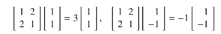
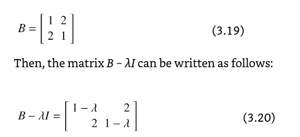
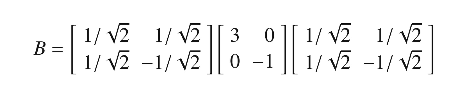
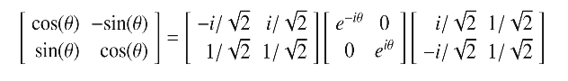
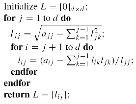

# Chapter 3. Eigenvectors and Diagonalizable Matrices

## 3.1 Introduction

Any squaer matrix A of size dxd can be considered a linear operator, which maps the d-dimensional column vector x to the d-dimensional vector Ax. A linear transformation Ax is a combination of operations such as rotations, reflections, and scalings of a vector x

A diagonalizable matrix is a special type of linear operator. Only corresponds to a simultaneous scaling along d different directions

- d different directions are `eigenvectors`
- d scale factors are `eigenvalues`

All such matrices can be decomposed using an invertible dxd matrix V and a diagonal dxd matrix \Delta:

$A = V\Delta V^{-1}  $

The columns of V contain d eigenvectors

The diagonal entries of \Delta contain the eigenvalues

For any $\bar{x} \in R^d  $, one can geometrically interpret Ax using the decomopsition in terms of a sequence of 3 transformations:

- i. Multiplication of x with V^{-1} computes the coordinates of x in a (possibly non-orthogonal) basis system corresponsing to the columns (eigenvectors) of V
- ii. multiplication of V^{-1}x with \Delta to create $\Delta V^{-1}\bar{x} $ dilates these coordinates with scale factors in \Delta in the eigenvector directions
- iii. final multiplication with V to create $V\Delta V^{-1}\bar{x}  $ transforms the coordinates back to the original basis system (i.e. the standard basis)

The overall result is an `anisotropic scaling` in d eigenvector directions

Linear transformations that can be represented in this way correspond to diagonalizable matrices

A dxd A diagonalizable matrix represents a linear transformation corresponding to anisotropic scaling in d A linearly independent directions

When th columns of matrix V are orthonormal, $V^{-1} = V^{T}$. In this case, the scaling is done along mutually orthogonal directions, and the matrix A is always symmetric, b/c $A^{T} = V\Delta^{T}V^{T} = V \Delta V^{T} = A  $

- contraction = scale factor 0.5
- dilation = scale factor 1

## 3.2 Determinants

Imagine an object, whose outline is projected on a graph, and the shape of the outline consists of coordinate vectors

Multiplying the vectors times a square matrix will distort the object

When matrix A is `diagonalizable`, this distortion is fully described by anisotropic scaling, which affects the "volume" of the object.

How can one determine the scale factors of the transformation implied by multiplication with a matrix? One must first obtain some notion of the effect of a linear transformation on the volume of an object - this is achieved by the notion of a `determinant`, which can be viewed as a quantification of its "volume". A loose but intuitive definition:

#### Definition 3.2.1 - Determinant: Geometric View

The determinant of a dxd matrix is the (signed) volume of the d-dimensional parallelpiped defined by its row (or column) vectors

This definition is self-consistent because the volume defined by the row vectors and the volume defined by the column vectors of a square matrix can be mathematically shown to be the same

- `determinant` of A = `det(A)`
- `sign` - the sign of the determinant
  - tells us the effect on the `orientation` ob the basis system

Ex. a Householder reflection matrix always has a determinant of -1 becuase it changes the orientation of the vectors it tansforms

Noteworthy: multiplying a nx2 data matrix containing the 2-dimensional scatter plot of a right hand (in its rows) with a 2x2 reflection matrix will change the scatter plot to that of a left hand. The sign of the determinant keeps track of this orentation effect of the linear transformation.

The geometric view of useful becuase it provides us an intuitive idea of what the determinant actually computes in terms of absolute values.

Consider two matrices

100
010
001

and

100
110
001

The determinants of both matrices can be shown to be 1, and both parallelipeds have a base area of 1 and a height of 1

The first is I. I is orthogonal. Orthogonal matrix always forms a unit hypercube, so the absolute value of the determinant is always 1

Ex. a 3x3 matrix of rank 2 - all 3 row vectors must lie on 2d plane. Therefore, no possibility of being 3d, so no volume, so no determinant

The determinant of the dxd matrix A can also be defined in terms of (d-1)x(d-1) submatrices of A

#### Definition 3.2.2 - Determinant: Recursive View

Let A = [a_{ij}] be a dxd matrix and A_{ij} be the (d-1)x(d-1) matrix formed by dropping the ith row and jth column, while maintaining the relative ordering of retained rows and columns. The determinant det(A) is recursively defined as:

1. If A is a 1x1 matrix, its determinant is equal to the single scalar inside of it

2. If A is > 1x1 matrix, its determinant is given by the following for any fixed value of j \in {1..d}:

$\det{(A)} = \sum_{i=1}^{d}(-1)^{(i+j)} a_{ij}\det{(A_{ij})}  $ [Fixed column j]

This fixes a column j, and then expands using all the elements of that column. Any choice of j will yield the same determinant. It is also possible to fix a row i and expand along that row:

$\det{(A)} = \sum_{j=1}^{d}(-1)^{(i+j)}a_{ij}\det({A_{ij}})  $ [Fixed row i]

The recursive definition implies that some matrices have easily computable determinants:

- Diagonal matrix:
  - The determinant of a diagonal matrix is the product of its diagonal entries
- Triangular matrix:
  - The determinant of a triangular matrix is the product of its diagonal entries
  - A matrix containing a row (or columns) of 0s will have a determinant of 0

Consider:

ab
cd

det(A) = ad - bc

```txt
abc   a**   *bc   *bc
def   *ef   d**   *ef
ghi   *hi   *hi   g**
```

= det(A) = a.det[[ef],[hi]] - d.det[[bc],[hi]] + g.det[[bc],[ef]]

= a(ei - hf) - d(bi - hc) + g(bf - ec)

= aei - ahf - dbi + dhc + gbf - gec

its like, for whatever row your operating on, cover values in that row and in the column, and just take the remaining values as matrix

Can observe that the determinant contains 3! = 6 terms, which is the numer of possible ways in which the three elements can be permuted. This perspective provides a permutation-centric definition of the determinant, which is also referred to as the $Leibniz formula$:

#### Definition 3.2.3 - Determinant: Explicit Formula

Consider a dxd matrix A = [a_ij] and let \Sigma be the set of all d! permulations of {1...d}. In other words, for each $\sigma = \sigma_{1}\sigma_{2}...\sigma_{d} \in \Sigma  $, the value $\sigma_{i} $ is a permuted integer from {1...d}. The sign value (denoted by `sgn(\sigma)`) of a permutation $\sigma \in \Sigma  $ is +1, if the permutation can be reached from {1...d} with an even number of element interchanges and it is -1 otherwise. Then, the determinant of A is defined as follows:

$\det{(A)} = \sum_{\sigma \in \Sigma} (sgn(\sigma) \prod_{i=1}^{d}a_{i\sigma_{i}}  )  $

The permutation-centric definition of a determinant is the most direct, although it is difficult to use computationally, and it is not particularly intuitive

#### Problem 3.2.1

Suppose that you have a dxd matrix A, which is not invertible. Provide an informal argument with the geometric view of determinants, as to why addition of i.i.d Gussian noise with variance \lambda to each entry of the matrix A will almost certainly make it invertible

Basically it should shake up the values to the point where they are no longer linearly dependent, and un-collapse the dependent dimensions such that a volume arises

#### Useful Properties of Determinants

The recursive and geometric definitions of the detmerminant imply the following properties:

- 1. Switching two rows (or columns) of a matrix A flips the sign of the determinant
- 2. det(A) = det(A^T)
- 3. A matrix with two identical rows has det(A) = 0
- 4. Multiplying a single row of the matrix A with c to create the new matrix A' results in the multiplication of the determinant of A by c (b/c we are scaling the volume of the matrix parallelepiped by c)
  - det(A') = c.det(A)
  - Muliplying the entire dxd matrix by c scales its determinant by c^d
- 5. det(A) is !=0 only if the matrix is non-singular
  - Geometrically, a parallelepiped of linearly dependent vectors lies in a lower dimensional plane with zero volume

Other important properties

#### Lemma 3.2.1

The determinant of the product of two matrices A and B is the product of their determinants:

det(AB) = det(A).det(B)

Corollary - the det of the inverse of a matrix is the inverse of its determinant:

$\det{(A^{-1})} = \frac{\det{(I)}}{\det{(A)}} = \frac{1}{\det{(A)}}  $

The product-wise property of determinants can be geometrically interpreted in terms of parallelepiped volumes:

- 1. Multiplying matrix A with matrix B (in any order) always scales up the (parallelepiped volume of B) with the volume of A. Therefore, even thought AB != BA (in general), their volumes are always the same
- 2. Multiplying matrix A with a diagonal matrix with values $\lambda_{1}...\lambda_{d}  $ along the diagonal scales up the volume of A with $\lambda_{1}\lambda_{2}...\lambda_{d} $. Not surprising bc we are strethcing the axes with these factors, which explains the nature of the scaling of the volume of the underlying parallelepiped.
- 3. Multiplying A with a rotation matrix simply rotates the parallelepiped, and it does not change the determinant of the matrix
- 4. Reflecting a parallelepiped to its mirror image changes its sign without changing its volum. the sign of the determinant tells us a key fact about the orientation of the data created using multiplicative transformation with A.
  - For ex, consider an nx2 data set D containing the 2-dimensional scatter plot oa right hand in arrows. A negative determinant of a 2x2 matrix A means that multiplicative transformation of the nx2 data set D with A will result in a scatter plot of a right hand in D changing into that of a (possibly stretched and rotated) left hand in DA
- 5. Since all linear transformations are combinations of rotations, reflections, and scaling, one can compute the aboslute effect of a linear transformation on the determinant by focusing on only the scaling portions of the transformation

The product-wise property of determinants is particulary useful for matrices with special structure. For ex, an orthogonal matrix satisfies $A^T A = I$ so therefore we have $\det{(A)}\det{(A^{T})} = det(I) = 1  $. Since the det of A and A^T are equal, it follows that the *square* of the determinant of A is 1

#### Lemma 3.2.2

The determinant of an othogonal matrix is either +1 or -1

One can use this result to simplify the determinant computation of a matrix with various types of decompositions containing orthogonal matrices

#### Problem 3.2.2

Consider a dxd matrix A that is decomposed into the form A = Q\Sigma P^T, where Q and P are dxd orthonormal matrices, and \Sigma is a dxd diagonal matrix containing the nonnegative values \sigma...

- What is the absolute value of the determinant of A?
- Can the sign of the determinant be negative?
- Does the answer change with Q=P?

#### Problem 3.2.3 - Restricted Affine Property of Determinants

ith row becomes the weighted combination of contributions from each A and B.

say like weights of 4, 6 - normalized, these become .4 and .6 of the entire contribution.

- .4 = .4
- .6 = 1 -.4

#### Problem 3.2.4

Work out the determinants of all the elementary row operator matrices from ch1

#### Problem 3.2.6

How can one compute the determinant from the QR decomposition or the LU decomposition of a square matrix

- QR
  - Q is an orthogonal matrix, so det = +-1s
  - R is upper triangular, so det is product of diagonal entries
- LU
  - L is a square lower triangular with ones on the diagonal, so det(L) = 1
  - U is upper triangular, so det is product of diagonal entries

#### Problem 3.2.6

Consider a dxd square matrix A such that A = -A^T. Use properties of determinants to show that if d is odd, then the matrix is singular

#### Problem 3.2.7

Suppose you have a dxd matrix in which the absolute value of every entry is <= 1.

Show that the absolute value of the det <= (d)^{d/2}

Provide an example of a 2x2 matrix in which the determinant is equal to this upper bound (hint: think about the geometric view of determinants)

## 3.3 Diagonalizable Transformations and Eigenvectors

#### Definition 3.3.1 - Eigenvectors and Eigenvalues

A d-dimensional column vector $\bar{x}$ is said to be an `eigenvector` of dxd matrix A, if the following relationship is satisfied for some scalar $\lambda$:

$A\bar{x} = \lambda \bar{x}  $

The scalar $\lambda$ is referred to as its `eigenvalue`

An `eigenvector` can be viewed as "stretching direction" of the matrix, where multiplying the vector with the matrix simply stretches the former. For ex:

- [1, 1]^T and [1, -1]^T are `eigenvectors` of the following matrix
- 3 and -1 are the eigenvalues, respectfully



Each member of the standard basis is an eigenvector of the diagonal matrix, with eigenvalue equal to the ith diagona entry. All vectors are eigenvectors of the identity matrix

The number of eigenvectors of a dxd matrix A may vary, but only diagonalizable matrices represent `anisotropic` scaling in d linearly independent directions; therefore, *we need to be able to find d A linearly independent eigenvectors*.

Let $\bar{v}_{1}...\bar{v}_{d}  $ be d linearly independent eigenvectors and $\lambda_{1}...\lambda_{d}  $ be the corresponding eigenvalues. Therefore, the eigenvector condition holds in each case

$A\bar{v}_{i} = \lambda_{i}\bar{v}_{i}, \forall i \in \{1...d \} $

one can rewrite the condition in matrix form:

$A[\bar{v}_{1}...\bar{v_{d}}] = [\lambda_{1}\bar{v}_{1}...\lambda_{d}\bar{d}] $

By defining V to be a dxd matrix containing v_{1}...v_{d} in its columns, and $\Delta$ to be a diagonal matrix containing $\lambda_{1}...\lambda_{d}  $ along the idaonals, one can rewrite as:

$AV = V\Delta  $

Post-multiplying with V^{-1}, we obtain the diagonalization of the matrix A:

$A = V\Delta V^{-1}  $

- V is an *invertible* dxd matrix containing *linearly independent* eigenvectors
  - aka `basis change matrix`
  - b/c tells us that the linear transformation A is a diagonal matrix $\Delta$ *after changing the basis to the columns of V*
- $\Delta$ is a dxd diagonal matrix, whose diagonal elements contain the `eigenvalues` of A

The `determinant` of a `diagonalizable matrix` is defined by **the product of its eigenvalues**. Since diagonalizable matrices represent linear transforms corresponding to *anisotropic* scaling in arbitrary directions, a diagonalizable transform should scale up the volume of an object by the product of these scaling factors. It is helpful to think of the matrix A in terms of the transform it performs on the unit parallelepiped corresponding to the orthonormal columns of the identity matrix:

$A = AI  $

The transformation scales this unit parallelepiped with scaling factors $\lambda_{1}...\lambda_{d}  $ in d directions. The ith scaling multiplies the volume of the parallelepiped by $\lambda_{i} $. A a result, the final volume of the parallelepiped defined by the I matrix (after all the scalings) is the product of $\lambda_{1}...\lambda_{d} $. This intuition provides:

#### Lemma 3.3.1

The determinant of a diagonalizable matrix is equal to the product of its eigenvalues

The presence of a zero eigenvalue implies that the matrix A is singular because its determinant is zero. One can also infer this fact from the observation that the corresopnding eigenvector v satisfies Av = \bar{0}. In other words, the matrix A is not of full rank because its null space is nonempty. A nonsingular, diagonalizable matrix can be inverted easily according to:

$(V\Delta V^{-1})^{-1} = V \Delta^{-1}V^{-1} $

Note that the $\Delta^{-1}  $ can be obtained by replacing each eigenvalue in the diagonal of \Delta with its reciprocal. Matrices with zero eigenvalues cannot be inverted; the reciprocal of zero is not defined

#### Problem 3.3.1

Let A be a square, diagonalizable matrix. Consider a situation in which we add \alpha to each diagonal entry of A to create A'. Show that A' has the same eigenvectors as A, and its eigenvalues are related to A by a difference of \alpha

It is noteworthy that the ith eigenvector $\bar{v}_{i}$ belongs to the (right) null space of $A - \lambda_{i}I $ because $(A - \lambda_{i}I)\bar{v}_{i} = 0  $. This polynomial expression that yields the eigenvalue roots is referred to as the `charactersitc polynomial of A`

#### Definition 3.3.2 - Characteristic Polynomial

The characteristic polynomial of a dxd matrix A is the degree-d polynomial in \lambda obtained by expanding $\det{(A - \lambda I)}  $

Note that this is a degree-d polynomial, which always has d roots (including repeated or complex roots). The d roots of the characteristic polynomial of *any* dxd matrix are its eigenvalues

#### Observation 3.3.1

The characteristic polynomial f(\lambda) of a dxd matrix A is a polynomial in the following form, where $\lambda_{1}...\lambda_{d}  $ are `eigenvalues` of A:

$\det{(A - \lambda I)} = (\lambda_{1} - \lambda)(\lambda_{2} - \lambda)...(\lambda_{d} - \lambda)  $

Therefore, the eigenvalues and eigenvectors of a matrix A can be computed as follows:

- 1. The eigenvalues of A can be computed by
  - expanding $\det{(A - \lambda I)}  $ as a polynomial expression in \lambda
  - setting it to zero
  - solving for \lambda
- 2. For each root \lambda_{i} of the polynomial, we solve the system of equations (A - \lambda_{i} I)\bar{v} = 0 in order to obtain one or more eigenvectors. The linearly independent eigenvectors with eigenvalue \lambda_{i}, therefore, define a basis of the right null space of (A - \lambda_{i} I)

The charactersitic polynomial of the dxd identity matrix is $(1 - \lambda)^{d}  $. This is consistent with the fact that an identity matrix has d repeated eigenvalues of 1, and every d-dimensional vector is an eigenvector belonging to the null space of A - \lambda I. As another example:



- The determinant: $(1 - \lambda)^{2} - 4 = \lambda^{2} - 2\lambda - 3  $
  - equivalent to: $(3 - \lambda)(-1 - \lambda)  $
  - Setting to 0, we get eigenvalues of:
    - 3, -1
- The corresponding eigenvectors are:
  - [1, 1]^T, [1, -1]^T
  - which can be obtained from the null spaces of each $(A - \lambda_{i} I)  $

We need to diagonalize B as $V\Delta V^{-1}  $. The matrix V can be constructed by stacking the eigenvectors in columns

The normalization of columns is not unique, although choosing V to have unit columns (which results in V^{-1} having unit rows) is a common practice. Can construct the diagonalization $B = V \Delta V^{-1}  $ as follows:



#### Problem 3.3.2

#### Problem 3.3.3

One can compute a polynomial of a square matrix A in the same way as one computes the polynomial of a scalar - the main differences are that non-zero powers of the scalar are replaced with powers of A and that the scalar term c in the polynomial is replaced by cI. When one computes the characteristic polynomial in thers of its matrix, one always obtains the zero matrix - this is the `Cayley-Hamilton Theorem` and is true for all matrices whether they are diagonalizable or not

#### Lemma 3.3.2 - Cayley-Hamilton Theorem

Let A be any matrix with characteristic polynomial $f(\lambda) = \det{(A - \lambda I)}  $. Then, f(A) evaluates to the zero matrix

The Cayley-Hamilton theorem is true in general for any square matrix A, but it can be proved more easily in some special cases. For ex, when A is diagonalizable, it is easy to show the following for any polynomial fn f():

$f(A) = V f(\Delta)V^{-1}  $

Applying a polynomial fn to a diagonal matrix is equivalent to applying a polynomial fn to each diagonal entry (eigenvalue). Applying the characteristic polynomial to an eigenvalue will yield 0. therefore, f(\Delta) is a zero matrix, which implies that f(A) is a zero matrix. One interesting consequence of the Cayley-Hamilton theorem is that the inverse of a non-zero singular matrix can always be expressed as a polynomial of degree (d-1)!

#### Lemma 3.3.3 - Polynomial Representation of Matrix Inverse

The inverse of an invertible dxd matrix A can be expressed as a polynomial of A of degree at most (d-1)

The constant term in the characteristic polynomial is the product of the eigenvalues, which is non-zero in  the case of nonsingular matrices. Therefore, only in the case of nonsingular matrices, we can write the Cayley-Hamilton matrix polynomial in some form:

$f(A) = A[g(A)] + cI  $ where g(A) is a matrix polynomial of degree (d-1)

Rearranging, we get:

$A[-g(A)/c] = I  $ where $[-g(A)/c] = A^{-1}$

#### Problem 3.3.4

AA = A^2

So A[g(A)] where g(A) is a d-1 polynomial is equivalent

The above lemma explains why the inverse shows many special properties (e.g., commutativity of multiplication with inverse) shown by matrix polynomials. Similarly, both polynomials and inverses of triangular matrices are triangular. Triangular matrices contain eigenvalues on the main diagonal

#### Lemma 3.3.4

Let A be a dxd triangular matrix. Then, the entries $\lambda_{1}...\lambda_{d}  $ on its main diagonal are its eigenvalues.

### 3.3.1 Complex Eigenvalues

It is possible for the characteristic polynomial of a matrix to have complex roots. In such a case, the real values matrix might be diagonalizable with complex eigenvectors/eigenvalues

Consider the case of the rotation transform, which is not diagonalizable with real eigenvalues. After all, it is hard to imagine a real-valued eigenvector that when transformed with a 90deg rotation would point in the same direction as the original vector. However, this is indeed possible when working in complex fields! The key point is that multiplication with the imaginary number i rotates a complex vector to an orthogonal orientation.

One can verify that the complex vector u = a + ib is always orthogonal to the vector $v = i[a + ib] $ using the definition of complex inner products

For the std 90deg rotation matrix:

```
cos(90) -sin(90) = 0 -1
sin(90)  cos(90) = 1  0
```

- Characteristic polynomial is (\lambda^{2} + 1)
  - which does not have any real valued roots
  - -i and i
- eigenvectors are:
  - [-i, 1]^T and [i,1]^{T}

The use of complex numbers greatly extends the family of matrices that can be diagonalized. One can write the family of 2x2 rotation matrices at an angle \theta (in radians as):



From Eulers formula, it is known that $e^{i\theta} = \cos(\theta) + i \sin(\theta)  $

It seems geometrically intuitive that multiplying a vector with the mth power of a \theta-rotation matrix should rotate the vector m times to create an overall rotation of m\theta. The noted diagonalization above makes it algebraically obvious that the mth power of the \theta-rotation matrix yields a rotation of m\theta because the diagonal entries in the mth power become $e^{\frac{+}{-}m\theta}  $

#### Problem 3.3.5

### 3.3.2 Left Eigenvectors and Right Eigenvectors

Throughout this book, we have defined an eigenvector as a *column* vector satisfying $Ax = \lambda x$ for some scalar \lambda. Such an eigenvector is a right eigenvector because x occurs on the right side of the product Ax. When a vector is referred to as an "eigenvector" without mention of right or left, it referrs to the `right eigenvector` buy default.

A `left eigenvector` is a *row* eigenvector y, such that $\bar{y}A = \lambda A $.

It is necessary for y to be a row vector for y to occur on the left-hand side of the product yA. It is noteworthy that (the transposed representation) of a right eigenvector of a matrix *need not* be a left eigenvector, and vice versa, unless the matrix A is symmetric.

#### Lemma 3.3.5

If a matrix A is symmetric, then each of its left eigenvectors is a right eigenvector after transposing the row vector into a column vector. Similarly, transposing each right eigenvector results in a row vector that is a left eigenvector.

The relationship between left and right eigenvectors holds only for symmetric matrices. How about the eigenvalues? It  turns out that left and right eigenvalues are the same irrespective of whether or not the matrix is symmetric. This is because the `characteristic polynomial` in both cases is $\det{(A - \lambda I)} = \det{(A^T - \lambda I)}  $

Consider a diagonalizable dxd matrix A, which can be converted to its diagonalized matrix \Delta as follows:

$A = V \Delta V^{-1}  $

In this case, the right eigenvectors are the d columns of the dxd matrix V. However, the left eigenvectors are the rows of the matrix V^{-1}. This is because the left eigenvectors of A are the right eigenvectors of A^T after transposition. Transposing A yields:

$A^{T} = (V\Delta V^{-1})^{T} = (V^{-1})^{T}\Delta V^{T}  $

In other words, the right eigenvectors of A^T are the columns of (V^{-1})^T, which are the transposed rows of V^{-1}

#### Problem 3.3.6

The right eigenvectors of a diagonalizable matrix A = V \Delta V^{-1} are columns of V, wehreas the left eigenvectors are rows of V^{-1}. Use this fact to infer the relationships between left and right eigenvectors of a diagonalizable matrix

- left and right eigenvectors are `dual bases` wrt the std dot product
  - they are othogonal
- column space is spanned by the right eigenvectors
- row space is spanned by the left eigenvectors

### 3.3.3 Existence and Uniqueness of Diagonalization

The characteristic polynomial provides insights into the existence and uniqueness of diagonlzation. Assume complex-valued diagonalization is allowed, although the original matrix is assumed to be real-valued

In order to perform the diagonalization, we need d linearly independent eigenvectors. We can then put the d linearly independent eigenvectors in the columns of matrix V and the eigenvalues along the diagonal of \Delta to perform the diagonalization $V\Delta V^{-1}  $

First, we note the `characteristic polynomial` has at least one distinct root (which is possibly complex), and the minimum number of roots occurs when the same root is repeated d times

Given a root \lambda, the matrix A - \lambda I is singular, since its determinant is 0. Therefore, we can find the vector x in the null space of (A - \lambda I). Since this vector satisfies $(A - \lambda I)\bar{x} = 0  $, it follows that it is an eigenvectors.

#### Observation 3.3.2

A well-defined procedure exists for finding an eigenvector from each *distinct* root of the charactersitic polynomial. Since the characteristic polynomial has at least one (possibly complex) root, every real matrix has at least one (possibly complex) eigenvector

Note that we *might* be able to find more than one eigenvector for an eigenvalue when the root is repeated, which is a key deciding factor in whether or not the matrix is diagonalizable. First, we show the most important result that the eigenvectors belonging to distinct eigenvalues are linearly independent

#### Lemma 3.3.6

The eigenvectors belonging to distinct eigenvalues are linearly independent

In the special case that the matrix A has d distinct eigenvalues, one can construct an invertible matrix V from the eigenvectors. This makes the matrix A diagonalizable

#### Lemma 3.3.7

When the roots of the characteristic polynomial are distinct, one can find d linearly independent eigenvectors. Therefore, a (possibly complex-valued) diagonalization $A = V \Delta V^{-1}$ of a real-valued matrix A with d distinct roots always exists.

In the case that the characteristic polynomial has distinct roots, one can not only show existence of a diagonalization, but we can also show that the diagonalization can be performed in an almost unique way (with possibly complex eigenvectors and eigenvalues). We use the word "almost" because one can multiply and eigenvector with any scalar and it still remains an eigenvector with the same eigenvalue.

If we scale the ith column of V by c, we can scale the ith row of V^{-1} by 1/c without affecting the result

Finally, one can shuffle the order of the left/right eigenvectors in V^{-1}, V and eigenvalues in \Delta in the same way without affecting the product. By imposing a non-increasing eigenvector order, and a normalization and sign convention on the diagonalization (such as allowing only unit normalized eigenvectors in which the first non-zero component is positive), one can obtain a *unique diagonalization*

On the other hand, if the characteristic polynomial is of the form $\prod_{i}(\lambda_{i} - \lambda)^{r_{i}}  $, where at least one $r_{i} $ is strictly greater than 1, the roots are not distinct. In such a case, the solution to $(A - \lambda_{i} I)\bar{x} = 0 $ might be a vector space with dimensionality less than r_{i}. As a result, we may or may not be able to find the full set of d eigenvectors required to create the matrix V for diagonalization.

The `algebraic multiplicity` of an eigenvalue \lambda_{i} is the number of times (A - \lambda_{i}I) occurs as a factor in the characteristic polynomial. For example, if A is a dxd matrix, its characteristic polynomial always contains d factors (including repetitions and complex-valued factors). We have already shown that an algebraic multiplicity of 1 for each eigenvalue is the simple case where a diagonalization exists. In the case where the algebraic multiplicities of some eigenvalues are strictly greater than 1, one of the following will occur:

- Exactly r_{i} linearly independent eigenvectors exist for each eigenvalue with algebraic multiplicity r_{i}. Any linear combination of these eigenvectors is also an eigenvector.
  - In other words, a vector space of eigenvectors exists with rank r_{i}, and any basis of this vector space is a valid set of eigenvectors. Such a vector space corresponding to a specific eigenvalue is referred to as an `eigenspace`
  - In this case, one can perform diagonalization A = V \Delta V^{-1} by choosing the columns of V in an infinite number of possible ways as the basis vectors of all the underlying eigenspaces
- If less than r_{i} eigenvectors exist for an eigenvalue with algebraic multiplicity r_{i}, a diagonalization *does not exist*. The closest we can get to a diagonalization is the `Jordan normal form`
  - such a matrix is said to be `defective`

In the first case, it is no longer possible to have a unique diagonalization even after imposing a normalization and sign convention on the eigenvectors

For an eigenvalue \lambda_{i} with algebraic multiplicity r_{i}, the system of equations $(A - \lambda_{i} I)\bar{x} = 0  $ might have as many as r_{i} solutions. When we have two or more distinct eigenvectors (e.g. v_{1} and v_{2}) for the same eigenvalue, any linear combination $\alpha\bar{v}_{1} + \beta\bar{v}_{2}  $ will also be an eigenvector for all scalars \alpha and \beta

Therefore, for creating a diagonalization $A = V \Delta V^{-1}  $, one can construct the columns of V in an infinite number of possible ways. The best example of this situation is the identity matrix in which any unit vector is an eigenvector with eigenvalue 1. One can "diagonalize" the (already diagonal) identity matrix I in an infinite number of possible ways $I = V\Delta V^{-1}  $, where \Delta is identical to I and V is any invertible matrix

Repeated eigenvalues also create the possibility that a diagonalization might not exist. This occurs when the number of linearly independent eigenvectors for an eigenvalue is less than its algebraic multiplicity. Even though the characteristic polynomial has d roots (including repititions), one migh have fewer than d eigenvectors. In such a case, the matrix is not diagonalizable

Consider:

$A = \begin{bmatrix}1 & 1\\0 & 1\end{bmatrix}$

The characteristic polynomial is (1 - \lambda)^{2}. Therefore, we obtain a single eigenvalue of \lambda = 1 with algebraic multiplicity of 2. However, the matrix (A - \lambda I) has rank 1, and we obtain only a single eigenvector [1, 0]^{T}. Therefore, this matrixs is not diagonalizable. *Matrices containing repeated eigenvalues and missing eigenvectors of the repeated eigenvalues are not diagonalizable*

The number of eigenvectors of an eigenvalues is referred to as its `geometric multiplicity`, which is at least 1 and at most the algebraic multiplicity r_{i}

### 3.3.4 Existence and Uniqueness of Triangulization

Where do the "missing eigenvectors" of defective matrices go?

Consider an eigenvalue \lambda with multiplicity k. The characteristic polynomial only tells us that the null space of (A - \lambda I )^{k} has dimensionality k, but does not guarantee this for (A - \lambda I). The key point is that the system of equations $(A - \lambda I)^{k}\bar{x} = 0$ is guaranteed to have k linearly independent solutions, although the system of equations $(A - \lambda I)\bar{x} = 0$ mmight have anywhere between 1 and k solutions. Can we somehow use this fact to get something close to a diagonalization?

Let the sysetm of equations $(A - \lambda I)\bar{x} = 0$ have r < k solutions. All the k solutions of $(A - \lambda I)^{k}\bar{x} = 0$ are *generalized* eigenvectors and r < k of them are `ordinary eigenvectors`. It is possible to decompose the set of k generalized eigenvectors into r `Jordan chains`. The ith Jordain chain contains an ordered sequence of m(i) (generalized) eigenvectors out of the k eigenvectors, so that we have $\sum_{i=1}^{r}m(i) = k  $. The sequence of generalized eigenvectors for the ith Jordan chain is denoted by $\bar{v}_{1}...\bar{v}_{m(i)}  $, so that the first eigenvector $\bar{v}_{1}$ is an `ordinary eigenvector` satisfying $A\bar{v}_{1} = \lambda\bar{v}_{1}  $, and the remaining satisfy the chain relation $A\bar{v}_{j} = \lambda\bar{v}_{j} + \bar{v}_{j-1}  $ for j > 1. Note that these chain vectors are essentially obtained as $\bar{v}_{m(i)-r} = (A - \lambda I)^{r} \bar{v}_{m(i)}  $ for each r from 1 to m(i) - 1

The matrix V contains the generalized eigenvectors in its columns, with eigenvectors belonging to the same Jordan chain occuring consecutively in the same order as their chain relations, and with the ordinary eigenvector being the leftmost of this group of columns. This matrix V can be used to create the `Jordan normal form`, which "almost" diagonalizes the matrix A with an upper-triangular matrix U:

$A = V U V^{-1} $

The upper-triangular matrix U is "almost" diagonal, and it contains diagonal entries containing eigenvalues in the same order as the corresponding generalized eigenvectors in V. In addition, at most (d-1) entries, which are just above the diagona, can be 0 or 1.

- An entry just above the diagonal:
  - is 0 if and only if the corresponding eigenvector is an ordinary eigenvector
  - is 1 if it is not an ordinary eigenvector

It is not difficult to verify that AV = VU is the matrix representation of all eigenvector relations (including chain relations), which implies that $A = VUV^{-1}  $

Each entry immediately above the diagonal is referred to as a `super-diagonal entry`

A large matrix may sometimes contain only a small number of repeated eigenvalues, and the number of non-zero entries above the diagonal is always bounded above by these repetitions. Therefore, the Jordan normal form contains a small number of super-diagonal 1s in addition to the non-zero entries on the diagonal. In the special case of diagonalizable matrices, the Jordan normal form is the diagonalization of the matrix

The existence of the Jordan normal form implies that all square matrices are triangulizable, although it is possible for the eigenvectors and eigenvalues to be complex even for real matrices. The triangulizability of a matrix is not unique. One can create different types of triangulizations by imposing different types of constraints on the basis vectors and the triangular matrix.

For example, the Jordan normal form has a special structure of the upper-triangular matrix U, but no special structure on the basis vectors in V.

Another form of triangulization is the `Schur decomposition` in which the basis change matrix P is orthogonal, and the upper-triangular matrix U contains the eigenvalues on the diagonal with no other special properties:

$A = PUP^{-1}  $

A `Schur decomposition` can be found using iterative QR decomposition, and it is one of the methods used for computing the eigenvalues of a matrix.

The `Schur decomposition` of a symmetric matrix is the *same as its diagonalization*. this is because if we have A = A^T, then we must have $PUP^T = PU^{T}P^{T}  $, which is the same as saying that $P(U - U^T)P^T = 0  $. Since P is non-singular, we must have U = U^T. This is possible only when U is diagonal. A (possibly complex-valued) Schur decomposition of a real matrix always exists, alghough it might not be unique (just as the diagonalization is not unique)

#### Diagonalizability vs Triangulizability: A Geometric View

How can one geometrically interpret the Jordan normal form?

Note that each entry of 1 on the super-diagonal can be zeroed out using an elementary row addition operator with the row below it, provided that we perform the elementary row addition operations from bottom to top order on consequtive pairs of rows

As discussed, elementary row addition operations correspond to shear matrices. Multiplications with shear matrices cause transformations of the type that changed the cube to a parallelepiped

Non-diagonalizable matrices always contain this type of "residual" rotation

Diagonalizable transforms are those in which a (possibly non-orthogonal) basis system exists along which one can scale the space. For non-diagonalizable matrices, scaling alone is not adequate. If we are additionally willing to allow some rotation after scaling, non-diagonalizable transforms can be represented as well.

Every square matrix can be decomposed into the product of:

- a diagonalizable matrix
- the "residual" rotation matrix

This ^^ decomposition ^^ is referred to as the `polar decomposition` of a matrix

Note that rotation matrices are also diagonalizable, albeit with complex eigenvalues. Therefore, every real matrix can be expressed as the product of at most two diagonalizable matrices (although one might have complex eigenvalues)

### 3.3.5 Similar Matrix Families Sharing Eigenvalues

Similar matrices are defined as:

#### Definition 3.3.3

Two matrices A and B are said to be similar when $B = VAV^{-1} $

Similarity is a commutitive and transitive property

In other words, if A and B are similar, B and A are similar as well. Furthermore, if A and B are similar, and B and C are similar, then A and C are similar. Therefore, similar matrices form a `family` of related matrices

What do similar matrices mean?

When we have two similar matrices A and B, then multiplying a vector with either A or B results in the same transformation of that vector as long as the basis is appropriately chosen in each case. For example, two similar matrices of size 3x3 might correspond to a 60deg rotation of a 3-dimensional vector, but the axis of rotation might be different. Similarly, two similar transformations might scale a vector by the same factor in different directions. One can interpret this point in terms of their Jordan normal forms

#### Lemma 3.3.8 - Jordan Normal Forms of Similar Matrices

Let A and B be two similar matrices satisfying B = VAV^{-1}. Then, their Jordan normal forms (with possibly complex eigenvalues) will be related:

$A = V_{1}UV_{1}^{-1}, B = V_{2}UV_{2}^{-1}  $

The matrix V_{2} is related to V_{1} as V_{2} = VV_{1}

The above lemma is easy to show by direct substitution of the Jordan form of A in the relationship B = VAV^{-1}. An important consequence of the above result is that *similar matrices have the same eigenvalues (and their corresponding multiplicities)*

Furthermore, if one member of a similar family is diagonalizable, then all members are diagonalizable as well, and a diagonal matrix is included in the family

The sum of the diagonal entries of a matrix is equal to the sum of its eigenvalues, whether it is diagonalizable or not

#### Lemma 3.3.9

The traces of similar matrices are equal, and are equal of the sum of the eigenvalues of that family (whether it is diagonalizable or not)

Similar matrices perform similar operations, but in different basis systems. For example, a similar family of diagonalizable matrices performs anisotropic scaling with the same factors, albeit in completely different eigenvector directions

#### Problem 3.3.7 - Householder Family

Show that all householder reflection matrices are similar, and the family includes the elementary reflection matrix that differs from the identity matrix in one element

#### Problem 3.3.8 - Projection Famile

Section 2.8.2 introduces the nxn projection matrix $P = A(A^{T}A)^{-1}A^{T}  $ for nxd matrix A with full column rank d and n > d. Show that all projection matrices P obtained by varying A (but for particular values of n and d) are similar.

- What is the trace of P?
- Provide a geometric interpretation of (I - P) and (I - 2P)

#### Problem 3.3.9 - Givens Family

Show that all Givens matrices with the same rotation angle \alpha are similar, because for any such pair of Givens matrices G1 and G2, one can find a permutation matrix P such that $G_{2} = PG_{1}P^{T}  $. Now consider an orthogonal matrix Q that is not a permutation matrix. Provide a geometric interpretation of $QG_{1}Q^{T}  $

- something about changing the index of eigenvalues corresponds to same index of eigenvectors, and there is a relationship between (right) eigenvectors and left eigenvectors
- QG_{1}Q^{T} is just like stretching the parallelepiped bc not orthogonal

#### Problem 3.3.10 - Similarity in Graph Theory

Consider a graph G_{A} whose adjacency matrix is A. Show that the adjacency matrix B of the *isomorphic* graph G_{B} obtained by reordering the vertices of G_{A} is similar to matrix A. What type of matrix is used for the basis transformation between A and B?

"return to it after reading Chapter 10"

basically, graph adjacency matrix is like each index of the row and column correspond to a node, and a value of 1 at the intersection means an edge exists between them

#### Geometric Interpretability of Trace

Since the trace of a matrix is invariant to similarity transformations, a natural question arises as to whether it can be interpreted in a geometric way. The interpretation of the trace of a square matrix is not a simple one, especially when the underlying matrix is not symmetric. Fortunately, many of the square matrices encountered in ML appear in the form of Gram matrices A^{T}A, where A is either an nxd dataset or its transpose. Examples of such matrices include the *regularized graph adjacency matrix*, the *covariance matrix* and the *dot product similarity matrix*. We make the following observation:

#### Observation 3.3.3

The trace of the Gram matrix A^{T}A is equal to the energy in its base matrix A

The above observation follows directly from the definition of energy in Eq. 1.23 of Ch 1. One consequence of the observation is that if we apply an orthonormal similarity transformation AP on a data set contained in the nxd matrix A, its energy, which is equal to the trace of $P^{T}(A^{T}A)P  $ does not change. This fact can be used to infer the result that the sum of the variances of all dimensions in a means-centered data set is always the same, irrespective of the choice of basis:

#### Problem 3.3.11 - Covariance Family

Let D be a *mean-centered* nxd dataset with n rows and d dimensions, and let P be any dxd orthogonal matrix. Let DP be transformed nxd dataset in the new orthogonal basis system. A covariance matrix is a dxd matrix, in which (i,j)th entry is the covariance between dimensions i and j, with diagonal entries representing variances. Show that all covariance matrices of DP over different choices of orthogonal P are similar and they therefore have the same trace.

### 3.3.6 Diagonalizable Matrix Families Sharing Eigenvectors

A diagonalizable matrix family that shares eigenvectors (but not eigenvalues) is referred to as `simultaneously diagonalizable`

#### Definition 3.3.4 - Simultaneous Diagonalizability

To diagonalizable matrices A and B are said to be simultaneously diagonalizable, if a dxd invertible matrix V exists, such that the columns of V are the eigenvectors of both A and B. Therefore, we have the following:

$A = V \Delta_{1} V^{T}  $

$B = V \Delta_{2} V^{T}  $

Here, \Delta_{1} and \Delta_{2} are diagonalizable matrices

The geometric interpretation of simultaneously diagonalizable matrices is that *they perform anisotropic scaling in the same set of directions*. However, the scaling factors might be different, since the diagonal matrices are different. Simultaneous diagonalzability is a property that is closely related to matrix commutativity

#### Lemma 3.3.10

Diagonalizable matrices are also simultaneously diagonalizable if and only if they are commutative

#### Problem 3.3.12

Let A and B be two diagonalizable matrices that share the same set of eigenvectors. Provide a geometric interpretation of why AB = BA

if the eigenvectors are the same, the directions in which A and B operate are the same, so when multiplying, under the hood, the additions applied are actually commutative

#### Problem 3.3.13 - Givens Commutative Family

The multiplication of rotation matrices in dimensionalityies greater than 2 is not commutative in general. However, the dxd family of Givens rotation matrices G_{c}(i, j, \theta) is known to commutative over *fixed* dimension pair i,j and varying \theta.

- Provide a geometric interpretation of this commutativity.
- Now provide an algebraic interpretation in terms of simultaneous diagonalizability by generalizing Equation 3.21 to dxd matrices

Im guessing has to do with sin and cos being like different expressions of the same thing. Maybe something to do with sin^2 + cos^2 = 1, so when multiplying we end up in the addition domain, and term order doesnt matter (so it commutates). 3.12 is also in the VDV^{-1} form

### 3.3.7 Symmetric Matrices

Symmetric matrices arise repeatedly in ML. This is because covariance matrices, dot-product matrices, (undirected) graph adjacency matrices, and similarity (kernel) matrices are used frequently in ML. Furthermore, many of the applications associated with such matrices require some type of diagonalization. One of the fundamental properties of symmetric matrices is that they are always diagonalizable, and have orthonormal eigenvectors - this is the spectral theorem

#### Theorem 3.3.1 - Spectral Theorem

Let A be a dxd symmetric matrix with real entities. Then, A is always diagonalizable with real eigenvalues and has orthonormal, real-valued eigenvectors.

Since the inverse of an orthogonal matrix is its transpose, it is common to write the diagonalization of symmetric matrices in the form $A = V\Delta V^{T}  $ instead of $A = V\Delta V^{-1}  $

Multiplying a data matrix D with a symmetric matrix represents anisotropic scaling of its rows along orthogonal axis directions

The eigenvectors of a symmetric matrix A are not only orthogonal but also AA-orthogonal

#### Definition 3.3.5 - A-Orthogonality

A set of column vectors $\bar{v}_{1}...\bar{v}_{d}  $ is A-orthogonal, if and only if $\bar{v}_{i}^{T}A\bar{v}_{j} = 0  $ for all pairs [i,j] with $i\neq j $

The nortion of A-orthogonality is a generalization of orthogonality, and setting A = I reverts the definition to the usual notion of orthogonality. Nore that $\bar{v}_{i}^{T}A\bar{v}_{j} $ is simply a different choice of inner product from the vanilla dot product.

#### Lemma 3.3.11

The eigenvectors of a symmetric dxd matrix A are A-orthogonal

One can use a natural generalization of Gram-Schmidt orthogonalization to find A-orthogonal basis sets (which is a more efficient choice than eigenvector computation). In may applications like *conjugate gradient descent*, one is often looking for A-orthogonal directions, where A is the `Hessian` of the optimization fn

#### Problem 3.3.14 - Forbenius Norm vs Eigenvalues

Consider a matrix with real eigenvalues. Show that its squared Frobenius norm is at least equal to the sum of the squares of its eigenvalues, and that strict equality is observed for symmetric matrices. The Schur decomposition is helpful

### 3.3.8 Positive Semidefinite Matrices

A symmetric is `positive semidefinite` if and only if all its eigenvalues are non-negative. From a geometric perspective, pre-multiplication of a set of d-dimensional vectors x_{1}...x_{n} with a dxd `positive semidefinite` matrix A to create Ax_{1}...Ax_{n} will distort the scatter-plot of the vectors, so that the scatter-plot is stretched along the eigenvector directions with non-negative scale factors

The nonnegativity of scale factors ensures that transformed vectors do not have large angles wrt the original vectors (i.e. angles > 90deg). The angle between a data vector x and its transformed representation x' = Ax is shown; this angle is no greater than 90 b/c of the fact that the scale factors are nonnegative. Since the cosine of any such angle is nonnegative, it follows that the dot product $x^{T}(Ax)  $ between any column vector x \in R^d and its transformed representation, Ax, is non-negative

#### Definition 3.3.6 - Positive Semidefinite Matrix

A dxd symmetric matrix A is positive semidefinite iff for any non-zero vector x \in R^d, the following is true:

$x^{T}Ax \geq 0  $

#### Lemma 3.3.12

Definition of Positive Semidefinite Matrix of a dxd symmetric matrix A is equivalent to stating that A has nonnegative eigenvalues

A minor variation of positive semidefinite matrix is that of a `positive definite` matrix, where the matrix A cannot be singular

#### Definition 3.3.7 - Positive Definite Matrix

A dxd symmetric matrix A is positive definite iff for any non-zero vector x \in R^d, the following is true

$x^{T}Ax \gt 0  $

The eigenvalues of such a matrix need to be strictly positive

#### Lemma 3.3.13

A syymmetric matrix $A = V\Delta V^{T}  $ is positive definite, iff it has positive eigenvalues

Unlike positive semidefinite matrices, positive definite matrices are guaranteed to be invertible. The inverse matrix is simply $V\Delta^{-1}V^{T}  $, here, \Delta^{-1} can always be computed because none of the eigenvalues are zero.

One can also define `negative semidefinite matrices` as those matrices in which every eigenvalue is non-positive, and $x^{T}Ax \leq 0  $ for each column vector x. A negative semidefinite matric can be converted into a positive semidefinite matric by reversing the sign of each entry in the matrix.

`negative definite` matrix is one in which every eigenvalue is strictly negative

`indefinite` - symmetric matrices with both positive and negative eigenvalues

Any matrix of the form BB^T or B^T B (i.e. Gram matrix form) is always positive semidefinite. The Gram matrix is fundamental to ML, and it appears repeatedly in different forms. Note that B need not be a square matrix.

#### Lemma 3.3.14

A dxd matrix A is `positive semi-definite` iff it can be expressed in the form B^T B for some matrix B. (same worsk for BB^T)

#### Problem 3.3.15

If C is a positive semidefinite matrix, show that there exists a square-root matrix \sqrt{C} that satisfies:

$\sqrt{C}\sqrt{C} = C $

#### Problem 3.3.16

If a matrix C is positive definite, then so is C^{-1}

### 3.3.9 Cholesky Factorization: Symmetric LU Decomposition

The fact that positive definite matrices can be symmetrically factorized into Gram matrix form is a useful result for kernel methods in ML. The use of eigendecomposition to achieve this goal is a natural choice, but not the only one.

Given a factorization the dxd matrix A = BB^T, one can use any orthgonal dxd matrix P to create an alternative factorization:

$A = B(PP^T)B^{T} = (BP)(BP)^{T}  $

One of these infinite choices of symmetric factorizations of A is one in which B is lower-triangular. In other words, one can express the positive definite matrix A in the form LL^T, where L = [l_{ij}] is some dxd lower-triangular matrix. This is `Cholesky factorization`

The Cholesky decomposition is a special case of LU decomposition, and it can be used **only for positive definite matrices**. Although a matrix might have infinte number of LU decompositions, a positive definite matrix has a *unique* Cholesky factorization. It is computationally more efficient to compute the Cholesky decomposition for positive defininte matrices than the generic LU decomposition

Let the columns of the matrix $L = [l_{ij}]_{d\times d}  $ be deonted by $\bar{l}_{1}...\bar{l}_{d}  $. Furthermore, since the matrix $A = [a_{ij}]_{d\times d}  $ is symmetric, we will focus only on the lower-triangular entries a_{ij} (with i >= j) to set up a system of equations that can be easily solved using back-subsititution. First, note that for any i >= j, we have the following:

$a_{ij} = \sum_{k=1}^{d} l_{ik}l_{jk} = \sum_{k=1}^{j}l_{ik}l_{jk} L  $

Where the sum of d = $A_{ij} = (LL^{T})_{ij} $ and the sum of j = Lower-triangular

Note that the subscript for k only runs up to j instead of d for lower-triangular matrices and i >= j. This condition easily sets up a simple system of equations for computing the entries in each column of L one-by-one while back substituting the entries already computed, *as long as we do the computation in the correct order*. For example, we can compute the first column of L by setting j = 1, and iterating over all i >= j:

$l_{11}  = \sqrt{a_{11}}  $

$l_{i1} = a_{i1}/l_{11} \forall i>1  $

We can repeat the same process to compute the second column of L as:

$l_{22} = \sqrt{a_{22} - l_{21}^{2}}  $

$l_{i2} = (a_{i2} - l_{i1}l_{21})/l_{22} \forall i>2  $



Each computation of l_{ij} requires O(d) time, and therefore, the Cholesky method requires O(d^3) time. The above algorithm works for **positive-definite matrices**

If the matrix is *singular* and *positive semi-definite*, then at least one l_{ij} will be 0. This will cause a division by 0 during the computation of l_{ij}, which results in an undefined value. The decomposition is no longer unique, and a Cholesky factorization does not exist in such a case. One possibility is to add a small positive value to each diagonal entry of A to make it positive definite and then restart the factorization.

If the matrix A is indefinite or negative semidefinite, it will show up during the computation of at least one l_{ij}, where one will be forced to compute the square root of a negative quantity. The Cholesky factorization is the preferred approach for testing the positive definite of a matrix

#### Problem 3.3.17 - Solving a System of Equations

b/c positive definite, L guaranteed to be invertible

#### Problem 3.3.18 - Cholesky Factorizationi from Any Symmetric Factorization

## 3.4 Machine Learning and Optimization Applications

### 3.4.1 Fast Matrix Operations in ML

Consider a situation, where one wants to compute a^k for some positive integer k. Repeated matrix multiplication can be expensive. Furthermore, there is no way to compute A^k, k tends to infinity in the limit. It turns out that diagonalization is very useful, even if it is complex valued. This is because one can express A^k as follows:

$A^{k} = V \Delta^{k} V^{-1}  $

Note that it is often easy to compute $\Delta^k$, because we only need to exponentiate the individual entries along the diagonal. By using this approach, one can compute A^k in relatively few operations. As k -> \inf, it is often the case that A^k will either vanish to 0 or explode to very large entries depending on whether the largest eigenvalue is less than 1 or whether it is greater than 1. One can easily compute a polynomial fn in A by computing a polynomial fn in \Delta

These types of applications often arise when working with the adjacency matrices of graphs

### 3.4.2 Examples of Diagonalizable Matrices in ML

There are several positive semidefinite matrices that arise repeatedly in ML applications

#### Dot Product Similarity Matrix

A dot product similarity matrix of an nxd data matrix D is an nxn matrix containing the pairwise dot products between the rows of D.

#### Definition 3.4.1

Let D be an nxd data matrix containing d-dimensional points in its rows. Let S be an nxn similarity matrix between the points, where the (i,j)th entry is the dot product between the ith and jth rows of D. Therefore, the similarity matrix S is related to D as follows:

$S = DD^T  $

Since the dot product is in the form of a Gram matrix, it is positive semidefinite

#### Observation 3.4.1

The dot product similarity matrix of a data set is positive semidefinite

A dot product similarity matrix is an alternative way of specifying the data set, because one can recover the data set D from the similarity matrix to within rotations and reflections of the original data set.

This is because each computational procedure for performing symmetric factorizations $S = D'D'^T$ of the similarity matrix might yield a different D', which can can be viewed as a rotated and reflected version of D. Examples of such computational procedures include eigendecomposition or Cholesky factorization. All the alternatives yield the same dot product. After all, dot products are invariants to axis rotation of the coordinate system. Since ML applications are only concerned with the relative positions of points, this type of ambiguous recovery is adequate in most cases. One of the most common methods to "recover" a data matrix from a similarity matrix is to use eigendecomposition:

$S = Q \Delta Q^T $

The matrix \Delta contains only nonnegative eigenvalues of the positive semidefinite similarity matrix, and therefore we can create a new diagonal matrix \Sigma containing the square-roots of the eigenvalues. Therefore, the *similarity matrix S* can be written as:

$S = Q \Sigma^2 Q^T = (Q\Sigma)(Q\Sigma)^{T}  $

Here $D' = Q\Sigma $ is an nxn data set containing n-dimensional representations of the n points. It seems somewhat odd that the new matrix D' = Q\Sigma is an nxn matrix. After all, if the similarity matrix represents dot products between d-dimensional data points for d << n, we should expect the recovered matrix D' to be a rotated representation of D in d dimensions. What are the extra (n-d) dimensions? Here, the key point is that if the similarity matrix S was indeed created using dot products on d-dimensional points, then DD^T will also have rank at most d. Therefore, at least (n-d) eigenvalues in \Delta will be zeros, which corresponds to dummy coordinates.

But what if we did not use dot product similarity to calculate S from D? What if we use some other similarity function? It turns out that this idea is the essence of *kernel methods* in ML. Instead of using the dot product x.y between two points, one often uses similarity functions such as the following:

$Similarity(\bar{x}, \bar{y}) = \exp{(-\|\bar{x} - \bar{y}\|^{2}/\sigma^{2})}  $

Here, \signa is a parameter that controls the sensitivity of the similarity fn to distances between points. Such a similarity fn is referred to as a *Gaussian kernel*. If we use a similarity fn like this instead of the dot product, we might recover a data set that is different from the original data set from which the similarity was constructed. In fact this recovered data set may not have dummy coordinates, and all n > d dimensions might be relevant. furthermore, the recovered representations Q\Sigma from such similarity fns might yield better results for ML applications than the original data set. This type of fundamental transformation of the data to a new representation is referred to as a `nonlinear feature engineering`, and it goes beyond the natural (linear) transformations like rotation that are common in linear algebra. In fact, it is even possible to extract multidimensional representations from data sets of *arbitrary* objects between which only similarity is specified. For example, if we have a set of n graphs or time-series objects, and we only have the nxn similarity matrix of these objects (and no multidimensional representation), we can use the aforementioned approach to create a multidimensional representation of each object for off-the-shelf learning algorithms.

#### Problem 3.4.1

Suppose given a similarity matrix S that was constructed using some arbitrary heuristic (rather than dot products) on a set of n arbitrary objects (e.g. graphs). As a result, the matrix is symmetric but not positive semidefinite. Discuss how you can repair the matrix S by modifying only its self similarity (i.e., diagonal) entries so that it becomes positive semidefinite

- adding a multiple (preferred)
  - $A_{PSD} = A + \alpha I  $
  - where \alpha carefully chosen
  - only modifies the diagonal
- eigenvalue clipping
  - replace negative eigenvalues in \Delta with 0 (for $B = V\Delta V^{-1}$)
    - so you get $\Delta' $

#### Covariance Matrix

computes (scaled) dot product between **columns** of D *after* `mean-centering` the matrix

Consider a set of scalar values x_1...x_n

- $\mu$ = mean
- $\sigma^{2} $ = variance

$\mu = \frac{\sum_{i=1}^{n}x_{i}}{n}  $

$\sigma^{2} = \frac{\sum_{i=1}^{n} (x_{i} - \mu)^{2}}{n} = \frac{\sum_{i=1}^{n} x_{i}^{2}}{n} - \mu^{2}  $

- Consider a data matrix in which two columns have values x_1...x_n and y_1...y_n
- assume the means of the two columns are the same

Covariance of $\sigma_{xy}  $ is:

$\sigma_{xy} = \frac{\sum_{i=1}^{n}(x_i - \mu_{x})(y_{i} - \mu_{y})}{n} = \frac{\sum_{i=1}^{n}x_{i}y_{i}}{n} - \mu_{x}\mu_{y}  $

The notino of covariance is an extension of variance bc $\sigma_{x}^{2} = \sigma_{xx}  $ is simply the variance of x_1...x_n. Note that when the data is mean centered and \mu_x = \mu_y = 0, then covariance simplifies to just the first term:

$\sigma_{xy} = \frac{\sum_{i=1}^{n}x_{i}y_{i}}{n}  $ [Mean-centered data only]

It is noteworthy that the right side is simply a *scaled version of the dot product b/w columns*

If we have a nxd data matrix D, which is mean-centered, we can compute the covariance between cols i, j using the following to produce a `covariance matrix`

#### Definition 3.4.2 - Covariance matrix of Mean-Centered Data

Let D be an nxd mean-centered data matrix. Then, the covariance matrix C of D is defined as:

$C = \frac{D^{T} D}{n}  $

The *unscaled version* of the matrix, in which the factor of n is not used in the denominator, is referred to as the `scatter matrix`

The covariance matrix is often used for Principal Component Analysis

- since positive semidefinite, can diagonalize as: $C = P\Delta P^T $
- D (data set) is transformed to D' = DP
  - equivalent to representing each row of the original matrix D in the axis system of directions contained in the cols of P

One can also write the diagonal matrix as: $\Delta = P^{T}CP $.

- This \Delta is the new covariance matrix of the transformed data D' = DP
- note that the transformed data is also mean-centered b/c the sum of its columns can be shown to be 0
- Transformation represents a `decorrelated version of the data`

The entries on the diagonal of \Delta are the variances of the individual dimensions in the transformed data, and they represent the nonnegative eigenvalues of the positive semidefinite matrix C

Typically, only a few diagonal entries are large (in relative terms), which contain most of the variance in the data. The remaining low-variance directions can be dropped from the transformed representation. Once can select a small subset of columns from P corresponding to the largest eigenvalues in order to create a dxk transformation matrix P_k where k << d. Each dxk transformed data mstrix is defined as D_{k}' = DP_{k}. Each row is is a new k-dimensional representation of the data set.

It turns out that this representation has a highly reduced dimensionality, but it still retains most of the data variability (like Euclidean distances between points). For mean-centered data, the discarded (d-k) columns of DP are note very informative because they are all very close to 0.

In fact, one can show using optimization methods that this representation provides an optimal reduction of the data in k-dimensions (or principal components), so that the least amount of variance in the data is lost.

### 3.4.3 Symmetric Matrices in Quadratic Optimization

Many ML applications are posed as optimization problems over a squared objective fn. Such objective fns are quadratic, because the highest term of the polynomial is 2

The simplest versions of these quadratic fns can be expressed as:

$\bar{x}^{T}A\bar{x}  $, where A is dxd matrix, and x is a d-dim col vector of optimization variables

The process of solving such optimization problems is `quadratic programming`

`Quadratic programming` is an *extremely important* class of problems in optimization b/c arbitrary fns can be locally approximated as quadratic fns by using `Taylor expansion`

The shape of the fn $\bar{x}^{T}A\bar{x}  $ critically depends on the nature of the matrix A

- `convex functions`
  - When A is `positive semidefinite`
  - Shape of a Bowl:
    - has minimum
    - no maximum
- `concave functions`
  - When A is `negative semidefinite`
  - iNVERTED BOWL

Formally, convex and concave fns satisfy the fillowing properties for any pair of vectors x_1 and x_2 and any scalar $\lambda \in (0, 1)  $:

$f(\lambda\bar{x}_{1} + (1-\lambda)\bar{x}_{2}) \leq \lambda f(\bar{x}_{1}) + (1-\lambda)f(\bar{x}_{2})  $ [Convex function]

$h(\lambda\bar{x}_{1} + (1-\lambda)\bar{x}_{2}) \geq \lambda h(\bar{x}_{1}) + (1-\lambda)h(\bar{x}_{2})  $ [Concave function]

Functions in which A is neither positive nor negative semi-definite (i.e. A is indefinite) have niether global maxima nor minima. Such quadratic fns have `saddle points`, which are infelction points looking like *both* maxima or minima, depending on which direction one approaches the point from

Consider the quadratic fn $f(x_{1}, x_{2}) = x_{1}^{2} + x_{2}^{2}  $

- is `convex`
  - if it has a single global min at (0,0)
- is `concave`
  - if pre multiply -1 * f(.)

Cone can express f(x,y) in matrix form as:

$f(x_{1}, x_{2}) = \begin{bmatrix}x_{1} & x_{2} \end{bmatrix} \begin{bmatrix}1 & 0 \\ 0 & 1 \end{bmatrix} \begin{bmatrix}x_{1}\\ x_{2} \end{bmatrix}  $

In this case, the fn represents a perfectly circular bowl, and the corresponding matrix A for representing the ellipse $\bar{x}^{T}A\bar{x} = r^2  $ is the 2x2 I matrix, which is a trivial form of a positive semidefininte matrix

Using the negative of the I matrix (which is a negative semidefinite matrix) results in an inverted bowl

The negative of a convex fn is always a concave fn, and vice verse. Therefore, maximizing concave fns is almost exactly similar to minimizing convex fns

$f(x) = x^{T}Ax $ corresponds to a *perfectly circular* bowl, when A is the I.

Changing A from the I leads to several interesting generalization.

If the diagonal entries of A are set to (nonnegative) values different from 1:

- then the circular bowl could become elliptical
- note, because quadratic, changes are squared

Note that the diagonal entries of A are `inverse squares` of stretching fns - so for $ \begin{bmatrix}x_{1} & x_{2} \end{bmatrix} \begin{bmatrix}4 & 0 \\ 0 & 1 \end{bmatrix} \begin{bmatrix}x_{1}\\ x_{2} \end{bmatrix} $, we actually shrink x_2 by 1/4 instead of multiplying x_1 by 4

So far, only considered quadratic fns in which stretching occurs along axis-parallel directions. now, consider a diagonal matrix \Delta and rotate using basis matrix P

Use $A = P\Delta P^{T}  $ to define $x^T Ax  $. Then, compute coordinates of x as $y = P^T x  $, and then compute $f(x) = x^T Ax = y^T \Delta y  $

How can we generalize to a fn with optimum occuring at \bar{b} and an optimum value of c (which is scalar)? Corresponding fn of `vertex form`:

$f(\bar{x}) = (\bar{x} - \bar{b})^{T}A(\bar{x}-\bar{b})+c  $

A is equivalent to half the `Hessian matrix` of the quadratic fn. The dxd Hessian H = [h_{ij}] of a fn of d variables is is a symmetric matrix containing the second-order derivatives wrt each pair of variables

$h_{ij} = \frac{\partial^{2}f(\bar{x})}{\partial x_{i} \partial x_{j}} $

Note that $x^T Hx $ represents the directional second derivative of the rate of change of f(x), when moving along the direction x. This value is always nonnegative for convex fns irrespective of x, which ensures that the value of f(x) is minimum when the first derivative of the rate of change of f(x) along each direction x is 0

Hessian needs to be positive semidefinite

### Observation 3.4.2

Consider a quadratic fn, whose quadratic term is of the form $x^T Ax  $. Then, the quadratic function is convex, IFF the matrix A is positive semidefinitite

Many quadratic fns in ML are of this form. A specific example is the dual objective fn of a SVM

It is noteworthy that the most general form of a quadratic fn in multiple variables is as follows:

$f(\bar{x}) = \bar{x}^{T}A'\bar{x} + \bar{b}'^{T} + c' $

- A' is a dxd symmetric matrix
- b' is a d-dim col vec
- v' is a scalar

Note, the vertex form only considers *strictly quadratic* fns, in which all cross-sections of the fn are quadratic. Quadratic is interesting because they certainly have a max or min, whereas linear functions do not

One can relate the corefficients from the above equations:

- A' = A
- b' = 2Ab
- c' = b^T b + c (note this looks suspiciously like the householder term)

Given A', b' and c', the main condition for being able to arrive at the vertex form is: $b' = -2Ab = -2A'b  $ for which a solution will exist only when b' occurs in the col space of A'

Finally, we discuss the case where the matrix A used to create fn x^T Ax is *indefinite* and has both positive and negative eigenvalues. An example of such a fn:

$g(x_{1}, x_{2}) = \begin{bmatrix}x_{1} & x_{2} \end{bmatrix} \begin{bmatrix}1 & 0 \\ 0 & -1 \end{bmatrix} \begin{bmatrix}x_{1} \\ x_{2} \end{bmatrix} = x_{1}^{2} - x_{2}^{2} $

The gradient at (0, 0) is 0, which seems to be an optimum point. However, this point behaves like **both a maximum and a minimum**, when examining second derivatives

If we approach the point from the x_{1} direction, it seems like a min. If we approach from the x_{2} direction, it seems like max. This is because the directional second derviatives in each direction are simply twice the diagonal entries (which are of opposite sign)

Obj fns containing such points are often notoriously hard for optimization

### 3.4.4 Diagonalization Application: Variable Separation for Optimization

Consider the quadratic fn:

$f(x) = x^T Ax + b^T x + c  $

Unless the symmetric matrix A is diagonal, the resulting fn contains terms of the form $x_{i}x_{j} $. Such terms are referred to as `interacting terms`. Most real-world quadratic fns contain such terms.

It is noteworthy that any multivariate quadratic function can be transformed to an additively separable fn (without interacting terms) by basis transformation of the input variables of the fn.

This type of change in basis brings us back to using linear algebra tricks. Additively separable fns are much easier to optimize, because one can decompose the optimization problem into smaller optimization problems on individual variables

For example, a multivariate quadratic fn would appear as a simple sum of univariate quadratic fns (each of which is extremely simple to optimize)

#### Definition 3.4.3 - Additively Separable Functions

A function $F(x_{1}, x_{2}, ..., x_{d})  $ in d variables is said to be `additively separable`, if it can be expressed in the following form for appropriately chosen univariate functions $f_{1}(.), f_{2}(.), ..., f_{d}(.)  $

$F(x_{1}, x_{2}, ..., x_{d}) = \sum_{i=1}^{d}f_{i}(x_{i})  $

Consider the following quadratic fn defined on a d-dimensional vector $\bar{x} = [x_{1}, ..., x_{d}]^{T} $

$f(\bar{x}) = \bar{x}^{T}A\bar{x} + \bar{b}^{T}\bar{x} + c  $

Since A is a dxd symmetric matrix, one can diagonalize it as $A = V\Delta V^{T}  $ and use the varaible transformation $\bar{x} = V\bar{x}'  $ (which is the same as $\bar{x}'' = V^{T}\bar{x}  $)

On performing this transformation one obtains the new fn $g(\bar{x}'') = f(V\bar{x}'')  $, which is identical to the original function in a different basis. It is easy to show that the quadratic fn bay be expressed as follows:

$f(Vx') = x'^{T}\Delta x' + b^{T}Vx' + c $

After this variable transformation, one obtains an additively separable fn, because matrix \Delta is diagonal. One can solve for x' using d univariate optimizations, and then transform back x' to x using $x = Vx'$

Although this approach simplifies optimization, the problem is that eigenvector computation of A can be expensive. However, one can generalize this idea and try to find any matrix V (with possibly non-orthogonal columns), which satisfies $A = V\Delta V^{T} $ for some diagonal matrix \Delta. Note this would not be a true diagonalization of A if the cols of V are not orthonormal.

However, it is good enough to create a separable transformation for optimization, which is what we really care about

The columns of such non-orthogonal matrices are computationally much easier to evaluate than true eigenvectors, and the transformed variables are referred to as `conjugate directions`. The columns of V are referred to as `A-orthogonal directions` because for any pair of (distinct) columns v_{i} and v_{j}, we have $v_{i}^{T}Av_{j} = \Delta_{ij} = 0 $

There are an infinite number of possible ways of creating conjugate directions, and the eigenvectors represent a special case. In fact, a generalization of the Gram-Schmidt method can be used to find such directions. This basic idea forms the principle of the `conjugate gradient descent` method (see Ch 5.), which can be used even for non-quadratic functions. Here, we provide a conceptual overview of the iterative conjugate gradient method for arbitrary (possibly non-quadratic) fn h(x) from current point x = x_{t}

- 1. Create a quadratic approximation f(x) of non-quadratic fn h(x) using the second-order Taylor expansion of h(x) at x = x_{t}
- 2. Compute the optimal solution x* of the quadratic fn f(x) using the separable variable optimization approach discussed above as a set of d univariate optimization problems
- 3. Set $x_{t+1} = x* $ and $t \Leftarrow t + t $
- 4. go back to step 1

This approach is iterated to convergence

### 3.4.5 Eigenvectors in Norm-Constrained Quadratic Programming

A problem that arises frequently in different types of ML settings is one in which we wish to opimize x^T Ax, where x is constrained to unit norm.

Here, A is a dxd *symmetric* data matrix. This type of problem arises in many feature engineering and dimensionality reduction applications like PCA, SVD, and spectral clustering. Such an optimization problem is posed as:

- Optimize: x^T Ax
- subject to: $\|x\|^{2} = 1  $

This optimization problem can be either in minimization or maximimization form

Constraining the vector x to be the unit vector fundamentally changes the nature of the optimization problem. Unlike the previous section, it is no longer important whether the matrix A is positive semidefinite or not. One would have a well-defined optimal solution, even if the matrix A is indefinite. Constraining the norm of the vector helps in avoiding vectors with unbounded magnitudes or trivial solutions (like the zero vector) even when the matrix A is indefinite

Let v_{1}...v_{d} be the d orthonormal eigenvectors of a symmetric matrix A. Note that the set of eigenvectors creates a basis for R^d, and therefore, andy d-dim vectro x can be expressed as a linear combination of v_{1}...v_{d} as follows:

$\bar{x} = \sum_{i=1}^{d} \alpha_{i}\bar{v}_{i}  $

We will re-parameterize this optimization problem in terms of the parameters $\alpha_{1}...\alpha_{d}  $ by subsituting for x in the optimization problem. By making this substitution, and setting each $A\bar{v}_{i} = \lambda_{i}\bar{v}_{i}  $, we obtain the following re-parameterized optimization problem:

- Optimize: $\sum_{i=1}^{d} \lambda_{i}\alpha_{i}^{2} $
- subject to: $\sum_{i=1}^{d}\alpha_{i}^{2} = 1  $

The expression $\|\bar{x}\|^{2} $ in the constraint is simplified to $(\sum_{i=1}^{d}\alpha_{i}\bar{v}_{i})\cdot(\sum_{i=1}^{d}\alpha_{i}\bar{v}_{i})  $; we can expand it using the distributive property, and then we use the orthogonality of the eigenvectors to set $\bar{v}_{i}\cdot\bar{v}_{j} = 0  $. The objective fn value is $\sum_{i}\lambda_{i}\alpha_{i}^{2}  $, where the different $\alpha_{i}^{2} $ sum to 1.

Clearly, the minimum and maximum possible values of this obj fn are achieved by setting the weight $\alpha_{i}^{2}  $ of a single value of \lambda_{i} to 1, which corresponds to the minimum or maximum possible eigenvalue (depending on whether the optimization problem is posed as a minimization or maximization form) - note this is because norm-constrained so max can only be 1:

The maximum value of the norm-constrained quadratic optimization problem is obtained by setting \bar{x} to the largest eigenvector of A. The minim value is obtained by setting \bar{x} to the smallest eigenvector of A

This problem can be generalized to finding a k-dimensional subspace. In other words, we want to find orthonormal vectors $\bar{x}_{i}...\bar{x}_{k}  $ so that $\sum_{i}\bar{x}_{i}A\bar{x}_{i}  $ is optimized:

- Optimize: $\sum_{i=1}^{k} \bar{x}_{i}^{T}A\bar{x}_{i} $
- subject to: $\|\bar{x}_{i}\|^{2} = 1 \forall i \in \{1...k \} $
  - $\bar{x}_{1}...\bar{x}_{k} $ are mutually orthogonal

The optimal solution to this problem can be derived using a similar procedure. An alternate solution with the use of Lagrangian relaxation is shown in Ch 6. Here, we simply state the optimal solution:

The maximum value of the norm-constrained quadratic optimization problem is obtained by using the largest k eigenvectors of A. The minimum value is obtained by using the smallest k eigenvectors of A

Intuitively, these results make geometric sense from the perspective of the `anisotropic scaling` (scaling factors different across different dimensions) caused by symmatric matrices like A. The matrix A distorts the space with scale factors corresponding to the eigenvalues along orthonormal directions corresponding to the eigenvectors. The obj fn tries to either maximize or minimize the aggregate projections of the distorted vectors Ax_{i} on the original vectors x_{i}, which is the sum of the dot products between x_{i} and Ax_{i}.

- By picking the **largest** k eigenvectors (scaling directions), this sum is maximized.
- By picking the **smallest** k directions, this sum is minimized.

## 3.5 Numerical Algorithms for Finding Eigenvectors

The simplest approach for finding eigenvectors of a dxd matrix A is to first find the d roots \lambda_1...\lambda_d of the equation det(A - \lambda I) = 0

next, one has to solve linear systems of the form $(A - \lambda_{j} I)\bar{x} = 0  $. This can be done with Gaussian elimination method

However, polynomial equation solvers are sometimes numerically unstable and have a tendency to show ill-conditioning in real-world settings. Finding the roots of a polynomial equation is numerically harder than finding eigenvalues of a matrix. In fact, one of the many ways in which high-degree polynomial equations are solved in engineering disciplines is to first construct a companion matrix of the polynomial, such that the matrix has the same charactersitic polynomial, and then find its eigenvalues:

#### Problem 3.5.1 - Companion Matrix

Consider

A = [[0,1], [-c, -b]]

discuss why the roots of the polynomial equation x^2 + bx + c = 0 can be computed using the eigenvalues of the matrix

...

In some cases, algorithms fro finding eigenvalues also yield the eigenvectors as byproduct, which is particularly convenient

### 3.5.1 The QR Method via Schur Decomposition

The QR algorithm uses the following two steps alternately in an iterative way:

- 1. Decompose the matrix A = QR using the QR algorithm from 2.2.7. Here, R is an upper triangular matrix and Q is an orthogonal matrix
- 2. Iterate by using $A = \Leftarrow Q^{T}AQ  $
  - go to previous step

The matrix Q^{T}AQ is similar to A, and therefore it has the same eigenvalues. A key result is that applying the transformation $A = \Leftarrow Q^{T}AQ  $ repeatedly to A results in the upper-triangular matrix U of the Schur decomposition

In fact, if we keep track of the orthogonal matrices Q_{1}...Q_{s} obtained using QR decomposition (in that order) and deonte their product Q_{1}Q_{2}...Q_{s} by the single orthogonal matrix P, one can obtain the Schur decomposition of A in the form:

$A = PUP^{T}  $

The diagonal entries of this converged matrix U contain the eigenvalues. In general, the triangulization of a matrix is a natural way of finding its eigenvalues. After the eigenvalues \lambda_{1}...\lambda_{d} have been found, the eigenvectors can be found by solving the equations of the form $(A-\lambda_{j}I)\bar{x} = 0  $

This approach is not fully optimized for computational spee, which can be improved by first transforming the matrix to `Hessenberg form`

### 3.5.2 The Power Method for Finding Dominant Eigenvectors

The power method finds the eigenvector with the largest *absolute* eigenvalue of a matrix, which is also referred to as its `dominant eigenvector` or `principal eigenvector`

One caveat is that it is possible for the principal eigenvalue of the matrix to be complex, in which case the power method might not work. The following assumes the matrix has real-valued eigenvectors/eigenvalues, which is the case in many real-world applications

Furthermore, we usually do not need all the eigenvectors, but only the top few eigenvectors. The power method is designed to find only the top eigenvector, although it can be used to find the top few eigenvectors with some modifications. Unlike the QR method, one can find eigenvectors and eigenvalues simultaneously, without the need to solve systems of equations after finding the eigenvalues. The power method is an iterative method, and the underlying iteratinos are also referred to as `von Mises iterations`

Consider a dxd matrix A which is diagonalizable with real eigenvalues. Since A is a diagonalizable matrix, multiplication with A results in anisotropic scaling. If we multiply any column vector $\bar{x} \in R^d $ with A to create Ax, it will result in a linear distortion of x, in which directions corresponding to larger (absolute) eigenvalues are stretched to a greater degree. As a result, the (acute) angle between Ax and the largest eigenvector v will reduce from that between x and v. If we keep repeating this process, the transformations will eventually result in a vector pointing in the direction of the largest (absolute) eigenvector.

Therefore, the power method starts by first initializing the d components of the vector x to random values from a uniform distribution in [-1, 1]. Subsequently, the following von Mises iteration is repeated to convergence:

$\bar{x} \Leftarrow \frac{A\bar{x}}{\|A\bar{x}\|}  $

Note that normalization of the vector in each iteration is essential to prevent overflow or underflow to arbitrarily large or small values. After convergence to the principal eigenvector v, one can compute the corresponding eigenvalue as a ratio of $\bar{v}^{T}A\bar{v} $ to $\|\bar{v}\|^{2} $ which is referred to as the `Raleigh quotient`

Consider a situation in which we represent the starting vector x as a linear combination of the basis of d eigenvectors v_{1}...v_{d} with coefficients $\alpha_{1}...\alpha_{d}  $

$\bar{x} = \sum_{i=1}^{d}\alpha_{i}\bar{v}_{i}  $

If the eigenvalue of $\bar{v}_{i}$ is $\lambda_{i}$, then multiplying with A^{t} has the following effect:

$A^{t}\bar{x} = \sum_{i=1}^{t}\alpha_{i}A^{t}\bar{v}_{i} = \sum_{i=1}^{t}\alpha_{i}\lambda_{i}^{t}\bar{v}_{i} \propto \sum_{i=1}^{t}\alpha_{i}(-1)^{t} \frac{|\lambda_{i}|^{t}}{\sum_{j=1}^{t}|\lambda_{j}|^{t}}\bar{v}_{i} $

When t becomes large, the quantity on the right-hand side will be cominated by the effect of the largest eigenvector. This is because the factor $|\lambda_{1}^{t}| $ increases the proportional weight of the first eigenvector, when \lambda_{1} is the (strictly) largest eigenvalue. The fractional valyu will converge to 1 for the largest (absolute) eigenvector and to 0 for all others. As a result, the normalized version of A^ {t}x will point in the direction of the largest (absolute) eigenvector v_{1}.

Note that this proof does depend on the fact that \lambda_{1} is strictly greater than the next eigenvalue, or else the convergence will not occur. Furthermore, if the top-2 eigenvalues are too similar, the convergence will be slow. However, large ML matrices (e.g. covariance matrices) are often such taht the top few eigenvalues are quite different in magnitude, and most of the similar eigenvalues are at the bottom with values of 0

Furthermore, even when there are ties in the eigenvalues, the power method tends to find a vector that lies within the span of the tied eigenvectors

#### Problem 3.5.2 - Inverse Power Iteration

Let A be an invertible matrix. Discuss how you can use A^{-1} to discover the smallest eigenvector and egienvalue of A in absolute magnitude

Basically do the inverse power law, and know that the eigenvalues of the inverse of A are the inverse of the eigenvalues. So the biggest eigenvalue of A^{-1} must be the largest for A

#### Finding the Top-k Eigenvectors for Symmetric Matrices

In most ML applications, one is looking not for the top eigenvector, but for the top-k eigenvectors. It is possible to use the power method to find the top-k eigenvectors. In symmetric matrices, the eigenvectors v_{1}...v_{d}, which define the columns of the basis matrix V, are orthonormal according to the following diagonalization:

$A = V\Delta V^{T}  $

The above relationship can also be arranged in terms of the column vectors of V and the eigenvalues $\lambda_{1}...\lambda_{d} $ of \Delta:

$A = V \Delta V^{T} = \sum_{i=1}^{d} \lambda[\bar{v}_{i}\bar{v}_{i}^{T}]  $

This result follows from the fact that any matrix product can be expressed as the sum of outer products. Applying Lemma 1.2.1 to the product of (V\Delta) and V^{T} yields the above result

The decomposition implied by Eq. 3.43 (above) is referred to as a `spectral decomposition` of the matrix A. Each v_{i}v_{i}^{T} is a rank-1 matrix of size dxd, and \lambda_{i} is the weight of this matrix component. As will be discussed in Ch 7.2.3, spectral decomposition can be applied to any type of matrix (and not just symmetric matrices) using an idea referred to as `singular value decomposition`

Consider the case in which we have already found the top eigenvector \lambda_{1} with eigenvalue v_{1}. Then, one can remove the effect of the top eigenvalue by creating the following modified matrix:

$A' = A - \lambda\bar{v}_{1}\bar{v}^{T}   $

As a result, the *second largest* eigenvalue of A becomes the dominant eigenvalue of A'. Therefore, by repeating the power iteration with A', one can now determine the second-largest eigenvector. The process can be repeated any number of times

When the matrix A is sparse, one disdvantage of this method is that A' might not be sparse. Sparsity is a desirable feature of matrix representations, because of the space- and time-efficiency of sparse matrix operation. However, it is not necessary to represent the dense matrix A' explicitly. The matrix multiplication A'x for the power method can be accomplished using the following:

$A'x = Ax - \lambda_{1}v_{1}(v_{1}^{T}x)  $

It is important to note how we have bracketed the second term on the right-hand side. This avoids the explicit computation of a rank-1 matrix (which is dense), and it can be accomplished with simple dot product computation between v_{1} and x. This is an example of the fact that the associativity property of matrix multiplication is often used to ensure the best efficiency of matrix multiplication. One can also generalize these ideas to finding the top-k eigenvectors by removing the effect of the top-r eignevectors from A when finding the (r+1)th eigenvector

#### Problem 3.5.3 - Generalization to Asymmetric Matrices

The `power method` is designed to find the single largest eigenvector. The approach for finding the top-k eigenvectors makes the addition assumption of a symmetric matrix. Discuss where the assumption of a symmetric matrix was used in this section. Can you find a way to generalize the approach to arbitrary matrices assuming that the top-k eigenvalues are distinct?

- symmetry used to ensure orthonormality

Hint: the left eigenvectors may not be the same in asymmetric matrices (as in symmetric matrices) and both are needed in order to subtract the effect of dominant eigenvectors

Hmm, maybe we do both a left and right multiplication

#### Problem 3.5.4 - Finding Largest Eigenvectors

The `power method` finds the top-k eigenvectors of largest *absolute* magnitude. In most applications, we also care about the sign of the eigenvector. In other words, an eigenvalue of +1 is greater than -2, when sign is considered. Show how you can modify the power method to find the top-k eigenvectors of a symmetric matrix when sign is considered

Translate the eigenvalues to nonnegative values by modifying the matrix using the ideas already discussed in the section

Oh lol just use a shift: $A' = A + \alpha I$ like we did earlier

## 3.6 Summary

Diagonalizable matrices represent a form of linear transformation, so that multiplication of a vector with such a matrix corresponds to anisotropic scaling of the vector in (possibly non-orthogonal) directions. Not all matrices are diagonalizable. Symmetric matrices are always diagonalizable, and they can be represented as scaling transformations in mutually orthogonal directions. When the scaling factors of symmetric matrices are nonnegative, they are referred to as positive semidefinite matrices. Such matrices frequently arise in different types of ML applications. Therefore, this chapter has placed a special emphasis on these types of matrices and their eigendecomposition properties. A number of key optimization applications of such matrices were introduced, which sets the stage for more detailed discussion later on

## 3.8 Exercises

1. sign of determinant
  - givens rotations
  - assuming if negative, then do need to reflect
2. sign of determinant
  - if even (+1) then even number of rotations
  - if odd (-1) then odd number of rotations
3. 
  - spectral decomposition
4. 
5. 
  - applying factors to rows is a pre-multiply
  - applying factors to cols is a post-multiply
  - A' = Rows A Cols
6. guaranteed to be
  - diagonalizable
  - invertible
  - both
  - neither
  - when all eigenvalues are non-zero, then invertible
7. 
  - real-valued matrix of odd dimension must have at least one real eigenvalue
    - complex roots come in conjugate pairs
    - so, an odd number cannot be paired off
  - the determinant of a real-valued matrix without any real eigenvalues is always positive
    - again, conjugate pairs
      - (a + bi)(a - bi) = a^2 + b^2
  - real valued matrix of even dimension with a negative determinant must have at least two distinct real-valued eigenvalues
    - hint: properties of polynomial roots
8. Cayley-Hamilton
9. defective matrix
  - algebraic multiplicity
  - geometric
10. trace is the sum of eigenvalues
11. the square of a matrix that does not have real eigenvalues is diagonalizable with real eigenvalues
  - this happens because squaring a matrix forces the eigenvalues into real pairs by removing imaginary parts from conjugate pairs
12. simultaneously diagonalizable
  - AB = BA
13. 
14. for Gram matrix
  - S = B^T B
  - here, the diagonal of s is B_{ii}^2
  - squared values can never be negative
  - guarantees convex (bowl) V
15. if P^2 = P then
  - all eigenvalues must be 1 or 0
  - P is a projection matrix
  - idempotent
16. A = VAV^{-1}
17. spectral theorem
  - Since the inverse of an orthogonal matrix is its transpose, it is common to write the diagonalization of symmetric matrices in the form $A = V\Delta V^{T}  $ instead of $A = V\Delta V^{-1}  $
18. True or False
  - a matrix with all zero eigenvalues must be the zero matrix
    - True. det(A) = 0 is singular and tr(A) = 0
  - a symmetric matrix will all zero eigenvalues must be the zero matrix
    - True
19. if either A or B is invertible, then we can construct a similarity transform P = A or P = B, which we use in similarity equation
  - AB = PBAP^{-1}
20. f(x_{1}, x_{2}, x_{3}) = 2x_{1}^{2} + 3x_{2}^{2} + 2x_{3}^{2} - 3x_{1}x_{2} - x_{2}x_{3} - 2x_{1}x_{3}
  - `Raleigh quotient`
21. f(x_{1}, x_{2}) = x_{1}^{2} + 3x_{1}x_{2} + 6x_{2}^{2}
  - use the c = -b += \sqrt(b^2 - 4ac)/2a to factor the polynomial
22. - `indefinite`
  - symmetric matrices with both *positive and negative* eigenvalues
23. B acts as a fractional transformation like \lambda^{1/k}
24. - `ellipsoid general equation`
  - (x - c)^{T}Q(x - c) = 1
  - where Q = P \Delta P^{T}
    - where \Delta is the eigenvalues diagonal matrix
      - where the eigenvalues are reciprocals 1/\lambda of the axis ratios
  - normalize the axis vectors to create P
  - where c is teh center point
25. 
26. nilpotent A^k = 0
27. Show diagonalizable
  - A^2 = A
  - A^2 = I
28. Elementary Row Addition Matrix is Defective
29. Symmetric and idempotent matrices
  P = QQ^T
30. Diagonalizability and Nilpotency
  - jordan decomposition
  - A = PJP^{-1}
  - J = \lambda I_{i} + N_{i}
