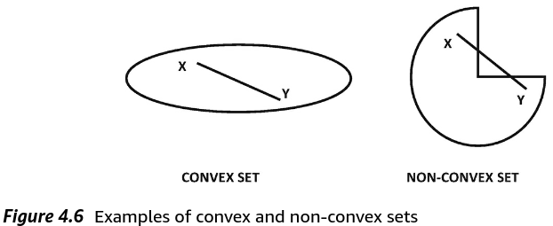
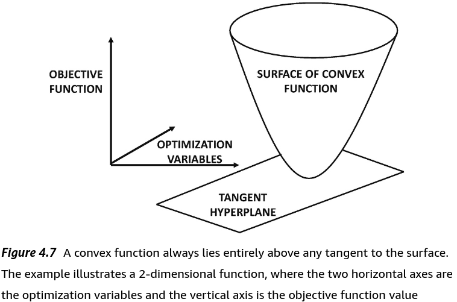
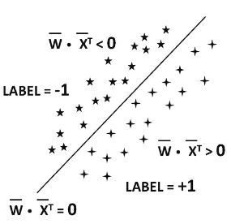
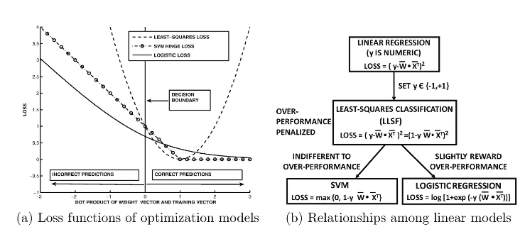

# Chapter 4. Optimization Basics: A Machine Learning View

"If you optimize everything, you will always be unhappy." - Donald Knuth

## 4.1 Introduction

Many ML models are cast as continuous optimization problems in multiple variables

Least-squares regression is foundational to ML:

- in least squares, find the best fit solution to a system of equations
  - system does not need to be consistent
  - if system is consistent, yields a loss of zero
  - loss is aggregate squared error of the best fit
  - target variable is numeric
- foundational to:
  - linear algebra
  - optimization
  - ML
- historically preceded classification problem frame
  - classification models were modifications of least squares regression
  - target variable is discrete (typically binary)
  - optimization model for linear regression needs to be "repaired" to work with discrete target variables

Most continuous optimization methods use differential calculus in one form or another

- main idea (of differential calculus):
  - provide a quantification of the *instantaneous* rate of change of an objective function wrt each of the variables in its argument
  - optimization methods based on this use the fact that the rate of change of an obj fn at a particular set of values of the optmization variables provides hints on how to iteratively change the optimization variable(s) and bring them closer to an optimum solution
  - such iterative algorithms are old, but pretty easy to do once computers were invented

## 4.2 The Basics of Optimization

Optimization problems:

- have an objective function
  - defined in terms of a set of variables = `optimization variables`
- goal is to compute the values of the variables at which the obj fn is either maximized or minimized
  - minimization is common, and referred to as `loss function`
    - `loss function` = obj fun with certain types of properties quantifying a nonnegative "cost" associated with a particular configuration of variables

### 4.2.1 Univariate Optimization

Consider: $f(x) = x^2 - 2x + 3 $

- becomes: $f(x) = (x - 1)^2  + 2$
  - clearly, when (x - 1) = 0, we are at a min
  - so, min value is at x = 1
- or, compute the first derivative wrt x, and set to zero
  - remember, at min value, rate of change wrt x is zero
    - so, the tangent to the plot at that point is horizontal
  - $f'(x) = \frac{d(f(x))}{dx} = 2x - 2 = 0$
  - but this only works for parabolas (x^2)
    - x^3 when f'(x) = 0 is just a saddle b/c s shaped
  - `critical points` = when f'(x) = 0
    - may be max, min, or saddle

Determining if `critical point` is max, min, saddle:

- looking at f''(x):
  - if f''(x) > 0 (is +), then a minima
  - if f''(x) < 0 (is -), then a maxima
  - if f''(x) = 0, then is a `degenerate` critical point
- so:
  - if f'(x) = 0 and f''(x) > 0:
    - is a `local minimum`

`Taylor expansion` can provide some insight:

$f(x_{0} + \Delta) \approx f(x_{0}) + \Delta f'(x_{0}) + \frac{\Delta^{2}}{2}f''(x_{0})  $

- we seek to compare $f(x_{0} + \Delta)$ to $f(x_{0}) $
- where $\Delta $ is:
  - $|\Delta| $ is extremely small value
  - positive or negative
  - $\Delta^2 > 0$ (because square)
- $\Delta f'(x_{0}) = 0 $
- because both $\Delta^{2} $ and $f''(x_{0}) $ are > (is +)
  - then, $f(x_{0} + \Delta) = f(x_{0}) + \epsilon $
    - where $\epsilon $ > 0 (is +)
  - this means that $f(x_{0} < f(x_{0} + \Delta))  $ for any small value of $\Delta $, whether its positive or negative
    - aka $x_{0} $ is a minimum wrt its *immediate locality*

Taylor expansion also provides insights as to why `degenerate` case is problemmatic ($f'(x_{0}) = f''(x_0) = 0 $)

- when $f''(x_0) = 0$:
  - one would need to keep expanding taylor series until reaching first non-zero term
  - if first non-zero term is positive (+), then:
    - $f(x_{0} + \Delta) < f(x_{0}) $
    - ex: $f(x) = x^{4} $ at $x_{0} = 0 $
      - here, x_0 is min wrt immediate locality
      - but first non-zero term is negative, or it depends on the sign of $\Delta$

### Problem 4.2.1

Quadratic functions are easy, with a single min or max depending on the sign of the quadratic term.

Other fns may have multiple turning points. ex: sin(x) is periodic, and has an infinite number of minima/maxima over (-inf, +inf)

Ex:

- $F(x) = (x^4 /4) - (x^3 / 3) - x^2 + 2 $
- $F'(x) = x^3 - x^2 - 2x = x(x + 1)(x -2 ) = 0 $
- $F''(x) = 3x^2 - 2x - 2 $
  - -> local min at x = -1,
    - F''(-1) > 0 (3 + 2 - 2)
    - F(-1) = 1/4 + 1/3 - 1 + 2 = 19/12
  - -> local min at x = 0, F'' < 0 (-2)
  - -> global min at x = 2,
    - F''(2) > 0 (12 - 4 - 2)
    - F(2) = 4 - 8/3 - 4 + 1 = -2/3 **global minimum**

### Problem 4.2.2

### Problem 4.2.3

```python
# Coefficients of F'(x) = 4x^3 -24x^2 +42x -22
coefficients = [4, -24, 42, -22]

# Find the roots
roots = np.roots(coefficients)
```

#### 4.2.1.1 Why We Need Gradient Descent

Solving f'(x) = 0 for x provides an `analytical` solution for a `critical point`, but it is not always possible to solve analytically

- `analytical solution`
  - any solution derived from algebraic or calculus-based manipulations
    - relying on identities, symbolic simplifications, derivatives, integrals, etc
    - exact expressions, not approximations
    - "solving by hand with math rules"
    - uses infinite, limits, series, or special functions
    - `closed-form solution`
      - strict subset of analytical solutions
      - x = -b +- sqrt(b^2 - 4ac) / 2a
- `numerical solutions`
  - approximate the answer using a computational method

Gradient descent - populat approach for optimizing objective functions (irrispective of functional form)

- start with an initial point $x = x_0 $
- successively update x using the steepest descent direction:
  - $x = \Longleftarrow x - \alpha f'(x) $
  - where a > 0 regulates step size, aka `learning rate`
- in univariate problems, x only has two directions of movement:
  - increase x or decrease x
  - one direction causes ascent, the other causes descent
- in multivariate problems, there is an infinite number of directions
  - the generalization of the notion of univariate detivative leads to steepest descent direction
- value of x changes in each iteration by $\delta x = -\alpha f'(x) $
  - when learning rate is "infentesimally" small, the above update will always reduce f(x):
    - $f(x + \delta x) \approx f(x) + \delta x f'(x) = f(x) - \alpha[f'(x)]^2 < f(x) $
  - small values of learning rate (\alpha > 0) is not advisable b/c convergence will take a while
  - too large \alpha makes effect of update unpredictable (b/x computed gradient is no longer good approximation)
    - remember: gradient is only instantaneous rate of change
  - extremely large values, can cause solution to *diverge*, exploding to a terminating numerical overflow

#### 4.2.1.2 Convergence of Gradient Descent

Execution of gradient-descent updates will generally result in a sequence of values: x_0, x_1, ..., x_t of the optimization variable, which has become successively closer to an optimum solution

- as x_t nears optimum, f'(x_t) tends to be closer and closer to zero
  - aka: the absolute step size will tend to reduce over execution of algorithm
- `monotonically`
  - consistent increases, or decreases
- two cases:
  - convergence (good)
  - divergence (bad)

#### 4.2.1.3 The Divergence Problem

- basically, things see-saw from one side of a quadratic function to another, because the large overshoot flips the sign of the gradient
- and, unless learning rate is dramatically reduced, the exploding gradient continues to increase in magnitude while alternating sign

Telltale sign of divergence:

- size of parameter vector seems to increase rapidly
- optimization objective worsens (at the same time)

First adjustment is to lower initial learning rate

Other literature discusses step size selection in depth

### 4.2.2 Bivariate Optimization

Helpful to bridge gap in complexity from single variable optimization to multivariate optimization

- $F(x, y) = f(x) + f(y) = x^2 + y^2 - 2x - 2y + 6 $
- $G(x, y) = g(x) + g(y) = ([x^4 + y^4]/4) - ([x^3 + y^3]/3) - x^2 - y^2 + 4 $

Note, both above are `additively separable`:

- when have multivariate fn x^2 + y^2
- but there are no xy terms - no `interacting terms`
- all quadratic functions can be represented in additively separable form

F(x) is easy because only one local (and thus global) minimum

G(x) is hard bc multiple minima, only one of which is global. To find this, need to compute the `partial derivative` of the obj functions F(x, y) and G(x, y) in order to perform gradient descent.

- `partial derivative`
  - comptues derivative wrt a particular variable
  - while treating other variables as contants
- `gradient`
  - a vector of `partial derivatives`

Gradient of $F(x, y) = x^2 + y^2 - 2x - 2y + 6 $ as:

$\nabla F(x,y) = \begin{bmatrix} \frac{\partial F(x,y)}{\partial x} & \frac{\partial F(x,y)}{\partial y} \end{bmatrix}^{T} = \begin{bmatrix}2x - 2 \\ 2y - 2 \end{bmatrix} $

so like if were taking the partial of x and hold all others (y) constant, we just ignore y terms which do not include x

Also note that $\nabla_{x, y} g(x,y) $ denotes choice of variables wrt which the gradient is computed

Once finding the gradient, just set to zero like f'(x) and solve for [x, y] = [1, 1] (for the above equation)

However, this wil **NOT** always lead to a system of equations with a closed form solution. The common solution is ot use gradient-descent updates wrt the optimization variablex [x, y] as follows:

$\begin{bmatrix}x_{t+1}\\ y_{t+1}\end{bmatrix} \Longleftarrow \begin{bmatrix}x_{t}\\ y_{t}\end{bmatrix} - \alpha \nabla g(x_{t}, y_{t}) = \begin{bmatrix}x_{t}\\ y_{t}\end{bmatrix} - \alpha \begin{bmatrix}2x_{t} - 2\\ 2y_{t} - 2\end{bmatrix}  $

Now, consider more complecated fn (that is not additively separable):

$H(x, y) = x^2 - \sin(xy) + y^2 - 2x $ here, sin(xy) ensures not additively separable

$\nabla H(x, y) = \begin{bmatrix}\frac{\partial H(x, y)}{\partial x} & \frac{\partial H(x, y)}{\partial y} \end{bmatrix}^{T} = \begin{bmatrix}2x - y\cos(xy) - 2 \end{bmatrix} \\ 2y - x\cos(xy) $

Despite partial derivative components not being expressed in terms of individual variables, gradient descent updates can be performed in similar manner

Looking at:

$\nabla G(x, y) = \begin{bmatrix}x^3 - x^2 - 2x \\ y^3 - y^2 - 2y \end{bmatrix} = \bar{0} $

We get 9 pairs of $(x, y) \in \{-1, 0, 2 \} \cross \{-1, 0, 2 \} $ which satisfy first order optimality conditions, and therefore all 9 are critical points. Among these there are:

- single global minimum
- three local minima
- single local maximum at (0, 0)
- the other four are saddle points

The classification of points as minima, maxima, or saddle points can only be accomplished with the use of a multivariate second-order conditions.

Pay attention to the rapid proliferation of the number of possible critical points satisfying the optimality conditions (when optimization problem contains two variables instead of one). In general, when a multivariate problem is posed as a sum of univariate functions, the **number of local optima can proliferate exponentially fast** with the number of optimization variables

#### Problem 4.2.4

### 4.2.3 Multivariate Optimization

Most ML problems are defined on large parameter space containing multiple optimization variables. Variables of optimization problem are parameters used to create a `prediction function` of either observed or hidden attributes of the ML problem

In linear regression, optimization variables w_1, w_2, ... w_d are used to predict the dependent variable y from the independent variables x_1, ..., x_d:

$y = \sum_{i=1}^{d} w_{i} x_{i} $

Going forward, assume the notation "w_1, ..., w_d" represent `optimization variables` (weights) as opposed to other "variables":

- x_i
- y

Both of which are observed values from the dataset at hand (which are constants from the optimization perspective)

The objective fn often penalize differences in observed an predicted values of specific attributes, such as y

Ex. if ew have many observed tupes of the form: [x_1, x_2, ..., x_d, **y**], one can sum up the values of $(y - \sum_{i=1}^{d} w_{i} x_{i})^{2} $ over all observed tuples. Such objective fns are referred to as `loss functions`

- `loss function` = `objective function`
  - `loss function` = $J(\bar{w})$
    - function of a vector of multiple optimization variables
    - $\bar{w} = [w_{1} ... w_{d}]^T $
      - (assume is a column vector unless explicitly specified)
    - here, use "w_1...w_d" for optimization variables
      - because $\bar{X}, x_{i}, \bar{y}, and y_{i} $ are reserved for attributes of data (data whose values are observed)
      - *d* corresponds to the number of optimization variables
    - use "J" because im guessing this is a `Jacobian` under the hood
      - ith component of d-dimensional gradient (vector) is the partial derivative of J wrt the ith parameter w_i

Simplest approach to solve the optimization problem directly (without gradient descent) is to set gradient (vector) to zero, leading to:

$\frac{\partial J(\bar{w})}{\partial w_{i}} = 0, \forall i \in \{1...d \} $

These conditions lead to a system of d equations, which can be solved to determine parameters w_1...w_d. As in univariate, would like to have a way to characterize whetehr a critical point (i.e., zero-gradient point) is a max, min, or infelction >> leads to second order condition

Second order condition: for single-variable, for f(w) to be min, f''(w) > 0. For multivariate, we generalize to the `Hessian` matrix.

`Hessian` - instead of a *scalar* second derivative, we have dxd matrix of second-derivatives, including the **pairwise** derivatives of J wrt different pairs of variables. The `Hessian` of the loss function $J(\bar{w}) $ wrt w_1...w_d is given by dxd *symmetric* matrix `H`, in which the (i, j)th entry H_{ij}:

$H_{ij} = \frac{\partial^{2}J(\bar{w})}{\partial w_{i} \partial w_{j}} $

Note, the (i, j)th entry of the Hessian is equal to the (j, i)th (yes backward from first instance) entry because partial derivatives are commutative according to `Schwarz's theorem`. Being symmetric is useful fact for many computational algorithms that require eigendecomposition of the matrix

The `Hessian` is a direct generalization of the univariate second derivative f''(w). For a univariate fn, the Hessian is a 1x1 matrix containing f''(w) as its only entry. Strictly speaking, the Hessian is a *function* of \bar{w}, and it should be denoted by $H(\bar{w}) $, though we denote it by H for brevity.

In the event that the fn J(w) is quadratic, the entries in the Hessian do not depend on the parameter vector $\bar{w} = [w_{1}...w_{d}]^T $. This is similar to the univariate case, where the second derivative f''(w) is a constant when the fn f(w) is quadratic (like f(x) = x^2 as the highest power). In general, the Hessian depends on the value of the parameter vector \bar{w} at which it is computed

!!! important !!!

For a parameter vector \bar{w} at which the gradient is zero (critical point), one needs to test the Hessian matrix H the same way we test f''(w) in univariate fns. Needs to be **positive-definite** for a point to be guaranteed to be a minimum (like f''(w) needs to be positive > 0 (+))

To illustrate, consider second-order, multivariate Taylor expansion of J(\bar{w}) in the immediate locality of \bar{w}_{0} along the direction \bar{v} and small radius \epsilon > 0:

$J(\bar{w_{0}}, + \epsilon \bar{v}) \approx J(\bar{w_{0}}) + \epsilon \bar{v}^{T} [\nabla J(\bar{w}_{0})] + \frac{\epsilon^{2}}{2}[\bar{v}^{T} H \bar{v}] $ where $[\nabla J(\bar{w}_{0})] = 0$ because f'(x) for critical point criterion

Following univariate pattern, above >>

$J(\bar{w_{0}}, + \epsilon \bar{v}) \approx J(\bar{w_{0}}) + \frac{\epsilon^{2}}{2}[\bar{v}^{T} H \bar{v}] > J(\bar{w_{0}})$ when $\bar{v}^T H\bar{v} > 0$ (positive definite)

and

$J(\bar{w_{0}}, + \epsilon \bar{v}) \approx J(\bar{w_{0}}) + (-)\frac{\epsilon^{2}}{2}[\bar{v}^{T} H \bar{v}] < J(\bar{w_{0}})$ when $\bar{v}^T H\bar{v} < 0$ (negative definite)

(note - free handed the above two equations, not from book)

The Hessian depends on parameter vector (remember $H(\bar{w})$ ), is computed at $\bar{w} = \bar{w}_{0} $. It is evident that `objective fn` $J(\bar{w}_{0}) < J(\bar{w}_{0} + \epsilon \bar{v}) $ when we have $\bar{v}^{T} H \bar{v} > 0 $. If we can find even a single direction \bar{v} where we have $\bar{v}^{T} H \bar{v} < 0 $, then \bar{w} is clearly not a minimum wrt its immediate locality.

!!! important !!!

A matrix H that satisfies $\bar{v} H \bar{v} > 0 $ is positive definite

The notion of positive definiteness of the Hessian is the direct generalization of the second-derivative condition f''(w) > 0 for univariate fns

Assuming that the gradient is zero at critical point \bar{w}, we can summarize the following second-order optimality conditions:

- 1. If Hessian is positive definite at $\bar{w} = [w_{1}...w_{d}]^{T} $, then $\bar{w} $ is a `local minimum`
- 2. If the Hessian is negative, then \bar{w} is a local maximum
- 3. If the Hessian is indefinite (x^T H(w) x = 0), then a saddle point
- 4. If Hessian is positive- or negative **semi**-definite, then the test is inconclusive

These conditions represent direct generalizations of univariate optimality conditions. Helpful to examine what a saddle point for an indefinite Hessian looks like. Consider:

$g(w_{1}, w_{2}) = w_{1}^{2} - w_{2}^{2} $

The Hessian of this quadratic function is independent of the parameter vector [w_1, w_2]^T, and is defined as follows:

$H = \begin{bmatrix}2 & 0 \\ 0 & -2 \end{bmatrix} $

This Hessian turns out to be a diagonal matrix, which is clearly indefinite b/c one of the two diagonal entries is negative. [0, 0] is a critical point bC the gradient is zero at that point. However, is a saddle point because of the indefinite nature of the Hessian

#### Problem 4.2.5

det < 0 = indefinite = saddle point

- det(H) > 0 and tr(A) > 0 (or f_xx > 0) >> positive definite (minima)
- det(H) > 0 and tr(A) < 0 (or f_xx < 0) >> negative definite (maxima)
- det(H) < 0 >> indefinite (one positive, one negative eigenvalue) (saddle point)
- det(H) = 0 >> inconclusive

Setting the gradient of the obj fn to 0 and then solving the resulting system of equations is usually computationally difficult. Therefore, gradient-descent is used - here with learning rate \alpha:

$[w_{1}...w_{d}]^{T} \Longleftarrow [w_{1}...w_{d}]^{T} - \alpha \begin{bmatrix} \frac{\partial J(\bar{w})}{\partial w_{1}} ... \frac{\partial J(\bar{w})}{\partial w_{d}} \end{bmatrix}^{T} $

Can rewrite the above in terms of the gradient of the obj fn wrt \bar{w}:

$\bar{w} \Longleftarrow \bar{w} - \alpha \nabla J(\bar{w}) $

Here, $\nabla J(\bar{w}) $ is a column vector containing the $\partial $ partial derivatives of $J(\bar{w}) $ wrt different parameters in the column vector \bar{w}. \alpha usually varies over the course of the algorithm

## 4.3 Convex Objective Functions

The presence of local minima creates uncertainty about the effectiveness of gradient-descent algorithms. Ideally, one would like to have an objective fn w/o local minima. Objective functions with this property is in the class of `convex functions`. `Convex functions` are defined only with domains that that are convex, using convex sets

### Definition 4.3.1 - Convex Set

A set S is convex, if for every pair of points $\bar{w}_{1}, \bar{w}_{2} \in S $ the point $\lambda \bar{w}_{1} + [1 - \lambda]\bar{w}_{2} $ must also be in S for all $\lambda \in (0, 1) $

Aka, it is impossible to find a pair of points in the set, such that any of the points on the straight line joining them do not lie in the set.

A `closed convex set` is one in which the boundary points (i.e. limit points) of the set are included in the set [-2, +2]

An `open convex set` is one in which all points within the boundary are included, but not the bounary itself (-2, +2)



A `convex function` $F(\bar{w}) $ is defined as: a function with a convex domain that satisfies the following conditions for any $\lambda \in (0,1) $:

$F(\lambda \bar{w}_{1} + (1 - \lambda) \bar{w}_{2}) \leq \lambda F(\bar{w}_{1}) + (1 - \lambda)F(\bar{w}_{2}) $

- convex if a >= 0
- strictly convex if a > 0
- concave if a <= 0
- strictly concave if a < 0

Also note that the convex sets you can visualize with circles. However, convex functions, in the 2d case, are parabolic U in an x y chart. so as long as *a* is non negative, will be convex. This allows for non-smootheness (aka "kinks") in the line However, this only works for univariate. for multivariate we have to look at Hessian and all that and require positive definiteness to assess convexity.

Also, this inequality is something we can do with univariate to build intuition, but we could also go directly to the F''(w) > 0 condition. this scales into multivariate with the v^T H v > 0 condition, also guaranteeing convexity. Note that the above F <= F inequality is just grounded in the literal definition of convexity

One can generalize the convexity condition to k points, discussed in problem 4.3.1

#### Problem 4.3.1

Im guessing that the function domain eventually has something to do with the span of the domain, and there are lacking directions pointed at making parts of the domain unreachable and thus non-convex

Attaching to the domain of the Function, like in abstract space we *can* draw a line between two points, which "cuts the corner", but the function cannot "cut the corner" because it doesnt point in the directions of the corner, so it is forced to take a longer route (cant shortcut), which is how we get the inequality and a function of each of the individual parts is > the function of the \lambda w1 + (1 - \lambda) w2 vector

The simplest example of a convex objective function is the class of quadratic functinos in which the leading (quadratic) term has a **non-negative coefficient**:

$f(w) = aw^2 + bw + c$

*a* needs to be nonnegative for the fn to be considered quadratic. All linear functions are always convex, because the convexity property holds with equality

#### Lemma 4.3.1

A linear function of the vector $\bar{w}$ is always convex

Convex functions have a number of useful properties that are leveraged in practical applications

#### Lemma 4.3.2

Convex functions obey the following properties

- 1. The sum of convex functions is always convex
- 2. The maximum of convex functions is convex
- 3. The square of a nonnegative convex function is convex
- 4. If F(.) is a convex function with a single argument and G(\bar{w}) is a linear function with a scalar output, then F(G(\bar{w})) is convex
- 5. If F(.) is a convex non-increasing function and G(\bar{w}) is a concave function with a scalar output, then F(G(\bar{w})) is convex
  - this means f'(x) is <= 0
  - like a -log(x) slope that at limit becomes a flat line
    - note it must be negative log (-log) for 1st and 2nd derivative properties
  - which bruh: this means we can take a concave function and "broadcast" it into a concave domain with log(f(x)) and optimize in that domain
    - **this is literally Cross-Entropy** as a convex objective
- 6. If F(.) is a convex non-decreasing function and G(\bar{w}) is a convex function with a scalar output, then F(G(\bar{w})) is convex
  - means that f'(x) >= 0
  - common in:
    - regularization terms
    - loss fns
    - confidence penalties
  - ex. x^2 (squaring, as we showed in 3.)

#### Problem 4.3.2

Prove all the results of Lemma 4.3.2 using the definition of convexity

The fact that every local minimum is a global minimum can be characterized geometrically (aka `first-derivative condition` aka `first derivative condition`): The entire convex function will always lie above a tangent to a convex function

An important consequence of convexity is that one is often guaranteed to reach a global optimum if successful convergence occurs durring the gradient-descent procedure



This tangent condition can be written algebraically using the gradient of the convex function at a given point w_0. This provides an alternate definition of convexity:

#### Lemma 4.3.3 - First-Derivative Characterization of Convexity

A differentiable function $F(\bar{w}) $ is a convex function if and only if the following is true for any pair $\bar{w}_{0} $ and $\bar{w} $:

$F(\bar{w}) \geq F(\bar{w}_{0}) + [\nabla F(\bar{w}_{0})] \cdot (\bar{w} - \bar{w}_{0}) $

Note that if the gradient of F(w) = 0 at $\bar{w} = \bar{w}_{0} $, it would imply that $F(\bar{w}) \geq F(\bar{w}_{0}) $ for any $\bar{w} $ aka: $\bar{w}_{0} is a global minimum $

therefore, any critical point that satisfies the first-derivative condition is a global minimum. Disadvantage with this approach is it applies to only differentiable functions like:

- abs()
- ReLU
- Hinge Loss

Characterizations:

- graph has sharp corner/kink
- functions involve max, min, abs
- piecewise function (esp. linear functions)
- left and right derivative dont match

#### Lemma 4.3.4 - Second-Derivative Characterization of Convexity

The twice differentiable function $F(\bar{w})$ is convex, if and only if it has a positive semidefinite Hessian at every value of the parameter $\bar{w} $ in the domain of F(.)

This method has a disadvantage of requiring F(w) to be twice differentiable. Therefore, the following convexity definitions are equivalent for twice-differentiable functions defined over R^d:

- 1. Direct:
  - The convexity condition:
  - $F(\lambda \bar{w}_{1} + [1 - \lambda]\bar{w}_{2}) \leq \lambda F(\bar{w}_{1}) + (1 - \lambda)F(\bar{w}_{2}) $
  - is satisfied for all $\bar{w}_{1}, \bar{w}_{2} $ and $\lambda \in (0, 1) $
- 2. First-derivative:
  - The first-derivative condition
  - $F(\bar{w}) > F(\bar{w}_{0}) + [\nabla F(\bar{w}_{0})] \cdot (\bar{w} - \bar{w}_{0} ) $ is satisfied for all $\bar{w} $ and $\bar{w}_{0} $
- 3. Second-derivative:
  - The Hessian of $F(\bar{w})$ is positive semi-definite for all $\bar{w} $
  - aka the second derivative > 0 (no need for the v^T H v stuff here)
    - literally just analytically derive F''

One can use any of the conditions as the definition of convexity, and then derive the other two as lemmas. However, the direct definition is more general (bc no dependency on differentiability). It is often the case that a particular definition is easier to use than another

!!! important !!!

Many ML objective fns are of the form: $F(G(\bar{w})) $ where $G(\bar{w}) $ is the linear function $\bar{w} \cdot \bar{X}^{T} $ for a row vector containing a d-dimensional data point $\bar{X} $, and F(.) is a univariate function.

In such a case, one only needs to prove that the univariate function F(.) is convex, based on the the final portion of Lemma 4.3.2. It is particularly easy to use the second-order condition $F''(.) \geq 0 $ for univariate functions

Next problems showcase convexity of the **logarithmic logistic loss function**. This function is useful for showing the convexity of logistic regression

#### Problem 4.3.4

literally, find second derivative and assess if its >= 0 or not to determine convexity

#### Problem 4.3.5

`strict convexity` is a slightly stronger condition, were we just replace the >= signs with >

Example: a bowl with a flat bottom is convex, but not strictly convex. **A strictly convex function will have a unique global minimum**

#### Lemma 4.3.5

A strictly convex function can at most contain one critical point. If such a point exists, it will be the global minimum of the structly convex function

The above property is easy to show by using either the direct or first-order definition of strict convexity.

!!! important !!!

One often constructs objective functions in ML by adding convex and strictly convex functions. In such cases, the sum of these functions is strictly convex

#### lemma 4.3.6

The sum of a convex function and a strictly convex function is strictly convex

Many objective fns in ML are convex, and they can often be made strictly convex by adding a **strictly convex regularizer**

A special case of convex functions is that of quadratic convex functions, which can be directly expressed in terms of the positive semidefinite Hessian. Although the Hessian of a function depends on the value of the parameter vector at a specific point, it is a constant matrix in the case of quadratic functions - example:

$f(\bar{w}) = \frac{1}{2}[\bar{w} - \bar{b}]^{T}H[\bar{w} - \bar{b}] + c $

Here, $\bar{b} $ is a d-dimensional column vector and *c* is scalar

A convex objective function is an ideal setting for a gradient-descent algorithm; the approach will never get stuck in a local minimum. Although the objective functions in comples ML models (like NNs) are not convex, they are often close to convex. As a result, gradient-descent methods work quite well in spite of the presence of local optima

For any convex function $F(\bar{w}) $, the region of space bounded by $F(\bar{w}) \leq b $ for any constant *b* can be shown to be a convex set. This type of constraint is encountered often in optimization problems. Such problems are easier to solve because of the convexity of the space in which one wants to search for the parameter vector.

Read: I think b is some arbitrary constraint we put in. is it learned or like a 0-1 regularized term?

## 4.4 The Minutiae of Gradient Descent

Such as selecting learning rate \alpha can have huge consequence in both good and bad way

### 4.4.1 Checking Gradient Correctness with Finite Differences

Many ML models use complex obj fns over millions of parameters. Gradients are computed analytically and hand-coded into the alg, or computed using automatic differentiation methods in applications like NNs. In all cases, analytical or coding errors remain a real possibility, which may not be obvious during execution. Knowing the reason for poor performance of an anlgorithm is a critical step in deciding whether to simply debug the alg or to make fundamental design changes

Consider situation where we compute gradient of obj fn: $J(\bar{w}) = J(w_{1}...w_{d}) $. In the finite-difference method, we sample a few of the optimization parameters from w_1...w_d and check their partial derivatives using `finite-difference approximation`.

- `finite-difference approximation`
  - perturb an optimization parameter w_i by a small ammount \Delta
  - and approximate the partial derivative wrt w_i using the difference between the perturbed value of the obj fn and the original value

$\frac{\partial J(\bar{w})}{\partial w_{i}} = \frac{J(w_{1}..., w_{i} + \Delta, ..., w_{d}) - J(w_{1}..., w_{i}, ..., w_{d})}{\Delta} $

- This way of estimating gradient referred to as finite-difference approximation
- one will not obtain an exact value of the partial derivative
  - however, in cases where gradients are computed incorrectly, the value of a `finite-difference approx` is often **so wildly different** from the analytical valuu that the error becomes self evident
- Typcially, it suffices to check the pds of small subset of the params to detect systematic problem in gradient computation

### 4.4.2 Learning Rate Decay and Bold Driver

A constant learning rate often poses a dilemma to the analyst.

- a lower learning rate used early on will cause the alg to take too long to reach anywhere close to an optimal solution
- a large learning rate will sllow the algorithm to come reasonably close to a good solution at first, but the alg will then oscillate around the point for a very long time

Allowing the learning rate to decay over time can naturally achieve the desired learning rate adjustment to avoid these challanges

$\alpha_{t} $ is the decaying learning rate, and subscripted with *t* for the time stamp

$\bar{w} \Longleftarrow \bar{w} - \alpha_{t} \nabla J $

Time *t* is typicall ymeasured in terms of the number of cycles over all training points. The most common decay functions are:

- Exponential decay:
  - $\alpha_{t} = \alpha_{0} \exp(-k \cdot t) $
- Inverse decay:
  - $\alpha = \frac{\alpha_{0}}{1 + k\cdot t} $
- Step decay
  - Rate reduced by a particular factor every few steps of gradient descent

Parameter k controls the rate of decay

Another popular approach for adjusting the lr is the `bold-driver algorithm`. Here, the LR changes depending on whether the obj fn is improving or worsening

- lr increased by a factor of ~5% in each iteration as long as steps improve
- as soon as worsen in a step, the step is *undone* and an attempt is made again with lr reduced by factor of ~50% (yes 50)
- continue until convergence
- note:
  - does not work in some noisy settings of gradient descent, where obj fn is approximated by using samples of the data.
  - examples of such a noisy setting:
    - `stochastic gradient descent`
  - here, test obj fn and adjust lr after m steps, rather than a single step
  - change in obj fn can be measured more robustly across multiple steps
  - and all m steps must be undone when the obj fn worsens over these steps

### 4.4.3 Line Search

Line search directly uses the optimum step size in order to provide the best improvement. Useful in specialized variations of gradient descent (but rarely used in vanilla GD bc computationally expensive). Armijo rule can be used in vanilla GD bc of efficiency

Let $J(\bar{w})$ be the obj fn being optimized and $\bar{g}_{t} $ be the descent direction at the beginning of the *t*th step with parameter vector $\bar{w}_{t} $. In `steepest-descent` method, the direction:

$\bar{g}_{t} = -\nabla J(\bar{w}_{t}) $

Although advanced methods might use other descent directions.

For below, assume $\bar{g}_{t} $ is not the steepest-descent direction (in order to preserve generalizty of the exposition).

From above:

$\bar{w} \Longleftarrow \bar{w} - \alpha_{t} \nabla J $

Clearly the parameter vector is updated as:

$\bar{w}_{t+1} \Longleftarrow \bar{w}_{t} + \alpha_{t}\bar{g}_{t} $

In line search, the lr \alpha_{t} is chosen in each step, so as to minimize the value of the obj fn at \bar{w}_{t+1}, where step size comptued as:

$\alpha_{t} = \argmin_{\alpha} J(\bar{w}_{t} + \alpha \bar{g}_{t}) $

After performing the next step, the gradient is computed at $\bar{w}_{t+1} $ for the next step. The gradient at $\bar{w}_{t+1} $ will be perpendicular to the search direction $\bar{g}_{t} $ or else $\alpha_{t} $ will not be optimal.

This result can be shown by observing that if the gradient of the obj fn at $\bar{w}_{t} + \alpha \bar{g}_{t} $ nas a **non-zer** dot product with the current movement direction $\bar{g}_{t} $, then one can improve the obj fn by moving an amount of either $+\delta $ or $-\delta $ along $\bar{g}_{t} $ from $\bar{w}_{t+1} $:

$J(\bar{w}_{t} + \alpha_{t}\bar{g}_{t} \pm \delta\bar{g}_{t}) \approx J(\bar{w}_{t} + \alpha_{t}\bar{g}_{t}) \pm \delta\bar{g}_{t}^{T}[\nabla J(\bar{w}_{t} + \alpha_{t} \bar{g}_{t})] $ where $\bar{g}_{t}^{T}[..] = 0 $ is the Taylor Expansion

#### Lemma 4.4.1

The gradient at the optimal point of a `line search` is always orthogonal to the current search direction

read:

- optimal point when the gradient is equal to zero (for current search direction)
- so the only way the gradient can be non-zero is if its pointing in a different direction
- I know we can get the orthogonality from the dot product being 0 but geometrically im not sure how we get there lol

A natural question arises as to how the minimization of Eq. 4.11 is performed. An important property of line-search is that that the obj fn $H(\alpha) = J(\bar{w} + \alpha\bar{g}_{t}) $ when expressed in terms of \alpha is often a `unimodal function`

- `unimodal function`
  - function with simgle maximum point
  - monotonicity

Main reason for being unimodal function is that typical ML settings that use the line-search method use quadratic, convex approximations of the original obj fn on which the search is done. Examples: Newton method, conjugate gradient method

Steps:

- 1. Identify a range [0, a_max] in which to perform the search
  - can be performed efficiently by evaluating the obj fn value at gegometrically increasing values of a (increasing every time by a factor of 2)
- 2. It is possible to use a variety of methods to narrow the interval such as the `binary search method`, the `golden-section search method`, and the `Armijo rule`
  - `binary search method` and `golden-section search method` are exact methods
    - leverage the unimodality of the obj fn in terms of the step size a.
  - `Armijo rule` is inexact
    - works even when $H(\alpha) = J(\bar{w}_{t} + \alpha \bar{g}_{t}) $ is multimodal/non-convex
    - therefore, has broader use than exact line-search methods

#### 4.4.3.1 Binary Search

We start by initializing the binary search interval for \alpha to [a, b] = [0, alpha_max]. In binary search over [a, b], the interval is narrowed by evaluating the obj function at two closely spaced points near (a+b)/2

We evaluate the obj fn at (a+b)/2 and (a+b)/2 + \eps, where \eps is a numerically small value like 10^-6. In other words, we compute:

- H[(a+b)/2]
- H[(a+b)/2 + \eps]

This allows us to evaluate whether the fn is increasingn or decreasing at (a+b)/2 by determining which of the two evaluations is larger.

- if fn is increasing at (a+b)/2
  - narrow the interval to [a, (a+b)/2 + \eps]
- otherwise
  - narrow to [(a+b)/2, b]

Repeat until an interval is reached with the required level of accuracy

#### 4.4.3.2 Golden-Section Search

Like binary search, start by init [a, b] = [0, alpha_max] however process of narrowing the interval is different

Basic principle in golden-section search is:

- use the fact that if we pick any pair of middle samples m1, m2 for a in the interval [a, b]
  - where a < m1 < m2 < b
- at least one of the intervals [a, m1] and [m2, b] can be dropped
  - In some cases, an even larger interval like [a, m2] and [m1, b] can be dropped
  - this is because the min value for unimodal fn must always lie in an adjacent interval to the choice of alpha \in {a, m1, m2, b} that yields the min value of H(alpha)
    - when alpha = a yields min, exclude (m1, b]
    - when alpha = m1 yields min, exclude (m2, b]
    - when alpha = m2 yields min, exclude [a, m1)
    - when alpha = b yields min, exclude [a, m2)
    - set new bounds [a, b] for these
  - At the end of the process, we are left with an interval containing either 0 or 1 evaluated point
  - if we have an interval containing no evaluated point
    - first select random point \alpha = p in the (reset) interval [a, b]
    - and then another point \alpha = q in the larger of the two intervals [a, p] and [p, b]
    - on the other hand, if left with an interval [a, b] containing a single evaluated point \alpha = p, then we select \alpha = q in the larger of the two intervals [a, p] and [p, b]
      - this yields another set of four points over which we can apply golden-section search
  - note this last bit with p and q I think there are some typos in the book

#### 4.4.3.3. Armijo Rule

The basic idea is that the descent direction $\bar{g}_{t}$ at the starting point $\bar{w}_{t} $ (i.e. at \alpha = 0) often deteriorates in thers of rate of improvement of obj fn as one moves further along this direction. The rate of improvement of the obj fn along the search direction at the starting point is: $|\bar{g}_{t}^{T}[\nabla F(\bar{w}_{t})]| $

Therefore, the (typical) improvement of the obj fn at a particular value of alpha can optimistically be expected to be $\alpha |\bar{g}_{t}^{T}[\nabla F(\bar{w}_{t})]| $ for most real-world objective fns

The `Armijo rule` is satisfied with a fraction $\mu \in (0, 0.5) $ of this improvement. A typical valyu of \mu is ~0.25 . In other words, we want to find the largest step-size \alpha satisfying the following:

$F(\bar{w}_{t}) - F(\bar{w}_{t} + \alpha \bar{g}_{t}) \geq \mu\alpha|\bar{g}_{t}^{T}[\nabla F(\bar{w}_{t})] | $

Note that for small enough values of \alpha, the condition above will always be satisfied. One can show using the finite-difference approximation that for infintesimally small values of alpha, the condition is satisfied at mu = 1. However, we want larget step size to ensure faster progress

What is the largest step-size one can use?

We test successively decreasing values of \alpha for the condition above, and stop the first time above the is satisfied. In backtracking line search, we start by testing $H(\alpha_{max}), H(\beta\alpha_{max})...H(\beta^{r}\alpha_{max})$ until the condition above is satisfied. At that point we use $\alpha = \beta^{r}\alpha_{max} $. here, \beta is a parameter drawn from (0, 1) and a typical value is 0.5

#### When to Use Line Search

Although line-search method can be shown to converge to at least a local optimum, it is expensive

When exact line search is required, the n steps is often relatively small, and the fewer the number of steps more than compensate for the expensive nature of individual steps

An important point with the use of line search is that convergence is guaranteed, even if the resulting solution is a local optimum

### 4.4.4 Initialization

GD starts at an initial point, and successively improves paramter vector at particular learning rate

Heurisitic initializatinos are good, esp for NNs because there are dependencies between optimization parameters

## 4.5 Properties of Optimization in ML

Optimization problems in ML have some typical properties that are often not encountered in other generic optimization settings

### 4.5.1 Typical Objective Functions and Additive Separability

Modt obj fns in ML penalize the deviation of a **predicted value** from an **observed value** in one ofrm or another. Ex, obj fn of least squares regression is:

$J(\bar{w}) = \sum_{i=1}^{n} \| \bar{w} \cdot \bar{X}_{i}^{T} - y_{i}\|^{2} $

- $\bar{X}_{i} $ is a d-dimensional row vector containing the ith of n training points
- $\bar{w} $ is a d-dimensional col vector of optimization variables
- $y_{i} $ contains real-valued observation of the ith training point

Note that this obj fn represents an additively separable sum of squared differences between the **predicted values** $\hat{y}_{i} \bar{w} \cdot \bar{X}_{i}^{T} $ and the observed values y_i in the actual data

Another form of penalization is the `negative log-likelihood objective function`. This form of the obj fn uses the probability that the models prediction of a dependent variable matches the observed value in the data. Clearly, higher values of the probability are desirable, and therefore, the models should learn parameters that maximize these probabilities (or likelihoods)

For ex, such a model might output the probability of each class in a binary classification setting, and it is desired to maximize the probability of the true (observed) class. For the ith training point, denoted as $P(\bar{X}_{i}, y_{i}, \bar{w}) $ which depends on the paramter vector \bar{w} and training pair (X, y). The probability of correct prediciotn over all training points is given by the products of the probabilities P(X, y, w) over all (X, y). The negative logarithm is applied to this product to convert the max problem into a min problem (while addressing numerical underflow issues caused by repeated multiplication)

$J(\bar{w}) -\log_{e}[\prod_{i=1}^{n}P(\bar{X}_{i}, y_{i}, \bar{w}) ] = -\sum_{i=1}^{n} \log_{e}[P(\bar{X}_{i}, y_{i}, \bar{w})] $

Using the log also makes the obj function appear as an `additively separable sum` over training points

Many ML problems use additively separable data-centric objective functions, whether squared loss or log-likelihood loss. This means that each individual data point creates a small (additive) component of the obj fn. In each case, the obj fn contains n additively separable terms, and each point-specific error [ such as $J_{i} = (y_{i} - \bar{w}\cdot\bar{X}_{i}^{T})^{2} $ in least squares regression] can be viewed as a point-specific loss. Therefore, the oberall obj fn can be expressed as the sum of these point-specific losses:

$J(\bar{w}) = \sum_{i=1}^{n} J_{i}(\bar{w}) $

This type of linear separability is useful bc enables use of fast optimization methods like `stochastic gradient descent` and `mini-batch stochastic gradient descent`, where one can replace the obj fn with a sampled approx

### 4.5.2 Stochastic Gradient Descent

Linear and additive nature of obj fns in ml enables use of techniques referred to as `stochastic gradient descent`. Particularly useful in the case in which the datasets are very large and one can often estimate good descent directions using modest samples of the data.

Consider a sample S of the n data points X1...Xn, where S contains the indices of the relevant data points from {1...n}. The set S of data points is referred to as a `mini-batch`. One can set up a sample-centric obj fn J(S) as:

$J(S) = \frac{1}{2} \sum_{i \in S}(y_{i} - \bar{w}\cdot\bar{X}_{i}^{T})^2 $

The key idea in mini-batch stochastic gradient descent is that the gradient of J(S) wrt the parameter vector \bar{w} is an excellent approximation of the gradient of the full obj fn J. therefore, the gradient descent update above is modified to mini-batch stochastic gradient descent as:

$[w_{1}...w_{d}]^{T} \Longleftarrow [w_{1}...w_{d}]^{T} - \alpha[\frac{\partial J(S)}{\partial w_{1}}...\frac{\partial J(S)}{\partial w_{d}} ] $

Note that computing the gradient of J(S) is far less computationally intensive compared to computing the gradient of the full obj fn. A special case of mini-batch stochastic gradient descent is one in which the set S contains a single randomly chosen data point (regular stochastic gradient descent). The use of SGD is rare, and one tends to use the mini-batch method more often. Typical mini-batch sizes are powers of 2, such as 64, 128, 256, etc. Driver is powers of 2 good for compute

SGD typically cycle through the full dataset, rather than simp0ly sampling the data points at random. Aka, the data points are permuted in some random order and blocks of points are drawn from this ordering. Therefore, all other points are processed before arriving at a data point again. Each cycle of the mini-batch SGD is referred to as an `epoch`.

- When mini-batch size is 1, epoch contains n updates
  - where n is the training data size
- in case where mini-batch size is k
  - epoch contains $\lceil n / k \rceil $ updates

SGD methods have much lower memory requirements than pure gradient descent, bc one is processing only a small sample of data in each step. Although each update is more noisey, the sampled gradient can be comptued much faster. Therefore, despite more updates, overall process is much faster

Why does SGD work so well in ML? At its core, mini-batch methods are random sampling methods. One is trying to estimate the gradient of a loss function using a random subset of the data

At the beginning of GD, the parameter vector $\bar{w} $ is grossly incorrect. Therefore, using only a small subset of the data is often sufficient to estimate the direction of descent very well, and the updates of mini-batch SGD are almost as good as those obtained using the full data (for a fraction of the comptuational effort).

When the parameter vector $\bar{w} $ nears the optimal value during descent, the effect of sampling error is more significant. Interestingly, it turns out this type of error is actually beneficial in ML applications bc of an effect referred to as `regularization`

### 4.5.3 How Optimization in ML is Different

Traditional optimization focuses on learning parameters to optimize the obj fn as much as possible

in ML, there is a differentiation between the **training data** and the (roughly similar) unseen **test data**

General rule of thumb: the optimized model will almost always predict the dependent variable of the training data more accurately than that of the test data (obviously lmao)

Consider the example of linear regression, where one will often have training samples (X, y) and a separate set of test examples (Z, y'). The labels of the test examples are unavailable in real-world applications at the time they are predicted. In practice, the only become available in retrospect, when the true accuracy of the ML alg can be computed

In ML, one only cares about accuracy on the unseen test examples rather than training examples. It is possible for excellently designed optimization methods to perform very well on the training data, but have disatrously poor results on the test data. This separation between training and test data is also respected during benchmarking of ML algs by creating simulated training and test data sets from a single labeled data set

Ok w/e the key difference between ML and traditional optimization: in ML a different (but similar) dataset is used to eval performance, as opposed to just using the whole dataset

Good ML models generalize to unseen data. Im guessing like we compare an optimal control algorithm for step responses where the entire input and output domain is known, and we need to find the optimal way to transition between states.

So like regular regression, depending on the size of the datset and number of parameters, its possible to have an infinite number of equally good best-fit solutions if there are low impact (noise) features with permuted coefficients

Ok so literal `overfitting` is like when the coefficients of one of many infinitely good best fit functions are found for a loss/error of zero. But minor variations to inputs like break this

"Poor generalization is a result of models adapting to the quirks and random nuances of a specific training data set; it is likely to occur when the training data is small"

- When the number of training instances is fewer than the number of features, an infinite number of equally "good" solutions exist

There are a number of special properties of optimization in ML:

- 1. In traditional optimization, one optimizes the parameters as much as possible to improve the obj fn.
  - However, in ML, optimizting a the parameter vector beyond a certain point often leads to overfitting
  - If validation (hold-out data) accuracy decreases (even though loss on training is reducing)
  - Therefore, the criterion for termination is different from that in traditional optimization
- 2. While SGD methods have lower accuracy than GD methods (bc of sampling appx), they often perform comparably (or even better) on the test data
  - This is because the random sampling of training instances during optimization reduces overfitting
- 3. The obj fn is sometimes modified by penalizing the squared norms of weight vectors
  - While the the unmodified obj fn is the most direct surrogate for the performance on the training data, the penalzied obj fn performs better on the out-of-sample test data
  - Concise parameter vectors with smaller squared norms are less prone to overfitting
  - This is `regularization`

These differences between traditional optimization and ML are important bc they affect the design of virtually every optimization procedure in ML

### 4.5.4 Tuning Hyperparameters

Learning process requires us to specify a number of hyperparameters such as:

- \alpha learning rate
- weight of regularization
- etc

`Hyperparameter` is used to specifically refer to the parameters regulating the design of the model (like learning rate an regularization) and they are different from the more fundamental parameters such as the weights of the linear regression model. ML always uses a two-tiered organization of parameters in the model:

- primary model parameters (like weights)
  - are optimized with computational learning algorithms (e.g. SGD) only *after* fixing the >>
- hyperparameters
  - which are fixed manually or with use of a *tuning* phase

Hyperparemters should be tuned using the validation data, and we see how model performance varies on the validation set to inform hanges

The main challenge w hyperparameter optimization is that different combinations of hyperparaemters need to be tested for their performance:

- grid search
  - number of grid points increases exponentially w number of params
  - start with coarse grids
  - then narrow down to a particular rang eof interest
    - one needs to be careful if the optimal parameter is at the edge of the grid range
    - should increase grid range

Common to search for hyperparameters in the logarithmic space (but some should be searched for on a uniform scale)

- e.g. instead of sampling lr between .1 and .0001
  - first sample log_10(lr) uniformly between -1 and -3, and then exponentiate it as a power of 10

### 4.5.5 The Importance of Feature Preprocessing

Vastly varying sensitivities of the loss function to different parameters tennds to hurt the learning, and this aspect is controlled by the scale of the features

Consider a model in which a persons wealth is modeled as a linear funtion of:

- x1 age [0, 100]
- x2 n_years_college_education [0, 10]

$y = w_{1} x_{1}^{2} + w_{2}x_{2}^{2} $

In such a case, the partial derivative $\frac{\partial y}{\partial w_{1}} = x_{1}^{2} $ and $\frac{\partial y}{\partial w_{2}} = x_{2}^{2} $ will show up as multiplicative terms in the compnents of the error gradient wrt w1 and w2 respectively

Since x1^2 is usually much larger than x2^2 (and often by a factor of 100), the components of the error gradient wrt w1 will typically be much greater in magnitude than those wrt w2. Often, small steps along w2 will lead to large steps along w1 (and therefore an overshooting of the optimal value along w1)

Note that the sign of the gradient componetns along the w1 direction will often keep flipping in successive steps to compensate for the overshooting along the w1 direction after large steps. In practice, this leads to a pack-and-forth "bouncing" behavior along the w1 direction and tiny (but consistent) process along the w2 direction. As a result, convergence will be very slow

Therefore, it is often helpful to have features with similar variance. There are two forms of feature preprocessing:

- 1. Mean-centering
  - In many models, can be useful to mean-center data to remove certain types of bias effects
  - PCA works on assumption of mean-centered data
  - A vector of column-wise means is subtracted from each data point
- 2. Feature normalization
  - Divide each feature by its std
  - When combined with mean-centering, is known as `standardized`
    - basic idea is that each feature is presumed to have been drawn from a `standard` normal distribution with zero mean and unit variance

Min-max normalization is useful when the data needs to be scaled to the range (0, 1)

Feature normalization avoids ill-conditioning and ensures much smoother convergence of gradient-descent methods

## 4.6 Computing Derivatives wrt Vectors

In typical optimization models in ML, one is differentiating scalar obj fns (or even vectored quantities) wrt **vectors of parameters**

This is bc the loss fn J(\bar{w}) is often a function of a vector of parameters \bar{w}. Rather than having to write out large numbers of partial derivatives wrt each component of the vector, it is often convenient to represent such derivatives in *matrix calculus notation*

In *matrix calculus notation*, one can compute a derivative of a scalar, vector, or matrix wrt another scalar, vector, or matrix. The result might be a scalar, vector, matrix, or tensor; the final result can often be compactly expressed in terms of the vectors/matrices in the partial derivative (and therefore one does not have to tediously compute them in elementwise form)

Here, we only look at computing the derivatives of scalars/vectors wrt other scalars/vectors, however occasionally will consider derivatives of scalars wrt matrices. The result is always a scalar, vector, or matrix

Being able to differentiate blocks of variables wrt other blocs us useful from the perspective of brevity and quick computation. Although the field of matrix calculus is very broad, there are **a few important identities**, which are useful for addressing the vast majority of ML problems likely to be encountered in practice

### 4.6.1 Matrix Calculus Notation

The simplest (and most common) example of matrix calculus notation arises during the computation of gradients. For ex, consider the gradient-descent update for multivariate opotimization problems:

$\bar{w} \Longleftarrow \bar{w} - \alpha \nabla J $

An equivalent notation for:

- the gradient $\nabla J $, is:
- the matrix-calculus notation $\frac{\partial J(\bar{w})}{\partial \bar{w}} $
  - this notation is a scalar-to-vector derivative, which always returns a vector

Therefore, we have:

$\nabla J = \frac{\partial J(\bar{w})}{\partial \bar{w}} = [\frac{\partial J(\bar{w})}{\partial w_{1}} ... \frac{\partial J(\bar{w})}{\partial w_{d}} ]^{T} $

Note, that each index is an individual w_{i} as oppposed to the vector \bar{w}, which is passed into the obj fn J

Here, it is important to note that there is some convention-centric ambiguity in the treatments of matrix calcuclus by various communities as to whether the derivative of a scalar wrt a column vect4or is a reow vector or whther it is a column vector. In this book, we use convention that:

- derivative of a scalar wrt column vector is also a column vector
  - known as `denominator layout`
- for derivatives of row vector, producing a row vector, known as the `numerator layout`

Here, `denominator layout` is used bc frees us from notational clutter of always having to transpose a row vector into a column vector in order to perform gradient descent updates on \bar{w} (which are extremely common in ML)

Indeed the choice of using the numerator layout and denominator layout in different communities is often regulated by these types of notational conveniences. Therefore, we can directly write the update in matrix calculus notation as follows:

$\bar{w} = \Longleftarrow \bar{w} - \alpha [\frac{\partial J(\bar{w})}{\partial \bar{w}}] $

The matrix calculationn notation allow allows derivatives of vectors wrt to vectors. Such as a derivative results in a matrix, referred to as `the Jacobian` 0.0

Jacobians arise frequently when computing the gradients of recursively nested multivariate functions. A specific example is multilayer neural networks

For example, the derivative of an m-dimensional column vector h (of dimension m) wrt a d-dimensional column vector w (of dimension d) is a dxm matrix in the denominator layout

The (i,j)th entry of this matrix is the derivative of h_j wrt w_i:

$[\frac{\partial \bar{h}}{\partial \bar{w}}]_{ij} = \frac{\partial h_{j}}{\partial w_{i}} $ (4.19)

The (i,j)th element of the Jacobian is always $\frac{\partial h_{i}}{\partial w_{j}} $, and therefore is it s the transpose of the matrix $\frac{\partial \bar{h}}{\partial \bar{w}} $ from the above equation (4.19)

Another useful derivative that arises quickly in different types of matrix factorization is the derivative of a scalar obj fn J wrt an mxn matrix W. In the denominator layout, the result inherits the shape of the matrix in the deonominator. The (i,j)th entry of the derivative is simply the derivative of J wrt the (i,j)th entry in W:

$[\frac{\partial J}{\partial W} ]_{ij} = \frac{\partial J}{\partial W_{ij}} $ (4.20)

#### Table 4.1 Matrix Calculus operations in numerator and denominator layouts

\frac{}{}

##### Denominator Layout

| Derivative of | wrt | Output Size | ith or (i,j)th element |
| - | - | - | - |
| Scalar J | Scalar x | Scalar | $\frac{\partial J}{\partial x} $ |
| Column vector $\bar{j} $ in *m* dimensions | Scalar x | Row vector in *m* dimensions | $[\frac{\partial \bar{h}}{\partial x}]_{i} = \frac{\partial h_{i}}{\partial x} $ |
| Scalar J | Column vector $\bar{w}$ in *d* dimensions | Column vector in *d* dimensions | $[\frac{\partial J}{\partial \bar{w}}]_{i} = \frac{\partial J}{\partial w_{i}} $ |
| Column vector $\bar{h} $ in *m* dimensions | Column vector $\bar{w}$ in *d* dimensions | *d* x *m* matrix | $[\frac{\partial \bar{h}}{\partial \bar{w}}]_{ij} = \frac{\partial h_{j}}{\partial w_{i}} $ |
| Scalar J | *m* x *n* matrix W | *m* x *n* matrix | $[\frac{\partial J}{\partial W}]_{ij} = \frac{\partial J}{\partial W_{ij}} $ |
|  |  |  |  |

##### Numerator Layout

| Derivative of | wrt | Output Size | ith or (i,j)th element |
| - | - | - | - |
| Scalar J | Scalar x | Scalar | $\frac{\partial J}{\partial x} $ |
| Column vector $\bar{h} $ in *m* dimensions | Scalar x | Column vector in *m* directions | $[\frac{\partial \bar{h}}{\partial x}]_{i} = \frac{\partial h_{j}}{\partial{x}}  $ |
| Scalar J | Column vector $\bar{w} $ in *d* dimensions | Row vector in *d* dimensions | $[\frac{\partial J}{\partial \bar{w}}]_{i} = \frac{\partial J}{\partial w_{i}} $ |
| Column vector $\bar{h}$ in *m* dimensions | Column vector $\bar{w} $ in *d* dimensions | *m* x *d* matrix | $[\frac{\partial \bar{h}}{\partial \bar{w}} ]_{ij} = \frac{\partial h_{i}}{\partial w_{j}} $ I want to say this is the legit Jacobian |
| Scalar J | *m* x *n* matrix W | *n* x *m* matrix | $[\frac{\partial J}{\partial W}]_{ij} = \frac{\partial J}{\partial W_{ji}} $ |

### 4.6.2 Useful Matrix Calculus Identities

Some matrix calculus identities that are frequently used in ML

A common expression is of the form:

$F(\bar{w}) = \bar{w}^{T}A\bar{w} $

Where A is a dxd symmetric matrix of constant values, and \bar{w} is a d-dimensional column vector of optimization variables

Note that this type of obj fn occurs in virtually every convex quadratic loss fn like least-squares regression and in the (dual) support-vector machine. The gradient $\nabla F(\bar{w}) $ can be written as:

$\nabla F(\bar{w}) = \frac{\partial F(\bar{w})}{\partial \bar{w}} = 2A\bar{w} $

The algebraic similarity of the derivative to the scalar case is quite noticable. Also note that $\nabla F(\bar{w}) $ is a column vector

Another common obj fn $G(\bar{w}) $ in ML is:

$G(\bar{w}) = \bar{b}^{T} B \bar{w} = \bar{w}^{T}B^{T}\bar{b} $

Here, B is an nxd matrix of constant values and $\bar{w} $ is a d-dimensional column vector of optimization variables. $\bar{b} $ is an n-dimensional constant vector that does not depend on $\bar{w} $. Therefore, this is a linear function in $\bar{w} $ and all components of the gradient are constants.

The values $\bar{b}^{T} B \bar{w} $ and $\bar{w}^{T}B^{T}\bar{b} $ are the same because the transposition of a scalar is the same scalar. In such cases, the gradient of $G(\bar{w}) $ is computed as:

$\nabla G(\bar{w}) = \frac{\partial G(\bar{w})}{\partial \bar{w}} = B^{T}\bar{w} $

In this case, every component of the gradient is a constant

#### Problem 4.6.1

Remember: any term that does not interact with the variable being differentiated against we ignore because it doesnt contribute any direction to the derivative

Aight this was a pain to compute lol "one can then appreciate the compactness of the matrix calculus approach for quick computation"

Bc it is common to compute the gradient wrt a column vector of parameters, the below identities represent drivatives wrt col vectors

#### Table 4.2

List of common matrix calculus identities in denominator layout

- A is a constant dxd matrix
- B is a constant nxd matrix
- $\bar{b}$ is a constant n-dimensional vector (independent of the parameter vector $\bar{w} $)
- C is a kxd matrix

##### 4.2a - Scalar-to-vector derivatives

| Objective (fn) J | Derivative of J wrt $\bar{w} $ |
| - | - |
| (i) $\bar{w}^{T} A \bar{w} $ | $2A\bar{w} $ (symmetric A) |
|  | $(A + A^{T})\bar{w} $ (asymmetric A) |
| (ii) $\bar{b}^{T}B\bar{w} $ or $\bar{w}^T B^{T}\bar{b} $ | $B^{T}\bar{b} $ |
| (iii) $\|B\bar{w} + \bar{b}\|^{2} $ | $2B^{T}(B\bar{w} + \bar{b}) $ |
| (iv) $f(g(\bar{w})) $ | $f'(g(\bar{w}))\nabla_{w} g(\bar{w}) $ Note $g(\bar{w}) $ is scalar of example below |
| (v) $f(\bar{w} \cdot \bar{a}) $ | $f'(\bar{w} \cdot \bar{a})\bar{a} $ where $g(\bar{w} = \bar{w} \cdot \bar{a}) $ |

##### 4.2b Vector-to-vector derivatives

| Vector $\bar{h} $ | Derivative of $\bar{h} $ wrt $\bar{w} $ |
| - | - |
| (i) $\bar{h} = C\bar{w} $ | $C^{T} $ |
| (ii) $\bar{h} = F(\bar{w}) $ where F(.) is elementwise function (Product-of-variables identity) | Diagonal matrix with (i,i)th entry containing partial derivative of ith component of $F(\bar{w}) $ wrt $w_{l} $ |
| (iii) $\bar{h} = f_{s}(\bar{w})\bar{x} $ where $f_{s}(\bar{w}) $ is vector-to-scalar function | $\frac{\partial f_{s}(\bar{w})}{\partial \bar{w}} \bar{x}^{T} + f_{s}(\bar{w})\frac{\partial \bar{x}}{\partial \bar{w}} $ |

#### 4.6.2.1 Application: Unconstrained Quadratic Programming

In `quadratic programming`, the obj fn contains a quadratic term of the form:

- $\bar{w}^{T}A\bar{w} $
- a linear term: $\bar{b}^{T}\bar{w} $
- and a constant

An unconstrained quadratic program has the form:

Minimize $\bar{w}\frac{1}{2}\bar{w}^{T}A\bar{w} + \bar{b}^{T}\bar{w + c} $

Here, we assume that:

- A is a **poasitive definite** dxd matrix
- $\bar{b}$ is a d-dimensional column vector
- c is a scalar constant
- $\bar{w} $ is a d-dimensional column vector containing the optimization variables

An unconstrained quadratic program is a direct generalization of 1-dimensional  quadratic functions like $\frac{1}{2}ax^2 + bc + c $. Note that a minimum exists at x = -b/a for 1-dimensional quadratic functions when a > 0, and a minimum exists for multidimensional quadratic functions when A is **positive definite**

The two terms in the objective function can be differentiated wrt $\bar{w} $ by using the identities (i) and (ii) in 4.2a. Since the matrix A is positive definite, it follows that the Hessian A is positive definite irrespective of the value of \bar{w}. Therefore, the obj fn is **strictly convex**, and setting the gradient to zero is a necessary and sufficient condition for minimization of the obj fn. Using identities (i) and (ii) of Table 4.2, we obtain the following optimality condition:

$A\bar{w} + \bar{b} = \bar{0} $

Therefore, we obtain the solution $\bar{w} = -A^{-1}\bar{b} $

Note that this is a direct generalization of the solution for the 1-dimensional quadratic function. In the event that A is singular, a solution is not guaranteed even when A is positive and semidefinite. For example, when A is the zero matrix, the obj fn becomes linear with no minimum. When A is positive semidefinite, tit can be shown that a minimum exists IFF \bar{b} lies in the column space of A

#### 4.6.2.2 Application: Derivative of Squared Norm

A special case of unconstrained quadratic programming is the norm of a vector that is itself a linear function of another vector (with an additional constant offset). Such a problem arises in least-squares regression, which is known to have a closed form solution like the quadratic program of the previous section. This particular obj form ahs the form:

$J(\bar{w}) = \|B\bar{w} + \bar{b}\|^{2} $

$J(\bar{w}) = \bar{w}^{T}B^{T}B\bar{w} + 2\bar{b}^{T}B\bar{w} + \bar{b}^{T}\bar{b} $

Here:

- B is a nxd data matrix
- $\bar{w}$ is a d-dimensional vector
- $\bar{b}$ is an n-dimensional vector

This form of the obj fn arises frequently in least-squares-regression, where B is set to the observed data matrix D, and the constant vector $\bar{b}$ is set to the negative of the response vector $\bar{y}$. One needs to compute the gradient wrt \bar{w} in order to perform the updates

When we have expanded the squared norm in term sof matric vector products, the individual terms are of the same form as the results (i) and (ii) of 4.2a. In this case, we can compute the derivative of the squared norm wrt $\bar{w} $ by substituting for the scalar-to-vector derivatives in results (i) and (ii) of 4.2a. therefore, we obtain the results:

$\frac{J(\bar{w})}{\partial \bar{w}} = 2B^{T}B\bar{w} + 2B^{T}\bar{b} $

$\frac{J(\bar{w})}{\partial \bar{w}} = 2B^{T}(B\bar{w} + \bar{b}) $

This form of the gradient is often used in least-squares regression. Setting this gradient to zero yields the closed-form solution to least-squares regression

### 4.6.3 The Chain Rule of Calculus for Vectored Derivatives

The chain rule of calculus is extremely useful for differentiating compositions of functions. In the univariate case with scalars, the rule is simple. Consider case where the scalar objective J is a function of the scalar w:

$J = f(g(h(w))) $

All of f(.), g(.), and h(.) are assumed to be scalar functions. In such a case, the derivatives of J wrt the scalar w is simply $f'(g(h(w))) g'(h(w)) h'(w) $. This rule is referred to as the `univariate chain rule` of differential calculus. Note, order of multiplication does not matter bc scalar multiplication is commutative

Similarly, consider the case where you have the follow functions, where on e of the fns is a vector-to-scalar function:

$J = f(g_{1}(w), g_{2}(w), ..., g_{k}(w)) $

In such a case, the `multivariate chain rule` states that one can compute the derivative of J wrt w as the sum of the products of the partial derivatives using all arguments of the function:

$\frac{\partial J}{\partial w} = \sum_{i=1}^{k} [\frac{\partial J}{\partial g_{i}(w)}][\frac{\partial g_{i}(w)}{\partial w}] $

One can generalize *both* of the above results into a single form by considering the case where the functions are vector-to-vector functions. Note that vector-to-vector derivatives are matrices, and therefore we will be multiplying matrices together instead of scalars

Surpisingly, very large classes of ML algorithms perform the repeated composition of only two types of functions, which are shown in Table 4.2b

**Unlike the case of the scalar chain rule, the order of multiplication is important when dealing with matrices and vectors**. In a composition function, the derivative of the argument (inner level variable) is always pre-multiplied with the derivative of the fn (outer level variable). In many cases, the order of multiplication is self-evident because of the size constraints associated w matrix multiplication

#### Theorem 4.6.1 - Vectored Chain Rule

Consider a composition function of the form:

$\bar{o} = F_{k}(F_{k-1}(...F_{1}(\bar{x}))) $

Assume that each $F_{i}(.) $ takes as input an $n_{i}$-dimensional column vector and outputs an $n_{i+1} $-dimensional col vector.

Therefore, the input $\bar{x} $ is an $n_{1} $-dimensional vector and the final output $\bar{o} $ is an $n_{k+1} $-dimensional vector. For brevity, denote the vector output of $F_{i}(.) $ by $\bar{h}_{i} $.

Then, the vectored chain rule asserts:

$[\frac{\partial \bar{o}}{\partial \bar{x}}] = [\frac{\partial \bar{h}_{1}}{\partial \bar{x}}] [\frac{\partial \bar{h}_{2}}{\partial \bar{h}_{1}}] ... [\frac{\partial \bar{h}_{k-1}}{\partial \bar{h}_{k-2}}] [\frac{\partial \bar{o}}{\partial \bar{h}_{k-1}}] $

Term dimensions:

- 1. n_1 x n_k+1
- =
- 2 n_1 x n_2
- 3 n_2 x n_3
- ...
- n_k-1 x n_k
- n_k x n_k+1

#### 4.6.3.1 Useful Examples of Vectored Derivatives

Some common examples of vectored derivatives in ML

Consider the case where the fn f(.) has a d-dimensional vector argument and its output is scalar. Futhermore, the fn f(.) is a scalar-to-scalar fn

$J = f(g(\bar{w})) $

In such a case, we can apply the vectored chain rule to obtain:

$\nabla J = \frac{\partial J}{\partial \bar{w}} = \nabla g(\bar{w}) f'(g(\bar{w})) $ where the f'(.) term is scalar

In this case, the order of multiplication does not matter, bc one of the factors in the product is a scalar. Note that this result is used frequently in ML, because many loss-functions in ML are computed by applying a scalar fn f(.) to the dot product of $\bar{w}$ with a training point $\bar{a}$. In other words, we have $g(\bar{w}) = \bar{w} \cdot \bar{a} $. Note that $\bar{w} \cdot \bar{a} $ can be written as $\bar{w}^{T}(I)\bar{a} $, where I is the identity matrix. This is in the form of the matrix identity (ii) of 4.2a. In such a case, one can use the chain rule to obtain:

$\frac{\partial J}{\partial \bar{w}} = [f'(g(\bar{w}))] \bar{a} $ where the bracket term resolves to a scalar

This result is extremely useful, and can be used for computing the derivatives of many loss fns like least-squares regression, SVMs, and logisitc regression. The vector $\bar{a}$ is simply replaced with the vector of the training point at hand. The funciton f(.) defines the specific form of the loss fn for the model at hand. These are in (iv) and (v) of 4.2a

4.2b contains a nubmer of useful derivatives for vector-to-vector functions. The first is the linear transformation $\bar{h} = C\bar{w} $ where C is a matrix that does not depend on the parameter vector w. The corresponding vector-to-vector derivative of h wrt w is C^T (from id (i)). This type of transformation is used commonly in **linear layers** of **feed-forward neural networks**

Another common vector-to-vector fn is the element-wise function $F(\bar{w})$, which is also used in nns (in the form of `activation functions`). In this case, the corresponding derivative is a diagonal matrix containing the element-wise derivatives shown in the (ii) of 4.2b

Finally, we consider a generalization of the `product identity` in differntial calcuclus. Instead of differentiating the product of two scalar variables, we consider the product of a scalar and a vector variable. Consider the relationship $\bar{h} = f_{s}(\bar{w})\bar{x} $, which is the product of a vector and a scalar. Here, $f_{s}(.)$ is a vector-to-scalar fn, and x is a column vector that depends on w. In such a case, the derivative of h wrt w is tha matrix $\frac{\partial f_{s}(\bar{w})}{\partial \bar{w}}\bar{x}^{T} + f_{s}(\bar{w})\frac{\partial \bar{x}}{\partial \bar{w}} $ (see (iii) of 4.2b). Note that the first term is the outer product of the two vectors $\frac{\partial f_{x}(\bar{w})}{\partial \bar{w}} $ and $\bar{x}$, whereas the second term is a scalar multiple of a vector-to-vector derivative

## 4.7 Linear Regression: Optimization with Numerical Targets

Linear regression is also referred to as least-squares regression, because it is usually paired with a least-squares objective fn.

A natural application of least-squares regression is to model the dependence of a target variable on the feature variables. We have n pairs of observations (X, y) for i in {1, ..., n}. The target y is predicted using $\hat{y}_{i} \approx \bar{W} \cdot \bar{X}_{i}^{T} $. The circumflex on top of $\hat{y}_{i} $ indicates that it is a predicted value. Here, $\bar{W} = [ w_{1}, ... w_{d}]^{T} $ is a d-dimensional column vector of optimization parameters

Each vector X is referred to as the set of independent variables or `regressors`, whereas the variable y is referred to as the target variable, response variable, or `regressand`. Each X is a row vector, because it is common for data points to be represented as rows of data matrices in ML. Therefore, the row vector X needs to be transposed before performing a dot product with the column vector W. The vector W needs to be learned in a data driven manner, so that $\hat{y}_{i} = \bar{W} \cdot \bar{X}_{i}^{T} $ is as close to each y as possible. Therefore, we compute the loss $(y_{i} - \bar{W} \cdot \bar{X}_{i}^{T})^{2} $ for each training point and then add up these losses over all points in order to create the obj fn:

$J = \frac{1}{2} \sum_{i=1}^{n} (y_{i} - \bar{W} \cdot \bar{X}_{i}^{T})^{2} $

Once the vector W has been learned from the training data by optimizing the aformentioned obj fn, the numberical value of the target variable of an unseen test instance Z (which is a d-dimensional row vector) can be predicted as $\bar{W} \cdot \bar{Z}^{T} $

It is particularly convenient to write this obj fn in terms of an nxd data matrix. Note $D\bar{W} $ is an n-dimensional column vector of `predictions` which should ideally equal the observed vector $\bar{y} $. Therefore, the vector of erros is given by $(D\bar{W} - \bar{y}) $, and the squared norm of the error vector is the loss fn. Therefore, the minimizatino loss fn can be written as:

$J = \frac{1}{2} \|D\bar{W} - \bar{y}\|^{2} = \frac{1}{2}[D\bar{W} - \bar{y}^{T}[D\bar{W} - \bar{y}]] $

One can expand the expression above into:

$J = \frac{1}{2}\bar{W}^{T}D^{T}D\bar{W} - \frac{1}{2}\bar{W}^{T}D^{T}\bar{y} - \frac{1}{2}\bar{y}^{T}D\bar{W} + \frac{1}{2}\bar{y}^{T}\bar{y} $

It is easy to see that the above expression is convex, because $D^{T}D $ is the positive semidefinite Hessian in the quadratic term. This means that if we find a value of the vector W at which the gradient is zero (i.e. a critical point), it will be a global min of the obj fn

In order to compute the gradient J wrt W, one can directly use the squared-norm result of 4.6.2.2 to yield:

$\nabla J = D^{T}D\bar{W} - D^{T}\bar{y} $

Setting the gradient to zero yields the following:

$D^{T}D\bar{W} = D^{T}\bar{y} $

Pre-multiplying both sides with $(D^{T} D)^{-1} $, one obtains:

$\bar{W} = (D^{T}D)^{-1}D^{T}\bar{y} $

Note that this formula is identical to the use of the left-inverse of D for solving a system of equations, and the derivation of Section 2.8 uses the normal equation rather than calculus. The problem of solving a system of equations is a special case of least-squares regression. When the system of equatinos has a feasible solution, the optimal solution has zero loss on the training data. in the case that the system is inconsistent, we obtain the best-fit solution

How can one compute W efficiently when D^T D is invertible? This can be achieved via QR decomposition of D as $D = QR $, where Q is an nxd matrix with orthonormal columns and R is a dxd upper-triangular matrix. One can simply substitute D = QR in the above equation and use Q^T Q = I_d to obtain:

$R^{T}R\bar{W} = R^{T}Q^{T}\bar{y} $

Multiplying both sides with $(R^{T})^{-1} $, one obtains $R\bar{W} = Q^{T}\bar{y} $. This triangular system of equations can be solved efficiently using back-substitution

The above solution assumes that matrix D^T D is invertible. However, in cases where the number of data points is small, the matrix D^T D might not beinvertible. In such cases, infinitely many solutions exists to this system of equations, which will overfil the training data; such methods will not generalize easily to unseen test data. In such cases, ``regularization`` is important

### 4.7.1 Tikhonov Regularization

The closed-form solution to the problem does not work in under-determined cases, where the number of optimization variables is greater than the number of points. One possible solution is to reduce the number of variables in the data by posing the problem as a constrained optimization problem. In other words, we could try to optimize the same loss fn while posing the hard constraint that at most k values of w_i are non-zero. However, such a constrained optimziation problem is hard to solve. A softer solution is to impose a small penalty on the absolute value of each w_i in irder to discourage non-zero values of w_i. Therefore, the resulting liss fn is:

$J = \frac{1}{2}\|D\bar{W} - \bar{y}\|^{2} + \frac{\lambda}{2}\|\bar{W}\|^{2} $

Here, $\lambda > 0$ is the regularization parameter. By adding the squared norm penalty, we are encouraging each w_i to be small in magnitude, unless it is absolutely essential for learning. Note that the addition of the strictly convex term $\lambda \|\bar{w}\|^{2} $ to the convex least-squares regression loss fn makes the regularized obj function *strictly* convex. A strictly convex obj fn has a unique optimal solution

In order to solve the optimization problem, one can set the gradient of J to 0. The gradient of the added term (the \lambda/2 |W|^2) is \lambda W

On setting the gradient of J to 0, we obtain the following modified condition:

$(D^{T} D + \lambda I)\bar{W} = D^{T}\bar{y} $

Pre-multiplyingg both sides with $(D^{T}D + \lambda I)^{-1} $ one obtains:

$\bar{W} = (D^{T} D + \lambda I )^{-1} D^{T} \bar{y} $

Here, it is important to note that $(D^{T}D + \lambda I) $ is always invertible for lambda > 0, since the matrix is positive definite. The resulting solution is regularized, and it generalizes much better to out-of-sample data. Because of the `push-through identity`, the solution can also be written in the alternative form:

$\bar{W} = D^{T} (DD^{T} + \lambda I)^{-1} \bar{y} $

#### 4.7.1.1 Pseudoinverse and Connections to Regularization

A special case of Tikhonov regularization is the Moore-Penrose pseudoinverse. The MP D^{+} is the limiting case of Tikhonov regularization in which lambda > 0 is infintesimally small

Therefore, one can simply write the solution W in terms of the MP as:

$\bar{W} D^{+}\bar{y} $

### 4.7.2 Stochastic Gradient Descent

In ML, it is rare to obtain a closed-form solution like above equation. In most cases, one uses (stochastic) gradient-descent updates of the form:

$\bar{W} \Longleftarrow \bar{W} - \alpha \nabla J $

One advantage of (stochastic) gradient descent is that it is an efficient solution both in terms of memory requirements and computational efficiency. In the case of least-squares regression, the update for the above equaiton can be instantiated as:

$\bar{W} \Longleftarrow \bar{W}(1 - \alpha\lambda) - \alpha D^{T} (D\bar{W} - \bar{y}) \bar{e} $ Note, I think formatting got messed up in Kindle

- \alpha > 0 is learning rate
- $\bar{e} = (D\bar{W} - \bar{y}) $ is the error vector, n-dimensional
- $D^T \bar{e}$ is a d-dimensional vector computed on the update

Such an approach only requires matrix-vector multiplication, rather than requiring the materialization of the potentially large matrix D^T D

One can also perform mini-batch SGD by selecting subsets of rows from D. Let S be set of training examples from current mini-batch, containing feature-target pairs (X, y). GD update modified as:

$\bar{W} \Longleftarrow \bar{W}(1 - \alpha \lambda) - \alpha \sum_{(\bar{X}_{i}, y_{i}) \in S} \bar{X}_{i}^{T}(\bar{W}\cdot \bar{X}_{i}^{T} - y_{i}) $

Where the error value is: $(\bar{W}\cdot \bar{X}_{i}^{T} - y_{i})$

### 4.7.3 The Use of Bias

It is common in ML to introduce an additional bias variable to account for unexplained constant effects in the targets. For example, consider case where target variable is temperature in tropical city in Fahrenheit and the two feature variables are: n days since beginning of year, and n minutes since midnight. The modeling $y_{i} = \bar{W} \cdot \bar{X}_{i}^{T} $ is bound to lead to large errors because of unexplained constant effects. When both features are 0, is new years eve. The temp in a tropical city is bound to be much higher than 0. However, the modeling $y_{i} = \bar{W} \cdot \bar{X}_{i}^{T} $ will always yield 0 as a predicted value. This problem can be avoided with the use of a bias variable $b $, so that the new model is:

$y_{i} = \bar{W} \cdot \bar{X}_{i}^{T} + b $

The bias variable absorbs the additional constant effects (i.e., bias specific to the city at hand) and needs to be learned like the other parameters in $\bar{W} $. Modifications to GD updates are as folloows:

$\bar{W} \Longleftarrow \bar{W}(1 - \alpha\lambda) - \alpha \sum_{(\bar{X}_{i}, y_{i}) \in S} \bar{X}_{i}^{T}(\bar{W}\cdot \bar{X}_{i}^{T} + b - y_{i}) $

$b \Longleftarrow b(1 - \alpha\lambda) - \alpha \sum_{(\bar{X}_{i}, y_{i}) \in S} (\bar{W}\cdot \bar{X}_{i}^{T} + b - y_{i}) $

It turns out that is is possible to achieve *exactly* the same effect as the above updates without changing the original (i.e., bias-free) model. **The trick is to add an additional dimension to the training and test data with a constant value of 1.** Therefore, one would have an additional (d + 1)th parameter $w_{d+1} $ vector in $\bar{W} $, and the target variable for $\bar{X} = [x_{1}...x_{d}] $ is predicted as follows:

$\hat{y} = [\sum_{i=1}^{d} w_{i}x_{i}] + w_{i+1} $

It is easy to see this is exactly the same prediction fn as the one with bias. The coefficient $w_{d+1} $ if this additional dimension is the bias varaible b. since the bias variable can be incorporated with a feature engineering trick, it will largely be omitted in most of the ML applications in the book. However, as a practical matter, it is very important to use the bias (in some form) in order to aboid undesirable constant effects

#### 4.7.3.1 Heuristic Initialization

Choosing a good initialization can sometimes be helpful in speeding up the updates. Consider a linear regression problem with an nxd data matrix D. In most cases, the number of training examples n is much greater than the number of features d. A simple approach for heuristic initialization is to select d randomly chosen training points and solve the dxd system using any of the methods discussed in Ch2. Solving a system of linear equations is a special case of linear regression, and it is also much simpler. This provides a good initial starting point for the weight vector.

#### Problem 4.7.1 - Matrix Least-Squares

Left inverse only b/c tall matrix. just happens to have form of right inverse, which is projection matrix. prove projection with A^2 = A, and symmetric (which performs an orthogonal projection) with A^T = A

## 4.8 Optimization Models for Binary Targets

Least-squares regression learns how to relate numerical feature variables (independent variables or regressor) to a numerical target (i.e., dependent variable or regressand)

In many applications, the targets are discrete rather tha nreal valued, like {Blue, Green, Red} where there is no natural ordering

A special case of discrete targets is the case in which the target variable y is binary and drawn from {-1, +1}. the instances with label +1 are referred to as `positive class instances`, and -1 is `negative class instances`. In the binary class case, we can impose an ordering between the two possible target values

aka: we can pretend the targets are numeric, and perform linear regression. This is known as `least-squares classification`

Treating discrete targets as numerical values does have disadvantages. Therefore, many alternative loss fns have been proposed for discrete (binary) data to avoid problems. Examples include support vector machine and logistic regression

### 4.8.1 Least-Squares Classification: Regression on Binary Targets

In least-squares classification, linear regression is directly applied to binary targets. The nxd data matrix D still contains (X, y) but y only contains binary values drawn from {-1, +1}

In least-squares classification, we pretend that the binary targets are real valued. So we can model each target as $y_{i} \approx \bar{W}\cdot \bar{X}_{i}^{T} $, where $\bar{W} = [w_{1}, ..., w_{d}]^{T} $ is a column vector containing the weights. We set up the same squared loss fn as least-squares regression by treating binary targets as speical cases of numerical targets. This results in the same closed-form solution for $\bar{W}$:

$\bar{W} = (D^{T} D + \lambda I)^{-1}\bar{y} $

Even though $\bar{W}\cdot\bar{X}_{i}^{T} $ yields a real-valued prediction for instance X_i (like regression) it makes more sense to view the hyperplane $\bar{W}\bar{X}^{T} = 0 $ as a `separator` or `modeled decision boundary`, where any instance X with label +1 will satisfy $\bar{W} \cdot \bar{X}_{i}^{T} > 0 $, and is < 0 for -1 labeled instances

Because of the way in which the model has been trained, most *trainign* points will align themselves on the two sides of the separator, so that the sign of the training label y_i matches the sign of WX^T.

Note that some data distributions might not have neat separability. In such cases, one either needs to live with errors or use feature transformation techniques to create linear separability - these are known as `kernel methods` (and discussed in Ch 9)



Once the weight vector $\bar{W}$ has been learned in the training phase, the classification is performed on an unseen test instance $\bar{Z}$. Since $\bar{Z} $ is a row vector, whereas $\bar{W} $ is a col vector, the test instance needs to be transposed before computing the dot product. This dot product yields a real-valued prediction which is converted to a binary prediction using the sign fn:

$\hat{y} = sign\{\bar{W}\cdot \bar{Z}^{T}\} $

In effect, the model learns a linear hyperplane $\bar{W}\bar{X}^{T} = 0 $ separating the positive and negative class

As in the case of real-valued targets, one can also use the mini-batch SGD

Mini-batch update for least-squares classification is identical to least-dquares regression

$\bar{W} \Longleftarrow \bar{W}(1 - \alpha \lambda) - \alpha \sum_{(\bar{X}_{i}, y_{i}) \in S} \bar{X}_{i}^{T}(\bar{W}\cdot \bar{X}_{i}^{T} - y_{i}) $

- alpha > 0 is learning rate
- lambda > 0 is regularization
- S is minibatch pairs

Since y_i is drawn from {-1, +1}, an alternative approach also exists for writing the targets using the fact that $y_{i}^{2} = 1 $. The alternative update form is:

$\bar{W} \Longleftarrow \bar{W}(1 - \alpha\lambda) - \alpha \sum_{(\bar{X}_{i}, y_i) \in S} y_{i}^{2} \bar{X}_{i}^{T}(\bar{W}\cdot \bar{X}_{i}^{T} - y_{i}) $

$\bar{W} \Longleftarrow \bar{W}(1 - \alpha\lambda) - \alpha \sum_{(\bar{X}_{i}, y_i) \in S} y_{i}\bar{X}_{i}^{T}(y_{i} [\bar{W} \cdot \bar{X}_{i}^{T}] - y_{i}^{T}) $

Setting $y_{i}^{2} = 1 $ we obtain:

$\bar{W} \Longleftarrow \bar{W}(1 - \alpha\lambda) + \alpha \sum_{(\bar{X}_{i}, y_i) \in S} y_{i}\bar{X}_{i}^{T}(1 - y_{i}[\bar{W} \cdot \bar{X}_{i}^{T}]) $

This form of update is more convenient bc it is more closely related to updates of other classification models discusses later, such as svm and logistic regression

#### Alternative Representation of Loss Function

The alternative form of the above can be derived from an alternative form. With $y_{i}^{2} $, we obtain:

$J = \frac{1}{2} \sum_{i=1}^{n}(1 - y_{i}[\bar{W} \cdot \bar{X}_{i}^{T}])^{2} + \frac{\lambda}{2}\|\bar{W}\|^{2} $

Differentiating this loss fn leads directly to the equation of 4.48. However, it is important to note that the loss fn/updates of lq-classification are identical to the loss fn/updates of ls-regression

The updates of least-squares classification are also referred to as `Widrow-Hoff updates`. The rule was proposed in the context of neural network learning, and it was the second major neural learning algorithm proposed after the perceptron. Interestingly, the neural models were proposed independently of the classifcal literature on least-squares regression; yet, the updates turn out to be identical

#### Heuristic Initialization

A good way to perform heuristic initialization is to determine the mean $\mu_{0} and \mu_{1} $ of the points belonging to the negative and positive class respectfully. The difference between the two means is $\bar{w}_{0} = \bar{mu}_{1}^{T} - \bar{mu}_{0}^{T} $ is a d-dimensional column vector which satisfies $\bar{w}_{0}\cdot\bar{mu}_{1}^{T} \geq \bar{w}_{0}\cdot \bar{mu}_{0}^{T} $. The choice $\bar{W} = \bar{w}_{0} $ is a good starting point, because positive-class instances will have larger dot products with $\bar{w}_{0} $ than will negative-class instances (on the average). In many real applications, the classes are roughly separable with a linear hyperplane, and the normal hyperplane to the line joining the class centraoids provides a good initial separator

#### 4.8.1.1 Why Least-Squares Classification Loss Needs Repair

The least-squares classification model has an important weakness, which is revealed when one examines its loss fn:

$\frac{1}{2} \sum_{i=1}^{2}(1 - y_{i}[\bar{W}\cdot\bar{X}_{i}^{T}])^{2} + \frac{\lambda}{2}\|\bar{W}\|^{2} $

Now consider a positive class instance for which $\bar{W}\cdot\bar{X}_{i}^{T} = 100 $ is highly positive. So it is correct, and confidently correct, however the loss fn treats the pred as a large loss of:

$(1 - y_{i}[\bar{W}\cdot\bar{X}_{i}])^{2} = (1 - (1)(100))^{2} = 99^2 = 9801 $

Therefore, a large gradient descent update will occur for a training instance that is located at large distance from the hyperplane $\bar{W}\cdot\bar{X}^{T} = 0 $. Such a situation is undesirable bc it tends to confuse least squares classification; updates from these points on the correct side of $\bar{W}\cdot\bar{X}^{T} = 0 $ tend to push the hyperplane in the same direction as some of the incorrectly classified points.

To address this, many ML algs treat such points in a more nuanced way

### 4.8.2 The Support Vector Machine

As in the case of least-squares classification, assume n training pairs (X, y) where yx are {-1,+1}. Want to find d-dimensional column vector W so that sign of $WX^T $ yields a class label

The SVM treats *well-separated points* in the loss fn in a more careful way by not penalizing them at all.

What is a well separated point? When $y_{i}[\bar{W}\bar{X}_{i}] > 1 $ (as opposed to just being > 0 for + class). Therefore, the loss fn of ls-classifciation can be modified by setting the loss to 0, when this condition is satisfied. Done as:

$J = \frac{1}{2}\sum_{i=1}^{n} \max\{0, (1 - y_{i}[\bar{W}\cdot\bar{X}_{i}^{T}]) \}^{2} + \frac{\lambda}{2}\|\bar{W}\|^{2} $ [L2-loss SVM]

*Only* difference is use of max term to set loss of well separated points to zero

A more common form of SVM loss is the `hinge-loss` aka the L1-version of squared loss above:

$J = \sum_{i=1}^{n} \max\{0, (1 - y_{i}[\bar{W}\cdot\bar{X}_{i}^{T}]) \} + \frac{\lambda}{2}\|\bar{W}\|^{2} $

#### Lemma 4.8.1

Both the L2-Loss SVM and hinge loss are convex in the parameter vector $\bar{W} $. Furthermore, these functions are strictly convex when the regularization term is included

`Regularized Loss` - L2 Regularization is strictly convex. since the sum of a convex and strictly convex function is strictly convex, both obj fns according to Lemma 4.3.6 (including the regularization term) are strictly convex

Therefore, one can find the **global** optimum of an SVM by using gradient descent

#### 4.8.2.1 Computing Gradients

Both the obj fn for L1-loss (hinge loss) and L2-loss SVM are of the form

$J = \sum_{i}J_{i} + \Omega(\bar{W}) $, where

- J_i is a point-specific loss
- $\Omega(\bar{W}) = \lambda\|\bar{W}\|^{2}/2 $ is regularization term
  - its gradient is $\lambda\bar{W} $

The main challenge is in computing the gradient of the point specific loss J_i. Here, the key point is that the point-specific loss of both the L1-loss (hinge loss) and L2-loss can be expressed in the form of identity (v) of 4.2a for an appropriately chosen fn:

$J_{i} = f_{i}(\bar{W}\cdot\bar{X}_{i}^{T}) $

Here, the fn f_i(.) is defined as:

- $f_{i}(z) = \max\{0, 1 - y_{i}z \} $ [Hinge Loss]
- $f_{i}(z) = \max\{0, 1 - y_{i}z \}^{2} $ [L2-Loss]

Therefore, the gradient of J wrt W is:

$\frac{\partial J_{i}}{\partial \bar{W}} = \bar{X}_{i}^{T}f_{i}'(\bar{W} \cdot \bar{X}_{i}^{T}) $

The corresponding derivatives are:

- $f_{i}'(z) = -y_{i}I[1 - y_{i}z] > 0 $ [Hinge Loss]
- $f_{i}'(z) = y_{i}\max\{0, 1 - y_{i}z \} $ [L2-Loss]

Where, I(.) is an indicator function, which takes on the value of 1 when condition inside is true, and 0 otherwise

So loss derivatives are:

- $\frac{\partial J_{i}}{\partial \bar{W}} = -y_{i}\bar{X}_{i}^{T}I([1 - y_{i}(\bar{W}\cdot\bar{X}_{i}^{T})] > 0) $ Hinge Loss
- $\frac{\partial J_{i}}{\partial \bar{W}} = -y_{i}\bar{X}_{i}^{T}\max\{0, 1 - y_{i}(\bar{W}\cdot\bar{X}_{i}^{T}) \} $ L2 loss

#### 4.8.2.2 Stochastic Gradient Descent

For greatest generality, we use mini-batch SGD where S is training set. For hinge-loss SVM, we first determine set $S^{+} \subseteq S $ of training instances in which $y_{i}[\bar{W}\cdot\bar{X}_{i}^{T}] < 1 $

$S^{+} = \{(\bar{X}_{i}, y_{i}) : (\bar{X}_{i}, y_{i}) \} \in S, y_{i}[\bar{W}\cdot\bar{X}_{i}^{T} < 1] $

The subset of instances in S+ correspond to those for which the indicator fn I(.) of the previous section takes on the value of 1.

So two cases for $y_{i}[\bar{W}\cdot\bar{X}_{i}^{T}] $

- < 0 means misclassified instance on wrong side of decision boundary
- \in {0, 1} meaning is on correct side of decision boundary, but uncomfortably close to decision boundary

Each of the above instances will not trigger updates to the SVM aka, well separated points do not play a role in the update

By using the gradient of the loss fn, the updates in the L1-Loss SVM are:

$\bar{W} \Longleftarrow \bar{W}(1 - \alpha \lambda) + \sum_{(\bar{X}_{i}, y_{i}) \in S^{+}} \alpha y_{i} \bar{X}_{i}^{T} $

This algorithm is referred to as the `primal support vector machine algorithm`.

Hinge-loss is a piece-wise linear function

Updates for SVM with L2 loss are:

$\bar{W} \Longleftarrow \bar{W}(1 - \alpha \lambda) + \alpha \sum_{(\bar{X}_{i}, y_{i}) \in S} y_{i}\bar{X}_{i}^{T}(\max\{1 - y_{i}[\bar{W}\cdot\bar{X}_{i}^{T}], 0 \}) $

Identical updates are made for misclassified points and those near the decision boundary, whereas no updates are made for well separated points on the correct side of the decision boundary

### 4.8.3 Logistic Regression

Again, assuming (X, y) data

Goal: find $\bar{W} $ so that sign of $\bar{W}\cdot\bar{X_{i}^{T}} $ yields class label of X, where W is d-dimensional col vector

Loss fn for logistic regression:

- is smooth loss function, which has similar shape to hinge-loss SVM however hinge-loss is piecewise linear
- probabilistic interpretation in terms of log-likelihood loss of data point
- all logs are natural log

$J = \sum_{i=1}^{n} \log(1 + \exp (-y_{i}[\bar{W}\cdot\bar{X}_{i}^{T}])) + \frac{\lambda}{2} \|\bar{W}\|^{2} $ where J_i is the summed term before the lambda\2 term

When WX^T is large in abs magnitude and has same sign as y_i, the point-specific loss (J_i) is close to log(1 + exp(-inf)) = 0

As opposed to being log(1 + exp(0)) = log(2) when the signs disagree

When the signs disagree, the loss increases almost inearly with WX^T as magnitude of WX^T becomes increasingly large bc:

$\lim_{z -> -\inf} \frac{\log(1 + \exp(-z))}{-z} = \lim{z -> -\inf} \frac{\exp(-z)}{1 + \exp(-z)} = \lim_{z -> - \inf} = \frac{1}{1 + \exp(z)} = 1 $ becuase of L'Hopitals rule (which differentiates the numerator and denominator to evaluate)

Note the hinge loss of an SVM is always (1 - z) for $z = y_{i}\bar{W}\cdot\bar{X}_{i}^{T} < 1 $. One can show that the logistic loss differs from the hinge loss by a constant offset of 1 for grossly misclassified instances

#### Problem 4.8.1

Since constant offsets do not affect gradient descent, logistic loss and hinge loss treat grossly mosclassified training instances in a similar way. However, unlike the hinge loss, all instances have non-zero logistic losses.

Like SVMs, the loss fn of logistic regression is convex:

#### Lemma 4.8.2

The loss fn of logistic regression is a convex fn. Adding the regularization term makes the loss strictly convex

Logistic regression is strictly convex even without regularization

#### Problem 4.8.2

Show the loss fn in logistic regression is strictly convex even w/o regularization lmao

#### 4.8.3.1 Computing Gradients

B/c logistic regression loss fn is strictly convex, can reach global optimum with SGD

Like SVM, obj fn is in form:

$J = \sum_{i} J_{i} + \Omega(\bar{W}) $

- J_i = point-specific loss
- $\Omega(\bar{W}) = \lambda \|\bar{W}\|^{2} / 2 $ is regularization term
  - gradient ($\nabla $) is $\lambda \bar{W} $

Logistic loss J_i gradient follows identity (v) of 4.2a for an appropriately chosen fn f(.):

- $J_{i} = f_{i}(\bar{W}\cdot\bar{X}_{i}^{T}) $
  - $f_{i}(z) = \log(1 + \exp(-y_{i}z)) $ where f_i(.) is "appropriately chosen fn"

So, gradient of J_i wrt W is:

$\frac{\partial J_{i}}{\bar{W}} = \bar{X}_{i}^{T} f_{i}'(\bar{W}\cdot\bar{X}_{i}^{T}) $

So corresponding derivative is:

$f_{i}(z) = \frac{-y_{i}\exp(-y_{i}z)}{1 + \exp(-y_{i}z)} = \frac{-y_{i}}{1 + \exp(y_{i}z)} $.

If $z = \bar{W}\cdot\bar{X_{i}}^{T} $, then f_i(z) results in:

$\frac{\partial J_{i}}{\partial \bar{W}} = \frac{-y_{i}\bar{W}_{i}^{T}}{(1 + \exp(y_{i}[\bar{W}\cdot\bar{X}_{i}^{T}]))} $

The point-wise loss derivatives can be used to derive the stochastic gradient-descent updates

#### 4.8.3.2 Stochastic Gradient Descent

Given mini-batch of S (X, y), can define an obj fn J(S), which only uses the losss of only the training instances in S. The regularization term remains unchanged, because one can simply rescale the regularization parameter by $|S| / n $. Compute gradient $\nabla J(S) $ based on mini-batch S as:

$\nabla J(S) = \lambda \bar{W} - \sum_{(\bar{X}_{i}, y_{i}) \in S} \frac{y_{i}\bar{X}_{i}^{T}}{(1 + \exp(y_{i}[\bar{W}\cdot\bar{X}_{i}^{T}]))} $

Therefore, the mini-batch SGD can be implemented as:

$\bar{W} \Longleftarrow \bar{W}(1 - \alpha\lambda) + \sum_{(\bar{X}_{i}, y_{i}) \sum S} \frac{\alpha y_{i}\bar{X}_{i}^{T}}{(1 + \exp(y_{i}[\bar{W}\cdot\bar{X}_{i}^{T}]))} $

Logistic regression makes similar updates as the hinge-loss SVM. The main difference is in terms of the treatment of well-separated points, where SVM does not make any updates and logistic regression makes (small) updates

### 4.8.4 How Linear Regression is a Parent Problem in ML

Many binary classification models use loss fns that are modifications of the least-squares regression loss fn in order to handle binary target values. The most extreme example of this inheritance is least squares classification, where one directly uses the regression loss fn by pretending that labels from {-1, +1} are numerical values

The direct inheritance of regression loss fn has undesirable consequences for binary data. In LSC, the value of the loss first decreasess as WX^T increases **as long as** WX^T <= 1; however, it increases for the same positive instance when WX^T increases beyond 1 - this is counterintuitive. This is why the max() fn is critical because beyond WX^T = 1, the point is neither rewarded nor penalized. This point is referred to as the `margin boundary` in SVMs. In logistic regression, increasing distance of a training point X from hyperplane WX^T = 0 on the correct side is slightly rewarded



For each class, the SGD updates are of the form:

$\bar{W} \Longleftarrow \bar{W}(1 - \alpha \lambda) + \alpha y_{i}[\delta(\bar{X}_{i}, y_{i})]\bar{X}_{i}^{T} $

where $\delta(\bar{X}_{i}, y_{i}) = (y_{i} - \bar{W}\cdot\bar{X}_{i}^{T}) $ is:

- the "mistake fn" for
  - LS regression
  - LS classification
- the indicator variable for
  - SVMs
- the probability value for
  - logistic regression

where "mistake fn" is a unifying term to describe the "wrongness" of each training pair as $y_{i} - \bar{W}\cdot\bar{X}_{i}^{T} $

## 4.9 Optimization Models for the MultiClass Setting

In multi-class classification, the discrete labels are no longer binary. Rather, they are drawn from a set of *k unordered* possibilities, whose indecies are {1, ..., k}. Like colors are unordered. Unordered nature requires further algorithmic modifications

Each training instance (X, c(i)) contains:

- d-dimensional feature vector X (as row vector)
- index c(i) \in {1, ..., k} observed class

Goal: find k different column vectors W1...Wk simultaneously so that the value of $\bar{W}_{c(i)} \cdot \bar{X}_{i}^{T} > \bar{W}_{r} \cdot \bar{X}_{i}^{T} $ for each $r \neq c(i) $

Aka, the training instance X is predicted to the class r with the largest value of Wr Xi^T. After training the test instances are predicted to the class with the largest dot product with the weight vector

### 4.9.1 Weston-Watkins Support Vector Machine

For the ith training instance Xi, we want:

$\bar{W}_{c(i)} \cdot \bar{X}_{i}^{T} - \bar{W}_{j}\cdot\bar{X}_{i}^{T} > 0 $ for each $j \neq c(i) $

In keeping with notion of margin in a SVM, we not only penalize incorrect classification, but also "barely correct" predictions. Aka, we want to penalize cases in which Wci Xi^T - WjXi^T is less than some fixed positive value of the margin. This margin value can be set to 1, because using any other value a simply scales up the parameters by the same factor a (yes "a" not alpha).

aka, the "ideal" setting with zero lsos is one in which the following is satisfied for each $j \neq c(i) $:

$\bar{W}_{c(i)}\cdot\bar{X}_{i}^{T} - \bar{W}_{j}\cdot\bar{X}_{i}^{T} \geq 1 $

So one can set up a loss value Ji for the ith training instance as:

$J_{i} = \sum_{j: j \neq c(i)} \max(\bar{W}_{j}\cdot\bar{X}_{i}^{T} - \bar{W}_{c(i)}\cdot\bar{X}_{i}^{T} + 1, 0) $

Overall obj fn can be computed by adding the losses over the different training instances, and adding the regularization term

$J_ = \sum_{i=1}^{n} \sum_{j: j \neq c(i)} \max(\bar{W}_{j}\cdot\bar{X}_{i}^{T} - \bar{W}_{c(i)}\cdot\bar{X}_{i}^{T} + 1, 0) + \frac{\lambda}{2}\sum_{r=1}^{k} \|\bar{W}_{r}\|^{2} $

Weston-Watkins loss being convex has proof similar to the binary case. One needs ot show that each additiive term of Ji is convex in terms of the parameter vector W; after all, this additive term is the composition of a linear and a max fn. This can be used to show that Ji is convex as well

Weight vectors learned w gradient descent

#### Problem 4.9.1

The Weston-Watkins loss fn is convex in terms of its parameters

#### 4.9.1.1 Computing Gradients

The main point in computing gradients is the vector derivative of Ji wrt Wr. The above gradient is computed using the chain rule, while recognizing that J contains additive terms of the form max{v_ji, 0} where:

$v_{ji} = \bar{W}_{j}\cdot\bar{X}_{i}^{T} - \bar{W}_{c(i)}\cdot\bar{X}_{i}^{T} + 1s $

The derivative of Ji can be written wrt Wr by using multivariate chain rule as:

$\frac{\partial J_{i}}{\partial \bar{W}_{r}} = \sum_{j=1}^{k} \frac{\partial J_{i}}{\partial v_{ji}} \frac{\partial v_{ji}}{\bar{W}_{r}} $ where the first pd = $\delta(j, \bar{X}_{i}) $

The partial derivative of $J_{i} = \sum_{r} \max\{v_{ri}, 0 \} $ wrt v_ji is equal to the partial derivative of max{v_ji, 0} wrt v_ji.

The partial derivative of the fn max{v_ji, 0} wrt v_ji:

- = 1 for positive
- = 0 otherwise

This is denoted as $\delta(j, \bar{X}_{i}) $

Aka. the value $\delta(j, \bar{X}_{i}) $ = 1 when $\bar{W}_{c(i)}\cdot\bar{X}_{i}^{T} < \bar{W}_{j}\cdot\bar{X}_{i}^{T} + 1 $ and therefore the correct class is not preferred wrt class j w sufficient margin

The right hand side of 4.63 requires us to compute the derivative of:

$v_{ji} = \bar{W}_{j}\cdot\bar{X}_{i}^{T} - \bar{W}_{c(i)}\cdot\bar{X}_{i}^{T} + 1 $ wrt Wr

This is an easy derivative to compute bc of its linearity, as long as we are careful to track which weight vectors Wr appear w positive signs in v_ji.

When r != c(i) (separator for wrong class):

- derivative of v_ji wrt Wr = Xi^t when j = r
- 0 otherwise

When r = c(i):

- derivative is -Xi^T when j != r
- 0 otherwise

On subsituting these values, one obtains the gradients of J_i wrt W_r as follows

$\frac{\partial J_{i}}{\partial \bar{W}_{r}} = \delta(r, \bar{X}_{i})\bar{X}_{i}^{T} $ for $r \neq c(i) $

$\frac{\partial J_{i}}{\partial \bar{W}_{r}} = -\sum_{j \neq r} \delta(j, \bar{X}_{i})\bar{X}_{i}^{T}  $ for $r = c(i) $

One can obtain the gradient of J wrt Wr by summing up the contributions of the different Ji and the regularization component of $\lambda \bar{W}_{r} $. Therefore, the updates for SGD are:

$\bar{W} \Longleftarrow \bar{W}_{r}(1 - \alpha\lambda) - \alpha \frac{\partial J_{i}}{\partial \bar{W}_{r}} \forall r \in \{1....k \} $

$\bar{W} \Longleftarrow \bar{W}_{r}(1 - \alpha\lambda) - \alpha \delta(r, \bar{X}_{i})\bar{X}_{i}^{T} $ for $r \neq c(i) \forall r \in \{1....k \} $

$\bar{W} \Longleftarrow \bar{W}_{r}(1 - \alpha\lambda) - \alpha -\sum_{j \neq r} \delta(j, \bar{X}_{i})\bar{X}_{i}^{T} $ for $r \neq c(i) \forall r \in \{1....k \} $

An important special case is one in which there are only two classes. In such case, it can be shown that the resulting updates of the separator belonging to the positive class will be identical to those in the hinge-loss SVM. Furthermore, the relationship $\bar{W}_{1} = -\bar{W}_{2} $ will always be maintained, assuming that the parameters are initialized in this way. This is bc the update to each separator will be the negative of the update to the other separator

#### Problem 4.9.2

Show that the Weston-Watkins SVM defaults to the binary hinge-loss SVM in the special case of two classes

One observation from $\bar{W}_[1] = -\bar{W}_{2} $ in the binary case is that there is a slight redundancy in the number of parameters of the multiclass SVM. This is bc we really need (k - 1) separators in order to model k classes, and one separator is redundant. However, since the update of the kth separator is always exactly defined by the updates of the other (k - 1) separators, this redundancy does not make a difference

#### Problem 4.9.3

Propose a natural L2-loss fn for the multiclass SVM. Derive the gradient and the details of stochastic gradient descent in this case

## 4.9 Optimization Models for the MultiClass Setting Synopsis

- labels are {1, ..., k} unordered options
- training instances:
  - $(\bar{X}_{i}, c(i)) $
    - X = row vector of inputs
    - c(i) \in {1, ..., k} = index of observed class
- $\bar{W} = \bar{W}_{1}...\bar{W}_{k} $
  - = k different column vectors

need:

$\bar{W}_{c(i)} \cdot \bar{X}_{i}^{T} > \bar{W}_{r}\cdot\bar{X}_{i}^{T} $

for each index in k, where index c(i) != r

- Wc != Wr

so each training instance Xi^T

- Wci.Xi^T = weights for actual class label
- Wr.Xi^T = weights for all other classes

remember

- WthisXi = {-1, 1} (notionally)
  - WthisXi = 1 = correct
  - WthisXi = -1 = wrong
- WotherXi = {-1, 1} (notionally)
  - WotherXi = 1 = WRONG
  - WotherXi = -1 = CORRECT because this is successfully predicting the NOT

so for condition WthisXi - WotherXi

- WthisXi - WotherXi > 0
  - right - wrong > 0
  - +1 - -1 = 2 > 0
- WthisXi - WotherXi < 0
  - wrong - right
  - -1 - +1 < 0 so bad loss

So like "ideal" setting w "most correctness":

$\bar{W}_{c(i)}\cdot\bar{X}_{i}^{T} - \bar{W}_{j}\cdot\bar{X}_{i}^{T} \geq 1 $

aka

$\bar{W}_{this}\cdot\bar{X}_{i}^{T} - \bar{W}_{others}\cdot\bar{X}_{i}^{T} \geq 1 $

- WthisXi - WotherXi >= 1
  - right - wrong >= 1
  - 1 - (-1) >= 1

And for the others, we must iterate over all *others*

So to capture the *others*, we set up a max:

- like we dont care about which of the others we are furthest from
  - all we care about is how far off of the "right" k we are

So for each instance, we have the loss as

$J_{i} = \sum_{j: j \neq c(i)} \max(\bar{W}_{j}\cdot\bar{X}_{i}^{T} - \bar{W}_{c(i)}\cdot\bar{X}_{i}^{T} + 1, 0 ) $

Which reads as:

- for each k that is not this_i index
  - max of margin, 0
    - floor is 0
    - ceil is margin
    - greatest margin is carried forward
  - and remember we want to minimize this
    - so smallest margin is ideal
    - meaning only way to get 0 loss is if:
      - WotherXi = -1 (correctly incorrect)
      - WthisXi = 1 (correct)
      - -1 - 1 + 1 = -1
    - worst case is:
      - WotherXi = +1 (incorrectly "correct")
      - WthisXi = -1 incorrect
      - 1 - -1 + 1 = 3

Then, to form the full loss fn, we need to bundle up loss for all training samples:

$J = \sum_{i=1}^{n}\sum_{j: j \neq c(i)} \max(\bar{W}_{j}\cdot\bar{X}_{i}^{T} - \bar{W}_{c(i)}\cdot\bar{X}_{i}^{T} + 1, 0 ) + \frac{\lambda}{2}\sum_{r=1}^{k}\|\bar{W}_{r}\|^{2} $

### 4.9.2 Multinomial Logistic Regression

Generalization of logistic regression to multiple classes

- c(i) in {1...k} as the observed class
- k different separators whose parameter vectors are W1...Wk

Prediction rule for test instances same as Weston-Watkins SVM, since class j w largest dot product $\bar{W}_{j}\cdot\bar{Z}^{T} $ is predicted class of test instance

Multinomial logistic regression models the probability of a point belonging to the rth class. Probability of Xi belonging to class r is given by applying the softmax function to $\bar{W}_{1}\cdot\bar{X}_{i}^{T} ... \bar{W}_{k}\bar{X}_{i}^{T} $:

$P(r|\bar{X}_{i}) = \frac{\exp(\bar{W}_{r}\cdot\bar{X}_{i}^{T})}{\sum_{j=1}^{k}\exp(\bar{W}_{j}\cdot\bar{X}_{i}^{T})} $

Expect to see probability of X having class r increasing exponentially with increasing dot product between Wr and Xi

The goal in learning W1...Wk is to ensure probability is high for class c(i) for each instance X. This is achieved with `cross-entropy` loss, which is the negative logarithm of the probability of instance X belonging to correct class c(i)

$J = -\sum_{i=1}^{n} \log[P(c(i)|\bar{X}_{i})] + \frac{\lambda}{2}\sum_{r=1}^{k}\|\bar{W}_{r}\|^{2} $ where log term is Ji

Easy to show J_i = -log[P(c(i|Xi))] is convex using approach similar to case of binary logistic regression
