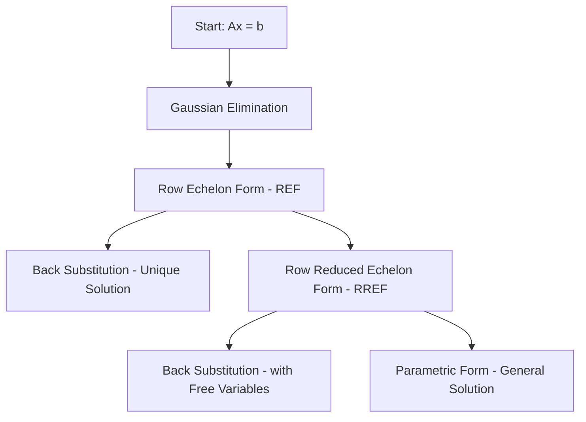
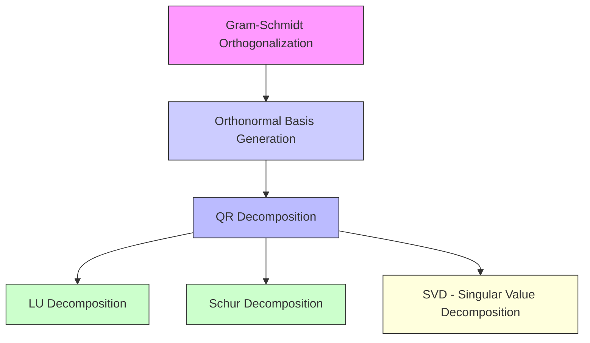
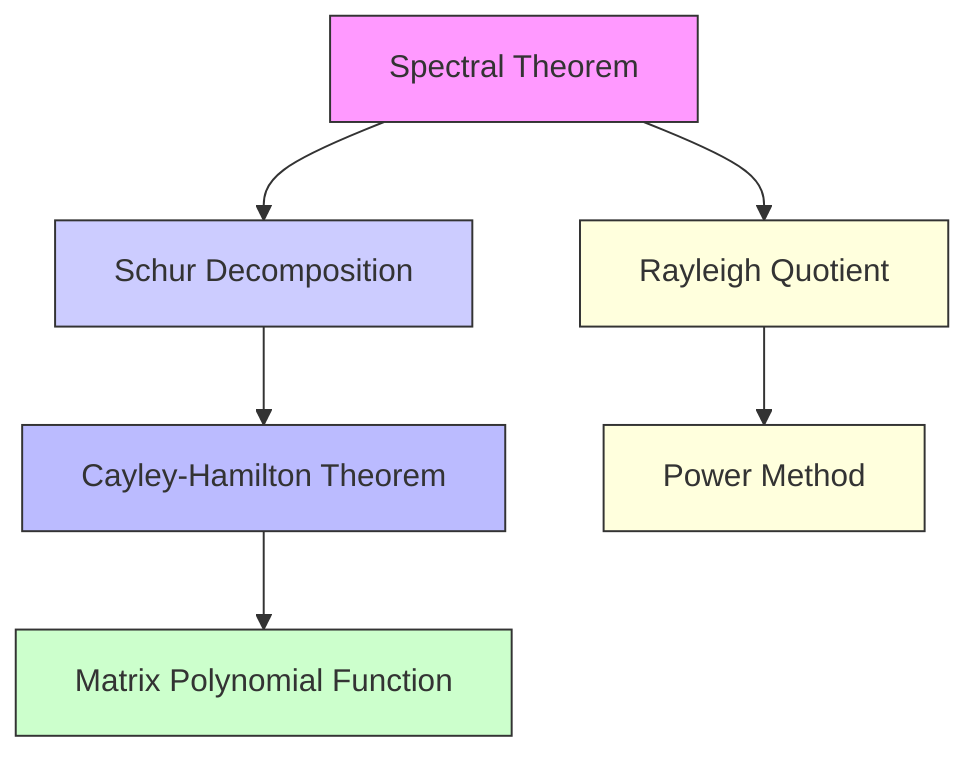

# Flashcards

## Matrix Properties

| Property | Definition | Key Implication |
| - | - | - |
| Determinant | det(A) is a scalar that determines *invertibility* | det(A) = 0 means A is singular (non-invertible), at least one eigenvalue is 0 |
| Invertibility | $AA^{-1} = A^{-1}A = I $ | det(A) != 0, has full rank, has no zero eigenvalues, Ax = b has unique solutions for any b |
| Left-inverse | $LA = I$ where $L = (A^T A)^{-1}A^T  $, when A has full column rank (rank(A) = n) | - when A is tall, - useful for exact solutions in consistent, `overdetermined systems`, - appears in pseudo-inverses (Moore-Penrose) |
| Right-inverse | $AR = I$ where $R = A^T(AA^T)^{-1}  $, when A has full row rank (rank(A) = d) | - when A is wide, - useful for underdetermined systems, - guarantees solutions when system is inconsistent |
|  |  |  |
| Singularity | det(A) = 0, not invertible | at least one eigenvalue is 0. Emphasizes the determinant (not collapsing to zero), as opposed to the function/operator view |
| Eigenvalues $\lambda$ | Scalars satisfying $A\bar{v} = \lambda\bar{v} $ | The scaling factors that describe how much the matrix stretches or compresses along eigenvector directions. Determine stability, transformations, and diagonalizability. The "spectrum of a matrix" (e.g. eigenvalues correspond to natural frequencies (vibrations, energy levels)) |
| Eigenvectors $\bar{v}$ | Nonzero vectors satisfying $A\bar{v} = \lambda\bar{v} $ | Point in the directions that remain unchanged under transformation. Form a basis if the matrix is diagonalizable |
|  |  |  |
| Rank | Number of linearly independent rows/columns | Full-rank **square** matrices are invertible |
| Trace | Tr(A) = sum of diagonal elements = sum of eigenvalues | Somehow this works regardless of if the matrix has been diagonalized |
| Norm | Measures the "size" of a matrix | Ex: Euclidean norm, Frobenius norm, spectral norm |
|  |  |  |
| Definiteness | Positive/negative definite, semidefinite, indefinite | Determines stability |
|  |  |  |
| Orthonormality | rows/cols are orthonormal if: 1. unit length, 2. mutually orthogonal (perpendicular (90deg angles yes really - this differs from linear independence)) | you may have linearly independent vectors, however they are only orthogonal if they meet at 90deg angle |
|  |  |  |
| Algebraic Multiplicity | Number of times an eigenvalue appears in the characteristic polynomial | Always >= GM |
| Geometric Multiplicity | Number of linearly independent eigenvectors for an eigenvalue | AM = GM for diagonalizability |
| Diagonalizability | $A = V \Delta V^{-1} $ | Simplifies computations in this form |
| Jordan Form | Generalization of diagonalization (for non-diagonalizable matrices) | Simplifies computations, reveals GM vs AM and how eigenvectors fail to form a complete basis. Exists for square matrices only. Gives you the algebraic structure (eigenvalue and eigenvectors) |
|  |  |  |
| Sparsity | Most entries are zero | Important for computational efficiency |
|  |  |  |
| Inconsistent | b $\notin$ column space of A | No solutions, but best fit is possible (trailing rows of 0s) (describes $Ax = b$, not just A) |
| Consistent | b $\in$ column space of A | At least one solution, either unique or infinite (no trailing rows of 0s) (describes $Ax = b$, not just A) |
|  |  |  |

## Matrix Types

| Matrix Type | Definition | Key Properties |
| - | - | - |
| Identity | Matrix with all ones on the diagonal |  |
| Diagonal | Diagonal elements are nonzero, all others are zero | Always diagonalizable, det = product of diagonal entries |
| Nilpotent | $A^{k} = 0 $ for some k | All eigenvalues are 0, not diagonalizable (unless zero matrix) |
| Idempotent | $A^{2} = A $ | Eigenvalues are only 0 or 1 |
| Orthogonal | $A^{T} = A^{-1} so $ $A^{T}A = I $ - columns/rows are orthonormal | Preserves lengths and angles, easy to invert, numerically stable, and eigenvalues are either 1, -1 |
| Unitary | $A^{*}A = I$ (complex analog of Orthogonal) | Preserves vector norms, eigenvalues lie on the unit circle |
| Symmetric | $A^{T} = A $ | Guarantees real eigenvalues, and possible diagonalizability (if matrix is real) |
| Hermitian | $A^{*} = A$ (comples analog of Symmetric) | Eigenvalues are real |
| Skew-Symmetric | $A^{T} = -A$ | Eigenvalues are either 0 or purely imaginary |
| Skew-Hermitian | $A^{*} = -A$ (complex analog of Skew-Symmetric) | Eigenvalues are purely imaginary |
|  |  |  |
| Positive Definite | $\bar{x}A\bar{x} > 0 $ for all x != 0 | All eigenvalues > 0, guaranteed invertible |
| Positive Semidefinite | $\bar{x}A\bar{x} >= 0 $ for all x | Eigenvalues >= 0, may be singular |
| Indefinite | $\bar{x}A\bar{x} $ can be positive or negative depending on x | Has both positive and negative eigenvalues |
| Negative Semidefinite | $\bar{x}A\bar{x} <= 0 $ for all x | Eigenvalues <= 0, may be singular |
| Negative Definite | $\bar{x}A\bar{x} < 0 $ for all x != 0 | All eigenvalues < 0, guaranteed invertible |
| Strictly Positive (Negative) | All individual values in matrix are > 0 (< 0) |  |
|  |  |  |
| Gram matrix | Column Gram matrix $A^{T}A$, Row Gram matrix $AA^{T}$ | - symmetric, - always positive semidefinite, sometimes positive definite if full col rank |
|  |  |  |
| Triangular (Upper/Lower) | All elements on and above/below diagonal are non-zero | Det = product of diagonal entries |
| Hessenberg | Triangular-like but with one extra non-zero sub/superdiagonal | Common in numerical algorithms |
|  |  |  |
| Stochastic | Nonnegative entries, rows sum to 1 | Common in Markov processes |
| Perron-Frobenius | A positive square matrix where the largest eigenvalue is real and positive | Used in probability and graph theory (e.g., Google PageRank) |
|  |  |  |

## Transformation Matrices

| Transformation | Definition | Key Properties |
| - | - | - |
| Permutation Matrix | Rearranges rows or cols | Square, orthogonal ($P^{T} = P^{-1}$), entries are 0 or 1 |
| Rotation Matrix | Rotates vectors around an axis | Orthogonal ($R^{T}R = I$), det(R) = +- 1 |
| Reflection Matrix | Flips points symmetrically across a plane or line | Symmetric ($A = A^{T} $), $\lambda_{i} = +- 1$ |
| Scaling Matrix | Stretches or compresses along principal axes | Diagonal form, $\lambda_{i}$ are scaling factors |
| Interchange Matrix | Swaps two rows or columns | Orthogonal ($P^{T} = P^{-1}, P^{T}P = I $) |
| Addition Matrix | Adds values of one row/col to another row/col | Invertible |
|  |  |  |
| Givens Rotation Matrix | 2d rotation matrix, performs localized rotation as G(row/col_1, row/col_2, angle) | Orthogonal ($P^{T} = P^{-1} $), used in QR decomp |
| Householder Reflection Matrix | Reflects vectors across hyperplane | Orthogonal ($P^{T} = P^{-1}, P^{T}P = I $) |
|  |  |  |
| Shear Matrix | Shifts one coordinate direction relative to another. Preserves straightness of lines, parallelness of lines, but distorts angles (breaking orthogonality b/c line intersection). Can stretch, shrink, or leave unchanged (per-dimension) | At least one $\lambda $ is 1 (b/c some vectors are unchanged) |
| Projection aka Basis (Matrix) | $A^{2} = A$, maps vectors onto a subspace (e.g. line or plane) | Idempotent. Eigenvalues are only 0 or 1. If there is an eigenvalue of 0, the associated eigenvectors lie in the null space, so A eliminates them (by projecting to a lower dimension) |
| Skew-Symmetric Matrix | $A^{T} = -A $ Rotation-like behavior without preserving vector magnitude | Eigenvalues are 0 or purely imaginary |
|  |  |  |
| Translation Matrix | Moves points without changing orientation, shape, or scale - shifts all points a fixed amount in each direction | like "adding an offset", but translation is a multiplication operation, whereas offset is element-wise addition (neither of these are linear operations) |
| Affine Transformation Matrix | Combines mutliple xformations, such as rotation, scaling, translation |  |
| Similarity Transformation Matrix | Changes a matrix while preserving eigenvalues | $A' = P^{-1} A P $ |
| Fourier Transformation Matrix | Converts signals between time and frequency domains | Complex-valued, $\lambda $ are roots of unity |

## Operations

| Operation | Definition | Key Properties |
| - | - | - |
| Dot Product (Inner Product) | $a \cdot b = \sum a_{i}b_{i} $ | measures how aligned two vectors are. returns scalar |
| Outer Product | $ab^T$ = (nxd) rank-1 matrix (all rows/cols are multiples of each other, so multiples of a single vector) | Represents a projection or transformation |
| Cross Product | Produces a vector orthogonal to both inputs | The area of the parallelogram is the magnitude of the cross product vector. Closely related to the determinant, but is NOT the determinant |
|  |  |  |
| Affine Transformation | Combination of a `linear transformation` with a `translation` |  |
| Linear Transformation (Linear Operator) | f(x) = Ax (so, b = 0, not translating) | maps between two vector spaces (maps origin of V to origin of W aka "preserves the origin") |
| Linear Function | f(x) = Ax + b (where b != 0 is the translation vector) | when `translation` is allowed, origins are not mapped to each other |
|  |  |  |

## Four Fundamental Subspaces of a Matrix

| Subspace | Span | Definition | Basis | Dimensionality | Identifies |
| - | - | - | - | - | - |
| Right Null Space | "null space of the row space" | Set of solution vectors x such that $A\bar{x} = 0$ | solutions to $A\bar{x} = 0 $ | N(A) = n - rank(A) | Identifies "lost inputs" in R^d (A annihilates input x by mapping to 0) |
| Row Space | Span of $A^{T}$ | Contains all possible linear combinations of row vectors | Independent rows of A | rank(A) | Identifies "constraints" on R^d |
| Column Space | Span of $A$ | Contains all possible linear combinations of column vectors | Independent cols of A | rank(A) | Identifies "reachable outputs in R^n" |
| Left Null Space | "null space of the column space" | Set of solution vectors y such that $A^{T}\bar{y} = 0$; vectors orthogonal to columns of A | solutions to $A^{T}\bar{y} = 0 $ | N(A) = d - rank(A) | Identifies "unreachable outputs" in R^n - directions that input x cannot reach b/c R^n fails to span |

## Solution Cases for $A\bar{x} = \bar{b} $

| Case | Condition | Geometric Interpretation | Implication on Rank |
| - | - | - | - |
| No Solution | b is not in col space, but orthogonal best fit solution is possible | inconsistent system (trailing rows of 0s in RREF), over-determined systems | # rows > # cols (tall) |
| Unique Solution | b is in col space, linearly independent cols | Solution: $\bar{x} = A^{-1}\bar{b} $ | square matrices |
| Infinite Solutions | b in col space, not linearly independent cols | Solution: has free parameters (free columns in RREF) | # cols > # rows (wide) |

## Diagonalizability & Related Concepts

| Concept | Definition | Relationship to Diagonalization | When Occurs | Key Insight |
| - | - | - | - | - |
| Diagonalizability | $A = PDP^{-1}$ | Matrix can be reduced via similarity | Has complete set of independent eigenvectors |  |
| Jordan Form | Generalization of diagonalization for non-diagonalizable (defective) matrices $A = PJP^{-1} $ | Similarity transformation | Always exists for square matrices |  |
| Defective Matrix | Does not have enough independent eigenvectors | Forces use of Jordan form | AM > GM (not =) | Uses "generalized eigenvectors"; leads to nontrivial jordan blocks |
| Similar Matrices | $A = PBP^{-1}$ | Generalizes diagonalization | Always occurs when two matrices represent the same linear map in different bases | Share eigenvalues, determinant, and trace (but not eigenvectors (the different bases)) |
| Simultaneously Diagonalizable | Two matrices diagonalizable by the same matrix P: $P^{-1}AP = D_{A}, P^{-1}BP = D_{B} $ | Special case, not like something to be sought after | Occurs when A and B are diagonalizable and commute (AB = BA) | Not really a big deal lel |

## Matrix Manipulation & Linear System Solving

| Process / Method | When | Why | Key Insight | Connects to |
| - | - | - | - | - |
| Gaussian Elimination | Solving any linear system $A\bar{x} = \bar{b} $ | Reduces to REF | Precursor to REF, RREF, back substitution, leads to LU decomp | Use row operations to zero out subdiagonal entries |
| Row Echelon Form (REF) | Product of Gaussian elimination | Simplifies A to triagnular form | Leads to backsubstitution or to RREF | Pivot positions indicate rank and system structure |
| Back Substitution (Unique Solutions) | After REF when no free variables exist (common in square and overdetermined systems) | Solves triangular systems bottom-up | Ends pipeline to unique solutions for Ax = b | Solve from the last variable upward recursively |
| Row Reduced Echelon Form (RREF) | Further reduces REF | Fully reveals free variables in underdetermined or redundant systems | Leads to back substitution w/ free variables or parametric form | Free variables arise from non-pivot columns |
| Back Substitution (w/ Free Variables) | After RREF when free variables exist | Solves dependent variables while leaving free variables open | Leads to parametric form for the general solution | Free variables appear as parameters in the general solution |
| Parametric form | Expresses infinite solution sets in consistent, underdetermined systems | Describes the general solution using free variables | Follows RREF and back substitution w/ free variables | $ x = x_p + t_{1}v_{1} + t_{2}v_{2} ...$ where $v_{i} \in Null(A)$ (right) Null space |
| Push Through Identity | When simplifying expressions including $A^{-1}$, I or A in formulas | Reduces expressions algebraically | Used in inverse derivations, projection simplifications, or factorizations | $AI = A $ and $A^{-1}A = I $; manipulate to isolate terms cleanly |

## Orthogonalization and Matrix Decompositions

| Process / Methods | When | Why | Key Insights | Connects To |
| - | - | - | - | - |
| Decomposition | Sameas Factorization | Expressing a matrix as a product of more simple or structured matrices |  |  |
| Gram-Schmidt Orthogonalization | Create an orthonormal basis from linearly independent set of vectors | The Q part of QR decomp (without normalization) |  |  |
| Orthonormal Basis Generation | The $q_{x} = u_{x}/\|u_{x} \| $ part of Q formation |  |  |  |
| QR Decomposition | A = QR Factorizes matrix into: - orthogonal matrix - upper triangular matrix (weights/coefficients to express original A in terms of Q) | Useful for computing other decomps |  |  |
| LU Decomposition | A = LU Factorizes into: - lower triangular matrix (keeps track of elementary row operations performed during GE) - U upper triangular matrix (the matrix resulting from GE) | Efficiently solve systems and compute determinants | Part of GE |  |
| Cholesky Decomposition | Special case of LU decomp **only for positive definite matrices**. this works because it is unique for PD matrices | $A = LL^{T} $ Factors a matrix into a product of a lower triangular and its transpose | More computationally efficient than standard LU for PD matrices |  |
| Upper/Lower Quasi-Triangular | Sameas Upper/Lower block-triangular. Has 2x2 blocks of $\begin{bmatrix}\alpha & \beta \\ -\beta & \alpha \end{bmatrix} $ where $\lambda = \alpha \pm i\beta  $ | - 1 block is real eigenvalue - 2block is complex pairs. these 2x2 squares live on the diagonal, where the diagaon of the 2x2 block align with the diagonal of the overall matrix. To use this, you have to unpack and process the blocks specially |  |  |
| Schur decomposition | $A = QTQ^{-1}$ Reduce matrix to quasi-triangular form (T upper triangular, Q orthogonal) | Used in spectral theory, stability analysis, eigenvalue algorithms | Quasi-triangular = block upper-triangular. Q is more stable than $V^{-1}$ in standard diagonalization | Schur decomp will naturally diagonalize a diagonalizable matrix, but if the matrix is not diagonalizable, it will still produce this form which makes spectral properties accessible and is stable to compute |
| SVD - Singular Value Decomposition | $A = U\Sigma V^{-1}$ ($\Sigma$ is diagonal w/singular values) Factorizing any matrix into orthogonal, diagonal components | U, V are orthogonal | Digaonalization only works on square, whereas SVD works on any nxd matrix (this is the only analog to diagonalizability for non-square matrices). U = left singular vectors (eigenvectors of $AA^{T}$), V = right singular values (eigenvectors of $A^{T}A$), $\Sigma$ = singular vaues (square roots of eigenvalues of $A^{T}A$) |  |

## Eigenvalue Theory / Spectral Operations

| Process / Methods | When | Why | Key Insights | Connects To |
| - | - | - | - | - |
| Spectral Theorem | For analyzing symmetric (Hermitian) matrices | Guarantees diagonalizability via orthogonal (unitary) matrix | Basis for eigenvalue decomp, PCA, Schur decomp | If $A = A^{T} $ then $A = Q\Lambda Q^{T} $ |
| Schur decomposition | For square matrices $A = QTQ^{-1}$ Reduce matrix to quasi-triangular form (T upper triangular, Q orthogonal) | Used in spectral theory, stability analysis, eigenvalue algorithms |  |  |
| Cayley-Hamilton Theorem | Simplifying matrix polynomials. Any matrix satisfies its own characteristic equation | Like, when we plug a legit matrix into the characteristic polynomial it solves the same way as individual eigenvalues | $p_{A}(A) = 0 $ where $p_{A}(\lambda) =\det{(A - \lambda I)} $ |  |
| Matrix Polynomial Function | Allows operating on matrices the same way we do scalars by using eigenvalues | $f(A) = V f(\Lambda) V^{-1} $ when A is diagonalizable | Useful for matrix exponentials $e^{At} $ |  |
| Rayleigh Quotient / Rayley Quotient | Estimates eigenvalues for **symmetric matrices** (Gram supports this) | $R(\bar{x}) = \frac{\bar{x}^{T}A\bar{x}}{\bar{x}^{T}\bar{x}} $ | Feeds into power method |  |
| Power Method | Iterative method to Estimate dominant eigenvector and eigenvalue numerically | $x_{k+1} = \frac{A\bar{x}_{k}}{\|A\bar{x}_{k}\|} $ | Principal eigenvector estimation, spectral clustering, graph algorithms |  |

## Inversion Tricks and Generalized Inverses

| Process / Methods | When | Why | Key Insights | Connects To |
| - | - | - | - | - |
| Moore-Penrose Pseudoinverse | When A is not square, or is singular. Works for over, under determined systems | $A^{+} = R^T(RR^T)^{-1} Q^T $ if have QR, and $A^{+} = V\Sigma^{+}U^{T} $ with SVD |  |  |
| Neumann Series | When A is invertible and $\|I - A\| \lt 1 $ | Approximates $A^{-1} $ as a series expansion $A^{-1} = \sum_{k=0}^{\inf} (I - A)^{k} $ |  |  |
| Sherman-Morrison-Woodbury Identity | $(A + UV^{T})^{-1} = A^{-1} - A^{-1}U(I + V^{T}A^{-1}U)^{-1}V^{T}A^{-1} $ | Note, U and V are just generic matrices, not SVD related | Useful when update is low rank. also good if just updating an inverse. iterates a big inverse for a few small matrix operations and a small inverse (dxd operation instead of nxn operation (if tall)) |  |

## Inner Product Spaces

| Process / Methods | When | Why | Key Insights | Connects To |
| - | - | - | - | - |
| Cauchy-Schwarz Inequality | The dot product between a pair of vectors is bounded *above* by the product of their lengths |  Provides an upper bound on the absolute value of an inner product |  |  |

Note, the vertical bars break the table:

$|\sum_{i=1}^{d}x_{i}y_{i}| = |\bar{x} \cdot \bar{y}  | \leq  \|\bar{x}\| \|\bar{y}\|  $

## Proofs? lol

### Simultaneously diagonalizable

- need to show the two matrices commute: AB = BA

### Symmetric

- need to show A = A^T
  - use: $(XY)^{T} = Y^{T} X^{T} $
- and:
  - $A_{ij} = A_{ji} $

### Positive Semidefinite

- generally:
  - gram matrix A^{T} A are:
    - symmetric
    - positive semidefinite
- not all symmetric matrices are PSD
  - but if it is symmetric:
    - A = B^{T}B
      - B is placeholder that says:
        - if A is symmetric, there must exist some B where A = B^T B
- if you can write: A = B^T B
- then: $\bar{x}^{T}A\bar{x} = \bar{x}^{T}B^{T}B\bar{x} = \|B\bar{x}\|^{2} \geq 0 $

### Orthogonal

- show $\bar{v}^{T} \bar{w} = 0 $
