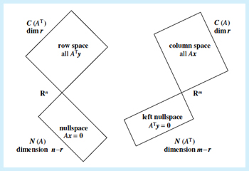

# The Four Fundamental Subspaces of Linear Algebra

- row space
- column space
- right null space
- left null space

## Critical Path

$A\bar{x} = \bar{b} $

- Inputs (x)
  - useful components of x reside in `row space` of A
  - lost components of x reside in `(right) null space` of A
- Outputs (b)
  - reachable outputs of b reside in `col space` of A
  - unreachable outputs of b reside in `(left) null space` of A

## Bigger Picture

What we are describing is the process by which A maps R^d into R^n:

A = nxd matrix

A maps from R^d (input space) to R^n (the output space), making A act as a linear transformation

- A transforms R^d (input space) into R^n (output space):
  - that checks out Ax -> x is a column vector of n dimensions
- The `column space` identifies "reachable outputs in R^n"
  - is subspace of R^n (output space)
- The `(right) null space` identifies the "lost inputs" in R^d
  - "null space of the `row space`"
  - is subspace of R^d (input space)
- The `row space` identifies the `constraints` on R^d
  - is subspace of R^d (input space)
  - the combinations of input vectors that are mapped into the column space
- The `(left) null space` identifies the "unreachable outputs" in R^n
  - "null space of the `column space`"
  - is subspace of R^n (output space)
  - identifies outputs in R^n that are orthogonal to the column space (lost outputs)
  - which directions cannot be reached by input x: directions in output that R^n fails to span

## Alternate Sequential Breakdown

A maps from R^d (input space) to R^n (the output space), making A act as a linear transformation

- starting with x inputs, the scaling factors of the directions of A's cols
- useful components of x fall within `row space`
  - subspace of R^d
  - lost/unused/annihilated inputs of x fall within `(right) row space`
    - (A annihilates input x by mapping to 0 and do not contribute to b)
- based on the `constraints` of A (rows of A)
- A projects used inputs of x from the `row space` into the reachable outputs of b which reside in the `column space`
  - subspace of R^n
- unreachable/lost outputs fall in the `(left) null space`
  - inherently lie outside of the `column space`

Note on `constraints`

- there exist n constraints from n rows of A
- each constraint depends on d coefficients contributed by the cols of A
- `constraint` on x = `equations governing` x (the use of (input/scaling factor) x)
- each row represents a linear equation that x must satisfy for Ax = b to hold
- the row space represents the collection of all such constraints
  - it describes the relationships among the variables in x

Note on `directions`

- there exist d directions from the n columns of A
- each direction depends on n dimensions contributed by the rows of A

As such:

- Column Space + Left Null Space (outers) = all of R^n
  - Every vector in R^n can be expressed as the sum of a vector in C(A) and one in N(A^T)
- Row space + Null Space (inners) = all of R^d
  - Every vector in R^d can be expressed as the sum of a vector in C(A^T) and one in N(A)

Ax = (nxd)(dx1) = nx1

- n is the output space
  - "this is where the result Ax lives"
- d is the input space
  - d = rank(A) + nullity(A)
  - d = rank(A) + N(A)

## Left and Right Inverse

These both are directly related to the row and column spaces

For square matrices, the left and right inverse are the same - $A^{-1} $. For non-square matrices, to reach I conditions, we need to get crafty:

- For Tall Matrix: produce left-inverse
- For Wide Matrix: produce right-inverse

### Left Inverse (for Tall)

- `left-inverse` relates to `column space`
- `left-inverse` relates to independent directions contributed by cols
- `left-inverse` operates in subspace of R^n
  - the dimensional*ity* of rows
  - the number of constraints which must be met
- requires full column rank (all cols linearly independent)
- $LA = I$
- L exists to "undo" transformations by A on the column space

### Right Inverse (for Wide)

- `right-inverse` relates to `row space`
- `right-inverse` relates to unique constraints by each row
- `right-inverse` operates in the subspace of R^d
  - the dimensional*ity* of cols
  - the number of directions in which information is contained
- requires full row rank (all rows linearly independent)
- $ AR = I$
- R exists to "undo" transformations by A on the row space
