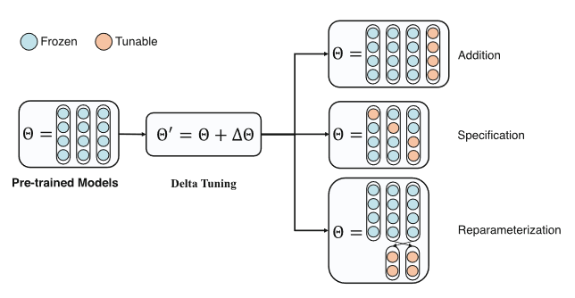
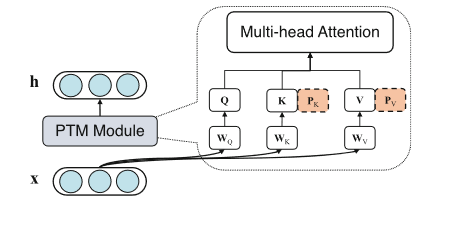
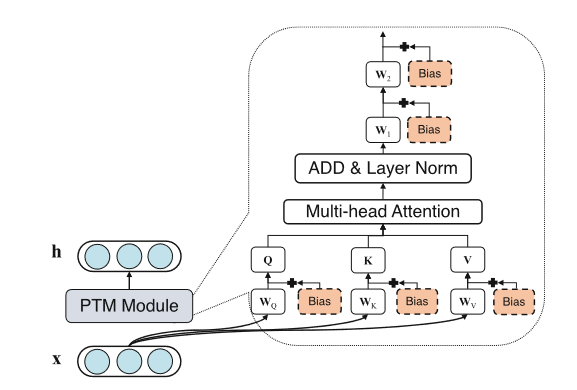
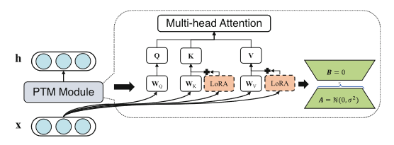

# Chapter 5 - Pre-trained Models for Representation Learning

Pre-training-finr-tuning has recently become a new paradigm in natural language processing, learning better representations of words, sentences, and documents in a self-supervised manner. Pre-trained models not only unify semantic representations of multiple tasks, multiple languages, and multiple modalities but also emerge high-level capabilities approaching human beings. In this chapter, we introduce pre-trained models for representaiton learning, from pre-training tasks to adaptation approaches for specific tasks. After that, we discuss several advanced topics toward better pre-trained representations, indluding better model architecture, multilingual, multi-task, effeicient representation, and chain-of-thought reasoning

## 5.1 Introduction

Representation learning aims to learn informative representaitons of objects from large-scale data. Representation learning for NLP can be divided into three stages according to the learning paradigm:

- statistical learning
  - domain experts to design task-specific rules according to their knoweledge
- deep learning
- pre-trained models

with the paradigm shift of representation from symbolic representaiton to distributed representation

pre-trained models (PTMs) for representation learning, aka foundation models, are so hot rn

- 1. Pre-training-Fine-Tuning Paradigm
  - Transfer learning enables the knowledge (usually stored in model parameters) learned from one task/domain to be transferred to help the learning of other tasks/domains in the same model architecture. Inspired by the idea of transfer learning, PTMs learn general task-agnostic representaitons via self-supervised learning from large-scale unlabeled data and then adapt their model aprameters to downstream tasks by task-specific fine-tuning. Different from conventional deep learning techniques that only learn from task-specific supervised data, the self supervised per-training objective enables PTMs to learn from larger unlabeled web-scale data without labeled task signals automatically. With pre-training-fine-tuning pipeline, PTMs learn general knowledge in the self-supervised pre-training and then stimulate task-related knowledge to complete the downstream tasks through model adaptation
- 2. Unified Representation
  - The development of the Transformer architecture unified the encoders of multiple entries such as text, image, and video. Based on the Transformer architecture and the pre-training-fine-tuning paradigm, PTMs unify the paradigm for representation from three persepectives:
    - task
    - language
    - modality
  - a unified representation learned by pre-trained models can be adapted and utilized for multiple downstream tasks, multiple languages, and even multiple modalities
- 3. Larger Models with Novel Capabilities
  - With more training data and compute avail, PTMs jsut getting huge. as get bigger, PTMs emerge with many fantastic abilities
  - context learning, learns downstream tasks with a task instruction and some optinoal examples as the additional text input
  - chain of thought
  - behavior learning, which learns the human behavior such as operating a search engine

## 5.2 Pre-training Tasks

PTMs for representation learning typically consist of two phases:

- pre-training
- adaptation

During pre-training, PtMs learn the task-agnostic representations, which aim to capture the textx  lexical, syntactic, semantic, and discourse knowledge as well as the world and commonsense knowledge hiding in the text. Three types:

- encoder-based
- decoder-based
- encoder-decoder-based

| Model | Architecture | Size |
| - | - | - |
| BERT | Encoder | 340M |
| RoBERTa | Encoder | 340M |
| SpanBERT | Encoder | 340M |
| UniLM | Encoder | 340M |
| ELECTRA | Encoder | 340M |
| XLM | Encoder | 340M |
| KnowBERT | Encoder | 340M |
| K-BERT | Encoder | Encoder |
| ERNIE (Tsinghua) | Encoder | 110M |
| ERNIE (Baidu) | Encoder | 340M |
| ELMo | Decoder | - |
| GPT | Decoder | 340M |
| XLNET | Decoder | 340M |
| GPT-2 | Decoder | 1.5B |
| CPM-1 | Decoder | 2.6B |
| GPT-3 | Decoder | 175B |
| GLM-130B | Decoder | 130B |
| BART | Encoder-decoder | 340M |
| T5 | Encoder-decoder | 11B |
| CPM-2 | Encoder-decoder | 11B |
| mT5 | Encoder-decoder | 13B |
| OPT | Encoder-decoder | 175B |
| Switch-Transformer | Encoder-decoder | 1.6T |

### 5.2.1 Word-Level Pre-training

Word-level pre-training tasks aim to learn conceptualized word representations

Multiple widely used word-level pre-training objectives, including casual language modeling (CLM), masked language modeling (MLM), replaced language modeling (RLM), and denoising language modeling (DLM)

#### Casual Language Modeling (CLM)

Most typical form of language modeling tasks, like for GPT

utilizes an auto-regressive Transformer decoder to model the probability of the input text

CLM feeds the whole input text sequence into the Tranformer decoder word-by-word auto-regressively and then asks the model to predict the next word at each prosition

Formally, given the input text s = (w1, w2, ..., wN) with N words, the pre-training objective of CLM is formulated as:

$\mathcal{L}_{CLM} = -\sum_{i-1}^N logP(w_{i}|w_{0}, w_{1}, ..., w_{i-1})$

Where w_0 is the start token, and the P(mess) is the probability of wi modeled conditioned on the historical context generated by an auto-regressive Transformer decoder. CLM is widely used as the pre-training task when training big PTMs due to its effectiveness and efficiency

Although CLM can learn the contextualized word representations simply and effectively, it can only encode the historical information in one direction in language understanding tasks. Hence, the downstream language understanding applications usually concatenate the word representations of lef-to-right and right-to-left Transformer decoders learned by CLM, which can naturally combine the contextual information from both sides

#### Masked Language Modeling (MLM)

another widely used. MLM believes that the contextual information of a word is not a simple combination of the historical information captured by a left-to-right model and the future information captured by a right-to-left model. When generating a word, a deep bidirectinoal Transformer model should be utilized to consider both historical and future information. However, casual language modeling cannot be directly applied in pre-training the deep bidir transformer mode since it suffers from information leakage brought by the self-attention operation. Therefore, MLM masks out part of the word with [MASK] tokens in the input text and then asks the model to predict the masked words according to the remainin unmasked context. The pre-training objective of MLM is formulated as

$\mathcal{L}_{MLM} = -\sum_{i-1}^N logP(w_{i}|\bar{s})$

MLM was first adopted by BERT and later used by many other PTMs. to address the gap between pre-training and adaptation pahses caused by the introduciton of the [MASK] token, BERT further utilizes a masking strategy: for a randomly selected word to be masked, BERT replaces it with 1) the [MASK] token with an 80% probability, 2) the original word with a 10% probability, and 3) a random word with a 10% probability. A major limitation of word-level masking is that it may not sufficiently capture the linguistic and knowledge information at the span level, such as phrases and named entities. Span-level semantics are important for many downstream NLP tasks, such as NER and entity linking. Hence, SpanBERT and ERNIE (Baidu) further introduce a novel masking strategy for MLM: span-based masking. Span-based masking proposed to mask contiguous random spans instead of individual random words. The PTMs can better encode the span-level semantics in their learned representaiotns by predicting the endite maske section.

Although MLM can take advantage of the superior power of a bidirectional Transformer encoder, its pretraining objective can only cover part of the input text, e.g. BERT only masks 15% of input words. The reason is that it must ensure that the contextual information in the remaining unmasked words is sufficient to recover the masked words to some extent. hence, the training efficiency of MLM is lower than that of CLM, which precdicts every input word. MLM requires more training steps for convergence

#### Replaced Language Modelin (RLM)

RLM is then proposed to improve the training efficiency of MLM, which is first adopted by ELECTRA. RLM proposes to replace part of the words in random positions of the input text and then asks the model to predict which positions are replaced words. RLM trains the PTMs in an adversarial manner. It uses a smaller bidirectional encoder as the generator, which generataed replaced words that are harder to be disctriminated against. And then, it regards the PTMs as a discriminator to distinguish the replaced words from other unreplaced words. Hence, RLM can cover its pretraining objective in all input words. Let sbar denote the correupted input text after random word replacement, and we can define the pre-training objective of RLM as:

$\mathcal{L}_{RLM} = -\sum_{i-1}^N logP(y_{i}|\bar{s})$

Where yi is the predicted label indicating whether the i-th word is replaced or not

#### Denoising Language Modeling (DLM)

DLM can cover nearly all the pre-training forms introduced above. It is widely used in encoder-decoder-based PTMs, which contain a bidir transformer encoder and an auto-regressive transformer decoder. With the encoder-decoder architecture, DLM allows more modifications to the input text sequence, which can help PTMs capture more lexical, syntactic, and semantic knowledge from the text. DLM randomly modifies the input text in several strategies

- Word masking
- Text Infilling
  - to mask a contiguous span of the input text with a single [MASK] token. Can be viewed as a harder version of word masking
  - is similar to span-level masking strategy of MLM
- Word Deletion
  - delete parts of the words from the input text randomly
  - requires PTMs to decide which words have been deleted
- Word Permutation
  - to shuffle all words from the input text in random order
  - requires PTMs to understand the syntactic and semantic relations between words as well as the whole meaning of the sentence to recover the sentence order

Besides the above word-level modifications, DLM also allows sentence-level modifications such as

- sentence permutation
- document rotation

$\mathcal{L}_{DLM} = -\sum_{i-1}^N logP(w_{i}|\bar{s}, w_{0}, w_{1}, ..., w_{i-1})$

### 5.2.2 Sentence-Level Pre-training

Sentence-level pre-training aims to learn sentence representation which can capture the global meanings of sentences as well as the relationships between sentences

- next sentence prediction (NSP)
- sentence order prediction (SOP)
- sentence contrastive learning (SCL)

#### Next Sentence Prediction (NSP)

NSP adds a [CLS] token in front of the sentence and utilizes the representation of [CLS] as the sentence representation. After that, NSP adds another sentence s' at the end of s with a token [SEP] to indicate the sentence boundary. s' can be the next sentence of s in the document, or a randomly selected sentence from the pre-training corpus. NSP aims to determine whether s' and s appear consequtively in the original text, which may help PTMs understand the relationship between sentences. Formally, NSPs pre-training obj can be formulated as:

$\mathcal{L}_{NSP} = -logP(y|s, s')$

where y is the predicted label indicating whether s' is the next sentence of s or not. In practice, BERT utilizes a uniform sampling strategy, i.e. choosing s' with 1) the original next sentence of s with half a chance and 2) the randomly selected sentence with a half chance

adopted by BERT

RoBERTa reimplements BERT and surprisingly finds that the performance of PTM on most downstream NLP tasks is even better by removing the NSP objective and only pre-training on the MLM objective. ALBERT further points out that the lack of task difficulty of NSP may be the key reason for its ineffectiveness. In fact, due to the big difference in topic distribution between the original next sentence and the randomly selected sentence, NSP usually suffers from a shortcut, i.e. it just requires PTMs to perform topic prediciton

#### Sentence Order Prediction (SOP)

proposed to avoid the problem of NSP in modeling inter-sentence relationships. adds a [CLS] token in front of the sentence. after that, randomly swaps the two consecutive sentences and asks PTMs to predict the proper orders. in this way, the instances of SOP with correct or wrong sentence orders to not differ expliciitly in topic distribution. Hence, SOP forces PTMs to distinguish discourse level coherence relations between two input sentences rather than their topics.

$\mathcal{L}_{SOP} = -logP(y|s, s')$

where y is the predicted label indicating whether s' and s are in order or not

from ALBERT, we see SOP can somewhat solve problems of NSP, which may come from analyzing misaligned coherence cues

#### Sentence Contrastive Learning (SCL)

Unlike NSP and SOP, which learn the sentence-level semantics by distinguishing the relations between different raw sentences, SimCSE simply predicts whether two input sentences are the same. The basic idea of SimCSE is that the representations of a sentence with different dropout masks should be closer than representations of other sentences. s^z' denote the sentence representations of sentence s with dropout mask z and z' respectively

$\mathcal{L}_{SOP} = -log ((exp(cos(s^{z}, s^{z'})))/(\sum_{i=1}^{M} exp(cos(s^{z}, s_{i}))))$

where s_i is the representation of the ith negative sentence in the training batch. cos(.) indicates the cosine similarity, and M is the batch size. In practice, the negative sentences are usually sampled from the same mini-batch for convenience. Although strikingly simple, it outperforms the NSP and SOP pre-training objectives by a large margin in a series of downstream NLP tasks. Other concurrent works also adopt the idea of sentence contrastive learning for sentence level pre-training, such as

- self-guidance contrastive learning
- contrastive tension
- TSDAE

## 5.3 Model Adaptation

### 5.3.1 Full-Parameter Fine-Tuning

Given a:

- PTM model $\Theta ={\theta_{1}, \theta_{2}, ..., \theta_{|\Theta|}}$
- training data D

the goal of fine-tuning can be formulated as finding the parameter updates $\Delta\Theta$

$\Delta\Theta = \nabla f_{\Theta}(D)$

where $f_{\Theta}(D)$ is the adaptation objective of the downstream tasks. that is, we can simply feed the task-specific inputs to the PTMs and fine-tune all parameters so that the parameters of PTMs for the downstream task can be obtained by

$\Theta' = \Theta - \Delta\Theta $

Main Tasks:

- classification
- sequence labeling
- generation

#### Classification

Formally, given the input sentence s and the outuput label y, the classification task models the conditional probability P(y|s)

A common solution to fine-tune PTMs is to add a task-specific classifier on top of the sentence/document representation generated by PTMs, i.e. $P(y|s) = P(y|\bold{s})$

As for sentence/doc representations **s**, we usually use:

- 1. the representaiton of the [CLS] token for encoder-based
- 2. the rep of last word in sentence for decoder-based
- 3. the rep of the start word in the Transformer-based decoder for encoder-decoder-based

Besides adding an external classifier, decoder-based and encoder-decoder-based PTMs also model the classification tasks as text generation, which directly generate the target labels in the decoder

#### Sequence Labeling

pos tagging, ner, etc

given the input sentence s = (w1, ..., wn) and the corresponding output labels y = (y1, ..., yN) for all words, the sequence labeling task models the conditional probabilities P(y|s)

It is usually modeled as the word-level classification form, in which the output labels of all words are conducted independently

i.e. $P(y|s) = \prod(y_{i}|s)$

We can add a task-specific classifier on top of the output representation $\bold{h_{i}}$ for the ith word generated

i.e. $P(y_{i}|s) = P(y_{i}|\bold{h_{i}}) $

#### Generation

formally, given the source sentence s and the corresponding target sentence t, the generation task models the conditional probaility P(t|s) (for the LM task alone, we only model P(t) without any condition)

Fine-tuning the whole PTMs is simple and effective, showing superior performance in a wide range of downstream tasks. However, two drawbacks:

- time- and resource-consuming
  - requires updating all model parameters and storing the whole model for each task
- hard to generalize from a few examples
  - requires considerable training data

How can we adapt PTMs more effectively? Therefore, delta tuning and prompt learning target these two problems from:

- model optimization perspective
- data utilization perspective

### 5.3.2 Delta Tuning

Delta tuning (aka parameter-efficient tuning) proposed to only update part of the model parameters instead of full parameter updates

Basic assumption of delta tuning is that we can stimulate the necessary abilities for downstream tasks by only modifying a few model parameters. Formally, different from full-parameter fine-tuning that the number of updated parameters $|\Delta\Theta| $ is equal to the number of whole model aprameters $|\Theta|(\Theta = \theta_{1}, \theta_{2}, ..., \theta_{n}) $, delta tuning only updates a small number of parameters while achieving the same adaptation objectives. From the persepective of representation learning, the general representations obtained by self-supervised pre-training can be adapted to task-specific representations with little cost.

three main categories:

- addition-based
- specification-based
- reparameterization-based

**THIS IS NOT MY DIAGRAM - ALL CREDITS FOR THE DIAGRAM AND THESE NOTES TO THE AUTHORS - SEE README**

**THIS IS NOT MY DIAGRAM - ALL CREDITS FOR THE DIAGRAM AND THESE NOTES TO THE AUTHORS - SEE README**

#### Addition-Based Approach

Keeps all aprameters in original PTMs frozen and inserts new trainable neural modules or parameters (denoted as $\Delta\Theta = \Theta_{add} = \{\theta_{n+1}, \theta_{n+2}, ..., \theta_{n+m}\} $)

in practice, we have m << n in the addition based methods

##### Adapter-Based Methods

Insert tiny neural adapter modules into the middle of transformer layers. It only tunes the parameters of the inserted adapter while keeping the PTMs frozen

- Vanilla adapter first utilizes a two-layer feed-forward network as adapters and achieves comparable performance compared with full-parameter fine-tuning in a lot of downstream NLP tasks

For an output hidden representation $h \in \mathbb{R}^{d} $ of a PTM module, vanilla adapter first feeds h into a down-projection network which projects it into r-dimensional semantic space with a transform matrix $\bold{W}_{down} \in \mathbb{R}^{d x r} (r<d) $ and then feeds the output into an up-projection network which projectis it back to d-dimensional space with a transform matrix $\bold{W}_{up} \in \mathbb{R}^{r x d} $. the process of vanilla adapter can be formulated as

$\bold{h} \leftarrow f(\bold{h}\bold{W}_{down})\bold{W}_{up} + \bold{h} $

where $\Delta\Theta = [\bold{W}_{down}, \bold{W}_{up}] $ are the tunable parameters, and f(.) is a nonlinear activation function

In practice, the adapter modules are inserted in the middle of two Transformer blocks in the PTMs and it can reduce the number of tunable parameters to about 0.5-8%

AdapterDrop further proposed to dynamically remove adapter modules from lower Transformer layers to further reduce the computational cost for model inference

Compacter further reduces the number of tunable parameters of the adapter module with parameterized hypercomplex multiplication layer. Formally, it replaces the original projection matrix with the sum of the kronecker products of two low-rank matrices:

$\bold{W}_{up} = \sum_{i=1}^{l} \bold{A}_{i} \otimes \bold{B}_{i} $

where $\bold{A}_{i} \in \mathbb{R}^{l \times l} and \bold{B}_{i} \in \mathbb{R}^{(d/l) \times (r/l)} $ and $\otimes $ indicates the Kronecker product operation. The formulation of Wdown is similar

Although existing adater-based methods can achieve the performance of nearly full-parameter fine-tuning with fewer modified parameters, it still requires back-propagation through the whole PTM.

Ladder side-tuning futher proposes tomove the adapter modules out of the Transformer architecture of PTMs, bridging a ladder outside the backbone model. Hence, it can effectively save computation of backpropogation of the original PTMs while updating adapter modules and also save memory by shrinking the hidden size of representations

##### Prefix Tuning Methods

Adds trainable prefix vectors to the **hidden states at each layer** instead of inserting adapter modules in the middle of the transformer layers. can be viewed as concatenating two prefix matrices $\bold{P}_{K}, \bold{P}_{V}| \in \bold{R}^{l \times d} $ (l is the number of the inserted prefix vectors in the prefix matrix) to the input key hidden matrix K and value hidden matrix V of the multi-head attention layer, which is formulated as

$\bold{h}_{i} = ATT(\bold{x}\bold{W}_{Q}^i, concat(\bold{P}_{K}^{i}; \bold{x}\bold{W}_{K}^{i}), concat(\bold{P}_{V}^{i}; \bold{x}\bold{W}_{V}^{i})) $

Where $\bold{P}_{K}^{i}$ and $\bold{P}_{V}^{i}$ are the ith sub-vectors of PK and PV for ith attention heads calculation, ATT(.) indicates the self-attention function, and x is the input feature of Transformer blocks. For prefix tuning, we have $\Delta\Theta = P_{K} \cup p_{V} $. Empirically, directly optimizing Pk and Pv may be unstable and hurt performance slightly, and thsu prefix tuning proposed to reparameterize them with FFNs:

$\bold{P}_{K} = MLP(\bold{P}_{K}') $

$\bold{P}_{V} = MLP(\bold{P}_{V}') $

and they only save Pk and PV after training

Prompt tuning is a simplified form of prefix-tuning, which only adds previx vectors (aka soft prompts) to the input layer instead of all layers. It shows that prompt tuning can achieve nearly the same performance as full-paremeter fine-tuning when the model size increases

#### Specification-Based Approach

Proposes to specify part of the model parameters in the original PTMs to be tunable (denoted as $ \Delta\Theta = \{\Delta\theta_{i d x_{1}}, \Delta\theta_{i d x_{2}}, ..., \Delta\theta_{i d x_{m}} \} $ where $i d x_{1} \in [1, n] $ is the index of tunable parameters) and also m << n

##### BitFit

BitFit proposes to only optimize the bias terms inside the PTMs while freezing other parameters. Formally, BitFit first specifies the multi-head attention layer in the Transformer block as:

$\bold{h}_{i} = ATT(\bold{x}\bold{W}_{Q}^{i} + \bold{b}_{Q}^{i}, \bold{x}\bold{W}_{K}^{i} + \bold{b}_{K}^{i}, \bold{x}\bold{W}_{V}^{i} + \bold{b}_{V}^{i}) $

and then specifies the next feed-forward layer as:

$\bold{h}' = GeLU(\bold{h}\bold{W}_{1} + \bold{b}_1)\bold{W}_{2} + \bold{b}_{2} $

where GeLU(.) indicates the Gaussian error linear unit. The bias terms of layer-norm layers are tunable as well. Shows 95%  performance as full-parameter fine-tuning on several benchmarks. They also find that different functionalities may be controlled by different parts of specified bias terms durring model adaptation

##### diff pruning

proposes to learn select part of the model parameters for model adaptation. the basic idea of diff pruning is to encourage the delta parameter \Delta\Theta to be as sparse as possible. To this end, Diff pruning first decomposes \Delta\Theta into a binary mask vector $\bold{z} \in \{0, 1\}^|\Theta| $ multiplied with a dense vector $\bold{w} \in \mathbb{R}^|\Theta| $

$\Delta\Theta = \bold{z} \odot \bold{w} $

and then it optimizes an expectation with repsect to z under a Bernoulli distribution parameter alpha

$\min_{\alpha, w} \mathcal{E}_{z ~ p(z;\alpha)} [\mathcal{L}(\Theta + \Delta\Theta) + \lambda ||\Delta\Theta||_{0}] $

Where fancy L indicates the learning objective of the downstream task and L_0-norm penalty is added to achieve the goal of sparsity. The idea of learning a binary mask vector for delta tuning is also proposed elsewhere

#### Reparameterization-Based Approach

proposes to reparameterize part of existing parameters in PTMs to paramter-efficient forms by transformation

Let P = {p1, p2, ..., pm} represent the set of parameter subsets to be reparameterized an $\Delta\Theta = \Theta + (\cup_{i=1}^{m} R(p_{i})) $ where R(p_i) is used to reparaemterize the parameter subset p_i

LoRA decomposes the change of the original weight matrixes in the multi-head attention modules into low-rank matrices - the basic ideas is that the full-parameter fine-tuning phase of PTMs has a low intrinsic dimension. LoRA uses four low-rank-matrices to decompose the changes of the transform matrices for key and value spaces, which can be formulated as

$\bold{h}_{i} = ATT(xW_{Q}^{i}, x(W_{K}^{i} + A_{K}B_{K}), x(W_{V}^{i} + A_{V}B_{V})) $

where $A_{K}, A_{V} \in \mathbb{R}^{d \times r}$ and $B_{K}, B_{V} \in \mathbb{R}^{r \times d}$

In the experiment on the GLUE benchmark, LoRA can nearly achieve comparable performance with full-parameter tine-tuning for the PTMs fo various scales and architectures

#### Understanding Delta Tuning from Ability Space

for a particular delta tuning method, the adaptations of PTM for multiple downstream tasks can be reparameterized as optimizations in a unified low-dimension parameter space. Find that optimization of different delta tuning methods for adapting PTMs to downstream tasks can also be reparameterized into optimizations in a unified low-dimension parameter space

This demonstrates the optimization space of PTMs adaptation is intrinsically low-dimensional, which may explain why the adaptation of PTMs can be done with relatively small-scale downstream data. The intrinsic low-dimensional tuning parameter space may indicate parts of the parameters int he PTMs that are related to each other, which may be co-activated and controlled ina unified manner. This phenomenon is also observed by MoEfication

### 5.3.3 Prompt Learning

Prompt learning is proposed to overcome the limitations of full-paramter fine-tuning from the **data utliization** perspective. It reformulates the downstream tasks as the conditional language modelinf form with a textual prompt as task instruction. This could effectively (in essence or functionally?) bridge the gap between model pre-training and adaptation for PTMs. Moreover, it incorporates the prior knowledge of domain experts into the model adaptation phase by elaborately designing the textual prompt, which can be viewed as feature engineering toward PTMs. Therefore, prompt learning can significantly reduce the requirements of extensive training data in the model adaptation phase

In-context learning can be divided into two levels:

- 1. task instruction learning, which adds a task instruction (like "Translate English to Chinese") in front of the translated text sequence, and requires the PTMs to perform zero-shot learning
- 2. Example learning, which also adds some task examples besides the task instruction and requires the PTMs to perform few-shot learning based on the task-related context

#### Task Instruction Design

Task instruction design aims to find the optimal task instruction prompts that can achieve the best performance in the downstream tasks. It can be divided into three categories

- Manual Design
  - intuition from human experts
  - limitations:
    - require much time and experience
    - optimal task instruction prompts are highly related to specific PTMs, task datasets, and even experts may fail to find the optimal task instruction prompts
- Automatic Design
  - to learn or find the optimal task instruction prompts automatically
  - 1. generate then rank
    - generate a candidate set of task instruction prompts by prompt mining, prompt paraphrasing, prompt generation, and then ranks the best one according to performance in the downstream tasks
  - 2. gradient-based search
    - searches over all words in the vocabulary to find short task instructions that can stimulate the specific PTMs to generate the target output of the downstream tasks according to gradients
- Knowledgeable Design
  - further incorporate external knowledge into the task
  - applies logic rules to guide the construction of promps, encoding the prior knowledge of each class into prompt learning
  - insert the type markets in front of the head and tail entities to incorporate the entity type knwoledge and insert a soft word with the average embeddings of the relation descriptions between the head and tail entities to inforporate the relation knowledge

#### Task Verbalizer Design

aims to find the optimal label word space of the verbalizer, i.e. the optimal words in the output vocab to map to the label words

- Manual Design
  - ask experts to select optimal words based on downstream task
- Automatic Design
  - for  paraphrasing, searching, generation
  - select top-k candidates and sum probabilities as label probabilities
- Knowledgeable Design
  - utilize knowledge bases to help expand the verbalizers label word space
  - for topic classificaiton, utilize the external topic-related vocab
  - extend the label word space from discrete words into soft embeddings and learn prototype vectors as verbalizers by self-supervised contrastive learning.
  - can also learn to prototype vectors for entity typing tasks by self-supervised learning

#### Connections Between Prompt Learning and Prompt Tuning

Prompt learning directly utilizes textual prompts to stimulate the specific functionalities of PTMs

## 5.4 Advanced Topics

- beter model architecture
- multilingual representation
- multi-task representation
- efficient representation
- chain-of-thought reasoning

### 5.4.1 Better Model Architecture

Is Transformer the optimal architecture for PTMs

#### Improving Model Capacity

how to increase the number of model parameters while keeping the same theoretical computation complexity

Sparsity, which indicates that the model only activates part of the parameters for a specific task, has been widely explored. In this way, model capacity can be significantly incrased without proportionally increasing theoretical compuation complexity.

Sparsely gated mixture of experts layer (MoE) proposed to allow models to only activate a part of the parameters for each input sample. has two parts:

- experts
- routing network

Each expert is usually a FFNN, the routing network is to determine which experts are activated when processing

sparsely gated MoE cannot be applied in real world scenarios due to the training instability and communication costs in GPU clsuters. GShard comes MoE with transformer, simplifes routing strategy, which only assigns at most two experts, and employs a capacity factor to balance the workload of each expert. Switch Transformer extens sparsely gated Moe, GLaM also. Basically, these can converge faster than vanilla trasformer architecture due to the significantly larger model capacity

Sparse model architectures would be an essential feature of the next generation of PTMs architectures

#### Modeling Long-Term Dependency

transformers self-attention mechanisms compuational and memory footprints are quadratic with the length of the input sequence

Fast attention mechanisms:

- Structured Sparse Attention
  - attention heads exhibit specific patterns
  - some tokens may attend to the [CLS] token, and some tokens may attentnd to others tokens specific positional offsets
  - propose to replace the original fully connected multi-head attns with several types of pre-defined structured sparse attentions, including
    - 1. the sparse global attention with which the token is visible for all other tokens and typically emplyed in the [CLS] token
    - 2. the structured local attention which reduces the visible field for most other tokens with stride window form or blockwise form, etc
- Low-Rank Approximation
  - propose to approx the multi-head attention matrixes with low-rank decomposition, reducing the multi-head attention to an operation which is linear with the length of the sentence
- Cluster-Based Sparse Attention
  - basic idea is that tokens can only attend to similar tokens according to the routing mechanism of the multi-head attention layer. Hence, it learns to cluster tokens in the input text according to their similarities and restricts that to only the tokens in the same clusters are visible to each other in the attention layer
  - Reformer emplyes a locality sensitive hashing strategy to cluster tokens for attention calculation, and routing Transformer employes a ks-means algorithm to cluster tokens
  - https://arxiv.org/abs/2001.04451 - Reformer 2020
  - https://arxiv.org/abs/2003.05997 - Routing Transformers 2020

#### Retrieving External Information

REALM is cool

RAG also mentioned lmao

### 5.4.2 Multilingual Representation

#### Nonparallel Pre-training

Directly pre-trains PTMs on nonparallel multilingual corpa with monolingual pre-training tasks. its basic idea is that the lexical overlaps between languages can help to align the multilingual language representations learned from corpa of multiple languages in the semantic space

Training style depends on encoder vs decoder vs encoder-decoder architectures

A major challange of multi-lingual is how to alleviate the data imbalance. mBERT performs exponentially smoothed weighting of the data distribution

#### Parallel Pre-training

Mainly focuses on designing multi-lingual pre-training tasks to better utilize the language alignment signals from parallel corpa

- cross-lingual masked language modeling
  - CMLM concatenates two semantically matched sentences in two languages and asks PTMs to recover randomly masked tokens in the connected sentence
  - CMLM allows PTMs to recover the masked tokens not only form the monolingual context but from its aligned tokens in another language
- crosslingual denoising language modeling
  - CDLM assigns the inputs of the encoder and decoder with text in different languages
- cross-lingual contrastive learning
  - InfoXML analyzes MLM and CMLM from perspective of information theory and proposes a contrastive pre-training objective for learning based on analysis

can these patterns extend to multiple modalities?

Compared to non-parallel pre-training, parallel can learn semantic-aligned multilingual representations. Most of these rely on a large number of parallel data at the sentence and word level, whcih is rare. ERNIE-M proposes back-translation techniqe as well as back-translation masekd language modeling pre-training objective. ALM proposed a code-switched pre-training objective, which directly replaces the tokens/spans in one language with the tokens/spans from either its semantic-aligned sentence in another language or bilingual lexicons and then performs CMLM on it

### 5.4.3 Multi-Task Representation

No clear answer whether multi-task learning in downstream tasks can make the pre-trained representaitons more expressive. Three directions:

#### Multi-Task Pretraining

Introduce learning signals of different NLP tasks into the pre-training phase

#### Multi-Task Preadaptation

additionally adapts the big PTMs by adding intermediate auxilliary tasks between pre-training and model adaptation. three categories

- exploring the effectiveness of preadaptation
  - could further learn more task capabilities not reflected in the self-supervised learning signals
  - preadaptation on domain-specific unlabeled data is good
- understanding the working mechanism of preadaptation
  - scaling the number of tasks as well as adopting task-heterogeneous batches and task-rebalancing loss scaling is important
- selecting intermediate aux tasks for preadaptation
  - how to efficiently select the optimal intermediate aux tasks according to the knowledge transferability among different tasks, such as embedding-based moethods, manually defining feature-based methods, task gradient-based methods

#### Multi-Task Model Adaptation

Usually suffer from the data imbalance problem. simply performing typical multi-task learning for model adaptation will lead to underfitting in resource-rich tasks and over-fitting on resource-scarce tasks

- task-specific layers
  - added on top of the shared universal text representations
- task-specific controlling modules
  - generate weights of the existing layers such as the FFN layers of the Transformer
- delta tuning methods
  - reduce the number of newly added model parameters for multiple downstream tasks

### 5.4.4 Efficient Representation

#### Model Pruning

omitting redundant model parameters

- unstructure pruning
  - directly prunes model parameters tha the neuron level
  - doesnt improve inference time since compute cannot deal well with pruned ustructured PTMs
- structure pruning
  - prunes model parameter at attention level or layer level
  - propose to randomly drop several layers so they can dynamically pick up parts of the model layers during inference
  - DeeBERT and CascadeBert learn to exit the inference in the shallow layer of PTMs in the downstream tasks

#### Knowledge Distillation

Learns a smaller student PTM to transfer the knowledge from a bigger teacher PTM, which aims to reduce both the inference time and memory cost while maintaining the performance of big PTMs. Main challenge is how to construct effective supervisions from the teacher, which has 3 types:

- from the original output probabilities
- from the hidden states in different layers
- from the attantion matrices

#### Parameter Quantizatino

Convers the precision of model parameters from a higher float point to a lower one. Original precision is usually 32 or 16 bit or mixed

### 5.4.5 Chain-of-Thought Reasoning
