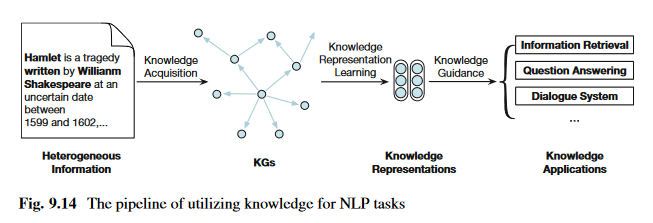

# Chapter 9 - Knowledge Representation Learning and Knowledge-Guided NLP

Knowledge is an important characteristic of human intelligence and reflects the complexity of human beings. To this end, many efforts have been devoted to organizing various human knowledge to improve the ability of machines in language understanding, such as world knowledge, linguistic knowledge, commonsense knowledge, and domain knowledge. Starting from this chapter, our view turns to representin rich human knowledge and using knowledge representations to improve NLP models. In this chapter, taking world knowledge as an example, we present a general framework of organizing and utilizing knowledge, including knoweldge representaiton learning, knowledge guided NLP, and knowledge acquisition. For linguistic knowledge, commonsense knowledge, and domain knowledge, we will introduce them in detail in subsequent chapters considering their unique knowledge properties

## 9.1 Introduction

Knowledge representation learning aims to encode symbolic knowledge into distributed representations so that knowledge can be more accessible to machines. Then, knowledge-guided NLP is explored to leverage knwoeldge representaitons to improve NLP models. Finally, based on knoweldge-guided models, we can perform knowledge acquisition to extract more knowledge from plain text to enrich existing knowledge systems

focus on world knowledge

## 9.2 Symbolic Knowledge and Model Knowledge

### 9.2.1 Symbolic Knowledge

holy fuck knowledge graphs were only proposed in 2012

KGs arrange the structured multi-relational data of both concrete and abstract entities in the real world, which can be regarded as graph-structured KBs. In addition to describing world knoweldge in conventinoal forms such as strings, the emergence of KGs provides a new tool to organize world knowledge from the persepctive of entities and relations. Since KGs are very suitable for organizing the massive amount of knowledge stored in the Web corpa for faster knowledge retrieval, the construction of KGs has been blooming in recent years and attracted wide attention from academia and industry.

### 9.2.2 Model Knowledge

For grammar rules, expert systems, and even KGs, one of the pain points of symbolic knowledge systems is their weak generalization. In addition, it is also difficult to process symbolic knowledge using the numerical computing operations that machines are good at. Therefore, it becomes important to establish a knowledge framework based on numerical computing and with a strong generalization ability to serve the processing of natural language

Different from symbolic knowledge, which is abstracted by human beings and regarded as **human-friendly** knowledge, the intrinsic nature of statistical learning is to capture the distribution patterns of data from statistics and uses these patterns to abstract implicit knowledge that can be used to solve specific problems. Although such implicit knowledge captured by statistical learning methods may not directly satisfy human intuition, the knowledge is adept at describing correlation information in data and is easy to compute numerically. In other words, this kind of knowledge based on numerical features and continuous probability models is more **machine-friendly**. Considering that the structure of probability models is also a kind of prior knowledge, here we introduce the concept of **model-knowledge** to describe this machine-friendly knoweldge.

### 9.2.3 Integrating Symbolic Knowledge and Model Knowledge

- Symbolic knowledge is suited for reasoning and modeling causality
- Model knowledge is suited for integrating information and modeling correlation

In order to integrate both symbolic and model knowledge, three challanges have to be addressed:

- 1. How to represent knowledge (especially symbolic knowledge) in a machine-friendly form so that current NLP models can utilize the knowledge?
- 2. How to use knowledge representations to guide specific NLP models?
- 3. How to continually acquire knowledge from large-scale plain text instead of handcrafted efforts?

## 9.3 Knowledge Representation Learning

As symbolic systems scale, face two challanges:

- data sparsity
- computational inefficiency

these challenges indicate that symbolic systems are not an inherently machine-friendly form of knowledge organization. Specifically, data sparsity is a common problem in many fields. Ex, when we use KGs to describe general world knowledge, the number of entities (nodes) in the KG can be enormous, while the number of relations (edges) in KGs is typically few, i.e. there are often no relations between two randomly selected entities in the real world

To solve the above problems, distributed knowledge representations are introduced, i.e. lwo-dimensional continuous embeddings are used to represent symbolic knowledge. The sparsity problem is alleviated owing to these distributed representatinos, and the computational efficiency is also improved.

We take KGs that orgnaize rich world knoweldge as an example

G = (E, R, T) to denote a KG, in which E = {e1, e1, ...} is the entity set, R = {r1, r2, ...} is the relation set, and T is the fact set. We use h, t \in E to represent head and tail entities, and **h**, **t** to represent their entity embeddings. A triplet $<h, r, t> \in T $ is a factual record, where h, t are entities and r is the relation between h and t

Given a triplet $<h, r, t> $, a score function f(h, r, t) is used by knowledge representaiton learning methods to measure whether <h, r, t> is a fact or fallacy. Generally, the larger the value of f(h, r, t), the higher probability that <h, r, t> is true. Based on f(h, r, t), knowledge representation can be learned with

$argmin_{\theta} \sum_{<h, r, t> \in T} \sum_{<\tilde{h}, \tilde{r}, \tilde{t} \in \tilde{T}>} max \{ 0, f(\tilde{h}, \tilde{r}, \tilde{t}) | \gamma - f(h, r, t) \}$

where \theta is the learnable embeddings of entities and relations, <h, r, t> indicates positive facts (i.e. triplets in T), and tilde <h, r, t> indicates negative facts (triplets that do not exit in KGs), \gamma > 0 is a hyperparamter used as a margin. A givver \gamma means to learn a wider gap between f(hrt) and tilde f(hrt). Considering there are no explicit triples in KGs, T~ is usually defined as:

$\tilde{T} = \{<\tilde{h}, r, t>| \tilde{h} \in E, <h, r, t> \in T \} \cup \{<h, \tilde{r}, t>|\tilde{r} \in R, <h, r, t> \in T \} \cup \{<h, r, \tilde{t}>|\tilde{t} \in E, <h, r, t> \in T  \} - T $

Which means T~ is build by corrupting the entities and relations of the triplets in T. Different from the margin-based loss function, some methods apply a likelihood-based loss function to learn knowledge representaitons as

$argmin_{\theta} \sum_{<h, r, t> \in T} log [1 + \exp(- f(h, r, t))] + \sum_{<\tilde{h}, \tilde{r}, \tilde{t}> \in \tilde{T}} log[1 + \exp(f(\tilde{h}, \tilde{r}, \tilde{t}))] $

Some typical knoweldge representation learning methods as well as their score functions

### 9.3.1 Linear Representation

Linear representaiton methods formalize relations as linear transformations between entities, which is a simple and basic way to learn knowledge representations

#### Structured Embeddings (SE)

typical. all SE entities are embedded into a d- dimensional space. SE designs two relation-specific matrices Mr1, and Mr,2 \in R^dxd for each relation r, which are both used to transform the embeddings of entities. Score fn defined as:

$f(h, r, t) = - \| M_{r, 1} h - M_{r,2} t  \| $

where ||.|| is the vector norm. The assumption of SE is that the head and tail embeddings should be as close as possible after being transformed into a relation-specific space. Therefore, SE uses the margin-based loss fn to learn representations

#### Semantic Matching Energy (SME)

builds more complex linear transformations than SE. given a triplet <h, r, t>, h and r are combined using a projection function to get a new embedding I_h,r. Similarly, given t and r, we can get I_t,r. Then, a pointwise multiplication function is applied on I_h,r and I_t,r to get the score of this triplet. SME introduces different projection functions to build f(h, r, t), one in linear form:

$f(h, r, t) = I_{h,r}^{\top} I_{t,r} , I_{h, r} = M_{1}h + M_{2}r + b_{1}, I_{t,r} = M_{3}t + M_{4} r + b_{2}     $

and the other is in the bilinear form

$f(h, r, t) = I_{h, r}^{\top} I_{t, r}, I_{h, r} = (M_{1} h \cdot M_{2}r) + b_{1}, I_{t, r} = (M_{3} t \cdot M_{4}r) + b_{2}   $

where \cdot si the elementwise (Hadamard) product. M1, M2, M3, M4 are learnable transformation matrices, and b1, and b2 are learnable bias vectors. This is suitable for dealing with the score functions build with vector norm operations, while the likelihood-based loss fn is more usually used to process the score functions build with inner product operations. Since SME uses the inner product operation to build its score function, the likelihood-based loss fn is thus used to learn representations

#### Latent Factor Model (LFM)

Aims to model large KGs based on a bilinear structure. By modeling entities as embeddings and relations as matrices, the score function of LFM is defined as:

$f(h, r, t) = h^{\top} M_{r} t  $

where matrix Mr is the representaiton of the relation r. Similar to SME, LFM adopts the likelihood-based loss fn to learn repreesntations. DistMult restricts Mr to diagonal matrix and reduces parameter size and computational complexity and achieves better performance

#### RESCAL

Based on matrix factorization. By modeling the entities as embeddings and relations as matrices, RESCAL adopts a score function the same to LFM. However, RESCAL employs neither the margin-based nor the likelihood-based loss fn to learn knowledge representations instead, a three way tensor $\overrightarrow{X} \in \mathbb{R}^{|\mathcal{E}| \times |\mathcal{E}| \times |\mathcal{R}|    } $ is adopted. In the tensor X, to modes repsectively stand for head and tail entities, while the thirdm ode stands for relations. The entries of X are determined by the existence of the corresopnding triplet facts. That is, $\overrightarrow{X}_{ijk} = 1  $ if the triplet <i-th entitie, kth-relation, jth-entity> exists in the training set, and otherwise $\overrightarrow{X}_{ijk} = 0. $ To capture the inherent structure of all triplets, given $\overrightarrow{X} = \{X_{1, ..., X_{|\mathcal{R}|}}  \} $ for each slice $X_{n} = \overrightarrow{X}_{[:,:, n]}  $. RESCAL assumes the following factorization for Xn holds

$Xn \approx EM_{r_{n}} E^{\top}  $

where $E \in \mathbb{R}^{|\mathcal{E}| \times d}  $ stands for the d-dimensional entity representations of all entities and $M_{r_{n}} \in \mathbb{R}^{d \times d}   $ represents the interactions between entities speicfic to the n-th relation r_n. Following this tensor factorization assumpion, the learning objective of RESCAL is defined as

$argmin_{E,M} (1/2) ( \sum_{n=1}^{|\mathcal{R}|} \| X_{n} - EM_{r_{n}} E^{\top}  \|_{F}^{2}  ) + (1/2) \lambda ( \|E \|_{F}^{2} + \sum_{n=1}^{|\mathcal{R}|} \|M_{r_{n}} \|_{F}^{2}   )      $

Where M = {M_r1, M_r2, ..., M_r|R|} is the collection of all relation matrices, ||.||_F is the Frobenius vector norm, and \lambda is a hyper-parameter to contro lthe second regularization term.

#### HOlographic Embeddings (HolE)

Proposed as an enhanced version of RESCAL. RESCAL works well with multi-relational data but suffers from a high computational complexity. HolE employs an operation named circular correlation to generate representations. The circular correlation operation $\star : \mathbb{R}^{d} \times \mathbb{R}^{d} \rightarrow \mathbb{R}^{d} $ between two entities h and t is

$[h \star t]_{k} = \sum_{i=1}^{d} [h]_{i} [t]_{(k+i) mod d+1}  $

where [.]i means the ith vector element. The score function is defined as

$f(h, r, t) = -r^{\top} (h \star t)  $

HolE adopts the likelihoood=based loss function to learn representations

The circular correlation operation brings several advantages. First, is noncommutative (i.e. $h \star t \ne t \star h$) which makes it capable of modeling asymmetric relations in KGs. Second, the circular correlation operation has a lower computational complexity compared to the tensor product operation in RESDCAL. Moreover, the circular correlation operation could be further accelerated with the help of fast Fourier transform (FFT), which is formalized as

$h \star t = \mathcal{F}^{-1} \bar{(\mathcal{F}(h)} \cdot \mathcal{F} (t))  $

Where F(.) and F(.)^-1 represent the FFt operation and its inverse operation. Respectively, F(.)bar denotes the complex conjugate of F(.) and \cdot stands for th element-wise (Hadamard) product. Due to the FFt operation, the computational complexity of the circular correlation operation is O(d log d) which is much lower than that of the tensor product operation.

### 9.3.2 Translation Representation

The primary motivation is that it is natural to consider relations betwen entities as translation operations. For distributed representations, entities are embedded into a low-dimensiona lspace, and ideal representations should embed entities with similar semantics into the nearby regions, while entities with different meanings should belong to distinct clusters. For example, William Shakespeare and Jane Austen may be in the same cluster of writers, Romeo and Juliet and Pride and predjudice may be in another cluster of books. In this case, they share the same relation

The secondary motivation of translation methods derives from the breakthrough in word representation learning. Word2vec proposes two simple models, skip-gram and CBOW. The learned word embeddings perform well in measuring word similarities and analogies. And these word embeddings have some interesting phenomena: if the same semantic or syntactic relations are shared by two word pairs, the translations within the two word pairs are similar (king - man) = (queen - woman)

The last motivation comes from the consideration of the computational complexity. experimental results on model complexity demonstrate that the simpler models perform almost as well as more expressive models in most knowledge-related applications

Modeling relations as translations rather than matrices leads to a better trade-off between effectiveness and efficiency

All translation-based methods extend from TransE

#### TransE

TransE embeds entities as well as relations into the same space. In the embedding space, relations are considered as translations from head entities to tail entities. With this translation assumption, given a triplet <h, r, t> in T, we want h+r to be the neareset neighbor of the tail embedding t. the score function of TransE is defined as:

$f(h, r, t) = - \|h + r - t \| $

TransE uses the margin-based loss fn for training. Although TransE is effective and efficient, it still has several challenges to be further explored

First, considering that there may be multiple correct answers given two elements in a triplet, under the translation assumption in TransE, each entitiy has only one embedding in all triplets, which may lead to reducing the discrimination of entity embeddings. In TransE, according to the entity cardinalities of relations, all relations are classified into four categories:

- 1:1
  - if one head appears with only one tail
- 1:many
- many:1
- many:many
  - if multiple heads appear with multiple tails

1:many, many:1, and many:many occupy a large portion. TransE performs well on 1:1 relations, but has problems when handling 1:many, many:1, and many:many

For instance, given head entity William Shakespeare, and the relation Notable Work, we get a list of masterpieces, such as Hamlet, A Midsummer Nights Dream, and Romeo and Juliet. These books share the same writer information while differing in may other fields such as theme, background, and famous roles in the book. Due to the entity Will and relation Notable work, these book may be assigned similar embeddings and become indistiguishable

Second, although the translation operation is intuitive and effective, only considering the simple one-step translation may limit the ability to model KGs. Taking entities and relations as nodes and edges, the nodes that are not directly connected may be linked by a path of more than one edge. However, TransE focuses on minimizing ||h + r - t|| which only utilizes the one step relation information in KGs, regardless of the latent relationships located in long-distance paths. For example, if we know <the forbidden city, located in, beijing> and <beijing, capital of china, china> we can infer that the forbidden city locates in china. TransE can be further enhanced with the favor of multi-step information

Third, the representation and the core function in TransE are oversimplified for the consideration of efficiency. Therefore, TransE may not be capable enough of modeling those complex entities and relations in KGs. There are sill some challenges in how to balance the effectiveness and efficiency as well as avoiding over and underfitting

- TransH, TransR, TransD, and TranSparse
  - proposed to solve the challenges in modeling complex relations
- PTransE
  - proposed to encode long-distance information located in multi-step paths
- CTransR, TransG, and KG2E
  - futher extend the oversimplified model of TransE

#### TransH

enables an entitiy to have multiple relation-specific representations to address the issue that TransE cannot do 1:many, many:1, or many:many. TransE entities are embedded to the same semantic embedding space and similar entities tend to be in the same cluster. However, it seems that Will should be in the neighborhood of Isaac newton when talking about Nationality, while it should be close to Mark Twain when talking about Occupation. To accomplish this, entities should have multiple representations in different triplets

TransH proposes a hyperplane w_r for each relation, and computes the translation on the hyperplane w_r. given a triplet <h, r, t>, TransH projects h and t to the corresponding hyperplane w_r to get the projection $h_{\perp} $ and $t_{\perp} $ and r is used to connect $h_{\perp} $ and $t_{\perp} $:

$h_{\perp} = h - w_{r}^{\top} h w_{r}, t_{\perp} = t - w_{r}^{\top} t w_{r}  $

where w_r is a vector and ||w_r||_2 is restricted to 1. The score function is:

$f(h, r, t) = - \|h_{\perp} + r - t_{\perp}  \| $

as for training, TransH also minimizes the margin-based loss function with negative sampling, which is similar to TransE

#### TransR

Takes full advantage of linear methods and translation methods. TransH, above, enables entities to have multiple relation-specific representations by projecting them to different hyperplanes, while entity embeddings and relation embeddings are restricted in the same space, which may limit the ability for modeling entities and relations. TransR (this one) assumes that entity embeddings and relation embeddings should be in different spaces.

For triplet <h, r, t>, TransR projects h and t to the relation space of r, defined as:

$h_{r} = h M_{r}, t_{r} = t M_{r}  $

where Mr is the projection matrix. hr and tr atand for relation-specific entity representations in the relatino space of r. This means that each entity has a relation-specific representation for each relation, and all translation operations are processed in the relation-specific space. The score function of TransR is:

$f(h, r, t) = -\|h_{r} + r - t_{r} \|$

TransR constrains the norms of the embeddings and has $\|h \|_{2} \leq 1, \|t \|_{2} \leq 1, \|r \|_{2} \leq 1, \|h_{r} \|_{2} \leq 1  , \|t_{r} \|_{2} \leq 1 $. as for training, TransR uses the same margin-based loss fn as TransE

Furthermore, a relation should also have multiple representations since the meanings of a relation with different head and tail entities differ slightly. For example, the relation "contains the location" has head-tail patterns like city-street, country-city, and even, country-university, each conveys different attribute information. To handle these subtle differences, entities for a same relation should also be projected differently.

To this end, **cluster-based TransR (CTransR)** is then proposed, which is an enhanced version of TransR by taking the nuance in meaning for the same relation with different entities into consideration. More specifically, for each relation, all entity pairs of the relation are first clustered into several groups. The clustering process depends on the result of t-h for each entity pair (h, t) and h and t are the embeddings learned by TransE. Then, we assign a distinct sub-relation embedding r_c for each cluster of the relation r according to cluster-specific entity pairs, and the original score function of TransR is modified as:

$f(h, r, t) = - \|h_{r} + r_{c} - t_r \| - \lambda  \|r_{c} - r \|$

where \lambda is a hyperplane to control the regularization term and ||r_c - r|| is to make the sub-relation embedding r_c and the unified relation embeddinf r not too distinct

#### TransD

Is an extension of TransR that uses dynamic mapping matrices to project entities into relation-specific spaces. TransR focuses on learning multiple relation-specific entitiy representations. However, TransR projects entities according to only relations, ignoring the entity diversity. Moreover, the projection operations based on matrix-vector multiplicaiton lead to a higher computational complexity compared to TransE, which is time-consuming when applied on large-scale KGs.

For each entity and relation, TransD defines two vectors:

- one is used as the embedding
- the other is used to construct projection matrices to map entities to relation spaces

We use h, t, r to deone the embeddings of entities and repations, and hp, tp, rp to represent projection vectors. There are two projection matrices M_rh, M_rt used to project entities to relation spaces, and these projection matrices are dynamically constructed as:

$M_{rh} = r_{p} h_{p}^{\top} + I, M_{rt} = r_{p} t_{p}^{\top} + I  $

which means the projection vectors of both entities and relations are combined to determine dynamics projection matrices. The score function is:

$f(h, r, t) = - \|M_{rh}h + r - M_{rt} t   \|  $

These projection matrices are initialized with identity matrices by setting all the projection vectors to 0 at initialization, and the normalization constraints in TransR are also used for TransD

TransD proposes a dynamic method to construct projection matrices by considering the diversities of both entities and relations, achieving better performance compared to existing methods in knoweldge completion. Morevoer, TransD lowers both computational and spatial complexity compared to TransR

#### TranSparse

Is also a subsequent work of TransR. Although TransR has achieved promising results, there are still two challenges remaining. One is the **heterogeneity** challenge. Relations in KGs differ ingranularity. Some relations express complex semantics between entities, while other relations are relatively simple. The other is the **imbalance** challenge. Some relations have more valid head entities and fewer valid tail entities, while some are the opposite. If we consider these challenges rather than merely trating all relations equally, we can obtain better knowledge representations

Existing methods such as TransR build projection matrices for each relation, and these projection matrices have the same parameter scale, regardless of the variety in the complexity of relations. TransSparse is proposed to address this issue. The underlying assumption of TransSparse is that the complex relations should havemore parameters to learn while simple relations should have fewer parameters, where the relation complexity is judged from the number of triplets or entities linked to the relation. To accomplish this, two models are proposed:

- TranSparse-share
- TranSparse-separate

##### TranSparse-share

Inspired by TransR, given a relation r, TranSparse-share builds a relation-specific projection matrix $M_{r}(\theta_{r} )  $ for the relation. $M_{r}(\theta_{r} )  $ is sparse and the sparse degree \theta_r mainly depends on the number of entity pairs linked to r. Suppose Nr is the number of linked entity pairs, $N_{r}^{*}  $ represents the maximum number of Nr, and \theta_min denotes the minimum sparse degree of projection matrices that 0 <= \theta_min <= 1. The sparse degree of relation r is defined as:

$\theta_{r} = 1 - (1 - \theta_{min}) (N_{r}/N_{r}^{*})  $

Both head and tail entities share the same sparse projection matrix $M_r(\theta_{r} )  $. The score function is:

$f(h, r, t) = - \|M_{r}(\theta_{r}) h + r - M_{r}(\theta_{r}) t  \|  $

##### TranSparse-separate

Builds two different sparse matrices $M_{rh}(\theta_{rh} )  $ and $M_{rt}(\theta_{rt} )  $ for head and tail entities, respectively. Then, the sparse degree \theta_rh (or \theta_rt) depends on the number of head (or tail) enities linked to r. We have N_rh (or N_rt) to represent the number of head (or tail) entities, as well as N_rh^* to represent the maximum number of N_rh (or N_rt). and \theta_min will also be set as the minimum sparse degree of projection matrices that 0 <= \theta_min <= 1. We have:

$\theta_{rh} = 1 - (1 - \theta_{min})N_{rh} / N_{rh}^{*}, \theta_{rt} = 1 - (1 - \theta_{min} N_{rt} / N_{rt}^{*})   $

The final score function of TranSparse-separate is

$f(h, r, t) = - \|M_{rh}(\theta_{rh})h + r - M_{rt}(\theta_{rt})t  \|  $

Through sparse projection matrices, TranSparse solves the heterogeneity challenge and the imbalance challenge simultaneously

#### PTransE

Is an extension of TransE that considers multi-step relational paths. All the above only consider simple one-step paths, ignoring the rich global information

There are two main challanges:

- 1. how to select reliable and meaningful relational paths among enormous path candidates
- 2. how to model the meaningful relational paths. it is not easy to handle the problem of spemantic composition in relational paths

To select meaningful relational paths, PTransE uses a path-constraint resource allocation (PCRA) algorithm to judge the path reliability. Suppose there is information (or resource) in the head entity h which will flow to the tail entity t through some certain paths. The basic assumption of PCRA is that the reliability of the path l depends on the amount of resource that eventually flows from head to tail

Formally, we denote a certain path between h and t as l = (r1, ..., r2). The resource that travels from h to t following the path could be represented as $(S_{0}/h) \underrightarrow{r_{1}} S_{1} \underrightarrow{r_{2}} ... \underrightarrow{r_{\mathcal{l}}} (S_{\mathcal{l}} / t)   $. For an entity m \in S_i, the amount of resource that belongs to m is defined as

$R_{\mathcal{l}}(m) = \sum_{n \in S_{i-1}(., m)}  (1/ |S_{i}(n, .)|) R_{\mathcal{l}}(n)  $

where S_i-1(., m) indicates all direct predecessors of the entity m along the relation r_i in S_i-1 and S_i(n,.) indicates all the direct successors of n \in S_i-1 with the relation r_i. Finally, the amount of resource that flows to the tail R_l(t) is used to measure the reliability of l, given the triplet <h, l, t>

Once we finish selecting those meaningful relational path candidates, the next challenge is to model the semantic composition of these multi-step paths. PTranseE proposes three composition operations, namely, addition, multiplications, and RNNs, to get the path representation I based on the relations in l = (r1, ..., r2). The score function is:

$f(h, \mathcal{l}, t) = - \|l - (t - h) \| \approx \|l - r \| = f(\mathcal{l}, r)   $

where r indicates the golden relation between h and t. Since PTransE also wants to meet the assumption in TransE that r \approx t - h, PTransE directly utliizes r in training. The optimization obj is:

$argmin_{\theta} \sum_{(h, r, t) \in T}  [L(h, r, t) + (1/Z) \sum_{\mathcal{l} \in P(h, t)}  R(\mathcal{l}| h, t) L(\mathcal{l}, r)   ]   $

where L(h, r, t) is the margin-based loss function with f(h, r, t), L(l, r) is the margin-based score function with f(l, r) and Z = sum (mess) is a normalization factor. The reliability of R(l|h, t) if l in (h, l, t) is well considered in the overall loss function. for the path l, the initial resource is set as R_l(h) = 1 by recursively performing PCRA from h to t through L, the resource R_l(t) can indicate how much information can be well translated, and R_l(t) is thus used to measure the reliability of the path l, i.e. R(l|h, t) = R_l(t). Besides PTransE, similar ideas also consider multistep relational paths and demonstrate that there is plentiful information ocated in multi-step relational paths which could significantly improve knowledge representation

#### KG2E

Introduces multidimensinoal Gaussian distributions to represent KGs. Existing translation methods usually consider entities and relations as vectors in low-dimensional spaces. However, as explained above, entities and relations in KGs are diverse at different granularities. Therefore, the margin in the margin-based loss fn that is used to distinguish positive triplets from negative triplets should be more flexible due to the diversity, and the uncertainties of entities and relations should be taken into consideration

KG2E represents entities and relations with Gaussian distributions. Specifically, the mean vector denotes the central position of an entity or a relation, and the covariance metrix denotes its uncertainties. Following the score function proposed in TransE, for <h, r, t>, the Gaussian distributions of entities and relations are defined as

$h ~ \mathcal{N}(\mu_{h}, \Sigma_{h}), t ~ \mathcal{N}(\mu_{t}, \Sigma_{t}), r ~ \mathcal{N}(\mu_{r}, \Sigma_{r})  $

Note that the covariances are diagonal for efficient computation. KG2E hypothesizes that head and tail entities are independent with specific relations; then, the translation could be defined as:

$e ~ \mathcal{N}(\mu_{h} - \mu_{t}, \Sigma_{h} + \Sigma_{t})   $

To measure the dissimilarity between e and r, KG2E considers both asymmetric similarity and symmetric similarity, and then proposes two methods.

The **assymetric similarity** is based on the KL divergence between e and r, wich is a typical method to measure the similarity between two distributions. The score function is:

$f(h, r, t) = - D_{KL}(e\|r)  $

$f(h, r, t) = - \int_{x \in \mathbb{R}^{d}}  \mathcal{N}(x; \mu_{r}, \Sigma_{r}) log((\mathcal{N}(x; \mu_{e}, \Sigma_{e}))/(\mathcal{N}(x; \mu_{r}, \Sigma_{r}))) dx  $

$f(h, r, t) = - (1/2) \{tr(\Sigma_{r}^{-1} \Sigma_{r}) + (\mu_{r} - \mu_{e})^{\top} \Sigma_{r}^{-1} (\mu_{r} - \mu_{e}) - \log ((\det(\Sigma_{e}))/(\det(\Sigma_{r}))) - d   \}  $

where tr(\Sigma) indicates the trace of \Sigma and \Sigma^{-1} indicates the inverse of \Sigma

The **symmetric similarity** is built on the expected likelihood and probability product kernel. KE2G takes the inner product between the probability density functions of e and r as the measure of similarity. The logarithm score function is defined as:

$f(h, r, t) = - \int_{x \in \mathbb{R}^{d}} \mathcal{N}(x; \mu_{e}, \Sigma_{e})\mathcal{N}(x; \mu_{r}, \Sigma_{r}) dx     $

$f(h, r, t) = -log \mathcal{N}(0; \mu_{e} - \mu_{r}, \Sigma_{e} + \Sigma_{r})     $

$f(h, r, t) = - (1/2) \{(\mu_{e} - \mu_{r})^{\top}(\Sigma_{e} + \Sigma_{r})^{-1}(\mu_{e} - \mu_{r}) + \log \det (\Sigma_{e} + \Sigma_{r}) + d \log(2 \pi)     \}     $

The optimization objective of KG2E is also margin-based similar to TransE. Both asymmetric and symmetric similarities are constrained by some regularizations to avoid overfitting:

$\forall \mathcal{l} \in \mathcal{E} \cup \mathcal{R}, \|\mu_{\mathcal{l}} \|_{2} \leq 1, c_{min} I \leq \Sigma_{\mathcal{l}} \leq c_{max} I, c_{min} > 0    $

where c_min and c_max are the hyperparameters as the restriction values for covariance

#### TransG

discusses the problem that some relations in KGs such as "Contains the Location" or "Part of" may have multiple sub-meanings, which is also discussed in TransR. In fact, these complex relations could be divided into several more precise dub-relations. CTransR is proposed with a preprocessing that clusters sub-relation according to entitiy pairs

TransG assumes that the embeddings containing several semantic comopnents should follow a Gaussian mixture model. The generative process is:

- 1. For each entity $e \in E$, TransG sets a standard normal distribution: $\mu_{e} ~ \mathcal(0, I)  $
- 2. For a triplet <h, r, t>, TransG uses the Chinese restaraunt process (CRP) (lmao wat) to automatically detect semantic components (i.e., sub-meanings in a relation): $\pi_{r, n} ~ CRP (\beta) $. \pi_{r,n} is the weight of the ith component generated by the CRP from the data
- 3. Draw the head embeddings from a standard normal distribution: $h ~ \mathcal{N}(\mu_{h}, \sigma_{h}^{2} I)   $
- 4. Draw the tail embedding from a standard normal distribution: $t ~ \mathcal(\mu_{t}, \sigma_{t}^{2} I)  $
- 5. Calcualte the relation embedding for this semantic component: $\mu_{r, n} = t - h  $

Finally, the score function is:

$f(h, r, t) \alpha \sum_{n=1}^{n_{r}} \pi_{r, n} \mathcal{N}(\mu_{r, n}; \mu_{t} - \mu_{h}, (\sigma_{h}^{2} + \sigma_{t}^{2}    ) I)   $

in which Nr is the number of semantic components of the relation r

This one is sick actually

### 9.3.3 Neural Representation

How to represent KGs with NNs

#### Single Layer Model (SLM)

Inspired by the previous works in representing KGs, SLM represents both entities and relations in low-dimensional spaces, and uses relation-specific matrices to project entities into relation spaces. Similar to the linear method SE, the score function of SLM is:

$f(h, r, t) = r^{\top} \tanh (M_{r,1} h + M_{r,2} t)   $

where h, t \in $\mathbb{R}^{d_{e}}$ represent head and tail embeddings, $r \in \mathbb{R}^{d_{e}}   $ represents relation embeddings, and $M_{r1}, M_{r2} \in \mathbb^{d_{e} \times d_{r}} $ stand for the relation-specific matrices

#### Neural Tensor network (NTN)

Although SLM has introduced relation embeddings as well as a nonlinear neural layer to build the score function, the representation capability is still restricted. NTN is then proposed by introducing tensors into the SLM framework, which can be seen as an enhanced version of SLM. Besides the original linear NN layer that projects entities to the relation space, NTN adds another tensor-based neural layer which combines head and tail embeddings with a relation-specific tensor. The score function of NTN is

$f(h, r, t) = r^{\top} \tanh ( h^{\top} \overrightarrow{M_{r}} t + M_{r,1} h + M_{r,2} t + b_{r} )    $

where $\overrightarrow{M_{r}} \in \mathbb{R}^{d_{e} \times d_{e} \times d_{r}}  $ is a three-way relation-specific tensor, b_r is the bias, and $M_{r,1}, M_{r,2} \in \mathbb{R}^{d_{e} \times d_{r}}   $ are the relation-specific matrices. Note that SLM can be seen as a simplified version of NTN if the tensor and the bias are set to zero

Besides improving the score function, NTN also attempts to utilize the latent textual information located in entitiy names and siccessfully achieves significant improvements. Differing from previous methods that provide each entitiy with a vector, NTN represents each entity as the average of its entity name's word embeddings. For example, the entity *Bengal tiger* will be represented as the average word embeddings of *Bengal* and *tiger*. It is apparent that the entity name will provide valuable information for understanding an entity, since *Bengal tiger* may come from Bengal and be related to tother tigers

NTN utilizes tensor-based NNs to model triplet facts and achieves excellent success. However, the overcomplicated method leads to high computational complexity compared to other methods, and the vast number of parameters limits the performance on sparse and large-scale KGs

#### Neural Association Model (NAM)

Adopts multilayer lonlinear activation to model relations. More specifically, two-structures are used by NAM to represent KGs:

- deep NN (DNN)
- relation modulated neural network (RMNN)

RAM-DNN adopts a MLP with L layers to operate knowledge embeddings:

$z^{k} = Sigmoid(M^{k} z^{k-1} + b^{k}), k=1, ..., L,  $

where $z^{0} = [h;r]$ is the concatenation of h and r, M^k is the weight matrix of the kth layer, and bk is the bias vector of the kth layer. Finally, NAM-DNN defines the score function as:

$f(h, r, t) = Sigmoid(t^{\top} z^{L})  $

As compared with NAM-DNN, NAM-RMNN additionally feeds the relation embedding r into the model

$z^{k} = Sigmoid(M^{k} z^{k-1} + B^{k} r), k=1, ..., L,  $

where Mk and Bk indicate the weights and bias matrices. Finally, NAM-RMNN defines the score function as

$f(h, r, t) = Sigmoid(t^{\top} z^{L} + B^{L+1} r)  $

#### Convolutional 2D Embeddings (ConvE)

uses 2D convolutional operations over embeddings to model KGs. Specifically, ConvE uses convolutional and fully connected layers to model interactions between entities and relations. After that, the obtained features are flattenend and transformed by a fully connected layer, and the inner product between the final feature and the tail entity embeddings is used to build the score function:

$f(h, r, t) = N (vec (N([\bar{h}; \bar{r}] * \omega)) W) . t  $

where $[\bar{h}; \bar{r}] $ is the conatenation of h_hat and r_hat, N(.) is a neural layer, * denotes the convolution operator, and vec(.) means compressing a matrix into vector. h_hat and r_hat denote the 2D reshaping versions of h and r respectively: if $h, r \in \mathbb{R}^{d}  $, then $\bar{h}, \bar{r} \in \mathbb{R}^{d_{a} \times d_{b}}   $, where $d = d_{a}d_{b}  $

To some extent, ConvE can be seen as an improvement model based on HolE. Compared with HolE, ConvE adopts multiple neural layers to learn nonlinear features and is thus more expressive than HolE

#### Relational Graph Convolutional Networks (RGCN)

Is an extension of GCNs to model KGs. The core idea of RGCN is to formalize modeling KGs as message passing. Therefore, in RGCN, the representations of entities and relations are the results of information propagation and fusion at multiple layers. Specifically, given an entitiy h, its embedding at the (k+1)-th layer is:

$h^{k+1} = Sigmoid (\sum_{r \in \mathcal{R}}  \sum_{t \in \mathcal{N}_{h}^{r}}  (1/(c_{h}^{r})) W_{r}^{k} t^{k} + \tilde{W}^{k} t^{k}     )   $

where $ \mathcal{N}_{h}^{r} $ denotes the neighbor set of h under the relation r and c_{h}^{r} is the normalization factor. c_{h}^{r} can be either learned or preset, and normally $c_{h}^{r} = |\mathcal{N}_{h}^{r}|  $

Note that the RGCN only aims to obtain more expressive features for entities and relations. therefore, based on teh output features of RGCN, any score function mentioned above can be used here, such as comgining the features of RGCN and the score function of TransE to learn knowledge representations

### 9.3.4 Manifold Representation

So far, we have introduced linear methods, translation methods, and neural methods for knowledge representaiton. All these methods project entities and relations into low-dimensional embedding spaces, and seek to improve the flexibility and variety of entity and relation representations. Although these methods have achieved promising results, they assume that the geometry of the embedding spaces for entities and relations are all Euclidian. However, the basic Euclidian geometry may not be the optimal geometry to model the complex structure of KGs. next, we will introduce several typical manifold methods that aim to use more flexible and powerful geometric spaces to carry representations

BRO POG

#### ManifoldE

considers the possible positions of golden candidates for representations in spaces as a manifold rather than a point. The overall score function of ManifoldE is:

$f(h, r, t) = - \|M(h, r, t) - D_{r}^{2}  \|  $

in which $D_{r}^{2}$ is a relation-specific manifold parameter. Two kinds of manifolds are then proposed in ManifoldE.

- ManifoldE-Sphere
- ManifoldE-Hyperplane

##### ManifoldE-Sphere

ManifoldE-Sphere is a straightforward manifold that supposes t should be located in the sphere which has h + r to be the center and Dr to be the radius. We have:

$M(h, r, t) = \|h + r - t  \|  $

A tail may correspond to many different head-relation pairs, and the manifold assumption requires that the tail lays in all the manifolds of these head-relation pairs, i.e., lays in the intersection of these manifold. However, two spheres can only intersect only some strict conditions. Therefore, the hyperplane is utilized becuase it is easier for two hyperplanes to intersect

##### ManifoldE-Hyperplane

The function of ManifoldE-Hyperplane is:

$M(h, r, t) = (h + r_{h}^{\top})(t+r_{t})  $

in which r_{h} and r_{t} represent the two entity-specific embeddings of the relation r. This indicates that for a triplet <h, r, t>, the tail entity t should locate in the hyperplane whose normal vector is h + r_h and intercept is D_{r}^{2}. Furthermore, ManifoldE-Hyperplane considers absolute values in M(h, r, t) as $|h + r_{h} |^{\top}|t + r_{t}|  $ to double the solution number of possible tail entities. For both manifolds, ManifoldE applies a kernel form on the reproducing kernel **Hilbert space**

#### ComplEx

Employs an eigenvalue decomposition model which makes use of complex-valued embeddings, i.e., $h, r, t \in \mathbb{C}^{d} $. Complex embeddings can well handle binary relations, such as the symmetric and antisymmetric relations. The score function of ComplEx is:

$f(h, r, t) = Re(<r, h, t>)   $

$f(h, r, t) = <Re(r), Re(h), Re(t)  > + <Re(r), Im(h), im(t)  > - <Im(r), Re(h), Im(t)  > - <Im(r), Im(h), Re(t)  >   $

where $<x, y, z> = \sum_{i} x_{i} y_{i} z_{i}  $ denotes the trilinear dot product, Re(x) is the real part of x, and Im(x) is the imaginary part of x. In fact, ComplEx can be viewed as a generalization of RESCAL that uses complex embeddings to model KGs

#### RotatE

Cimilar to ComplEx, RotatE also representes KGs with complex valued embeddings. RotatE defines relations as rotations from head entities to tail entities, **which makes it easier to learn various relation patterns such as symmetry, antisymmetry, inversion, and composition**. The elemnt-wise (Hadamard) product can naturally represent the rotation process in the complex-valued space. Therefore, the score function of RotatE is:

$f(h, r, t) = - \|h \cdot r - t   \|   $

Where $h, r, t \in \mathbb{C}^{d}  $ and \cdot denotes the element-wise (Hadamard) product. RotatE is simple and achieves quite good performance. Compared with previous methods, it is the first model that is theoretically able to model all the above four patterns (symmetry, antisymmetry, inversion, and composition). On the basis of RotatE, Zhang et al. further introduce hypercomplex spaces to represent entities and relations and achieves better performance.

#### MuRP

proposes to embed the entities in the hyperbolic space since hyperbolic space is shown to be more suitable to represent hierarchical data than Euclidian space. Specifically, they embed the entities to the Poincare model (a typical geometric model in hyperbolic space), and explit the Mobius transformations in the Poincare model as the alternatives to vector-matrix multiplication and vector addition in Euclidian space. The score function of MuRP is

$f(h, r, t) = d_{\mathbb{P}}(h^{(r)}, t^{(r)}  )^{2} - b_{h} - b_{t}    $

$f(h, r, t) = d_{\mathbb{P}}(\exp_{0}^{c}(M_{r} \log_{0}^{c}(h)), t \cross r ) - b_{h} - b_{t}     $

where $d_{\mathbb{P}}(.)$ calculates the distance between two points in the Poincare model, Mr is the transformation matrix for the relation r, r is the translation vector of the relation r, and bh and bt are biases for the head and tail entities respectively. \exp_{0}^{c} is the exponential mapping at 0 in the Poincare model of the curvature c, and it maps points in the tangental space at 0 (an euclidian subspace) to the Poincare model. log_{0}^{x} is the logarithmic mapping at 0 in the Poincare model of the curvature c, and is the inverse mapping for \exp_{0}^{c}. MuRP with a dimension as low as 40 achieves comparable results to the Euclidian models with dimensions greater than 100, showing the effectiveness of hyperbolic space in encoding relational knowledge

#### HyboNet

Argues that previous hyperbolic methods such as MuRP only introduce the hyperbolic geometric for embeddings, but still perform linear transformations in tangent spaces (Euclidian subspaces), significantly limiting the capability of hyperbolic models. Inspired by the **Lorentz transformations** in Physics, HyboNet proposes a linear transformation in the Lorentz model (another typical geometric model to build hyperbolic spaces) to avoid the introduction of exponential mapping and logarithmic mapping when transforming embeddings, **significantly speeding up the network and stabilizing the computation**. The score function of HyboNet is

$f(h, r, t) = d_{\mathbb{L}}^{2} (g_{r} (h), t) - b_{h} - b_{t} - \delta   $

where $d_{\mathbb{L}}^{2}$ is the squared Lorentzian distance between two points in Lorentz model, g_r is the relation-specific Lorentz linear transformation, b_h, and b_t are the biases for the head and tail entities, respectively, and \delta is a hyper-parameter used tomake th training process more stable.

### 9.3.5 Contextualized Representation

We live in a complicated pluralistic real world where we can get information from different senses. Due do this, we can learn knowledge not only from structured KGs but also from text, schemas, images, and rules. Good to integrate multi-source information

#### Knowledge Representation with Text

One attempt to utilize text is by jointly learning representations of entities, relations, and words within the same low-dimensional embedding space. The method contains three parts:

- the knowledge model
  - learned on the triplets of KGs using TransE
- the text model
  - learned using skip-gram
- the alignment model
  - two methods proposed to align entity and word representations by utilizing Wikipedia anchors and entity names, respectively

Modeling entities and words in same embedding space has the merit of encoding the information in both KGs and plain text in a unified semantic space. However, the joint model depends on the completeness of wikipedia anchors and suffers from the abiguities of many entity names. To sddress these issues, can further improve the alignment model with entity descriptions, assuming that entities should have similar semantics to their corresponding descriptions

Different from the bove joint models that merely consider the alignments between KGs and textual information, description-embodied knowledge representation learnin (DKRL) can directly build knowledge representations from entity desctiptions.

DKRL provides two kinds of knowledge representations:

- for each entity h, the first is the structure-based representation h_S, which can be learned based on the structure of KGs
- second, the decription-based representation d_D that derives from its description. The score function of DKRL derives from translation methods and we have:

$f(h, r, t) = -(\|h_{S} + r - t_{S} \|  +  \|h_{S} + r - t_{D}   \|   + \|h_{D} + r - t_{S}   \|    +  \| h_{D} + r - t_{D}  \|   )  $

The description-based representations are constructed via CBOW or CNNs that can encode rich textual information from plain text into representations

Compared with conventional non-contextualized methods, the representations learned by DKRL are built with both structured and textual information and thus could perform better. Besides, DKRL can represent an entity even if it is not in the training set as long as there are a few sentences to describe this entity. Therefore, with millions of new entities emerging every day, DKRL can handle these new entities based on the setting of zero-shot learning

#### Knowledge Representation with Types

Entity types, as hierarchical schemas, can provide rich structured information to understand entities. Two paths:

- type-constrained
- type-augmented

##### Type-Constrained Methods

Take type information as constraints to improve existing methods like RESCAL and TransE via type constraints. It is intuitive that for a particular relation, the head and tail entities associated with this relatino can only be of some specific types. For example, the head entity of the relation Writes Books should be a person (more precisely, an author), and the tail should be a book

With type constraints, in RESCAL, the original factorization $X_{n} \approx EM_{r_{n}}E^{\top}   $ can be modified to:

$X_{n}^{'}  \approx E_{[\mathcal{H}_{r_{n}}, :]} M_{r_{n}} E_{[\mathcal{T}_{r_{n}}, :]}^{\top}  $

where H_r_n and T_r_n are the entity sets fitting the type constraints of the n-th relation r_n in R, and Xn' is a sparse adjacency matrix of the shape $|\mathcal{H}_{r_{n}}| \times |\mathcal{T}_{r_{n}}|  $. Intuitively, only the entities that fit type constraints will be considered during the factorization process

With type constraints, in TransE, negative samples with higher quality can be generated. Learning knowledge representations need negative samples, and negative samples are often generated by randomly replacing triplets head or tail entities. Given a triplet <h, r, t> with type constraints, its negative samples <~h, ~r, ~t> need to satisfy:

$\tilde{h} \in \mathcal{H_{r}} \subseteq \mathcal{E}, \tilde{t} \in \mathcal{T_{r}} \subseteq \mathcal{E}  $

Intuitively, for an entity whose type does not match the relation r, it will not be used to construct negative samples. The negative samples constructed with type constraints are more confusin, which is benevidial for learning more robust and effective representations

##### Type-Augmented Methods

representation can be further enhanced by using the type information directly as additional informatoin in the learning. Instead of merely viewing type information as type constratins, type-embodied knoweldge representation learning (TKRL), uses hierarchical type structures to instruct the construction of projection matrices. Inspired by TransR that every entity should have multiple representations in different relation spaces, the score function of TKRL is:

$f(h, r, t) = - \|M_{rh}h + r - M_{rt}t   \|  $

in which $M_{rh}h$ and $M_{rt}t $ are two projection matrices for h and t that depend on their corresponding hierarchical types in this triplet, Two hierarhical encoders are proposed to learn the above projection matrices, regarding all sub=types in the hierarchy as projection matrixes, where the recursive hierarchical encoder (RHE) is based on the matrix multiplication operation, and the weighted hierarchical encoder (WHE) is based on the matrix summation operation

Taking a type hierarchy c with m layers for instance, $c^{(i)}  $ is the ith subtype. Considering the subtype at the first layer is the most precise and the subtype at the last layer is the most general, TKRL can get type-specific entity representations at different granularieis following the hierarchical structure, and the projection matrices can be formalized as:

$M_{RHE_{c}} = \prod_{i=1}^{m} M_{c(i)} = M_{c^{(1)}}M_{c^{(2)}}...M_{c^{(m)}}   $

$M_{WHE_{c}} = \prod_{i=1}^{m} \beta_{i}M_{c(i)} = \beta_{i}M_{c^{(1)}} + ... \beta_{i}M_{c^{(m)}}   $

where $M_{c(i)}$ stands for the projection matrix of the ith subtype of the hierarchical type c and \beta_i is the corresponding weight of the sub-type. Taking RHE as an example, given the entity Will, it is first projected to a general subspace type like *human* and then sequentially projected to a more precise sub-type like *author* or *English author*

#### Knowledge Representation with Images

Human cognition is highly related to the visual information of objects in the real world. For entities in KGs, their corresponding images can provide intuitive visual information about their appearance, which may give important hints about some attributes of the tntities. For instance, the images of Suit of armour and Armet. From these images, we can easily infer the fact <Suit of armour, Has a Part, Armet> directly

Image-embodied knowledge representation learning (IKRL) is proposed to consider visual information when learning knowledge representations. Inspired by DKRL, for each entity h, IKRL also proposed the image based representation h_l besides the original structure-based representation H_S, and jointly learns these entity representations simultaneously within the translation-based framework:

$f(h, r, t) = -(\|h_{S} + r - t_{S} \|  +  \|h_{S} + r - t_{l}   \|   + \|h_{l} + r - t_{S}   \|    +  \| h_{l} + r - t_{l}  \|   )  $

IKRL uses CNNs to obtain the representations of all entity images, and then uses a matrix to project image representations from the image embedding space to the entity embedding space. Since one entity may have multiple images, IKRL uses an attention-based method to highlight those most informative images.

#### Knowledge Representation with Logic Rules

Typical KGs store knowledge in the form of triplets with one relation linking two entities. Most methods only consider the information of triplets independently, ignoring the possible interactions and relations between triplets. Logic rules, which are certain kinds of summaries derived from human prior knowledge, could help us with knowledge reasoning. For instance, given the triplet <Beijing, Capital of, China>, we can easily infer the triplet <Beijing, Located in, China> with high confidence, since we know the logic rule Capital of => Located in. Here we introduce a typical translation method that jointly learns knowledge representations and logic rules - KALE. KALE can rank all possible logic rules based on teh results pre-trained by TransE, and then manually filter useful rules to improve knowledge representations

The joint learning of KALE consists of two parts:

- triplet modeling
- rule modeling

For triplet modeling, KALE defines its score function following the translation assumption as

$f(h, r, t) = 1 - (1/(3\sqrt{d})) \|h + r - t  \|  $

in which d stands for the dimensions of knowledge embeddings. f(h, r, t) takes a value in [0,1], aiming to map discrete Boolean values (false or true) into a continuous space ([0, 1]). For the rule modeling, KALe uses the t-norm fuzzy logics that compute the truth value of a complex formula from the truth values of its constituents. Especially, KALE focuses on two typical types of logical rules. The first rule is that $\forall h, t : <h, r_{1}, t> \Rightarrow <h, r_{2}, t>  $ (e.g. given <Beijing, Capital of, China>), we can infer that <Beijing, Located in, China>. KALE represents the score function of this logical rule l_1 via specific t-norm logical connectives as:

$f(l_{1}) = f(h, r_{1}, t)f(h, r_{2}, t) - f(h, r_{1}, t) + 1  $

The second rule is $\forall h, e, t : <h, r_{1}, e> \wedge <e, r_{2}, t> \Rightarrow <h, r_{3}, t>  $ (e.g., given <Tsinghua, Located in, Beijing> and <Beijing, Located in, China>, we can infer that <Tsinghua, Located in, China>). And the second score function is defined as:

$f(l_{2}) = f(h, r_{1}, e)f(e, r_{r}, t)f(h, r_{3}, t) - f(h, r_{1}, e)f(e, r_{2}, t) + 1     $

The joint training contains all positive formulas, including triplet facts and logic rules. Note that for the consideration of rule qualities, KALE ranks all possible logic rules by their truth values with pre-trained TransE and manually filters some rules

### 9.3.6 Summary

Five directions:

- 1. linear methods
  - where translations are represented as linear transformations between entities
- 2. translation methods
  - where relations are represented as additive translations between entities
- 3. neural methods
  - where neural networks parameterize the interactinos between entities and relations
- 4. manifold methods
  - where representations are learned in more flexible and powerful gemoetric spaces instead of the basic Euclidian geometry
- 5. contextualized methods
  - where representations are learned under complex contexts

## 9.4 Knowledge Guided NLP

Brief pipeline of utilizing knowledge for NLP tasks:

- 1. Extract knowledge from heterogeneous data sources and store the extracted knowledge with knowledge systems (KGs)
- 2. Project knowledge systems into low-dimensional continuous spaces with knowledge representation learning methods to manipulate the knowledge in a machine-friendly way
- 3. Apply informative knowledge representations

ML model performance depends on:

- input data
- model architecture
- learning objective
- hypothesis space

The whole goal is to minimize the structural risk

$min_{f \in \mathcal{F}} (1/N) \sum_{i=1}^{N} \mathcal{L}(y_{i}, f(x_{i})) + \lambda \mathcal{J}(f)   $

where x_i is the input data, f is the model function, L is the learning objective, F is the hypothesis space, and J(f) is the regularization term. By applying knowledge to each of these four factors, we can form four directions to perform knowledge guided NLP:

- 1. knoweldge augmentation, which aims to augment the input data xi with knowledge
- 2. knowledge reformulation, which aims to reformulate the model function f with knowledge
- 3. knowledge regularization which aims to regularize or modify the learning objectives L with knowledge
- 4. knowledge transfer, which aims to transfer the pre-trained parameters as prior knowledge to constrain the hypothesis space F

### 9.4.1 Knowledge Augmentation

Aims at using knowledge to augment the input features of models. Formally, after using knowledge k to augment the input, the original function is changed to:

$min_{f \in \mathcal{F}} (1/N) \sum_{i=1}^{N} \mathcal{L}(y_{i}, f(x_{i}, k)) + \lambda \mathcal{J}(f)   $

Two mainstream approaches

#### Augmentation with Knowledge Context

One approach is to directly add knowledge to the input as additional context. Augmenting LMs with retrieval as a representative method, REALM and RAG are examples. These models retrieve background knowledge from additional corpa and then use the retrieved knowledge to provide more information for language modeling.

##### Example: Knowledge Augmentation for the Generation of PTMs

Given the input sequence x to generate the output sequence y, the overall process of the typical autoregressive generation method can be formalized as

$P(y|x) = \prod_{i=1}^{N} P_{\theta}(y_{i}| x, y_{1:i-1})   $

where \theta is the parameters of the generator, N is the length of y, and yi is the ith token of y. To use more knowledge to generate y, RAG first retrieves the external information z according to the input x and then generates the output sequence y based on both x and z. To ensure the retrieved contents can cover the cruicial information required to generate y, the top-K contents retrieved by the retriever are all used to help generate the output sequence y, and thus the overall generation process is:

$P_{RAG-Sequence}(y|x) \approx \sum_{z \in top - K[P_{\eta}(.|x)]}   P_{\eta}(z|x)P_{\theta}(y|x, z)  $

$P_{RAG-Sequence}(y|x) = \sum_{z \in top-K[P_{\eta}(.|x)]} P_{\eta}(z|x) \prod_{i=1}^{N} P_{\theta}(y_{i}|x, z, y_{1:i-1}) $

where \eta is the parameters of the retriever

#### Augmentation with Knowledge Embeddings

Another approach is to design special modules to fuse the original input features and knowledge embeddings and then use the knolwedgeable features as the input to solve NLP tasks. This approach can help to fully utilize heterogeneous knowledge from multiple sources, so may works follow this approach to integrate unstructured text and structured symbolic knowledge in KGs, leading to knowledge guided information retrieval and knowledge guided PTMs.

##### Example: Knowledge Augmentation for Information Retrieval

Information retrieval focuses on obtaining informative representations of queries and documents and then designing effective metrics to compute the similarities between queries and documents.

Word-entity duet is a typical method for entity-oriented information retrieval. Specifically, given a query q and a document d, word-entity duet first constructs bag of words q^w and d^w. By annotating the entities mentioned by the query q and the document d, word-entity duet then constructs bag-of-entities q^e and d^e. Based on bag of words and bag of entities, word-entity duet utilizes the duet representations of bag of words and bag of entities to match the query q and the docuemtn d. Thw rod-entity duet method consists of a four way interactino:

- query words to document words (qw - dw)
- query words to document entities (qw - de)
- query entities to document words (qe - dw)
- query entities to document entities (qe - de)

ARDM further uses distributed representations instead of bag-of-words and bag-of-entities to represent queries and documents for ranking. ERDM first learns the distributed representations of entities according to entity-related information in KGs, such as entity descriptions and entity types. Then, EDRM uses interaction-based neural models to match the query and documents with word-entity duet distributed representations. More specifically, EDRM uses a translation layer that calculates the similarity between query document terms: $v_{w^{q}}^{i} v_{e^{q}}^{i} $ and $v_{w^{d}}^{i} v_{e^{d}}^{i} $. It constructs the interaction matrix $M = \{ M_{ww}, M_{we}, M_{ew}, M_{ee}     \}  $ by denoting $M_{ww}, M_{we}, M_{ew}, M_{ee}$ as the interactions of (qw - dw), (qw - de), (qe - dw), (qe - de). The elements in these matrices are the cosine similarities of the corrsponding terms:

$M_{ww}^{ij} = cos(v_{w^{q}}^{i}, v_{w^{d}}^{j});  $
$M_{we}^{ij} = cos(v_{w^{q}}^{i}, v_{e^{d}}^{j});  $
$M_{ew}^{ij} = cos(v_{e^{q}}^{i}, v_{w^{d}}^{j});  $
$M_{ee}^{ij} = cos(v_{e^{q}}^{i}, v_{e^{d}}^{j});  $

The final ranking feature \Phi(M) is a concatenation of four cross matches:

$\Phi(M) = [\phi(M_{ww}); \phi(M_{we}); \phi(M_{ew}); \phi(M_{ee});  ]  $

where \phi(.) can be any function used in interaction-based neural ranking models, such as Gaussian kernels to extract the matching feature from the matrix M and then pool into a feature vector \phi(M). For more details of designing \phi(.) and using \Phi(M) to compute ranking scores, refer to typical interactin-based information retrieval modules

#### 9.4.2 Knowledge Reformulation

Aims at using knowledge to enhance the model processing the procedure. Formally, after using knowledge to reformulate the model function, the original risk fn is changed to

$min_{f \in \mathcal{F}} (1/N) \sum_{i=1}^{N} \mathcal{L}(y_{i}, f_{k}(x_{i})) + \lambda \mathcal{J}(f_{k})   $

where f_{k}(.) is the model function reformulated by knowledge. Considering the complexity of the model fn f(.), it is difficult for us to comprehensively discuss the construction process of f_k.

Going to look at two things as an intro

#### Knowledgeable Preprocessing

On the one hand, we can use the underlying knowledge-guided model layer for preprocessing to make features more informative. Formally, xi is the first input to the funciton k and then input to the fn f as:

$f_{k}(x_{i}) = f(k(x_{i}))  $

where k(.) is the knowledge guided model fn used for preprocessing and f(.) is the original model function. The knowledge-guided attention mechanism is a representative approach that usually leverages informative knowledge representations to enhance model feature processing

##### Example: Knowledge Reformulation for Knowledge Acquisition

Knowledge acquisition includes two main approaches

- knowledge graph completion (KGC)
  - aims to perform link prediction on KGs
- relation extraction (RE)
  - predict relations between entity pairs based on the sentences containing entity pairs

Formally, given sentences s1, s2, ... containing the entity pairs h, t, RE aims to evaluate the likelihood that a relation r and h,t can form a triplet based on the semantics of these sentences. Different from RE, KGC only uses triplet representations of h, r, t learned by knowledge representation learning methods to compute the score function f(h,r,t) and the score funcion serves knowledge acquisition

Generally, RE and KGC models are learned separately, and these models cannot fully integrate text and knowledge to acquire more knowledge. Propose a joint learning framework, which can jointly learn knowledge and text representations within a unified semantic space via KG-text alignments. For the text part, the sentence with two entities (mark twain, and Florida) is the input to the encoder, and the output is considered to potentially describe specific relations (place of birth). For the KG part, entitiy and relation representations are learned via knowledge representation learning method such as TransE. The learned representations of the KG and text parts are aligned during the training process.

Given sentences {s1, s2, ...} containing the same entity pair h, t, not all of these sentences can help predict the relation between h and t. For a given relation r, there are many triplets {(h1, r, t1), (h2, r, t2), ...} containing the relation, but not all triplets are important enough for learning the representation of r. Therefore, further adopt mutual attention to reformulate the preprocessing of both the text and knowledge models, to select more useful sentences for RE and more important triplets for KGC. Specifically, we use knowledge representations to highlight the more valuable  sentences for predicting the relation between h and t. This process can be formalized as

$\alpha = Softmax(r_{ht}^{\top} W_{KA} S), \hat{s} = S \alpha^{\top}  $

where W_{KA} is a bilinear matrix of the knowledge-guided attention, S = [s1, s2, ...] are the hidden states of the sentences s1, s2, ..., r_{ht}^{\top} is a representation that can indicate the latent relation between h and t, computed based on knowledge representations. \hat{s} is the feature after synthesizing the information of all sentences, which is used to predict the relation between h and t finally

Similar to using knowledge representations to select high-quality sentences, we can also use semantic information to select triples conducive to learning relations. This process can be formalized as:

$\alpha = Softmax(r_{Text}^{\top} W_{SA} R), r_{KG} = R \alpha^{\top}  $

where W_{SA} is a bilinear matrix of the semantics-guided attention, $R = [r_{h_{1}t_{1}}, r_{h_{2}, t_{2}}, ...]  $ are the triplet-specific relation representations of the triplets {(h1, r, t1), (h2, r, t2), ...} r_{Text} is the semantic representation of the relation r used by the RE model. r_{KG} is the final relation representation enhanced with semantic information

##### Example: Knowledge Reformulation for Entity Typing

Entity typing is the task of detecting semantic types for a named entity (or entity mention) in plain text. For example, given a sentence "Jordan played 15 seasons in the NBA", entity typing aims to infer that Jordan in this sentence is a "person", an "athlete" and even a "basketball player". Entity typing is important for named entity disambiguation since it can narrow down the range of candidates for an entity mention. Moreover, entity typing also benefits massive NLP tasks such as relation extraction, QA, and knowledge base population

Neural models have achieved sota for fine-grained entity typing. However, these moethods only consider textual information and ignores the rich informaiton that KGs can provide. For example, "in 1975, Gates, ... Microsoft ... company", even though we have no type information of Microsoft in KGs, other entities similar to Microsoft (e.g. IBM) in KGs can also provide supplementary information to help us determine the type of Microsoft. KNET has been proposed

KNET mainly consists of two parts

- firstly, KNET builds a nn, including a bidirectional LSTM and a fully connected layer, to generate context and named entity mention representations
- secondly, KNET introduces a knowledge-guided attention mechanism to emphasize those critical words and improve the quality of text represntations

KNET introduces a knowledge-guided attention mechanism to emphasize those cruitical words and improve the quality of the context representations. KNET employs the translation method TransE to obtain entity embedding e for each entity e in KGs. During the training process, given the context words c = {wi, ..., wj}, a named entity mention m and its corresponding entity embedding e, KNET computes the knowledge guided attention as

$\alpha = Softmax (e^{\top} W_{KA} H), c = H \alpha^{\top} $

where W_{KA} is a bilinear matrix of the knowledge-guided attention and H = [h_{i}, ..., h_{j}] are the bidirectinoal LSTM states of {w_{i}, ..., w_{j}}. The context representation c is used as an important feature for the subsequent process of type classification

#### Knowledgeable Post-Processing

Apart from reformulating model functions for pre-processing, on the other hand, knowledge can be used as an expert at the end of models for post-processing, guiding models to obtain more accurate and effective results. Formally, x_{i} is first input to the funciton f and then input to the function k as

$f_{k}(x_{i}) = k(f(x_{i}))  $

where k(.) is the knowledge-guided model function used for post-processing and f(.) is the original model function. Knowledgeable post-processing is widely used by knowledge-guided LMing to improve the word prediciton process

##### Example: Knowledge Post-Processing on Language Models

NKLM aims to perform language modeling by considering both semantics and knowledge to generate text. Specifically, NKLM designs two ways to generate each word in the text.

- the first is the same as conventional auto-regressive models that generate a vocabulary word according to the probabilities over the vocabulary
- the second is to generate a knowledge word according to external KGs.

NKLM uses the LSTM architecture as the backbone to generate words. For external KGs, NKLM stores knowledge representations to build a knowledgeable module $\mathcal{K} = \{(a_{1}, O_{1}), (a_{2}, O_{2}), ..., (a_{n}, O_{n})    \}  $ in which O_{i} denotes the description of the ith fact, a_{i} denotes the concatenation of the representations of the head entity, relation and tail entity of the ith fact

Given the context {w_{1}, w_{2}, ..., w_{t-1}}, NKLM takes both the vocabulary word representation $w_{t-1}^{v} $, the knowledge word representation $w_{t-1}^{o}  $, and the knowledge guided representation a_{t-1} at the step t-1 as LSTMs input $x_{t} = \{w_{t-1}^{v}, w_{t-1}^{o}, a_{t-1}  \}  $. x_{t} is then fed to LSTM together with the hidden state h_{t-1} to get the output state h_{t}. Next, a two-layer multilayer perceptron f(.) is applied to the concatenation of h_{t} and x_{t} to get the fact key $k_{t} = f(h_{t}, x_{t})  $. k_{t} is then used to extract the most relevant fact representation a_{t} from the knowledgable model. Finally, the selected fact a_{t} is combined with the hidden state h_{t} to output a vocabulary word w_{t}^{v} and knowledge word w_{t}^{o} (which is copied from the entity name in the t-th fact), and then determine which word to generate at the step t

### 9.4.3 Knowledge Regularization

$min_{f \in \mathcal{F}} (1/N) \sum_{i=1}^{N} \mathcal{L}(y_{i}, f(x_{i})) + \lambda_{k}\mathcal{L}_{k}(k, f(x_{i}))  + \lambda \mathcal{J}(f)   $

where $\mathcal{L}_{k}(k, f(x_{i}))$ is the additional predictive targets and learning objectives constructed based on knowledge and \lambda_{k} is a hyperparameter to control the knowledgeable loss term

**Distant supervision** is a representation method that uses external knowledge to heuristically annotate corpa as additional supervision signals. For many vital information extraction tasks, such as RE and entity typing, distant supervision is widely applied for model training

Knowledge regularization is also widely used by knowledge-guided PTMs. To fully integrate knowledge into LMg, these knowledge-guided PTMs design knowledge-specific tasks as their pre-training objectives and use knowledge representations to build additional prediction objectives.

##### Example: Knowledge Regularization for PTMs

PTMs like BERT have great abilities to extract features from text. With informative language representations, PTMs obtain sota results on various tasks. However, the existing PTMs rarely consider inforporating external knowledge, which is essential in providing related background information

Enhanced Language Representation Model with Informative Entities (ERNIE) is proposed. ERNIE first augments the input data using knowledge augmentation from 9.4.1. Specifically, ERNIE recognizes named entity mentions and then aligns these mentions to their corresponding entities in KGs. Based on the alignments between text and KGs, ERNIE takes the informative entity representatinos as additional input features.

Similar to conventional PTMs, ERNIE adopts masked LMg and next sentence prediction as the pre-training oobjectives. To better fuse textual and knowledge feautres, ERNIE proposes *denoising entity auto-encoder (DAE)* by randomly masking some mention-entity alignments in the text and requiring models to select appropriate entities to complete the alignments. Different from the existing PTMs that predict tokens with only using local context, DAE requires ERNIE to aggregate both text and knowledge to predict both tokens and entities, leading to knowledge-guided LM. DAE is clearly a knowledge-guided objective function.

In addition to ERNIE, there are other representative works on knowledge regularization. For example, KEPLER incorporates structured knowledge into its pre-training. Spcecifically, KEPLER encodes the textual description of entities as entity representations and predicts the relation between entities based on these description-based representations. In this way, KEPLER can learn the structured information of entities and relations in KGs in a language modeling manner.

WKLM proposes a pre-training objective type-constrained entity replacement. Specifically, WKLM randomly replaces the named entity mentions in the text with other entities of the same type and requires the model to identify whether an entity mention is replaced or not. Based on the new pre-training objective, WKLM can accurately learn text-related knowledge and capture type information of entities

We can find that ERNIE also adopts knowledg reformulation by adding the new aggregator layers designed for knowledge integration to the original Transformer architecture. To a large extent, the success of knowledge-guided PTMs comes from the fact that these models use knowledge to enhance important factors of model learning

### 9.4.4 Knowledge Transfer

Knowledge transfer aims to use the knowledge to obtain a knowledgeable hypothesis space, reducting the cost of searching optimal parameters and making it easier to train an effective model. There are two typical approaches to transferring knowledge:

- 1. Transfer learning
  - that focuses on transferring model knowledge learned from *labeled data* to downstream task-specific models
- 2. self-supervised learning
  - that focuses on transferring model knowledge learned from *unlabeled data* to downstream task-specific models

More generally, the essense of knowledge transfer is to use prior knowledge to constrain the hypothesis space

$min_{f \in \mathcal{F_{k}}} (1/N) \sum_{i=1}^{N} \mathcal{L}(y_{i}, f(x_{i})) + \lambda \mathcal{J}(f)   $

where \mathcal{F}_{k} is the knowledge-guided hypothesis space

Knowledge transfer is widely used in NLP. The fine-tuning stage of PTMs is a typical scenario, which aims to transfer the versatile knowledge acquired in the pre-training stage to specific tasks. Intuitively, after pre-training a PTM, fine-tuning this PTM can be seen as narrowing down searching the task-specific parameters to a local hypothesis space around the pre-trained parameters rather than a global hypothesis space

Prompt learning has also been widely explored in addition to fine-tuning PTMs. Despite the success of fine-tuning PTMs, it still faces two challenges. On the one hand, there is a gap between the objectives of pre-training and fine-tuning, since most PTMs are learned with language modeling objectives, yet downstream tasks may have quire different objective forms such as classification, regression, and labeling. On the other hand, as the parameter size of PTMs increases rapidly, fine-tuning PTMs has become resource-intensive. In order to alleviate these issues, prompts have been introduced to utilize the knowledge of PTMs in an effective and efficient manner

Prompt learning aims at converting downstream tasks into a **cloze-style task** similar to pre-training objectives so that we can better transfer the knowledge of PTMs to downstream tasks. Taking prompt learning for sentiment classification as an example, a typical prompt consists of a template (e.e. It was [MASK]) and a label word set (e.g. great and terrible) as candidates for predicting [MASK]. By changing the input using the templates to predict [MASK] and mapping the prediction to corresponding labels, we can apply masked language modeling for sentiment classification

the recently proposed large-scale PTM GPT-3 shows excellent performance of prompt learning in various language understanding and generatino tasks. In prompt learning, all downstream tasks are transformed to be the same as the pre-training tasks. And since the parameters of PTMs are frozen during prompt learning, the size of the hypothesis space is much smaller compared to fine-tuning, making more efficient knowledge transfer possible.

PTMs also influence the paradigm of using symbolic knowledge in NLP. Many knowledge probing works show that by designing prompt, PTMs can even complete structured knowledge information. These studies show that PTMs, as good carriers of symbolic knowledge, can memorize symbolic knowledge well. These studies also indicate one factor that may contribute to the power of PTMs: knowledge can be spntaneously abstracted by PTMs from large-scale unstructured data and then used to solve concrete problems, and the abstracted knowledge matches well with the knowledge formed by human beings. INspired by this, we can further delve into how PTMs abstract knowledge and how PTMs store knowledge in their parameters, which is very meaningful for futher advancing the integration of symbolic knowledge and model knowledge. On the other hand, all these studies show the importance of knowledge-guided NLP. Compared with letting models slowly abstract knowledge from large-scale data, direclty injecting symbolic knowledge into models is amore effective solution.

### 9.4.5 Summary

Presented several ways in which knowledge can be used to guide NLP models, 4 categories

- 1. knowledge augmentatino
  - knowledge is introduced to augment the input data
- 2. knowledge reformulation
  - where special models are designed to interact with knowledge
- 3. knowledge regularization
  - where knowledge does not directly intervene the forward pass of the model but acts as a regularizer
- 4. knowledge transfer
  - whre knowledge helps narrow down the hypothesis space to achieve more efficient and effective model learning

## 9.5 Knowledge Acquisition

The KBs used in early expert systems and the KGs built in recent years both have long relied on manual construction. Ensures constructed with high quality, but is ineffecient, incomplete, and inconsistent (through the annotation process). Just doesnt scale

Generally, we have several approaches to acquireing knowledge.

- Knowledge graph completion (KGC)
  - aims to obtain new knowledge by reasoning over the internal structure of KGs
  - relies on the knowledge representation learning methods previously introduced
- RE
  - focuses on detecting relations between entities from external plain text
  - can obtain more and broader knowledge than KGC

As RE is an important way to acquire knowledge, many researchers have devoted extensive efforts to the field. Various statistical RE methods based on:

- feature engineering
- kernel models
- probabilistic graphical models

have been proposed and achieved promising results

With the development of deep learning, NNs as a powerful tool for encoding semantics have further advanced the development of RE, incluring RNNs, CNNs, graph NNs.

### 9.5.1 Sentence-Level Relation Extraction

Sentence-level RE is the basis for acquiring knowledge from text to enrich KGs. Based on sentence-level semantics to extract relations between entities. Formally, given an input sentence s = {w1, w2, ..., wn} consisting of n words and an entity pair (e1, e2) in the sentence, sentence-level RE aims to obtain the probability distribution P(r|s, e1, e2) over the relatino set R(r \in R). Based on P(r|s, e1, e2) we can infer all relations between e1 and e2

Learning an effective model to measure P(r|s, e1, e2) requires effort of three different aspects

- first is to encode the input words into informative word-level features {w1, w2, ..., wn} that can well serve the relation classification process
- train a sentence encoder, which can well encode the word-level features {w1, w2, ..., wn} into the sentence level feature s wrt the entity pair (e1, e2)
- train a classifier that can well compute the conditional probability distribution P(r|s, e1, e2) over all relations r based on the sentence-level feature s

#### Word-Level Semantics Encoding

given the sentence s = {w1, w2, ..., wn} and entity pair (e1, e2), before encoding sentence semantics and futher classifying relations, we have to projcect the discrete words of the source sentence s into a continuous vector space to get the input representation w = {w1, w2, ..., wn}. widely used wor-level features invlude:

- Word Embeddings
  - aim to encode the syntactic and semantic information of words into distributed representations
  - word2vec and GloVe
- Position Embeddings
  - aim to encode which input words belong to the target entities and how close each word is to the target entities
  - for each word w, its position embedding is formalized as the combination of the relative distances from wi to e1 and e2
  - since RE highly relies on word-level positional information to capture entity-specific spenatics, position embeddings are widely used in RE
- Part-of-Speech (POS) Tag Embeddings
  - aim to encode the word-level lexical information (e.g. nouns, verbs) of the sentence
- Hypernym Embeddings
  - aim to leverage the prior knowledge of hypernyms in WordNet
  - compared to POS, hypernyms are finer-grained

#### Sentence-Level Semantics Encoding

Based on word-level features

##### Convolutional Neural Network Encoders

use convolutional layers to extract local features and then use pooling operations to encode all local features intoa fixed-sized vector

PCNN adopts a piecewise max-pooling operation. All hiddne states {p1, p2, p3} are divided into three parts by the positions of e1 and e2. The max-pooling operation is performed on three segments respectively, and s is the concatenation of the three pooling results

##### Recurrent Neural Network Encoders

use recurrent layers to learn temporal features of the input sequence

Besides pooling operations, attention operations can also combine all cocal features. Specifically, given the output states H = [h1, h2, ..., hn] produced by a recurrent model, s can be formalized as

$\alpha = Softmax(q^{\top}f (H)  ), s = H \alpha^{\top}  $

where q is a learnable query vector and f(.) is an ettention transformation function

Some works propose to encode semantics from both the word sequence and tree-structured dependency of a sentence by stacking bidirectinoal path-based recurrent NNs. These path-based methods mainly consider the shortest path between entities in the dependency tree, and utilize stacked layers to encode the path as the sentence representation. Preliminary works have shown that these paths are informative in RE and poposed various recursive NNs for this

##### Recursive NN Encoders

aim to extract features based on syntactic parsing trees, considering that the syntactic information between target entities in a sentence can benefit classifying their relations. Generally, these encoders utilize th eparsing tree as the composition direction to integrate word-level features into sentence-level features. Introduce a recursive matrix-vector model that can capture the structure information by assigning a matrix-vector represetnation for each constituent in parsing trees. The vector can represent the constituent, and the matric can represent how the constituent modifies the word meaning it is combined with

Further propose two tree-structured models, the Child-Sum Tree-LSTM and the N-ary Tree-LSTM. Given the parsing tree of a sentence, the transition equations of the Child-Sum Tree-LSTM are defined as:

$h_{t} = \sum_{k\in C(t)} TLSTM(h_{k} )   $

where C(t) is the children set of the node t, TLSTM(.) indicates a Tree-LSTM cell, which is simply modified from the LSTM cell, and the hidden states of the leaf nodes are the input features.

#### Sentence-Level Relation Classification

After obtainin the representaiton s of the input sentence s, we require a relation classifier to compute the conditional probability P(r|s, e1, e2). this can be obtained with

$P(r|s, e_{1}, e_{2}) = Softmax(Ms + b) $

where M is the relation matrix consisting of relation embeddings and b is a bias vector. Intuitively, using a Softmax layer to compute the conditional probability means that an entity pair has only one corresponding relation. However, sometimes multiple relations may exist between an entity pair. to this end, for each relation r \in R, some works perform relation-specific binary classification

$P(r|s, e_{1}, e_{2}) = Sigmoid(r^{\top}s + b_{r}  )   $

where r is the relation embedding of r and b_{r} is a relation-specific bias value

### 9.5.2 Bag-Level Relation Extraction

Although existing neural methods have achieved promising results in sentence-level RE, these neural methods still suffer from the problem of data scarcity since manually annotating training data is time-consuming and labor intensive. To alleviate, distant supervision has been introduced to automatically annotate training data by aligning existing KGs and plain text.

The main idea of distant supervision is that sentences containing two entities may describe the relation of the two entities recorded in the KG. For example, given (New York, City of, USA) the distant supervision assumption regards all sentences that contain "New York" and USA as positive instances for the relation City of. Besides probiding massive training data, distant supervision also naturally rpvides a way to detect the relations between two given entities based on multiple senteces (bag level) rather than a single sentence (sentence level)

Therefore, bag-level RE aims to predict the relations between two given entities by considering all sentences containing these entities, by highlighting those infomative examples and filtering out noisy ones

Given the input sentence set S = {s1, s2, ..., sm} and an entity pair (e1, e2) contained by these sentence, bag-level RE aim to obtain the probability P(r|S, e1, e2) over the relation set

Learning an effective model to measure P(r|S, e1, e2) requires effort from three different aspects:

- encoding sentence-level semantics (including encoding word-level semantics)
- encoding bag-level semantics
- classifying relations

#### Bag-Level Semantics Encoding

For bag level RE, we need to encode bag-level semantics based on sentence-level representations. Formally, given a sentence bag S = {s1, s2, ..., sm} each sentence si has its own sentence representation si; a bag level encoder encodes all sentence representations into a single bag representation \hat{s}.

some typical bag-level encoders:

- Max encoders
  - aim to select the most confident sentence in the bag S and use the representaiton of the selected sentence as the bag representation
- Average encoders
  - use the average of all sentence vectors to represent the bag
  - the average encoder assumes all sentences contribute equally to the bag representation
- Attentive Encoders
  - use attention operations to aggregate all sentence vectors
  - considering the inevitablle mislabeling problem introduced by distant supervision, average encoders may be affected by those mislabeled sentences

Bag representation \hat{s} is defined as

$\alpha = Softmax(q_{r}^{\top} f(S)), \hat{s} = S\alpha^{\top}  $

where f(.) is an attention transformation fn and qr is the query vector of the related r.

To further improve the attention operation, more sophisticated mechanisms such as:

- knowledge-enhanced stategies
- soft-labeling strategies
- reinforcement learning
- adversarial training

have been explored

#### Bag-Level Relation Classificatino

similar to sentence level methods, when obtaining the bag representation \hat{s}, the probability P(r|S, e1, e2) is computed as

$P(r|\mathcal{S}, e_{1}, e_{2}) = Softmax(M\hat{s} + b)  $

where M is the relation matrix consisting of relation embeddings and b is a bias vector. For those methods performing relation-specific binary classificatino, the relation-specific conditional probability is given by

$P(r|\mathcal{S}, e_{1}, e_{2}) = Sigmoid(r^{\top} \hat{s} b_{r})  $

where r is the relation embedding of r and b_{r} is a relation-specific bias value

### 9.5.3 Document-Level Relation Extraction

A document may contain multiple entities that interact with each other ina complex way

more than 40% of facts in human annotated dataset from Wikipedia requires considering the semantics of multiple sentences for their extraction, which is not negligible

Due to being much more complex that sentence-level and bag-level RE, **document-level RE remains an open problem in terms of benchmarking and methodology**. For benchmarks that can evaluate the performance of document-level RE, existing datasets either:

- only have a few manually annotated examples
- have noisy distantly supervised annotations
- serve only a specific domain

Yao et al. manually annotate a large-scale and general-purpose dataset to support the evauation of document-level RE methods, named DocRED. nearly half the facts can only be extracted from multiple sentences

#### Document-Level RE Methods

The preliminary results on DocRED show that existing sentence-level methods cannot work well on docRED, indicating that document-level RE is more challenging that sentence-level RE.

Note these are all within one document

##### PTM-Based Methods

Use PTMs as a backbone to build an effective document-level RE model. Although PTMs can effectively capture contextual semantic information from plain text for document-level RE, PTMs still cannot explicitly handle coreference, which is critical for modeling interactions between entities. Ye et al. introduce a PTM that captures coreference relations between entities to improve document-level RE

##### Graph-Based Methods

Construct document-level graphs based on syntactic trees, coreferences, and some human-designed heuristics to model dependencies in documents. To better model document-level graphs, Zeng et al constuct a path reasoning mechanism using graph NNs to infer relations between entities.

##### Document-Level Distant Supervision

Some works also propose to leverage document-level distant supervision to learn entity and relation representations. Based on well-designed heuristic rules, these distantly supervised methods perform effective data autmentation for document-level RE

#### Cross-Document RE

This is across multiple documents

CodRED aims to acquire knowledge from multiple documents. Cross-document RE presents two main challenges:

- 1. Given and entity pair, models need to retrieve relevant documents to establish multiple reasoning paths
- 2. Since the head and tail entites come from different documents, models need to perform cross-document reasoning via briding entities to solve the relations

### 9.5.4 Few-Shot Relation Extraction

Although distant supervision can alleviate issues with annotation, the distantly supervised data also exhibits a long-tail distribution, i.e. most relations have very limited instances. Also suffers from mislabeling

#### Few-Shot RE Methods

FewRel is a large-scale supervised dataset for few shot RE, which requires models to handle relation classification with limited training instances. Some works:

- Meta Learning and Metric Learning Methods
  - demonstrate that meta-learning and metric learning can be well used
  - Dong et al. propose to leverage meta information of relations (e.g. relation names and aliases) to guide initialization and fast adaptation of meta learning for few-shot RE
- PTM-Based Methods
  - utilize PTMs to handle few-shot RE and show surprising results
  - use of PTMs can transfer the knowledge captured from unlabeled data to help solve the problem of data scarcity
  - also can use contrastive learning based on PTMs which can be seen as more effective metric learning method.
  FewRel, Soares' model can achieve comparable results to human performance

#### Domain Adaptation and Out-of-Distribution Detection

some more challenging few-shot scenarios, including domain adaptationa nd our-of-distribution detection.

FewRel 2.0 was built

few-shot RE is still a challenging open problem

### 9.5.5 Open-Domain Relation Extraction

Most RE systems regard the task as relation classification and can only deal with pre-defined relation types. However, relation types in the real-world corpa are typically in rapid growth. Handling emerging relations in the open-domain scenario is a challenging problem

Three types:

- extracting open relation phrases
- clustering open relation types
- learning with increasing relation types

#### Extracting Open Relation Phrases

Open information extraction (OpenIE) ains to extract semi-structured relation phrases. can deal with relations that are not predefined

Traditional statistical methods typically design heuristic rules (e.g. syntactic and lexical constraints) to identify relation phrase candidates and filter out noisy ones via a relation discriminator. Neural OpenIE methods typically learn to generate relation phrases in an encoder-decoder architecture, ro identify relation phrases in the sentence via sequence labeling. the supervision for neural OpenIE models typically comes from the high-confidence results from the statistical methods. Advantage is taht minimal human efforts are required in both relation type deisgn and relation instance annotation. The relational phrases also exhibit good readability to humans. However, due to diversity of natural lanugage, the same relation type can have different surface forms in different sentences. Therefore, linking various surface forms of relation phrasese to the standardized relation types could be difficult

#### Clustering Open Relation Types

Aims to discover new relation types by clustering relational instances into groups. OpenRE methods typically learn disciminative representations for relational instances and cluster these open-domain sintances into groups

Compared with OpenIE, OpenRE aims at clustering new types that are out of existing relation types, yet OpenIE only focuses on representing relations with language phrases to get rid of pre-defined types. Generally, the reuslts of OpenIE can be used to support the clustering of OpenRE. Elsahar et al. make an initial ettempt to obtain relational instance representations through rich features, including entity types and re-weighted word embeddings, and cluster these handcrafted representations to discover new relation types. Some works propose to inprove the learning and clustering of relational instance representations by using effective self-supervised signals. Notably, Wu et al. propose to transfer the relational knowledge from the supervised data of existing relations to the unsupervised data of open relations. Given labeled relational instances of existing relations, Wu et al. use a relational Siamese network to learn a metric space. Then, the metric space is transferred to measure the similarities of unlabeled sentences, based on which the clustering is performed. Inspired by Wu et al., Zhang et al. further leverage relation hierarchies to learn more discriminative metric space for the clustering of relational instance representations, where the instances of the nearby relations on hierarchies are encouraged to share similar representations. Moreover, since relational instance representations contain rich hierarchical information, the newly discovered relations can be directly appended to the existing relation hierarchy. OpenRE can deal with the diversity of relation surface forms by clustering. However, the specific semantics of relation clusters sill needs to be summarized through human efforts.

#### Learning with Increasing RElation Types

After discovering novel relations from the open corpa, the relation classifier needs to be updated to deal with both existing and new relations. A straightforward approach is to re-train the relation classifier using all the instances of existing and new relations together from scratch when new relations emerge. Not feasible cause of computational costs

Continual relation learning aims to utilize the instances of novel relations to update a relation classifier continually. A significant challenge of continual relation learning is the catastrophic forgetting, where the performance on existing relations can degrade significantly. to address this problem, some works propose saving several instances for existing classes and re-training the classifier with these memorized instances and new data together. This learning process based on memorized instances is named *memory replay*. However, repeatedly updating the classifier with several memorized instances mya cause overfitting of existing relations. EMAR proposes episodic memory activation and reconsolidation mechanism to prevent the overfitting problem. the key idea is that the prototypes of the existing relations should remain disciminative after each time of replaying and activating memorized relation instances. In this way, EMAR can flexibly handle new relations without forgetting or overfitting existing relations.

### 9.5.6 Contextualized Relation Extraction

To further improve RE performance, many researchers are working on the contextualized RE by integrating multisource information

#### Utilizing External Information

Jointly learn knowledge and text representaitons within a unified semantic space via KG-text alignments. For the text part, word and sentence representations are learned via a CNN encoder. For the KG part, entity and relation representations are learned via translation-based methods. The learned representaitons of the KG and text parts are aligned during the training process, by using entity anchors to share word and entity representations as well as adopting mutual attention to make the sentence representations and knowledge representations enhance each other. Apart from the preliminary attempt, many efforts have been devoted to this direction

#### Incorporating Relational Paths

Existing RE systems still suffer from: models can only directly learn from sentences containing both target entities. however, those sentences containing only one of the target entities could also provide helpful information to help build inference chains. Zeng et al. introduce a path-based RE model incorporating textual relational paths so as to utilize the information of both direct and indirect sentences. The model employs an encoder to represent the semantics of multiple sentences and then builds a relation path encoder to measure the probability distribution of relations given the inverence path in text. Finally, the model combines information from both sentences and relational paths and predicts each relations confidence. This work is the preliminary effort to consider the knowledge relation paths in text RE. There are also several methods later to consider the reasoning paths of sentence semantic meanings for RE, such as using effective neural models like RNNs to learn relations paths, and using distant supervision to annotate implicit relation paths automatically.

### 9.5.7 Summary

There are various approaches to acquiring knowledge, but we typically focus on RE and group into 6 groups:

- 1. sentence-level RE
  - which focuses on extracting relations from sentences
- 2. bag-level RE
  - which focuses on extracting relations from the bags of sentences annotated by distant supervision
- 3. document-level RE
  - focuses on extracting relations from documents
- 4. few-shot RE
  - focuses on low-resource scenarios
- 5. open-domain RE
  - focuses on continually extracting open-domain relations that are not pre-defined
- 6. contectualized RE
  - focuses on integrating multi-source information for RE

Note that knowledge acquisition does not JUST mean RE - also includes other methods:

- KGC
- event extraction
- etc

Lots of information inother modalities. How to obtain knowledge from these carriers is a problem worth of further consideration by researchers.
