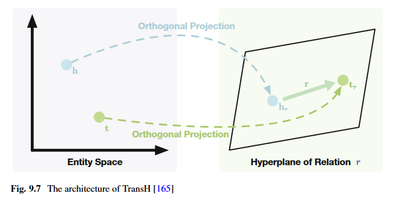
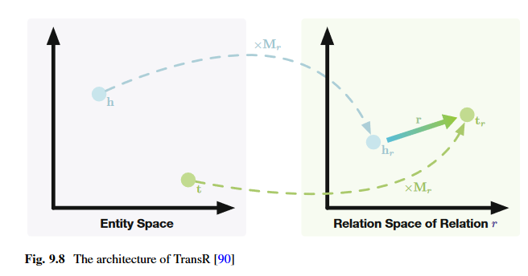
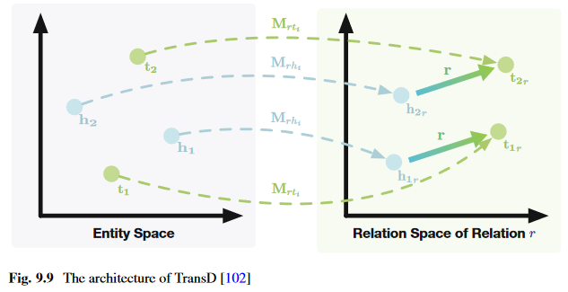
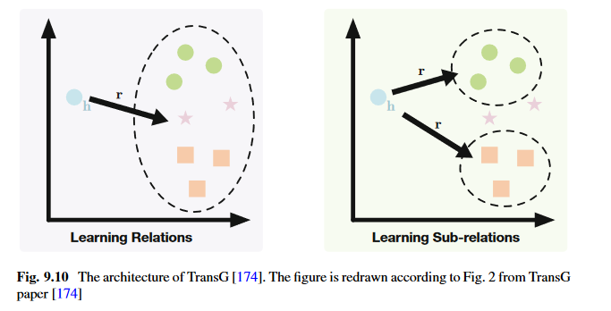

# Chapter 9 - Knowledge Representation Learning and Knowledge-Guided NLP

Knowledge is an important characteristic of human intelligence and reflects the complexity of human beings. To this end, many efforts have been devoted to organizing various human knowledge to improve the ability of machines in language understanding, such as world knowledge, linguistic knowledge, commonsense knowledge, and domain knowledge. Starting from this chapter, our view turns to representin rich human knowledge and using knowledge representations to improve NLP models. In this chapter, taking world knowledge as an example, we present a general framework of organizing and utilizing knowledge, including knoweldge representaiton learning, knowledge guided NLP, and knowledge acquisition. For linguistic knowledge, commonsense knowledge, and domain knowledge, we will introduce them in detail in subsequent chapters considering their unique knowledge properties

## 9.1 Introduction

Knowledge representation learning aims to encode symbolic knowledge into distributed representations so that knowledge can be more accessible to machines. Then, knowledge-guided NLP is explored to leverage knwoeldge representaitons to improve NLP models. Finally, based on knoweldge-guided models, we can perform knowledge acquisition to extract more knowledge from plain text to enrich existing knowledge systems

focus on world knowledge

## 9.2 Symbolic Knowledge and Model Knowledge

### 9.2.1 Symbolic Knowledge

holy fuck knowledge graphs were only proposed in 2012

KGs arrange the structured multi-relational data of both concrete and abstract entities in the real world, which can be regarded as graph-structured KBs. In addition to describing world knoweldge in conventinoal forms such as strings, the emergence of KGs provides a new tool to organize world knowledge from the persepctive of entities and relations. Since KGs are very suitable for organizing the massive amount of knowledge stored in the Web corpa for faster knowledge retrieval, the construction of KGs has been blooming in recent years and attracted wide attention from academia and industry.

### 9.2.2 Model Knowledge

For grammar rules, expert systems, and even KGs, one of the pain points of symbolic knowledge systems is their weak generalization. In addition, it is also difficult to process symbolic knowledge using the numerical computing operations that machines are good at. Therefore, it becomes important to establish a knowledge framework based on numerical computing and with a strong generalization ability to serve the processing of natural language

Different from symbolic knowledge, which is abstracted by human beings and regarded as **human-friendly** knowledge, the intrinsic nature of statistical learning is to capture the distribution patterns of data from statistics and uses these patterns to abstract implicit knowledge that can be used to solve specific problems. Although such implicit knowledge captured by statistical learning methods may not directly satisfy human intuition, the knowledge is adept at describing correlation information in data and is easy to compute numerically. In other words, this kind of knowledge based on numerical features and continuous probability models is more **machine-friendly**. Considering that the structure of probability models is also a kind of prior knowledge, here we introduce the concept of **model-knowledge** to describe this machine-friendly knoweldge.

### 9.2.3 Integrating Symbolic Knowledge and Model Knowledge

- Symbolic knowledge is suited for reasoning and modeling causality
- Model knowledge is suited for integrating information and modeling correlation

In order to integrate both symbolic and model knowledge, three challanges have to be addressed:

- 1. How to represent knowledge (especially symbolic knowledge) in a machine-friendly form so that current NLP models can utilize the knowledge?
- 2. How to use knowledge representations to guide specific NLP models?
- 3. How to continually acquire knowledge from large-scale plain text instead of handcrafted efforts?

## 9.3 Knowledge Representation Learning

As symbolic systems scale, face two challanges:

- data sparsity
- computational inefficiency

these challenges indicate that symbolic systems are not an inherently machine-friendly form of knowledge organization. Specifically, data sparsity is a common problem in many fields. Ex, when we use KGs to describe general world knowledge, the number of entities (nodes) in the KG can be enormous, while the number of relations (edges) in KGs is typically few, i.e. there are often no relations between two randomly selected entities in the real world

To solve the above problems, distributed knowledge representations are introduced, i.e. lwo-dimensional continuous embeddings are used to represent symbolic knowledge. The sparsity problem is alleviated owing to these distributed representatinos, and the computational efficiency is also improved.

We take KGs that orgnaize rich world knoweldge as an example

G = (E, R, T) to denote a KG, in which E = {e1, e1, ...} is the entity set, R = {r1, r2, ...} is the relation set, and T is the fact set. We use h, t \in E to represent head and tail entities, and **h**, **t** to represent their entity embeddings. A triplet $<h, r, t> \in T $ is a factual record, where h, t are entities and r is the relation between h and t

Given a triplet $<h, r, t> $, a score function f(h, r, t) is used by knowledge representaiton learning methods to measure whether <h, r, t> is a fact or fallacy. Generally, the larger the value of f(h, r, t), the higher probability that <h, r, t> is true. Based on f(h, r, t), knowledge representation can be learned with

$argmin_{\theta} \sum_{<h, r, t> \in T} \sum_{<\tilde{h}, \tilde{r}, \tilde{t} \in \tilde{T}>} max \{ 0, f(\tilde{h}, \tilde{r}, \tilde{t}) | \gamma - f(h, r, t) \}$

where \theta is the learnable embeddings of entities and relations, <h, r, t> indicates positive facts (i.e. triplets in T), and tilde <h, r, t> indicates negative facts (triplets that do not exit in KGs), \gamma > 0 is a hyperparamter used as a margin. A givver \gamma means to learn a wider gap between f(hrt) and tilde f(hrt). Considering there are no explicit triples in KGs, T~ is usually defined as:

$\tilde{T} = \{<\tilde{h}, r, t>| \tilde{h} \in E, <h, r, t> \in T \} \cup \{<h, \tilde{r}, t>|\tilde{r} \in R, <h, r, t> \in T \} \cup \{<h, r, \tilde{t}>|\tilde{t} \in E, <h, r, t> \in T  \} - T $

Which means T~ is build by corrupting the entities and relations of the triplets in T. Different from the margin-based loss function, some methods apply a likelihood-based loss function to learn knowledge representaitons as

$argmin_{\theta} \sum_{<h, r, t> \in T} log [1 + \exp(- f(h, r, t))] + \sum_{<\tilde{h}, \tilde{r}, \tilde{t}> \in \tilde{T}} log[1 + \exp(f(\tilde{h}, \tilde{r}, \tilde{t}))] $

Some typical knoweldge representation learning methods as well as their score functions

### 9.3.1 Linear Representation

Linear representaiton methods formalize relations as linear transformations between entities, which is a simple and basic way to learn knowledge representations

#### Structured Embeddings (SE)

typical. all SE entities are embedded into a d- dimensional space. SE designs two relation-specific matrices Mr1, and Mr,2 \in R^dxd for each relation r, which are both used to transform the embeddings of entities. Score fn defined as:

$f(h, r, t) = - \| M_{r, 1} h - M_{r,2} t  \| $

where ||.|| is the vector norm. The assumption of SE is that the head and tail embeddings should be as close as possible after being transformed into a relation-specific space. Therefore, SE uses the margin-based loss fn to learn representations

#### Semantic Matching Energy (SME)

builds more complex linear transformations than SE. given a triplet <h, r, t>, h and r are combined using a projection function to get a new embedding I_h,r. Similarly, given t and r, we can get I_t,r. Then, a pointwise multiplication function is applied on I_h,r and I_t,r to get the score of this triplet. SME introduces different projection functions to build f(h, r, t), one in linear form:

$f(h, r, t) = I_{h,r}^{\top} I_{t,r} , I_{h, r} = M_{1}h + M_{2}r + b_{1}, I_{t,r} = M_{3}t + M_{4} r + b_{2}     $

and the other is in the bilinear form

$f(h, r, t) = I_{h, r}^{\top} I_{t, r}, I_{h, r} = (M_{1} h \cdot M_{2}r) + b_{1}, I_{t, r} = (M_{3} t \cdot M_{4}r) + b_{2}   $

where \cdot si the elementwise (Hadamard) product. M1, M2, M3, M4 are learnable transformation matrices, and b1, and b2 are learnable bias vectors. This is suitable for dealing with the score functions build with vector norm operations, while the likelihood-based loss fn is more usually used to process the score functions build with inner product operations. Since SME uses the inner product operation to build its score function, the likelihood-based loss fn is thus used to learn representations

#### Latent Factor Model (LFM)

Aims to model large KGs based on a bilinear structure. By modeling entities as embeddings and relations as matrices, the score function of LFM is defined as:

$f(h, r, t) = h^{\top} M_{r} t  $

where matrix Mr is the representaiton of the relation r. Similar to SME, LFM adopts the likelihood-based loss fn to learn repreesntations. DistMult restricts Mr to diagonal matrix and reduces parameter size and computational complexity and achieves better performance

#### RESCAL

Based on matrix factorization. By modeling the entities as embeddings and relations as matrices, RESCAL adopts a score function the same to LFM. However, RESCAL employs neither the margin-based nor the likelihood-based loss fn to learn knowledge representations instead, a three way tensor $\overrightarrow{X} \in \mathbb{R}^{|\mathcal{E}| \times |\mathcal{E}| \times |\mathcal{R}|    } $ is adopted. In the tensor X, to modes repsectively stand for head and tail entities, while the thirdm ode stands for relations. The entries of X are determined by the existence of the corresopnding triplet facts. That is, $\overrightarrow{X}_{ijk} = 1  $ if the triplet <i-th entitie, kth-relation, jth-entity> exists in the training set, and otherwise $\overrightarrow{X}_{ijk} = 0. $ To capture the inherent structure of all triplets, given $\overrightarrow{X} = \{X_{1, ..., X_{|\mathcal{R}|}}  \} $ for each slice $X_{n} = \overrightarrow{X}_{[:,:, n]}  $. RESCAL assumes the following factorization for Xn holds

$Xn \approx EM_{r_{n}} E^{\top}  $

where $E \in \mathbb{R}^{|\mathcal{E}| \times d}  $ stands for the d-dimensional entity representations of all entities and $M_{r_{n}} \in \mathbb{R}^{d \times d}   $ represents the interactions between entities speicfic to the n-th relation r_n. Following this tensor factorization assumpion, the learning objective of RESCAL is defined as

$argmin_{E,M} (1/2) ( \sum_{n=1}^{|\mathcal{R}|} \| X_{n} - EM_{r_{n}} E^{\top}  \|_{F}^{2}  ) + (1/2) \lambda ( \|E \|_{F}^{2} + \sum_{n=1}^{|\mathcal{R}|} \|M_{r_{n}} \|_{F}^{2}   )      $

Where M = {M_r1, M_r2, ..., M_r|R|} is the collection of all relation matrices, ||.||_F is the Frobenius vector norm, and \lambda is a hyper-parameter to contro lthe second regularization term.

#### HOlographic Embeddings (HolE)

Proposed as an enhanced version of RESCAL. RESCAL works well with multi-relational data but suffers from a high computational complexity. HolE employs an operation named circular correlation to generate representations. The circular correlation operation $\star : \mathbb{R}^{d} \times \mathbb{R}^{d} \rightarrow \mathbb{R}^{d} $ between two entities h and t is

$[h \star t]_{k} = \sum_{i=1}^{d} [h]_{i} [t]_{(k+i) mod d+1}  $

where [.]i means the ith vector element. The score function is defined as

$f(h, r, t) = -r^{\top} (h \star t)  $

HolE adopts the likelihoood=based loss function to learn representations

The circular correlation operation brings several advantages. First, is noncommutative (i.e. $h \star t \ne t \star h$) which makes it capable of modeling asymmetric relations in KGs. Second, the circular correlation operation has a lower computational complexity compared to the tensor product operation in RESDCAL. Moreover, the circular correlation operation could be further accelerated with the help of fast Fourier transform (FFT), which is formalized as

$h \star t = \mathcal{F}^{-1} \bar{(\mathcal{F}(h)} \cdot \mathcal{F} (t))  $

Where F(.) and F(.)^-1 represent the FFt operation and its inverse operation. Respectively, F(.)bar denotes the complex conjugate of F(.) and \cdot stands for th element-wise (Hadamard) product. Due to the FFt operation, the computational complexity of the circular correlation operation is O(d log d) which is much lower than that of the tensor product operation.

### 9.3.2 Translation Representation

The primary motivation is that it is natural to consider relations betwen entities as translation operations. For distributed representations, entities are embedded into a low-dimensiona lspace, and ideal representations should embed entities with similar semantics into the nearby regions, while entities with different meanings should belong to distinct clusters. For example, William Shakespeare and Jane Austen may be in the same cluster of writers, Romeo and Juliet and Pride and predjudice may be in another cluster of books. In this case, they share the same relation

The secondary motivation of translation methods derives from the breakthrough in word representation learning. Word2vec proposes two simple models, skip-gram and CBOW. The learned word embeddings perform well in measuring word similarities and analogies. And these word embeddings have some interesting phenomena: if the same semantic or syntactic relations are shared by two word pairs, the translations within the two word pairs are similar (king - man) = (queen - woman)

The last motivation comes from the consideration of the computational complexity. experimental results on model complexity demonstrate that the simpler models perform almost as well as more expressive models in most knowledge-related applications

Modeling relations as translations rather than matrices leads to a better trade-off between effectiveness and efficiency

All translation-based methods extend from TransE

#### TransE

TransE embeds entities as well as relations into the same space. In the embedding space, relations are considered as translations from head entities to tail entities. With this translation assumption, given a triplet <h, r, t> in T, we want h+r to be the neareset neighbor of the tail embedding t. the score function of TransE is defined as:

$f(h, r, t) = - \|h + r - t \| $

TransE uses the margin-based loss fn for training. Although TransE is effective and efficient, it still has several challenges to be further explored

First, considering that there may be multiple correct answers given two elements in a triplet, under the translation assumption in TransE, each entitiy has only one embedding in all triplets, which may lead to reducing the discrimination of entity embeddings. In TransE, according to the entity cardinalities of relations, all relations are classified into four categories:

- 1:1
  - if one head appears with only one tail
- 1:many
- many:1
- many:many
  - if multiple heads appear with multiple tails

1:many, many:1, and many:many occupy a large portion. TransE performs well on 1:1 relations, but has problems when handling 1:many, many:1, and many:many

For instance, given head entity William Shakespeare, and the relation Notable Work, we get a list of masterpieces, such as Hamlet, A Midsummer Nights Dream, and Romeo and Juliet. These books share the same writer information while differing in may other fields such as theme, background, and famous roles in the book. Due to the entity Will and relation Notable work, these book may be assigned similar embeddings and become indistiguishable

Second, although the translation operation is intuitive and effective, only considering the simple one-step translation may limit the ability to model KGs. Taking entities and relations as nodes and edges, the nodes that are not directly connected may be linked by a path of more than one edge. However, TransE focuses on minimizing ||h + r - t|| which only utilizes the one step relation information in KGs, regardless of the latent relationships located in long-distance paths. For example, if we know <the forbidden city, located in, beijing> and <beijing, capital of china, china> we can infer that the forbidden city locates in china. TransE can be further enhanced with the favor of multi-step information

Third, the representation and the core function in TransE are oversimplified for the consideration of efficiency. Therefore, TransE may not be capable enough of modeling those complex entities and relations in KGs. There are sill some challenges in how to balance the effectiveness and efficiency as well as avoiding over and underfitting

- TransH, TransR, TransD, and TranSparse
  - proposed to solve the challenges in modeling complex relations
- PTransE
  - proposed to encode long-distance information located in multi-step paths
- CTransR, TransG, and KG2E
  - futher extend the oversimplified model of TransE

#### TransH

enables an entitiy to have multiple relation-specific representations to address the issue that TransE cannot do 1:many, many:1, or many:many. TransE entities are embedded to the same semantic embedding space and similar entities tend to be in the same cluster. However, it seems that Will should be in the neighborhood of Isaac newton when talking about Nationality, while it should be close to Mark Twain when talking about Occupation. To accomplish this, entities should have multiple representations in different triplets

TransH proposes a hyperplane w_r for each relation, and computes the translation on the hyperplane w_r. given a triplet <h, r, t>, TransH projects h and t to the corresponding hyperplane w_r to get the projection $h_{\perp} $ and $t_{\perp} $ and r is used to connect $h_{\perp} $ and $t_{\perp} $:

$h_{\perp} = h - w_{r}^{\top} h w_{r}, t_{\perp} = t - w_{r}^{\top} t w_{r}  $

where w_r is a vector and ||w_r||_2 is restricted to 1. The score function is:

$f(h, r, t) = - \|h_{\perp} + r - t_{\perp}  \| $

as for training, TransH also minimizes the margin-based loss function with negative sampling, which is similar to TransE

#### TransR

Takes full advantage of linear methods and translation methods. TransH, above, enables entities to have multiple relation-specific representations by projecting them to different hyperplanes, while entity embeddings and relation embeddings are restricted in the same space, which may limit the ability for modeling entities and relations. TransR (this one) assumes that entity embeddings and relation embeddings should be in different spaces.

For triplet <h, r, t>, TransR projects h and t to the relation space of r, defined as:

$h_{r} = h M_{r}, t_{r} = t M_{r}  $

where Mr is the projection matrix. hr and tr atand for relation-specific entity representations in the relatino space of r. This means that each entity has a relation-specific representation for each relation, and all translation operations are processed in the relation-specific space. The score function of TransR is:

$f(h, r, t) = -\|h_{r} + r - t_{r} \|$

TransR constrains the norms of the embeddings and has $\|h \|_{2} \leq 1, \|t \|_{2} \leq 1, \|r \|_{2} \leq 1, \|h_{r} \|_{2} \leq 1  , \|t_{r} \|_{2} \leq 1 $. as for training, TransR uses the same margin-based loss fn as TransE

Furthermore, a relation should also have multiple representations since the meanings of a relation with different head and tail entities differ slightly. For example, the relation "contains the location" has head-tail patterns like city-street, country-city, and even, country-university, each conveys different attribute information. To handle these subtle differences, entities for a same relation should also be projected differently.

To this end, **cluster-based TransR (CTransR)** is then proposed, which is an enhanced version of TransR by taking the nuance in meaning for the same relation with different entities into consideration. More specifically, for each relation, all entity pairs of the relation are first clustered into several groups. The clustering process depends on the result of t-h for each entity pair (h, t) and h and t are the embeddings learned by TransE. Then, we assign a distinct sub-relation embedding r_c for each cluster of the relation r according to cluster-specific entity pairs, and the original score function of TransR is modified as:

$f(h, r, t) = - \|h_{r} + r_{c} - t_r \| - \lambda  \|r_{c} - r \|$

where \lambda is a hyperplane to control the regularization term and ||r_c - r|| is to make the sub-relation embedding r_c and the unified relation embeddinf r not too distinct

#### TransD

Is an extension of TransR that uses dynamic mapping matrices to project entities into relation-specific spaces. TransR focuses on learning multiple relation-specific entitiy representations. However, TransR projects entities according to only relations, ignoring the entity diversity. Moreover, the projection operations based on matrix-vector multiplicaiton lead to a higher computational complexity compared to TransE, which is time-consuming when applied on large-scale KGs.

For each entity and relation, TransD defines two vectors:

- one is used as the embedding
- the other is used to construct projection matrices to map entities to relation spaces

We use h, t, r to deone the embeddings of entities and repations, and hp, tp, rp to represent projection vectors. There are two projection matrices M_rh, M_rt used to project entities to relation spaces, and these projection matrices are dynamically constructed as:

$M_{rh} = r_{p} h_{p}^{\top} + I, M_{rt} = r_{p} t_{p}^{\top} + I  $

which means the projection vectors of both entities and relations are combined to determine dynamics projection matrices. The score function is:

$f(h, r, t) = - \|M_{rh}h + r - M_{rt} t   \|  $

These projection matrices are initialized with identity matrices by setting all the projection vectors to 0 at initialization, and the normalization constraints in TransR are also used for TransD

TransD proposes a dynamic method to construct projection matrices by considering the diversities of both entities and relations, achieving better performance compared to existing methods in knoweldge completion. Morevoer, TransD lowers both computational and spatial complexity compared to TransR

#### TranSparse

Is also a subsequent work of TransR. Although TransR has achieved promising results, there are still two challenges remaining. One is the **heterogeneity** challenge. Relations in KGs differ ingranularity. Some relations express complex semantics between entities, while other relations are relatively simple. The other is the **imbalance** challenge. Some relations have more valid head entities and fewer valid tail entities, while some are the opposite. If we consider these challenges rather than merely trating all relations equally, we can obtain better knowledge representations

Existing methods such as TransR build projection matrices for each relation, and these projection matrices have the same parameter scale, regardless of the variety in the complexity of relations. TransSparse is proposed to address this issue. The underlying assumption of TransSparse is that the complex relations should havemore parameters to learn while simple relations should have fewer parameters, where the relation complexity is judged from the number of triplets or entities linked to the relation. To accomplish this, two models are proposed:

- TranSparse-share
- TranSparse-separate

##### TranSparse-share

Inspired by TransR, given a relation r, TranSparse-share builds a relation-specific projection matrix $M_{r}(\theta_{r} )  $ for the relation. $M_{r}(\theta_{r} )  $ is sparse and the sparse degree \theta_r mainly depends on the number of entity pairs linked to r. Suppose Nr is the number of linked entity pairs, $N_{r}^{*}  $ represents the maximum number of Nr, and \theta_min denotes the minimum sparse degree of projection matrices that 0 <= \theta_min <= 1. The sparse degree of relation r is defined as:

$\theta_{r} = 1 - (1 - \theta_{min}) (N_{r}/N_{r}^{*})  $

Both head and tail entities share the same sparse projection matrix $M_r(\theta_{r} )  $. The score function is:

$f(h, r, t) = - \|M_{r}(\theta_{r}) h + r - M_{r}(\theta_{r}) t  \|  $

##### TranSparse-separate

Builds two different sparse matrices $M_{rh}(\theta_{rh} )  $ and $M_{rt}(\theta_{rt} )  $ for head and tail entities, respectively. Then, the sparse degree \theta_rh (or \theta_rt) depends on the number of head (or tail) enities linked to r. We have N_rh (or N_rt) to represent the number of head (or tail) entities, as well as N_rh^* to represent the maximum number of N_rh (or N_rt). and \theta_min will also be set as the minimum sparse degree of projection matrices that 0 <= \theta_min <= 1. We have:

$\theta_{rh} = 1 - (1 - \theta_{min})N_{rh} / N_{rh}^{*}, \theta_{rt} = 1 - (1 - \theta_{min} N_{rt} / N_{rt}^{*})   $

The final score function of TranSparse-separate is

$f(h, r, t) = - \|M_{rh}(\theta_{rh})h + r - M_{rt}(\theta_{rt})t  \|  $

Through sparse projection matrices, TranSparse solves the heterogeneity challenge and the imbalance challenge simultaneously

#### PTransE

Is an extension of TransE that considers multi-step relational paths. All the above only consider simple one-step paths, ignoring the rich global information

There are two main challanges:

- 1. how to select reliable and meaningful relational paths among enormous path candidates
- 2. how to model the meaningful relational paths. it is not easy to handle the problem of spemantic composition in relational paths

To select meaningful relational paths, PTransE uses a path-constraint resource allocation (PCRA) algorithm to judge the path reliability. Suppose there is information (or resource) in the head entity h which will flow to the tail entity t through some certain paths. The basic assumption of PCRA is that the reliability of the path l depends on the amount of resource that eventually flows from head to tail

Formally, we denote a certain path between h and t as l = (r1, ..., r2). The resource that travels from h to t following the path could be represented as $(S_{0}/h) \underrightarrow{r_{1}} S_{1} \underrightarrow{r_{2}} ... \underrightarrow{r_{\mathcal{l}}} (S_{\mathcal{l}} / t)   $. For an entity m \in S_i, the amount of resource that belongs to m is defined as

$R_{\mathcal{l}}(m) = \sum_{n \in S_{i-1}(., m)}  (1/ |S_{i}(n, .)|) R_{\mathcal{l}}(n)  $

where S_i-1(., m) indicates all direct predecessors of the entity m along the relation r_i in S_i-1 and S_i(n,.) indicates all the direct successors of n \in S_i-1 with the relation r_i. Finally, the amount of resource that flows to the tail R_l(t) is used to measure the reliability of l, given the triplet <h, l, t>

Once we finish selecting those meaningful relational path candidates, the next challenge is to model the semantic composition of these multi-step paths. PTranseE proposes three composition operations, namely, addition, multiplications, and RNNs, to get the path representation I based on the relations in l = (r1, ..., r2). The score function is:

$f(h, \mathcal{l}, t) = - \|l - (t - h) \| \approx \|l - r \| = f(\mathcal{l}, r)   $

where r indicates the golden relation between h and t. Since PTransE also wants to meet the assumption in TransE that r \approx t - h, PTransE directly utliizes r in training. The optimization obj is:

$argmin_{\theta} \sum_{(h, r, t) \in T}  [L(h, r, t) + (1/Z) \sum_{\mathcal{l} \in P(h, t)}  R(\mathcal{l}| h, t) L(\mathcal{l}, r)   ]   $

where L(h, r, t) is the margin-based loss function with f(h, r, t), L(l, r) is the margin-based score function with f(l, r) and Z = sum (mess) is a normalization factor. The reliability of R(l|h, t) if l in (h, l, t) is well considered in the overall loss function. for the path l, the initial resource is set as R_l(h) = 1 by recursively performing PCRA from h to t through L, the resource R_l(t) can indicate how much information can be well translated, and R_l(t) is thus used to measure the reliability of the path l, i.e. R(l|h, t) = R_l(t). Besides PTransE, similar ideas also consider multistep relational paths and demonstrate that there is plentiful information ocated in multi-step relational paths which could significantly improve knowledge representation

#### KG2E

Introduces multidimensinoal Gaussian distributions to represent KGs. Existing translation methods usually consider entities and relations as vectors in low-dimensional spaces. However, as explained above, entities and relations in KGs are diverse at different granularities. Therefore, the margin in the margin-based loss fn that is used to distinguish positive triplets from negative triplets should be more flexible due to the diversity, and the uncertainties of entities and relations should be taken into consideration

KG2E represents entities and relations with Gaussian distributions. Specifically, the mean vector denotes the central position of an entity or a relation, and the covariance metrix denotes its uncertainties. Following the score function proposed in TransE, for <h, r, t>, the Gaussian distributions of entities and relations are defined as

$h ~ \mathcal{N}(\mu_{h}, \Sigma_{h}), t ~ \mathcal{N}(\mu_{t}, \Sigma_{t}), r ~ \mathcal{N}(\mu_{r}, \Sigma_{r})  $

Note that the covariances are diagonal for efficient computation. KG2E hypothesizes that head and tail entities are independent with specific relations; then, the translation could be defined as:

$e ~ \mathcal{N}(\mu_{h} - \mu_{t}, \Sigma_{h} + \Sigma_{t})   $

To measure the dissimilarity between e and r, KG2E considers both asymmetric similarity and symmetric similarity, and then proposes two methods.

The **assymetric similarity** is based on the KL divergence between e and r, wich is a typical method to measure the similarity between two distributions. The score function is:

$f(h, r, t) = - D_{KL}(e\|r)  $

$f(h, r, t) = - \int_{x \in \mathbb{R}^{d}}  \mathcal{N}(x; \mu_{r}, \Sigma_{r}) log((\mathcal{N}(x; \mu_{e}, \Sigma_{e}))/(\mathcal{N}(x; \mu_{r}, \Sigma_{r}))) dx  $

$f(h, r, t) = - (1/2) \{tr(\Sigma_{r}^{-1} \Sigma_{r}) + (\mu_{r} - \mu_{e})^{\top} \Sigma_{r}^{-1} (\mu_{r} - \mu_{e}) - \log ((\det(\Sigma_{e}))/(\det(\Sigma_{r}))) - d   \}  $

where tr(\Sigma) indicates the trace of \Sigma and \Sigma^{-1} indicates the inverse of \Sigma

The **symmetric similarity** is built on the expected likelihood and probability product kernel. KE2G takes the inner product between the probability density functions of e and r as the measure of similarity. The logarithm score function is defined as:

$f(h, r, t) = - \int_{x \in \mathbb{R}^{d}} \mathcal{N}(x; \mu_{e}, \Sigma_{e})\mathcal{N}(x; \mu_{r}, \Sigma_{r}) dx     $

$f(h, r, t) = -log \mathcal{N}(0; \mu_{e} - \mu_{r}, \Sigma_{e} + \Sigma_{r})     $

$f(h, r, t) = - (1/2) \{(\mu_{e} - \mu_{r})^{\top}(\Sigma_{e} + \Sigma_{r})^{-1}(\mu_{e} - \mu_{r}) + \log \det (\Sigma_{e} + \Sigma_{r}) + d \log(2 \pi)     \}     $

The optimization objective of KG2E is also margin-based similar to TransE. Both asymmetric and symmetric similarities are constrained by some regularizations to avoid overfitting:

$\forall \mathcal{l} \in \mathcal{E} \cup \mathcal{R}, \|\mu_{\mathcal{l}} \|_{2} \leq 1, c_{min} I \leq \Sigma_{\mathcal{l}} \leq c_{max} I, c_{min} > 0    $

where c_min and c_max are the hyperparameters as the restriction values for covariance

#### TransG

discusses the problem that some relations in KGs such as "Contains the Location" or "Part of" may have multiple sub-meanings, which is also discussed in TransR. In fact, these complex relations could be divided into several more precise dub-relations. CTransR is proposed with a preprocessing that clusters sub-relation according to entitiy pairs

TransG assumes that the embeddings containing several semantic comopnents should follow a Gaussian mixture model. The generative process is:

- 1. For each entity $e \in E$, TransG sets a standard normal distribution: $\mu_{e} ~ \mathcal(0, I)  $
- 2. For a triplet <h, r, t>, TransG uses the Chinese restaraunt process (CRP) (lmao wat) to automatically detect semantic components (i.e., sub-meanings in a relation): $\pi_{r, n} ~ CRP (\beta) $. \pi_{r,n} is the weight of the ith component generated by the CRP from the data
- 3. Draw the head embeddings from a standard normal distribution: $h ~ \mathcal{N}(\mu_{h}, \sigma_{h}^{2} I)   $
- 4. Draw the tail embedding from a standard normal distribution: $t ~ \mathcal(\mu_{t}, \sigma_{t}^{2} I)  $
- 5. Calcualte the relation embedding for this semantic component: $\mu_{r, n} = t - h  $

Finally, the score function is:

$f(h, r, t) \alpha \sum_{n=1}^{n_{r}} \pi_{r, n} \mathcal{N}(\mu_{r, n}; \mu_{t} - \mu_{h}, (\sigma_{h}^{2} + \sigma_{t}^{2}    ) I)   $

in which Nr is the number of semantic components of the relation r

This one is sick actually

### 9.3.3 Neural Representation

How to represent KGs with NNs

#### Single Layer Model (SLM)

Inspired by the previous works in representing KGs, SLM represents both entities and relations in low-dimensional spaces, and uses relation-specific matrices to project entities into relation spaces. Similar to the linear method SE, the score function of SLM is:

$f(h, r, t) = r^{\top} \tanh (M_{r,1} h + M_{r,2} t)   $

where h, t \in $\mathbb{R}^{d_{e}}$ represent head and tail embeddings, $r \in \mathbb{R}^{d_{e}}   $ represents relation embeddings, and $M_{r1}, M_{r2} \in \mathbb^{d_{e} \times d_{r}} $ stand for the relation-specific matrices

#### Neural Tensor network (NTN)

Although SLM has introduced relation embeddings as well as a nonlinear neural layer to build the score function, the representation capability is still restricted. NTN is then proposed by introducing tensors into the SLM framework, which can be seen as an enhanced version of SLM. Besides the original linear NN layer that projects entities to the relation space, NTN adds another tensor-based neural layer which combines head and tail embeddings with a relation-specific tensor. The score function of NTN is

$f(h, r, t) = r^{\top} \tanh ( h^{\top} \overrightarrow{M_{r}} t + M_{r,1} h + M_{r,2} t + b_{r} )    $

where $\overrightarrow{M_{r}} \in \mathbb{R}^{d_{e} \times d_{e} \times d_{r}}  $ is a three-way relation-specific tensor, b_r is the bias, and $M_{r,1}, M_{r,2} \in \mathbb{R}^{d_{e} \times d_{r}}   $ are the relation-specific matrices. Note that SLM can be seen as a simplified version of NTN if the tensor and the bias are set to zero

Besides improving the score function, NTN also attempts to utilize the latent textual information located in entitiy names and siccessfully achieves significant improvements. Differing from previous methods that provide each entitiy with a vector, NTN represents each entity as the average of its entity name's word embeddings. For example, the entity *Bengal tiger* will be represented as the average word embeddings of *Bengal* and *tiger*. It is apparent that the entity name will provide valuable information for understanding an entity, since *Bengal tiger* may come from Bengal and be related to tother tigers

NTN utilizes tensor-based NNs to model triplet facts and achieves excellent success. However, the overcomplicated method leads to high computational complexity compared to other methods, and the vast number of parameters limits the performance on sparse and large-scale KGs

#### Neural Association Model (NAM)

Adopts multilayer lonlinear activation to model relations. More specifically, two-structures are used by NAM to represent KGs:

- deep NN (DNN)
- relation modulated neural network (RMNN)

RAM-DNN adopts a MLP with L layers to operate knowledge embeddings:

$z^{k} = Sigmoid(M^{k} z^{k-1} + b^{k}), k=1, ..., L,  $

where $z^{0} = [h;r]$ is the concatenation of h and r, M^k is the weight matrix of the kth layer, and bk is the bias vector of the kth layer. Finally, NAM-DNN defines the score function as:

$f(h, r, t) = Sigmoid(t^{\top} z^{L})  $

As compared with NAM-DNN, NAM-RMNN additionally feeds the relation embedding r into the model

$z^{k} = Sigmoid(M^{k} z^{k-1} + B^{k} r), k=1, ..., L,  $

where Mk and Bk indicate the weights and bias matrices. Finally, NAM-RMNN defines the score function as

$f(h, r, t) = Sigmoid(t^{\top} z^{L} + B^{L+1} r)  $

#### Convolutional 2D Embeddings (ConvE)

uses 2D convolutional operations over embeddings to model KGs. Specifically, ConvE uses convolutional and fully connected layers to model interactions between entities and relations. After that, the obtained features are flattenend and transformed by a fully connected layer, and the inner product between the final feature and the tail entity embeddings is used to build the score function:

$f(h, r, t) = N (vec (N([\bar{h}; \bar{r}] * \omega)) W) . t  $

where $[\bar{h}; \bar{r}] $ is the conatenation of h_hat and r_hat, N(.) is a neural layer, * denotes the convolution operator, and vec(.) means compressing a matrix into vector. h_hat and r_hat denote the 2D reshaping versions of h and r respectively: if $h, r \in \mathbb{R}^{d}  $, then $\bar{h}, \bar{r} \in \mathbb{R}^{d_{a} \times d_{b}}   $, where $d = d_{a}d_{b}  $

To some extent, ConvE can be seen as an improvement model based on HolE. Compared with HolE, ConvE adopts multiple neural layers to learn nonlinear features and is thus more expressive than HolE

#### Relational Graph Convolutional Networks (RGCN)

Is an extension of GCNs to model KGs. The core idea of RGCN is to formalize modeling KGs as message passing. Therefore, in RGCN, the representations of entities and relations are the results of information propagation and fusion at multiple layers. Specifically, given an entitiy h, its embedding at the (k+1)-th layer is:

$h^{k+1} = Sigmoid (\sum_{r \in \mathcal{R}}  \sum_{t \in \mathcal{N}_{h}^{r}}  (1/(c_{h}^{r})) W_{r}^{k} t^{k} + \tilde{W}^{k} t^{k}     )   $

where $ \mathcal{N}_{h}^{r} $ denotes the neighbor set of h under the relation r and c_{h}^{r} is the normalization factor. c_{h}^{r} can be either learned or preset, and normally $c_{h}^{r} = |\mathcal{N}_{h}^{r}|  $

Note that the RGCN only aims to obtain more expressive features for entities and relations. therefore, based on teh output features of RGCN, any score function mentioned above can be used here, such as comgining the features of RGCN and the score function of TransE to learn knowledge representations

### 9.3.4 Manifold Representation

So far, we have introduced linear methods, translation methods, and neural methods for knowledge representaiton. All these methods project entities and relations into low-dimensional embedding spaces, and seek to improve the flexibility and variety of entity and relation representations. Although these methods have achieved promising results, they assume that the geometry of the embedding spaces for entities and relations are all Euclidian. However, the basic Euclidian geometry may not be the optimal geometry to model the complex structure of KGs. next, we will introduce several typical manifold methods that aim to use more flexible and powerful geometric spaces to carry representations

BRO POG

#### ManifoldE

considers the possible positions of golden candidates for representations in spaces as a manifold rather than a point. The overall score function of ManifoldE is:

$f(h, r, t) = - \|M(h, r, t) - D_{r}^{2}  \|  $

in which $D_{r}^{2}$ is a relation-specific manifold parameter. Two kinds of manifolds are then proposed in ManifoldE.

- ManifoldE-Sphere
- ManifoldE-Hyperplane

##### ManifoldE-Sphere

ManifoldE-Sphere is a straightforward manifold that supposes t should be located in the sphere which has h + r to be the center and Dr to be the radius. We have:

$M(h, r, t) = \|h + r - t  \|  $

A tail may correspond to many different head-relation pairs, and the manifold assumption requires that the tail lays in all the manifolds of these head-relation pairs, i.e., lays in the intersection of these manifold. However, two spheres can only intersect only some strict conditions. Therefore, the hyperplane is utilized becuase it is easier for two hyperplanes to intersect

##### ManifoldE-Hyperplane

The function of ManifoldE-Hyperplane is:

$M(h, r, t) = (h + r_{h}^{\top})(t+r_{t})  $

in which r_{h} and r_{t} represent the two entity-specific embeddings of the relation r. This indicates that for a triplet <h, r, t>, the tail entity t should locate in the hyperplane whose normal vector is h + r_h and intercept is D_{r}^{2}. Furthermore, ManifoldE-Hyperplane considers absolute values in M(h, r, t) as $|h + r_{h} |^{\top}|t + r_{t}|  $ to double the solution number of possible tail entities. For both manifolds, ManifoldE applies a kernel form on the reproducing kernel **Hilbert space**

#### ComplEx

Employs an eigenvalue decomposition model which makes use of complex-valued embeddings, i.e., $h, r, t \in \mathbb{C}^{d} $. Complex embeddings can well handle binary relations, such as the symmetric and antisymmetric relations. The score function of ComplEx is:

$f(h, r, t) = Re(<r, h, t>)   $

$f(h, r, t) = <Re(r), Re(h), Re(t)  > + <Re(r), Im(h), im(t)  > - <Im(r), Re(h), Im(t)  > - <Im(r), Im(h), Re(t)  >   $

where $<x, y, z> = \sum_{i} x_{i} y_{i} z_{i}  $ denotes the trilinear dot product, Re(x) is the real part of x, and Im(x) is the imaginary part of x. In fact, ComplEx can be viewed as a generalization of RESCAL that uses complex embeddings to model KGs

#### RotatE

Cimilar to ComplEx, RotatE also representes KGs with complex valued embeddings. RotatE defines relations as rotations from head entities to tail entities, **which makes it easier to learn various relation patterns such as symmetry, antisymmetry, inversion, and composition**. The elemnt-wise (Hadamard) product can naturally represent the rotation process in the complex-valued space. Therefore, the score function of RotatE is:

$f(h, r, t) = - \|h \cdot r - t   \|   $

Where $h, r, t \in \mathbb{C}^{d}  $ and \cdot denotes the element-wise (Hadamard) product. RotatE is simple and achieves quite good performance. Compared with previous methods, it is the first model that is theoretically able to model all the above four patterns (symmetry, antisymmetry, inversion, and composition). On the basis of RotatE, Zhang et al. further introduce hypercomplex spaces to represent entities and relations and achieves better performance.

#### MuRP

proposes to embed the entities in the hyperbolic space since hyperbolic space is shown to be more suitable to represent hierarchical data than Euclidian space. Specifically, they embed the entities to the Poincare model (a typical geometric model in hyperbolic space), and explit the Mobius transformations in the Poincare model as the alternatives to vector-matrix multiplication and vector addition in Euclidian space. The score function of MuRP is

$f(h, r, t) = d_{\mathbb{P}}(h^{(r)}, t^{(r)}  )^{2} - b_{h} - b_{t}    $

$f(h, r, t) = d_{\mathbb{P}}(\exp_{0}^{c}(M_{r} \log_{0}^{c}(h)), t \cross r ) - b_{h} - b_{t}     $

where $d_{\mathbb{P}}(.)$ calculates the distance between two points in the Poincare model, Mr is the transformation matrix for the relation r, r is the translation vector of the relation r, and bh and bt are biases for the head and tail entities respectively. \exp_{0}^{c} is the exponential mapping at 0 in the Poincare model of the curvature c, and it maps points in the tangental space at 0 (an euclidian subspace) to the Poincare model. log_{0}^{x} is the logarithmic mapping at 0 in the Poincare model of the curvature c, and is the inverse mapping for \exp_{0}^{c}. MuRP with a dimension as low as 40 achieves comparable results to the Euclidian models with dimensions greater than 100, showing the effectiveness of hyperbolic space in encoding relational knowledge

#### HyboNet

Argues that previous hyperbolic methods such as MuRP only introduce the hyperbolic geometric for embeddings, but still perform linear transformations in tangent spaces (Euclidian subspaces), significantly limiting the capability of hyperbolic models. Inspired by the **Lorentz transformations** in Physics, HyboNet proposes a linear transformation in the Lorentz model (another typical geometric model to build hyperbolic spaces) to avoid the introduction of exponential mapping and logarithmic mapping when transforming embeddings, **significantly speeding up the network and stabilizing the computation**. The score function of HyboNet is

$f(h, r, t) = d_{\mathbb{L}}^{2} (g_{r} (h), t) - b_{h} - b_{t} - \delta   $

where $d_{\mathbb{L}}^{2}$ is the squared Lorentzian distance between two points in Lorentz model, g_r is the relation-specific Lorentz linear transformation, b_h, and b_t are the biases for the head and tail entities, respectively, and \delta is a hyper-parameter used tomake th training process more stable.

### 9.3.5 Contextualized Representation

We live in a complicated pluralistic real world where we can get information from different senses. Due do this, we can learn knowledge not only from structured KGs but also from text, schemas, images, and rules. Good to integrate multi-source information

#### Knowledge Representation with Text

One attempt to utilize text is by jointly learning representations of entities, relations, and words within the same low-dimensional embedding space. The method contains three parts:

- the knowledge model
  - learned on the triplets of KGs using TransE
- the text model
  - learned using skip-gram
- the alignment model
  - two methods proposed to align entity and word representations by utilizing Wikipedia anchors and entity names, respectively

Modeling entities and words in same embedding space has the merit of encoding the information in both KGs and plain text in a unified semantic space. However, the joint model depends on the completeness of wikipedia anchors and suffers from the abiguities of many entity names. To sddress these issues, can further improve the alignment model with entity descriptions, assuming that entities should have similar semantics to their corresponding descriptions

Different from the bove joint models that merely consider the alignments between KGs and textual information, description-embodied knowledge representation learnin (DKRL) can directly build knowledge representations from entity desctiptions.

DKRL provides two kinds of knowledge representations:

- for each entity h, the first is the structure-based representation h_S, which can be learned based on the structure of KGs
- second, the decription-based representation d_D that derives from its description. The score function of DKRL derives from translation methods and we have:

$f(h, r, t) = -(\|h_{S} + r - t_{S} \|  +  \|h_{S} + r - t_{D}   \|   + \|h_{D} + r - t_{S}   \|    +  \| h_{D} + r - t_{D}  \|   )  $

The description-based representations are constructed via CBOW or CNNs that can encode rich textual information from plain text into representations

Compared with conventional non-contextualized methods, the representations learned by DKRL are built with both structured and textual information and thus could perform better. Besides, DKRL can represent an entity even if it is not in the training set as long as there are a few sentences to describe this entity. Therefore, with millions of new entities emerging every day, DKRL can handle these new entities based on the setting of zero-shot learning

#### Knowledge Representation with Types

Entity types, as hierarchical schemas, can provide rich structured information to understand entities. Two paths:

- type-constrained
- type-augmented

##### Type-Constrained Methods

Take type information as constraints to improve existing methods like RESCAL and TransE via type constraints. It is intuitive that for a particular relation, the head and tail entities associated with this relatino can only be of some specific types. For example, the head entity of the relation Writes Books should be a person (more precisely, an author), and the tail should be a book

With type constraints, in RESCAL, the original factorization $X_{n} \approx EM_{r_{n}}E^{\top}   $ can be modified to:

$X_{n}^{'}  \approx E_{[\mathcal{H}_{r_{n}}, :]} M_{r_{n}} E_{[\mathcal{T}_{r_{n}}, :]}^{\top}  $

where H_r_n and T_r_n are the entity sets fitting the type constraints of the n-th relation r_n in R, and Xn' is a sparse adjacency matrix of the shape $|\mathcal{H}_{r_{n}}| \times |\mathcal{T}_{r_{n}}|  $. Intuitively, only the entities that fit type constraints will be considered during the factorization process

With type constraints, in TransE, negative samples with higher quality can be generated. Learning knowledge representations need negative samples, and negative samples are often generated by randomly replacing triplets head or tail entities. Given a triplet <h, r, t> with type constraints, its negative samples <~h, ~r, ~t> need to satisfy:

$\tilde{h} \in \mathcal{H_{r}} \subseteq \mathcal{E}, \tilde{t} \in \mathcal{T_{r}} \subseteq \mathcal{E}  $

Intuitively, for an entity whose type does not match the relation r, it will not be used to construct negative samples. The negative samples constructed with type constraints are more confusin, which is benevidial for learning more robust and effective representations

##### Type-Augmented Methods

representation can be further enhanced by using the type information directly as additional informatoin in the learning. Instead of merely viewing type information as type constratins, type-embodied knoweldge representation learning (TKRL), uses hierarchical type structures to instruct the construction of projection matrices. Inspired by TransR that every entity should have multiple representations in different relation spaces, the score function of TKRL is:

$f(h, r, t) = - \|M_{rh}h + r - M_{rt}t   \|  $

in which $M_{rh}h$ and $M_{rt}t $ are two projection matrices for h and t that depend on their corresponding hierarchical types in this triplet, Two hierarhical encoders are proposed to learn the above projection matrices, regarding all sub=types in the hierarchy as projection matrixes, where the recursive hierarchical encoder (RHE) is based on the matrix multiplication operation, and the weighted hierarchical encoder (WHE) is based on the matrix summation operation

Taking a type hierarchy c with m layers for instance, $c^{(i)}  $ is the ith subtype. Considering the subtype at the first layer is the most precise and the subtype at the last layer is the most general, TKRL can get type-specific entity representations at different granularieis following the hierarchical structure, and the projection matrices can be formalized as:

$M_{RHE_{c}} = \prod_{i=1}^{m} M_{c(i)} = M_{c^{(1)}}M_{c^{(2)}}...M_{c^{(m)}}   $

$M_{WHE_{c}} = \prod_{i=1}^{m} \beta_{i}M_{c(i)} = \beta_{i}M_{c^{(1)}} + ... \beta_{i}M_{c^{(m)}}   $

where $M_{c(i)}$ stands for the projection matrix of the ith subtype of the hierarchical type c and \beta_i is the corresponding weight of the sub-type. Taking RHE as an example, given the entity Will, it is first projected to a general subspace type like *human* and then sequentially projected to a more precise sub-type like *author* or *English author*

#### Knowledge Representation with Images

Human cognition is highly related to the visual information of objects in the real world. For entities in KGs, their corresponding images can provide intuitive visual information about their appearance, which may give important hints about some attributes of the tntities. For instance, the images of Suit of armour and Armet. From these images, we can easily infer the fact <Suit of armour, Has a Part, Armet> directly

Image-embodied knowledge representation learning (IKRL) is proposed to consider visual information when learning knowledge representations. Inspired by DKRL, for each entity h, IKRL also proposed the image based representation h_l besides the original structure-based representation H_S, and jointly learns these entity representations simultaneously within the translation-based framework:

$f(h, r, t) = -(\|h_{S} + r - t_{S} \|  +  \|h_{S} + r - t_{l}   \|   + \|h_{l} + r - t_{S}   \|    +  \| h_{l} + r - t_{l}  \|   )  $

IKRL uses CNNs to obtain the representations of all entity images, and then uses a matrix to project image representations from the image embedding space to the entity embedding space. Since one entity may have multiple images, IKRL uses an attention-based method to highlight those most informative images.

#### Knowledge Representation with Logic Rules

Typical KGs store knowledge in the form of triplets with one relation linking two entities. Most methods only consider the information of triplets independently, ignoring the possible interactions and relations between triplets. Logic rules, which are certain kinds of summaries derived from human prior knowledge, could help us with knowledge reasoning. For instance, given the triplet <Beijing, Capital of, China>, we can easily infer the triplet <Beijing, Located in, China> with high confidence, since we know the logic rule Capital of => Located in. Here we introduce a typical translation method that jointly learns knowledge representations and logic rules - KALE. KALE can rank all possible logic rules based on teh results pre-trained by TransE, and then manually filter useful rules to improve knowledge representations

The joint learning of KALE consists of two parts:

- triplet modeling
- rule modeling

For triplet modeling, KALE defines its score function following the translation assumption as

$f(h, r, t) = 1 - (1/(3\sqrt{d})) \|h + r - t  \|  $

in which d stands for the dimensions of knowledge embeddings. f(h, r, t) takes a value in [0,1], aiming to map discrete Boolean values (false or true) into a continuous space ([0, 1]). For the rule modeling, KALe uses the t-norm fuzzy logics that compute the truth value of a complex formula from the truth values of its constituents. Especially, KALE focuses on two typical types of logical rules. The first rule is that $\forall h, t : <h, r_{1}, t> \Rightarrow <h, r_{2}, t>  $ (e.g. given <Beijing, Capital of, China>), we can infer that <Beijing, Located in, China>. KALE represents the score function of this logical rule l_1 via specific t-norm logical connectives as:

$f(l_{1}) = f(h, r_{1}, t)f(h, r_{2}, t) - f(h, r_{1}, t) + 1  $

The second rule is $\forall h, e, t : <h, r_{1}, e> \wedge <e, r_{2}, t> \Rightarrow <h, r_{3}, t>  $ (e.g., given <Tsinghua, Located in, Beijing> and <Beijing, Located in, China>, we can infer that <Tsinghua, Located in, China>). And the second score function is defined as:

$f(l_{2}) = f(h, r_{1}, e)f(e, r_{r}, t)f(h, r_{3}, t) - f(h, r_{1}, e)f(e, r_{2}, t) + 1     $

The joint training contains all positive formulas, including triplet facts and logic rules. Note that for the consideration of rule qualities, KALE ranks all possible logic rules by their truth values with pre-trained TransE and manually filters some rules

### 9.3.6 Summary

Five directions:

- 1. linear methods
  - where translations are represented as linear transformations between entities
- 2. translation methods
  - where relations are represented as additive translations between entities
- 3. neural methods
  - where neural networks parameterize the interactinos between entities and relations
- 4. manifold methods
  - where representations are learned in more flexible and powerful gemoetric spaces instead of the basic Euclidian geometry
- 5. contextualized methods
  - where representations are learned under complex contexts
