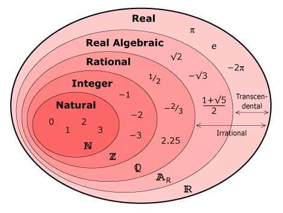

# Math

[nLab Wiki](https://ncatlab.org/nlab/all_pages)

## Numbers

## Idk where to put

- Category Theory -> Monoids -> [Binary Operations](./3.1_binary_operations.md)

## Cool terms

- [Information Geometry](https://www.robots.ox.ac.uk/~lsgs/posts/2019-09-27-info-geom.html)
- [Topology](https://en.wikipedia.org/wiki/Topology)
  - literally bro i know its planar like the surface of shit, but what is our brain do? Like there is a piece of information that we can retrieve by so many different paths. I think there is something to do with navigating a topology by traversing a ?manifold? and that being similar to "reasoning" or navigating a graph. Like I would not be interested in the discreteness of a graph if I knew i could "grab" the information "next" to a known point, regardless of the arbitrary distance metric. Like the distance metric should be coupled to the manifold (I dont know if i am thinking of manifold right. in my head its like a bedsheet that information resides in - a single plane)
  - [Topological Space](https://en.wikipedia.org/wiki/Topological_space)
- [Vector Bundle](https://en.wikipedia.org/wiki/Vector_bundle)
